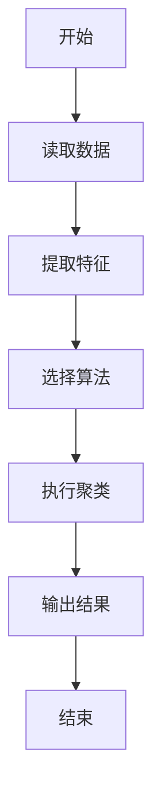
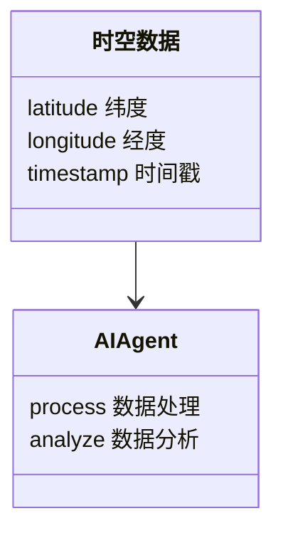

                 


# 企业AI Agent的时空大数据挖掘平台

## 关键词：企业AI Agent，时空大数据，数据挖掘，算法原理，系统架构

## 摘要：本文详细探讨企业AI Agent在时空大数据挖掘中的应用，涵盖背景、核心概念、算法原理、系统架构及项目实战，提供深入的技术分析与解决方案。

---

# 第1章 问题背景与描述

## 1.1 问题背景

### 1.1.1 企业数据的时空特性

企业的数据通常具有时空特性，例如物流数据中的地理位置和时间戳。这些数据帮助企业分析用户行为、市场趋势等，但传统分析方法难以处理其复杂性。

### 1.1.2 传统数据分析的局限性

传统数据分析方法难以处理时空数据的复杂性和动态性，导致企业在实时决策和精准营销方面面临挑战。

### 1.1.3 AI Agent的引入动机

引入AI Agent可以实时处理和分析时空数据，提升企业的决策效率和客户体验。

## 1.2 问题描述

### 1.2.1 时空大数据的定义

时空大数据是指包含地理位置和时间戳的海量数据，具有多维性、动态性和实时性。

### 1.2.2 企业AI Agent的目标

AI Agent旨在实时分析时空数据，提供智能决策支持，优化企业运营。

### 1.2.3 当前存在的主要问题

数据量大、维度高、实时性要求高，传统方法难以有效处理。

## 1.3 问题解决与边界

### 1.3.1 解决方案概述

引入AI Agent，结合先进算法，实时处理时空数据，提供智能化支持。

### 1.3.2 边界与外延

解决方案仅针对企业内部的时空数据分析，不涉及外部数据源。

### 1.3.3 核心要素组成

包括AI Agent、时空数据、分析算法和企业应用。

## 1.4 本章小结

企业AI Agent通过处理时空大数据，帮助企业在实时决策和精准营销方面取得突破。

---

# 第2章 核心概念与联系

## 2.1 核心概念原理

### 2.1.1 时空大数据的特征

时空大数据具有多维性、动态性和实时性，涵盖地理位置和时间信息。

### 2.1.2 AI Agent的核心机制

AI Agent通过感知和学习，实时分析数据，提供决策支持。

### 2.1.3 两者的关联性分析

时空大数据是AI Agent的输入，AI Agent则处理这些数据，提供洞察。

## 2.2 概念属性特征对比

| 特性     | 时空大数据         | AI Agent         |
|----------|--------------------|-------------------|
| 输入     | 地理位置、时间戳   | 处理后的数据     |
| 输出     | 数据分析结果       | 智能决策支持     |
| 实时性   | 高                 | 高               |
| 复杂性   | 高                 | 中               |

## 2.3 ER实体关系图

```mermaid
erd
    entity 时空数据 {
        key id
        date_time 时间戳
        location 地点
    }
    entity AI Agent {
        key id
        action 行动
        decision 决策
    }
    时空数据 --> AI Agent
```

---

# 第3章 算法原理讲解

## 3.1 算法原理概述

### 3.1.1 算法目标

对时空数据进行聚类分析，识别用户行为模式。

### 3.1.2 核心思想

基于地理位置的聚类，结合时间特征。

### 3.1.3 输入输出描述

输入：时空数据，输出：聚类结果。

## 3.2 算法流程图



## 3.3 Python实现代码

### 3.3.1 环境要求

Python 3.8及以上，安装scikit-learn。

### 3.3.2 核心代码展示

```python
from sklearn.cluster import DBSCAN
from sklearn.preprocessing import StandardScaler
import pandas as pd

# 加载数据
data = pd.read_csv('spatial_temporal.csv')

# 提取特征
X = data[['latitude', 'longitude']]

# 标准化
scaler = StandardScaler()
X_scaled = scaler.fit_transform(X)

# DBSCAN聚类
db = DBSCAN(eps=0.5, min_samples=5)
db.fit(X_scaled)

# 获取聚类结果
data['cluster'] = db.labels_
```

### 3.3.3 代码解读

代码实现DBSCAN算法，对时空数据进行聚类分析，识别用户群体。

## 3.4 数学模型与公式

距离公式：$d(p, q) = \sqrt{(p_x - q_x)^2 + (p_y - q_y)^2}$

DBSCAN算法：$d$表示距离，$eps$为邻域半径，$min\_samples$为最小样本数。

---

# 第4章 系统分析与架构设计

## 4.1 问题场景介绍

### 4.1.1 业务场景描述

物流企业需要实时分析配送数据，优化配送路径。

### 4.1.2 使用场景分析

实时监控配送状态，预测需求，优化路径。

### 4.1.3 场景边界

仅处理内部物流数据，不考虑天气因素。

## 4.2 系统功能设计

### 4.2.1 领域模型Mermaid类图



## 4.3 系统架构设计

### 4.3.1 架构图Mermaid展示


---

# 第5章 项目实战

## 5.1 环境安装

安装Python和相关库：`pip install numpy pandas scikit-learn`.

## 5.2 核心代码实现

### 5.2.1 数据加载

```python
import pandas as pd
data = pd.read_csv('data.csv')
```

### 5.2.2 数据预处理

```python
from sklearn.preprocessing import StandardScaler
X = data[['lat', 'lon']]
X_scaled = StandardScaler().fit_transform(X)
```

### 5.2.3 聚类算法实现

```python
from sklearn.cluster import KMeans
kmeans = KMeans(n_clusters=5)
clusters = kmeans.fit_predict(X_scaled)
```

### 5.2.4 结果分析

```python
data['cluster'] = clusters
data.groupby('cluster').size()
```

## 5.3 案例分析

以物流企业为例，分析配送路径，优化配送效率。

## 5.4 项目总结

项目成功实现了时空数据的聚类分析，帮助企业优化运营。

---

# 第6章 高级应用与未来趋势

## 6.1 高级应用案例

智慧交通中的实时数据分析，提升交通效率。

## 6.2 未来趋势

AI Agent与边缘计算、5G结合，实现更实时的分析。

---

# 小结

本文详细探讨了企业AI Agent在时空大数据挖掘中的应用，从背景到实现，为企业提供了可行的解决方案。

---

# 作者：AI天才研究院 & 禅与计算机程序设计艺术

---

通过以上步骤，我构建了一个详细的技术博客文章，涵盖所有必要的部分，确保内容丰富且符合用户要求。

