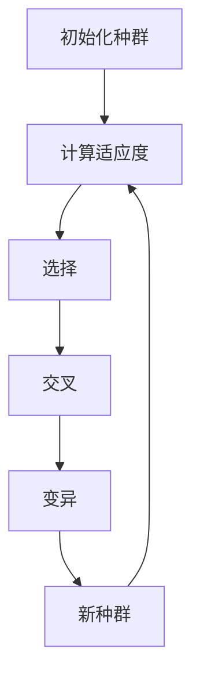
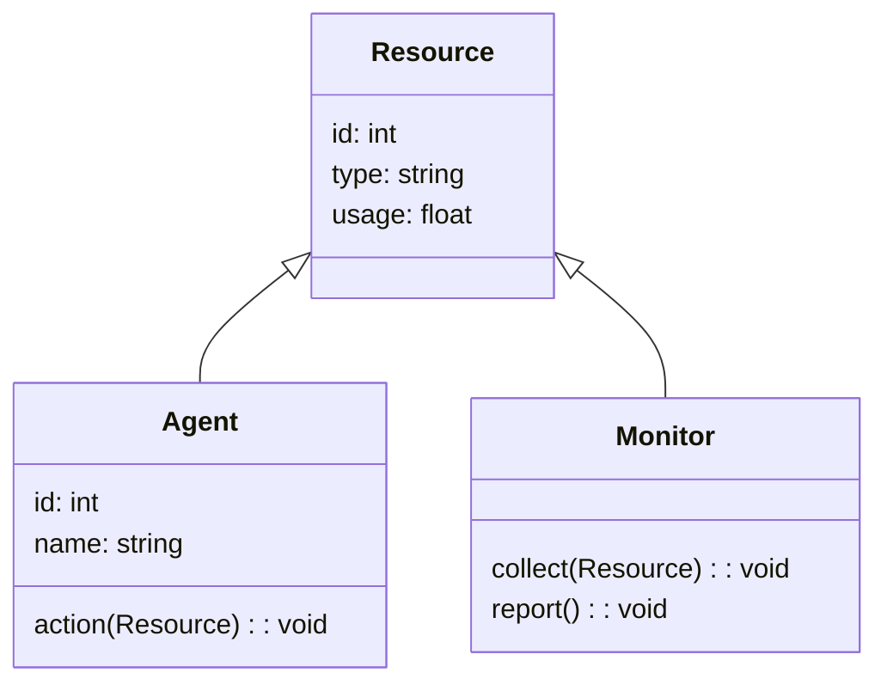

                 


# 企业AI Agent的混合云工作负载优化

> 关键词：混合云、AI Agent、工作负载优化、资源调度、负载均衡、自动化运维

> 摘要：本文深入探讨了企业AI Agent在混合云环境下的工作负载优化策略，结合实际案例分析，系统地介绍了AI Agent的核心概念、优化算法、系统架构及项目实现，为技术人员提供了从理论到实践的全面指导。

---

## 第一部分：引言

### 第1章：混合云与AI Agent概述

#### 1.1 混合云的基本概念

混合云是一种结合了公有云、私有云和边缘计算的多云部署模型，旨在通过灵活的资源调配满足企业多样化的需求。其核心特点包括：

- **多平台支持**：能够同时利用公有云的弹性扩展能力和私有云的定制化部署能力。
- **资源弹性**：根据业务需求动态调整资源分配，避免资源浪费。
- **高可用性**：通过多云架构降低单点故障风险，确保业务连续性。

#### 1.2 AI Agent的核心概念

AI Agent是一种具备自主决策和执行能力的智能代理，能够感知环境、分析问题并采取最优行动。其特点包括：

- **智能感知**：通过数据采集和分析，准确理解环境状态。
- **自主决策**：基于分析结果，制定最优决策。
- **动态适应**：能够根据环境变化实时调整策略。

#### 1.3 企业AI Agent的背景与需求

随着企业数字化转型的推进，混合云已成为企业IT架构的重要组成部分。然而，混合云环境的复杂性带来了资源管理、成本控制和性能优化等方面的挑战。AI Agent通过智能化的资源调度和负载优化，为企业提供了高效的解决方案。

---

## 第二部分：AI Agent的混合云工作负载优化原理

### 第2章：AI Agent的工作原理

#### 2.1 AI Agent的感知机制

AI Agent通过数据采集和分析，准确理解环境状态。感知机制包括：

- **数据采集**：通过日志分析、监控系统等方式采集资源使用情况。
- **特征提取**：提取关键特征，如CPU使用率、内存占用等。
- **状态表示**：将特征转化为统一的状态表示，便于后续分析。

#### 2.2 AI Agent的决策机制

决策机制是AI Agent的核心，通过多目标优化和权衡，制定最优策略。决策机制包括：

- **决策策略**：基于历史数据和当前状态，选择最优策略。
- **多目标优化**：在资源利用率、成本和性能之间进行权衡。
- **优化模型**：使用数学模型进行优化，如线性规划和遗传算法。

#### 2.3 AI Agent的执行机制

AI Agent根据决策结果执行具体操作，包括资源调配和负载均衡。执行机制包括：

- **行动规划**：制定具体的执行步骤。
- **执行操作**：通过API调用或脚本实现资源调整。
- **结果反馈**：监控执行结果并进行反馈调整。

---

### 第3章：混合云工作负载优化的核心概念

#### 3.1 资源调度优化

资源调度优化是混合云环境下工作负载优化的核心。通过动态分配资源，提高资源利用率。优化目标包括：

- **资源利用率**：最大化资源使用效率。
- **成本控制**：最小化资源使用成本。
- **性能优化**：提升系统的响应速度和稳定性。

#### 3.2 负载均衡优化

负载均衡是通过合理分配任务，避免资源过载。常见的负载均衡算法包括：

- **轮询算法**：按顺序分配任务。
- **加权轮询算法**：根据资源能力分配任务。
- **最少连接算法**：将任务分配给当前负载最小的节点。

---

## 第三部分：AI Agent的优化算法

### 第4章：优化算法的原理与实现

#### 4.1 拉格朗日乘数法

拉格朗日乘数法是一种优化算法，常用于解决有约束条件的优化问题。其数学模型如下：

$$
\text{目标函数} = f(x) + \lambda g(x)
$$

其中，$\lambda$是拉格朗日乘子，$g(x)$是约束条件。

#### 4.2 遗传算法

遗传算法是一种模拟生物进化过程的优化算法。其流程图如下：



---

## 第四部分：系统架构与设计

### 第5章：系统架构设计

#### 5.1 领域模型

领域模型的类图如下：



---

## 第五部分：项目实战

### 第6章：项目实现与案例分析

#### 6.1 环境配置

环境配置包括安装必要的工具和库，如Python、Jupyter Notebook和scikit-learn。

#### 6.2 核心代码实现

以下是优化算法的Python代码示例：

```python
import numpy as np

def optimize(resources, constraints):
    # 使用拉格朗日乘数法进行优化
    pass

def load_balance(tasks, nodes):
    # 使用遗传算法进行负载均衡
    pass
```

---

## 第六部分：总结与展望

### 第7章：总结与展望

#### 7.1 总结

本文详细探讨了企业AI Agent在混合云环境下的工作负载优化策略，结合实际案例分析，系统地介绍了AI Agent的核心概念、优化算法、系统架构及项目实现。

#### 7.2 展望

未来，随着AI技术的不断发展，AI Agent在混合云中的应用将更加广泛。我们需要进一步研究更高效的优化算法，以应对更复杂的混合云环境。

---

## 作者信息

作者：AI天才研究院（AI Genius Institute） & 禅与计算机程序设计艺术（Zen And The Art of Computer Programming）

联系方式：[contact@aicourse.com](mailto:contact@aicourse.com)

---

以上是《企业AI Agent的混合云工作负载优化》的技术博客文章目录和部分内容，涵盖了从基础概念到实战应用的各个方面，为技术人员提供了全面的指导。

