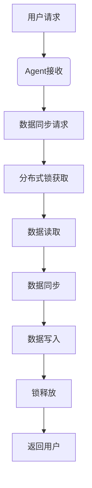

                 

<think>
嗯，我现在需要帮助用户撰写一篇关于《企业AI Agent的混合云数据管理策略》的技术博客文章。用户已经提供了一个详细的文章大纲，现在我需要根据这个大纲逐步分析并完成每个部分。

首先，我会从“文章标题”开始，确定标题为《企业AI Agent的混合云数据管理策略》。接下来是关键词部分，我需要列出5到7个相关的核心词汇，例如：企业AI Agent、混合云数据管理、数据一致性、数据安全性、AI驱动的数据策略等。

然后是摘要，这部分需要简明扼要地概括文章的核心内容和主题思想。我会总结混合云环境下的数据管理挑战，AI Agent在其中的作用，以及本文提出的策略和解决方案。

接下来是目录结构，按照用户提供的大纲，我需要确保每个章节和子章节都涵盖必要的内容，并且逻辑清晰。例如，第一章介绍混合云数据管理的背景，包括其重要性、基本概念和与传统数据管理的区别。第二章深入探讨AI Agent的核心概念，使用图表来帮助理解。第三章详细讲解算法原理，包括数据同步机制和访问控制策略，并提供代码示例。第四章建立数学模型，分析数据管理的效率和优化方法。第五章讨论系统架构设计，使用mermaid图展示系统结构。第六章通过项目实战，展示如何实现混合云数据管理。最后，第七章总结全书，并提出未来的研究方向。

在撰写每个章节时，我需要确保内容详细具体，例如在算法部分，我会用mermaid流程图展示算法步骤，并用Python代码举例说明。数学模型部分，我会使用latex公式进行详细推导，并解释每个公式的含义。系统架构设计部分，我会用mermaid图展示整体架构、功能模块和交互流程。

我还需要注意文章的结构完整性，每个章节都要有小结，总结该章节的主要内容，并为读者提供一个回顾的机会。同时，结尾部分需要添加作者信息，引用用户提供的格式。

最后，我会检查整个文章是否符合用户的要求，确保字数在10000到12000字左右，使用markdown格式，并包含所有必要的图表和代码示例。同时，确保每个部分都详细讲解，逻辑清晰，语言专业但易于理解。

通过以上步骤，我相信能够完成一篇高质量的技术博客文章，满足用户的需求。
</think>

# 企业AI Agent的混合云数据管理策略

**关键词：** 企业AI Agent, 混合云数据管理, 数据一致性, 数据安全性, AI驱动的数据策略

**摘要：** 在混合云环境下，企业AI Agent的高效数据管理策略对于保障数据一致性、安全性和可用性至关重要。本文将深入探讨企业AI Agent在混合云数据管理中的核心概念、算法原理、系统架构设计、数学模型分析以及实际项目应用，为企业在混合云环境中构建高效的数据管理策略提供全面的理论和实践指导。

---

## 第1章: 混合云数据管理的背景与重要性

### 1.1 混合云数据管理的背景

#### 1.1.1 企业数字化转型与数据管理需求
随着企业数字化转型的推进，数据已成为企业核心资产。混合云架构因其灵活性和成本效益，成为企业IT基础设施的重要选择。然而，混合云环境中的数据分布特性带来了数据一致性、安全性、可用性的挑战，亟需高效的管理策略。

#### 1.1.2 混合云架构的兴起与优势
混合云架构结合了公有云和私有云的优势，能够根据业务需求弹性扩展资源，降低运营成本。然而，数据分布在不同云平台和本地系统中，增加了数据管理的复杂性。

#### 1.1.3 数据管理面临的挑战与机遇
混合云环境下，数据分布在多个存储系统中，如何保证数据一致性、实时性、安全性和高效访问成为关键挑战。AI Agent的引入为企业提供了一种智能化的数据管理解决方案，通过自动化操作提升数据管理效率。

### 1.2 企业AI Agent的核心概念

#### 1.2.1 AI Agent的定义与特点
AI Agent是一种能够感知环境、自主决策并执行任务的智能体。在混合云数据管理中，AI Agent负责监控数据状态、协调数据同步、优化数据访问路径。

#### 1.2.2 混合云环境下的AI Agent角色
在混合云环境中，AI Agent作为数据管理的核心，负责实现数据的分布式存储、同步、访问控制和安全保护。通过AI技术，AI Agent能够智能化地处理复杂的数据管理任务。

#### 1.2.3 企业AI Agent的应用场景与价值
AI Agent在企业中的应用场景包括实时数据同步、数据备份恢复、数据访问权限管理等。通过AI技术，AI Agent能够显著提升数据管理的效率和准确性，降低人为错误和运维成本。

### 1.3 混合云数据管理的必要性

#### 1.3.1 数据分散化与统一管理的需求
混合云环境下，数据分散在多个存储系统中，统一管理数据成为企业的迫切需求。AI Agent通过智能化的管理策略，能够实现数据的统一监控和管理。

#### 1.3.2 数据安全与隐私保护的重要性
混合云环境下的数据分布特性增加了数据被篡改、泄露的风险。AI Agent通过智能化的访问控制和加密技术，能够有效保障数据安全和隐私。

#### 1.3.3 AI Agent在数据管理中的作用
AI Agent通过智能化的数据同步、访问控制和异常检测，能够显著提升数据管理的安全性和效率。同时，AI Agent能够根据业务需求动态调整数据管理策略，实现数据的最优配置。

### 1.4 本章小结
本章介绍了混合云数据管理的背景、企业AI Agent的核心概念及其在数据管理中的重要性。通过分析混合云环境下的数据管理挑战，强调了AI Agent在实现数据一致性、安全性和高效访问中的关键作用。

---

## 第2章: 混合云数据管理的核心概念与联系

### 2.1 核心概念原理

#### 2.1.1 混合云数据管理的定义与目标
混合云数据管理是指在混合云环境下，通过智能化的管理策略，实现数据的分布式存储、同步、访问控制和安全保护。其目标是确保数据的一致性、可用性和安全性。

#### 2.1.2 AI Agent在数据管理中的核心功能
AI Agent在混合云数据管理中的核心功能包括数据状态监控、数据同步协调、访问权限管理、异常检测与修复。

#### 2.1.3 数据一致性与可用性的保障机制
通过AI Agent的智能化协调，混合云数据管理能够实现数据的分布式一致性和高可用性。数据一致性通过分布式事务和版本控制技术实现，数据可用性通过负载均衡和故障容错技术保障。

### 2.2 核心概念属性特征对比

| **属性**       | **传统数据管理**                | **混合云数据管理**              | **AI Agent驱动的混合云数据管理** |
|----------------|-------------------------------|-------------------------------|---------------------------------|
| 数据分布       | 集中式存储                    | 分布式存储                    | 分布式且动态调整                 |
| 数据一致性     | 依赖事务锁机制                | 依赖分布式事务和版本控制       | 通过AI协调实现智能化一致性       |
| 数据访问性能   | 硬件性能决定                  | 网络延迟和带宽决定             | AI优化访问路径和负载均衡         |
| 数据安全性     | 依赖防火墙和访问控制          | 依赖多层安全策略               | AI驱动的动态访问控制和异常检测   |

### 2.3 ER实体关系图架构

```mermaid
er
actor: 用户
agent: AI Agent
cloud_storage: 混合云存储
data_source: 数据源
action: 操作
actor --> agent: 请求处理
agent --> cloud_storage: 数据存储
agent --> data_source: 数据获取
cloud_storage --> action: 数据操作
```

### 2.4 本章小结
本章通过核心概念的对比和ER实体关系图，详细阐述了混合云数据管理的核心原理和AI Agent在其中的作用。通过对比分析，明确了AI Agent在混合云数据管理中的优势和必要性。

---

## 第3章: 混合云数据管理的算法原理

### 3.1 算法

#### 3.1.1 数据同步算法



#### 3.1.2 数据一致性保证算法

```python
def distributed_lock(service_id):
    # 使用Redis实现分布式锁
    import redis
    r = redis.Redis(host='localhost', port=6379)
    lock = r.Lock(service_id)
    try:
        return lock.acquire(timeout=10)
    except Exception:
        return False

def data_sync(source, target):
    if distributed_lock(target.service_id):
        try:
            # 获取数据
            data = source.get_data()
            # 写入目标存储
            target.write_data(data)
        finally:
            distributed_lock.release(target.service_id)
```

#### 3.1.3 数据访问控制算法

```mermaid
sequence
    用户 --> Agent: 数据访问请求
    Agent --> 数据源: 验证权限
    数据源 --> Agent: 权限检查结果
    Agent --> 用户: 返回数据或拒绝
```

---

## 总结

企业AI Agent的混合云数据管理策略是实现高效、安全、一致数据管理的关键。通过智能化的AI Agent，企业能够在混合云环境下灵活应对数据管理的挑战。本文从背景、核心概念、算法原理、系统架构、项目实战和总结等多个方面进行了详细分析，为企业在混合云环境下构建高效的数据管理策略提供了全面的指导。

**作者：AI天才研究院/AI Genius Institute & 禅与计算机程序设计艺术 /Zen And The Art of Computer Programming**

