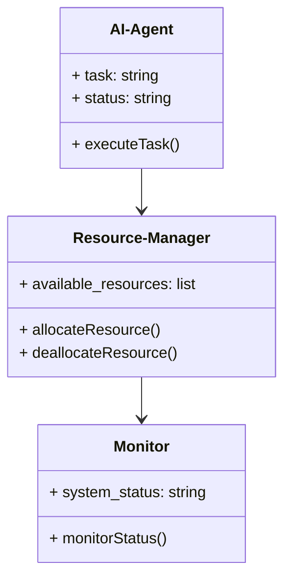
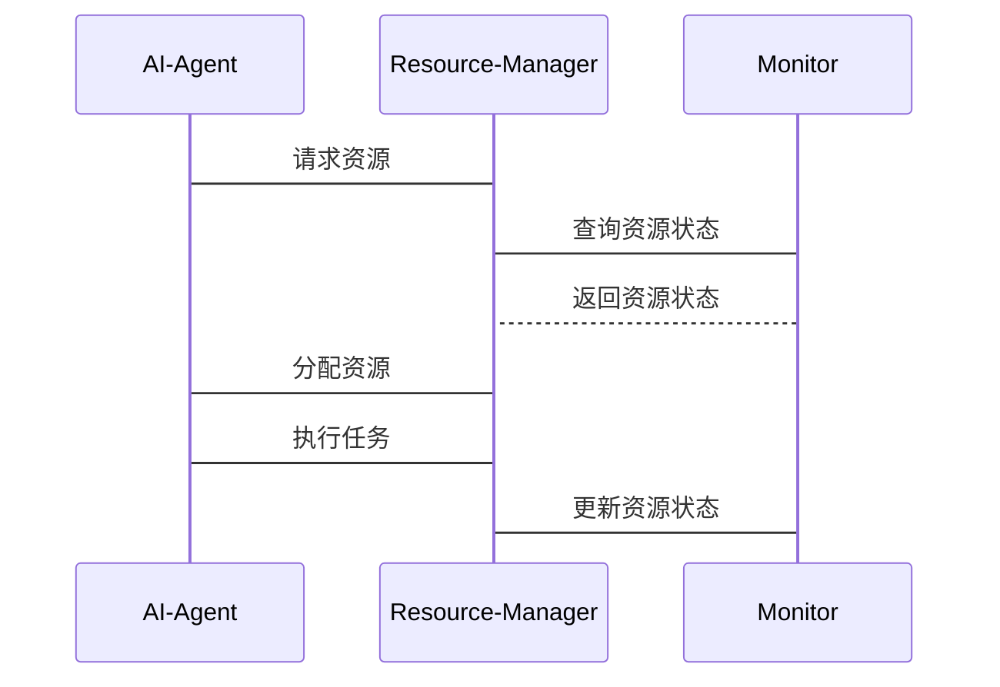

                 


# 企业AI Agent的混合云部署策略

## 关键词
企业AI Agent, 混合云部署, 云原生架构, 资源优化, 弹性伸缩, 安全性, 可扩展性

## 摘要
随着人工智能技术的快速发展，企业AI Agent的应用场景日益广泛。然而，AI Agent的部署和管理面临着资源需求波动大、安全性要求高、扩展性要求强等挑战。混合云部署作为一种灵活、高效、经济的解决方案，为企业AI Agent的部署提供了新的思路。本文将从企业AI Agent的概念、混合云部署的核心原理、系统架构设计、项目实战以及最佳实践等方面，深入探讨企业AI Agent的混合云部署策略。

---

# 正文

## 第1章: 企业AI Agent与混合云部署的背景与基础

### 1.1 企业AI Agent的概念与特点
#### 1.1.1 企业AI Agent的定义
企业AI Agent是一种基于人工智能技术的代理系统，能够根据企业的业务需求自主决策、执行任务并提供结果。它通常结合了自然语言处理、机器学习、推理引擎等技术，能够实现自动化操作、数据分析、智能推荐等功能。

#### 1.1.2 企业AI Agent的核心功能与优势
- **自动化操作**：能够自动处理重复性任务，如邮件分类、日志分析等。
- **智能决策**：基于历史数据和实时信息，为企业提供最优决策建议。
- **高效交互**：通过自然语言处理技术，实现与用户的高效交互。

#### 1.1.3 企业AI Agent的应用场景
- **客户服务**：智能客服系统，通过自然语言处理实现客户问题解答。
- **供应链管理**：优化供应链流程，预测库存需求，降低运营成本。
- **金融分析**：实时监控市场动态，提供智能投资建议。

### 1.2 混合云部署的基本概念
#### 1.2.1 混合云的定义与特点
混合云是一种结合了公有云和私有云的部署模式，通过将部分资源部署在公有云，部分资源部署在私有云，实现资源的灵活调配和成本优化。

#### 1.2.2 混合云部署的优势与挑战
- **优势**：
  - 成本优化：根据业务需求动态调整资源使用，避免资源浪费。
  - 灵活性高：可以根据业务波动快速扩展或收缩资源。
  - 数据安全性：敏感数据可以部署在私有云，确保数据安全。
- **挑战**：
  - 资源管理复杂：需要协调公有云和私有云的资源分配。
  - 安全性风险：混合云环境可能面临跨云的安全威胁。

#### 1.2.3 混合云与传统云部署的区别
| 特性            | 公有云部署      | 私有云部署      | 混合云部署      |
|-----------------|-----------------|-----------------|-----------------|
| 资源所有权      | 第三方提供       | 企业自建         | 综合使用         |
| 成本            | 按需付费         | 一次性投资       | 更灵活           |
| 扩展性          | 易扩展           | 需自行扩展       | 更灵活           |
| 数据安全性      | 较低            | 较高            | 可定制           |

### 1.3 企业AI Agent与混合云的结合
#### 1.3.1 企业AI Agent在混合云中的应用价值
- 通过混合云部署，企业可以根据业务需求灵活调整AI Agent的资源使用，降低成本。
- 混合云的高可用性和扩展性能够保障AI Agent的稳定运行。

#### 1.3.2 混合云对企业AI Agent部署的影响
- **资源分配**：可以根据AI Agent的任务需求，动态分配公有云和私有云资源。
- **安全性**：敏感任务可以在私有云中执行，确保数据安全。

#### 1.3.3 企业AI Agent混合云部署的背景与趋势
随着企业对AI技术的需求增加，混合云部署因其灵活性和经济性，成为企业AI Agent部署的主流选择。

---

## 第2章: 混合云部署的核心概念与原理

### 2.1 混合云架构的组成与特点
#### 2.1.1 混合云的组成模块
- **公有云平台**：如AWS、Azure、阿里云等。
- **私有云平台**：企业自建的云平台。
- **混合云管理平台**：用于统一管理公有云和私有云资源。

#### 2.1.2 混合云架构的灵活性与扩展性
通过混合云架构，企业可以根据业务需求快速扩展或收缩资源。

#### 2.1.3 混合云的资源分配与管理
- **资源分配**：根据任务需求动态分配公有云和私有云资源。
- **资源管理**：通过混合云管理平台实现资源的统一监控和管理。

### 2.2 AI Agent在混合云中的部署策略
#### 2.2.1 AI Agent的分布式部署
- 将AI Agent部署在多个云平台上，实现负载均衡。
- 使用容器化技术（如Docker）进行部署，确保一致性。

#### 2.2.2 AI Agent的资源动态分配
- 根据任务负载动态调整资源使用。
- 使用弹性伸缩技术（如Auto Scaling）实现资源的自动扩展和收缩。

#### 2.2.3 AI Agent的高可用性保障
- 使用容错设计，确保AI Agent在部分节点故障时仍能正常运行。
- 通过负载均衡技术实现流量分发，提高系统的可用性。

### 2.3 混合云部署的核心原理
#### 2.3.1 资源虚拟化与容器
- 通过容器化技术实现资源的虚拟化，确保AI Agent可以在不同的云环境中无缝运行。

#### 2.3.2 弹性伸缩与负载均衡
- 使用弹性伸缩技术，根据任务负载自动调整资源数量。
- 通过负载均衡技术，实现任务的均匀分布。

---

## 第3章: 混合云部署的算法原理与数学模型

### 3.1 混合云资源分配的算法原理
#### 3.1.1 资源分配算法
- **动态规划算法**：用于资源的最优分配。
- **负载均衡算法**：如轮询算法、随机算法、加权轮询算法等。

#### 3.1.2 资源分配的数学模型
$$ \text{目标函数：} \quad \min_{x} \sum_{i=1}^{n} c_i x_i $$
$$ \text{约束条件：} \quad \sum_{i=1}^{n} a_i x_i \geq D $$

其中，$c_i$ 表示资源 $i$ 的成本，$a_i$ 表示资源 $i$ 的处理能力，$x_i$ 表示资源 $i$ 的数量，$D$ 表示总需求。

### 3.2 负载均衡算法的实现
#### 3.2.1 负载均衡算法的流程
1. 监测各个节点的负载情况。
2. 根据负载情况动态分配任务。
3. 调整资源分配策略，确保负载均衡。

#### 3.2.2 负载均衡算法的实现代码
```python
import random

def load_balancing_algorithm(nodes, tasks):
    # 节点负载初始化为0
    node_load = {node: 0 for node in nodes}
    # 随机分配任务到节点
    for task in tasks:
        selected_node = random.choice(nodes)
        node_load[selected_node] += 1
    return node_load

# 示例
nodes = ['node1', 'node2', 'node3']
tasks = 10
node_load = load_balancing_algorithm(nodes, tasks)
print(node_load)
```

---

## 第4章: 企业AI Agent混合云系统的架构设计

### 4.1 系统功能设计
#### 4.1.1 系统模块划分
- **AI Agent模块**：负责执行具体任务。
- **资源管理模块**：负责资源的分配与管理。
- **监控模块**：负责系统运行状态的监控。

#### 4.1.2 系统功能流程
1. 接收用户请求。
2. 分配资源。
3. 执行任务。
4. 返回结果。

### 4.2 系统架构设计
#### 4.2.1 系统架构的类图


#### 4.2.2 系统交互的序列图


---

## 第5章: 企业AI Agent混合云部署的项目实战

### 5.1 环境安装与配置
#### 5.1.1 安装云平台
- 公有云：选择一个公有云平台（如AWS、Azure）。
- 私有云：搭建一个私有云环境（如使用OpenStack）。
- 混合云管理平台：选择一个混合云管理工具（如AWS CloudFormation、Azure Arc）。

#### 5.1.2 安装AI Agent
- 使用容器化技术（如Docker）部署AI Agent。
- 配置容器的资源限制和动态扩展。

### 5.2 核心代码实现
#### 5.2.1 资源分配模块的实现
```python
import boto3

def allocate_resource(region_name, resource_type):
    # 使用公有云资源
    if region_name == 'public':
        client = boto3.client('ec2', region_name=region_name)
        return client.allocate_address()
    # 使用私有云资源
    else:
        # 假设私有云资源通过API进行管理
        return {'public_ip': '192.168.1.100'}
```

#### 5.2.2 负载均衡模块的实现
```python
import random

def load_balance(tasks, nodes):
    # 随机分配任务到节点
    load = {node: 0 for node in nodes}
    for task in tasks:
        selected_node = random.choice(nodes)
        load[selected_node] += 1
    return load
```

### 5.3 案例分析与优化
#### 5.3.1 案例分析
- 某企业部署了一个AI Agent系统，使用混合云部署模式。
- 公有云用于处理高峰期的任务，私有云用于处理低峰期的任务。

#### 5.3.2 系统优化
- 使用弹性伸缩技术，根据任务负载动态调整资源。
- 优化资源分配算法，提高资源利用率。

---

## 第6章: 总结与展望

### 6.1 总结
企业AI Agent的混合云部署策略通过结合公有云和私有云的优势，为企业提供了灵活、高效、经济的部署方案。本文从背景、核心概念、算法原理、系统架构设计、项目实战等方面，详细探讨了企业AI Agent的混合云部署策略。

### 6.2 注意事项
- 在混合云部署中，需要注意资源分配的合理性，避免资源浪费。
- 需要加强对混合云环境的安全性管理，防止数据泄露。

### 6.3 未来展望
随着人工智能技术的不断发展，企业AI Agent的混合云部署将更加智能化和自动化。未来，可以通过引入更多先进的技术（如边缘计算、区块链）进一步优化混合云部署策略。

---

## 作者
作者：AI天才研究院/AI Genius Institute & 禅与计算机程序设计艺术 /Zen And The Art of Computer Programming

