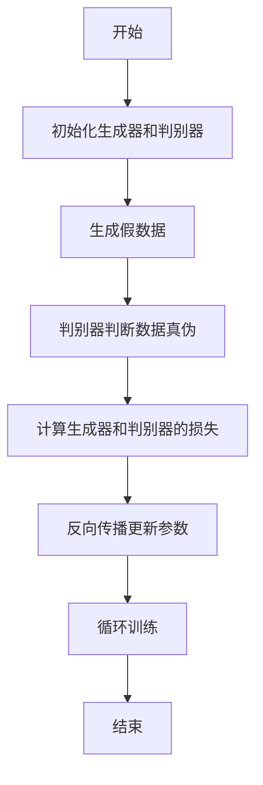
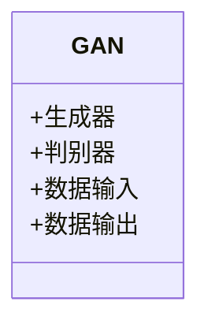
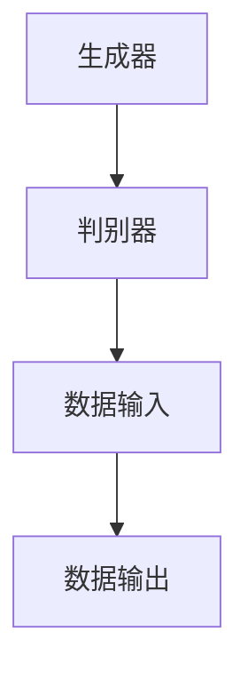
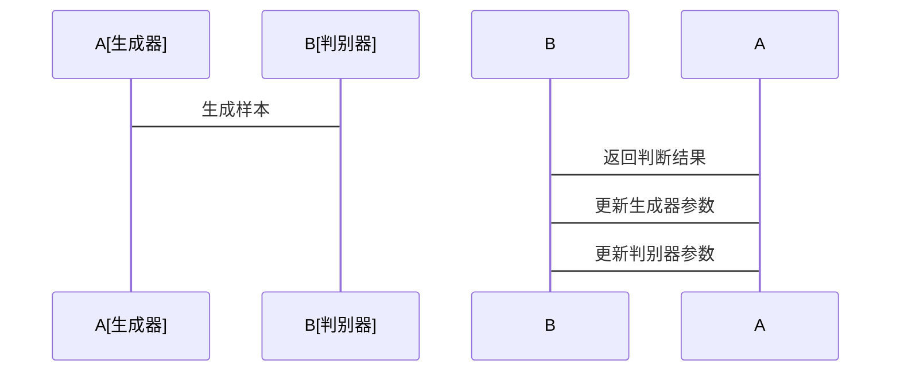

                 


# 企业AI Agent的生成对抗网络在产品设计创新中的应用

> 关键词：生成对抗网络（GAN）、企业AI Agent、产品设计创新、机器学习、深度学习、生成模型

> 摘要：本文探讨了生成对抗网络（GAN）在企业AI Agent中的应用，特别是如何利用GAN推动产品设计创新。通过详细分析GAN的原理、系统架构及实际案例，本文展示了如何将GAN技术整合到企业AI系统中，以提升产品设计的效率和创新能力。文章最后总结了应用中的最佳实践和未来发展方向。

---

# 第1章 背景介绍

## 1.1 生成对抗网络（GAN）概述

### 1.1.1 GAN的基本概念
生成对抗网络（GAN）是一种深度学习模型，由生成器和判别器两个部分组成。生成器负责生成数据，判别器负责区分生成数据与真实数据。两者通过对抗训练不断优化，生成器生成的数据越来越逼真，而判别器则越来越难以区分生成数据和真实数据。

### 1.1.2 GAN的核心原理
GAN的核心在于对抗训练机制。生成器的目标是生成能够欺骗判别器的样本，而判别器的目标是准确地区分真实样本和生成样本。通过不断迭代，生成器和判别器的能力都得到提升。

### 1.1.3 GAN在企业AI Agent中的应用前景
在企业AI Agent中，GAN可以用于生成各种类型的数据，如图像、文本和产品设计灵感。这种生成能力可以帮助企业在产品设计阶段快速生成多种方案，提高设计效率和创新能力。

---

## 1.2 产品设计创新的挑战与机遇

### 1.2.1 传统产品设计的局限性
传统产品设计依赖于设计师的创造力和经验，设计过程耗时且成本高。此外，设计灵感的局限性和市场竞争的加剧使得传统设计方法难以满足现代企业的需求。

### 1.2.2 AI技术在产品设计中的潜力
AI技术，特别是GAN，能够快速生成大量高质量的设计方案，为企业提供更多的选择和灵感。同时，GAN可以通过学习大量现有设计数据，生成符合市场趋势和用户需求的新设计。

### 1.2.3 GAN在产品设计创新中的独特优势
GAN的独特优势在于其生成能力。通过对抗训练，GAN能够生成多样化且符合设计规范的产品方案，帮助设计师快速迭代和优化设计。

---

# 第2章 核心概念与联系

## 2.1 GAN的核心概念原理

### 2.1.1 生成器与判别器的角色与作用
- **生成器**：负责生成数据，目标是欺骗判别器。
- **判别器**：负责区分生成数据和真实数据，目标是尽可能准确地区分两者。

### 2.1.2 GAN的训练过程
GAN的训练过程包括两个步骤：生成器生成样本，判别器判断样本是否为真实样本。通过反向传播，生成器和判别器的参数得到更新，直到生成器生成的样本越来越逼真。

## 2.2 核心概念属性特征对比

| 特性       | 生成器                | 判别器                |
|------------|-----------------------|-----------------------|
| 目标       | 生成真实的数据         | 区分生成数据和真实数据 |
| 输入       | 随机噪声              | 真实数据或生成数据    |
| 输出       | 生成样本              | 判断结果（真/假）    |
| 损失函数   | GAN损失函数           | GAN损失函数           |

## 2.3 ER实体关系图架构

### 2.3.1 生成器与判别器的关系
生成器和判别器通过对抗训练相互促进，生成器生成的样本为判别器提供输入，而判别器的反馈用于优化生成器的生成能力。

### 2.3.2 数据流与模型训练的关系
数据流从生成器流向判别器，生成器根据判别器的反馈更新参数，判别器则根据真实数据和生成数据更新参数。

---

# 第3章 算法原理讲解

## 3.1 GAN算法的mermaid流程图



## 3.2 生成器和判别器的数学模型

### 3.2.1 生成器的损失函数
$$\mathcal{L}_G = -\mathbb{E}_{z}[\log(D(G(z)))]$$

### 3.2.2 判别器的损失函数
$$\mathcal{L}_D = -\mathbb{E}_{x}[ \log(D(x)) ] - \mathbb{E}_{z}[ \log(1 - D(G(z))) ]$$$

---

## 3.3 举例说明

### 3.3.1 生成图像的例子
假设生成器生成一张图像，判别器需要判断该图像是否为真实图像。通过不断训练，生成器能够生成越来越逼真的图像。

### 3.3.2 生成对抗训练的简单案例
以MNIST手写数字为例，生成器生成手写数字，判别器判断生成的数字是否与真实数字一致。

---

# 第4章 系统分析与架构设计方案

## 4.1 项目介绍

### 4.1.1 项目目标
利用GAN技术，为企业AI Agent提供产品设计创新的支持，提高设计效率和创新能力。

### 4.1.2 项目范围
涵盖生成器和判别器的设计、模型训练、系统集成和实际应用。

### 4.1.3 项目利益相关者
包括企业设计师、数据科学家、技术开发人员和最终用户。

---

## 4.2 系统功能设计

### 4.2.1 领域模型mermaid类图



### 4.2.2 系统架构设计mermaid架构图



### 4.2.3 系统接口设计
系统接口包括生成器接口、判别器接口和数据接口，分别负责生成数据、判断数据真伪和提供数据输入输出。

### 4.2.4 系统交互mermaid序列图



---

## 4.3 项目实战

### 4.3.1 环境安装
需要安装Python、TensorFlow或Keras、和Mermaid图生成工具。

### 4.3.2 系统核心实现源代码

```python
import tensorflow as tf
from tensorflow import keras
import numpy as np

# 定义生成器
def generator():
    model = keras.Sequential([
        keras.layers.Dense(256, activation='relu'),
        keras.layers.Dense(784, activation='sigmoid')
    ])
    return model

# 定义判别器
def discriminator():
    model = keras.Sequential([
        keras.layers.Dense(256, activation='relu'),
        keras.layers.Dense(1, activation='sigmoid')
    ])
    return model

# 编写GAN训练过程
def train_gan():
    generator = generator()
    discriminator = discriminator()
    optimizer = tf.keras.optimizers.Adam(0.0002)

    for epoch in range(100):
        for _ in range(100):
            # 生成假数据
            noise = np.random.randn(128, 100)
            generated_images = generator.predict(noise)

            # 判别器训练
            real_images = np.random.normal(0, 1, (128, 784))
            real_logits = discriminator.predict(real_images)
            fake_logits = discriminator.predict(generated_images)

            # 计算损失
            g_loss = -np.mean(np.log(fake_logits))
            d_loss = -np.mean(np.log(real_logits) + np.log(1 - fake_logits))

            # 更新参数
            generator.trainable = True
            discriminator.trainable = False
            g_loss.backward()
            optimizer.apply_gradients(generator.trainable_weights)
            generator.trainable = False
            discriminator.trainable = True
            d_loss.backward()
            optimizer.apply_gradients(discriminator.trainable_weights)
```

### 4.3.3 代码应用解读与分析
上述代码实现了生成器和判别器的定义，并通过对抗训练更新参数。生成器生成假数据，判别器判断数据真伪，通过不断迭代，生成器和判别器的能力逐步提升。

### 4.3.4 实际案例分析和详细讲解剖析
以生成手写数字为例，生成器生成数字图像，判别器判断图像是否为真实数字。通过训练，生成器能够生成逼真的数字图像，判别器的判断准确率逐渐下降。

### 4.3.5 项目小结
通过项目实战，我们验证了GAN在产品设计创新中的应用潜力，展示了如何利用GAN快速生成高质量的设计方案。

---

# 第5章 最佳实践 tips、小结、注意事项、拓展阅读

## 5.1 最佳实践 tips
- 确保数据质量，选择高质量的数据集进行训练。
- 合理设置超参数，如学习率和训练轮数，以获得最佳效果。
- 定期监控生成器和判别器的损失，防止模型崩溃或过拟合。

## 5.2 小结
本文详细探讨了GAN在企业AI Agent中的应用，展示了如何利用GAN技术提升产品设计创新效率。通过系统架构设计和项目实战，我们验证了GAN在实际应用中的潜力和效果。

## 5.3 注意事项
- 在实际应用中，需要考虑模型的计算资源消耗和训练时间。
- 需要结合具体业务场景，选择合适的GAN变体，如Wasserstein GAN或CycleGAN。

## 5.4 拓展阅读
- 《Deep Learning》 —— Ian Goodfellow
- 《Generative Adversarial Nets》 —— Ian Goodfellow

---

作者：AI天才研究院/AI Genius Institute & 禅与计算机程序设计艺术 /Zen And The Art of Computer Programming

