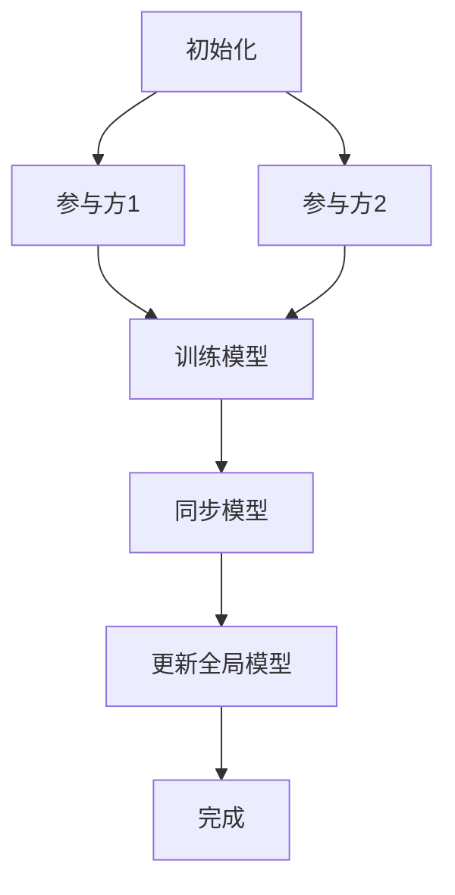
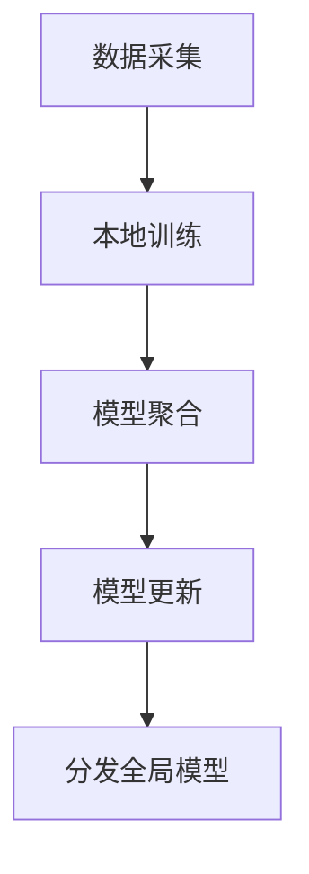
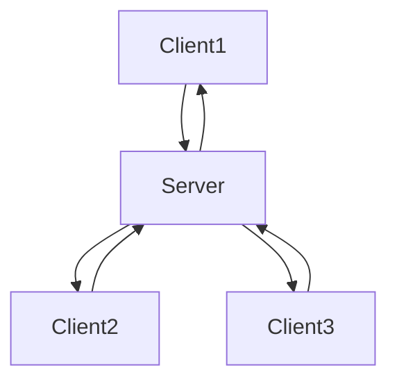

                 


# 《企业AI Agent的联邦学习安全协议设计》

## 关键词：企业AI Agent，联邦学习，安全协议，数据隐私，模型安全，多方协作

## 摘要：本文系统地探讨了在企业AI Agent环境下，如何设计联邦学习的安全协议。通过分析联邦学习的基本原理、AI Agent的核心功能，以及两者结合的安全挑战，本文提出了基于联邦学习的安全协议设计方法，确保数据隐私和模型安全。文章结合理论与实践，深入分析了协议设计的关键步骤，并通过实际案例展示了如何在企业环境中实现安全的联邦学习协议。

---

# 第1章: 联邦学习与AI Agent概述

## 1.1 联邦学习的基本概念

### 1.1.1 联邦学习的定义与背景
联邦学习（Federated Learning，FL）是一种分布式机器学习技术，允许多个参与方在不共享原始数据的情况下，协作训练共享的模型。其核心思想是“数据不出门，模型多跑路”，适用于数据孤岛、隐私保护需求高的场景。

**问题背景**：
- 数据孤岛问题：企业间数据无法共享，导致模型训练效率低下。
- 隐私保护需求：企业数据涉及商业机密和个人隐私，不能直接共享。

**问题解决**：
- 通过联邦学习，各参与方可以在本地数据上训练模型，并通过通信协议交换模型参数，最终形成一个全局模型。

**边界与外延**：
- 边界：仅在模型参数层面进行协作，原始数据不离开本地。
- 外延：支持多种模型架构和优化算法，适用于分类、回归等多种任务。

### 1.1.2 联邦学习的核心特点
1. 数据局部性：数据无需集中，模型参数共享。
2. 隐私保护：通过加密和差分隐私技术保护数据隐私。
3. 分布式协作：各参与方协作训练，形成全局模型。

### 1.1.3 联邦学习与传统数据共享的区别
| 特性 | 联邦学习 | 传统数据共享 |
|------|----------|--------------|
| 数据共享 | 参数共享 | 数据共享     |
| 隐私风险 | 低       | 高           |
| 灵活性 | 高       | 低           |

### 1.1.4 联邦学习的应用场景
1. 医疗领域：患者数据隐私保护。
2. 金融领域：客户数据安全共享。
3. 智能制造：设备间协作优化。

## 1.2 AI Agent的定义与特点

### 1.2.1 AI Agent的定义
AI Agent（人工智能代理）是一种能够感知环境、自主决策并执行任务的智能实体。它可以是一个软件程序、一个机器人，甚至是嵌入在设备中的智能模块。

### 1.2.2 AI Agent的核心功能
1. 感知环境：通过传感器或API获取环境信息。
2. 问题建模：将问题转化为模型可以处理的形式。
3. 决策推理：基于模型和环境信息做出决策。
4. 执行任务：通过执行器或API完成任务。

### 1.2.3 AI Agent与传统AI的区别
| 特性 | AI Agent | 传统AI       |
|------|----------|--------------|
| 自主性 | 高       | 低           |
| 交互性 | 高       | 低           |
| 可扩展性 | 高      | 低           |

## 1.3 企业AI Agent的背景与需求

### 1.3.1 企业智能化转型的背景
- 数字化转型需求：企业需要通过智能化技术提升竞争力。
- 数据驱动决策：企业需要利用数据进行精准决策。
- 高效协作需求：企业内部和外部需要高效协作。

### 1.3.2 AI Agent在企业中的应用场景
1. 智能客服：通过AI Agent实现自动化客户服务。
2. 智能监控：实时监控企业运行状态。
3. 智能决策：基于数据进行商业决策。

### 1.3.3 企业AI Agent的痛点与挑战
1. 数据隐私保护：企业数据涉及商业机密和个人隐私。
2. 安全威胁：AI Agent可能成为攻击目标。
3. 协作效率：多部门协作需要高效通信机制。

## 1.4 联邦学习在企业AI Agent中的应用

### 1.4.1 联邦学习的优势
- 数据隐私保护：通过联邦学习，企业可以在不共享数据的情况下协作训练模型。
- 高效协作：联邦学习支持分布式协作，提升企业内部和外部的协作效率。
- 模型性能提升：通过多源数据协作，提升模型的泛化能力。

### 1.4.2 联邦学习在企业AI Agent中的价值
1. 提升模型性能：通过多源数据协作，提升模型的准确性和泛化能力。
2. 数据隐私保护：通过联邦学习，企业可以在不共享数据的情况下协作训练模型。
3. 降低通信成本：通过优化通信协议，降低数据传输的带宽和延迟。

### 1.4.3 联邦学习的安全性问题
- 数据泄露风险：如果通信协议不安全，可能导致模型参数泄露。
- 攻击风险：恶意参与方可能通过攻击联邦学习协议破坏模型训练。

## 1.5 本章小结
本章介绍了联邦学习和AI Agent的基本概念，分析了企业AI Agent的背景与需求，探讨了联邦学习在企业AI Agent中的应用价值和安全性问题，为后续章节的安全协议设计奠定了基础。

---

# 第2章: 联邦学习与AI Agent的核心概念

## 2.1 联邦学习的协议框架

### 2.1.1 联邦学习的协议结构
1. 初始化阶段：确定参与方、模型架构和训练目标。
2. 通信阶段：参与方通过通信协议交换模型参数。
3. 同步阶段：所有参与方同步最新模型参数。

### 2.1.2 联邦学习的通信机制
- 基于加密的通信：通过加密技术保护通信数据。
- 基于差分隐私的通信：通过差分隐私技术保护参与方的贡献数据。

### 2.1.3 联邦学习的同步机制
- 同步频率：周期性同步或实时同步。
- 同步方式：全量同步或增量同步。

## 2.2 AI Agent的联邦学习协议设计

### 2.2.1 AI Agent的协议特点
1. 自主性：AI Agent可以根据环境动态调整协议参数。
2. 可扩展性：支持多个参与方加入或退出。
3. 安全性：通过加密和差分隐私技术保护数据隐私。

### 2.2.2 AI Agent的协议框架
1. 初始化：确定参与方和模型架构。
2. 训练：每个参与方在本地数据上训练模型，并通过通信协议交换参数。
3. 同步：所有参与方同步最新模型参数。

### 2.2.3 AI Agent协议与传统协议的对比
| 特性 | AI Agent协议 | 传统协议       |
|------|--------------|----------------|
| 自主性 | 高           | 低             |
| 安全性 | 高           | 低             |
| 可扩展性 | 高          | 低             |

## 2.3 联邦学习的安全性分析

### 2.3.1 联邦学习的安全威胁
1. 数据泄露：模型参数可能泄露数据分布。
2. 模型攻击：恶意参与方可能通过攻击模型训练过程破坏模型。
3. 通信攻击：攻击者可能截获或篡改通信数据。

### 2.3.2 联邦学习的安全性保障
1. 加密通信：通过加密技术保护通信数据。
2. 差分隐私：在模型训练中加入噪声，保护参与方的数据隐私。
3. 模型验证：通过验证机制检测恶意参与方。

### 2.3.3 联邦学习的安全性评估
1. 模型鲁棒性评估：评估模型对攻击的抵抗能力。
2. 数据隐私评估：评估协议对数据隐私的保护能力。

## 2.4 本章小结
本章详细分析了联邦学习与AI Agent的核心概念，探讨了协议设计的关键要素和安全性保障措施，为后续章节的安全协议实现奠定了理论基础。

---

# 第3章: 联邦学习与AI Agent的核心原理

## 3.1 联邦学习的算法原理

### 3.1.1 联邦学习的基本算法
- 联邦平均（FedAvg）：通过加权平均各参与方的模型参数，形成全局模型。

### 3.1.2 联邦学习的数学模型
$$ \theta_{global} = \sum_{i=1}^{n} \frac{1}{n} \theta_i $$
其中，$\theta_{global}$ 是全局模型参数，$\theta_i$ 是第i个参与方的模型参数，n 是参与方总数。

### 3.1.3 联邦学习的流程图


## 3.2 AI Agent的联邦学习协议设计

### 3.2.1 AI Agent的协议实现
1. 本地训练：每个参与方在本地数据上训练模型。
2. 模型聚合：通过通信协议聚合各参与方的模型参数，形成全局模型。
3. 模型更新：将全局模型分发给所有参与方，更新本地模型。

### 3.2.2 AI Agent协议的代码实现
```python
def train_local_model(model, data, epochs):
    for epoch in range(epochs):
        model.train(data)
    return model

def aggregate_models(global_model, models):
    for param_global, param_local in zip(global_model.parameters(), models.parameters()):
        param_global.data += (param_local.data - param_global.data) * weight
    return global_model

def main():
    global_model = initialize_model()
    while True:
        models = [train_local_model(global_model, data_i) for i in participants]
        global_model = aggregate_models(global_model, models)
```

### 3.2.3 联邦学习的数学模型
$$ \theta_{global}^{new} = \theta_{global}^{old} + \sum_{i=1}^{n} \lambda_i (\theta_i^{local} - \theta_{global}^{old}) $$
其中，$\lambda_i$ 是第i个参与方的权重。

---

# 第4章: 系统分析与架构设计

## 4.1 系统功能设计

### 4.1.1 问题场景介绍
企业AI Agent需要在多个参与方之间协作训练模型，同时保护数据隐私。

### 4.1.2 系统功能需求
1. 数据采集：采集企业内部和外部数据。
2. 模型训练：在本地数据上训练模型。
3. 模型聚合：通过通信协议聚合模型参数。
4. 模型更新：更新全局模型并分发给所有参与方。

### 4.1.3 系统功能流程图


## 4.2 系统架构设计

### 4.2.1 系统架构图


### 4.2.2 系统接口设计
1. 客户端接口：`train_and_send(model)`，用于本地训练并发送模型参数。
2. 服务器接口：`aggregate_and_push(model)`, 用于聚合模型参数并分发全局模型。

## 4.3 系统交互设计

### 4.3.1 系统交互流程图
```mermaid
graph TD
    Client1 --> Server: 发送模型参数
    Server --> Client2: 请求模型参数
    Client2 --> Server: 发送模型参数
    Server --> Client1: 分发全局模型
```

### 4.3.2 系统交互步骤
1. 客户端1发送本地模型参数到服务器。
2. 服务器请求客户端2发送本地模型参数。
3. 客户端2发送模型参数到服务器。
4. 服务器聚合模型参数，生成全局模型。
5. 服务器将全局模型分发给客户端1。

---

# 第5章: 项目实战

## 5.1 环境搭建

### 5.1.1 环境需求
1. Python 3.6+
2. PyTorch 1.9+
3. 加密库（如PyCrypto）

### 5.1.2 安装依赖
```bash
pip install torch
pip install pycrypto
```

## 5.2 核心实现

### 5.2.1 本地训练实现
```python
import torch

def train(model, data, epochs):
    for epoch in range(epochs):
        outputs = model(data)
        loss = criterion(outputs, labels)
        loss.backward()
        optimizer.step()
    return model
```

### 5.2.2 模型聚合实现
```python
def aggregate(global_model, local_models, weights):
    for i in range(len(global_model.parameters())):
        global_model.parameters()[i].data += weights[i] * (local_models[i].parameters()[i].data - global_model.parameters()[i].data)
    return global_model
```

## 5.3 案例分析

### 5.3.1 实际应用
企业AI Agent在智能客服中的应用：
1. 数据采集：从客户咨询记录中提取数据。
2. 模型训练：在本地数据上训练客服响应模型。
3. 模型聚合：通过联邦学习聚合各参与方的模型参数，形成全局模型。
4. 模型更新：将全局模型分发给所有参与方，更新本地模型。

### 5.3.2 实施步骤
1. 初始化：确定参与方和模型架构。
2. 本地训练：每个参与方在本地数据上训练模型。
3. 模型聚合：通过通信协议聚合模型参数，形成全局模型。
4. 模型更新：将全局模型分发给所有参与方，更新本地模型。

---

# 第6章: 总结与展望

## 6.1 总结

### 6.1.1 核心内容回顾
- 联邦学习的基本原理。
- AI Agent的核心功能。
- 联邦学习的安全协议设计。

### 6.1.2 安全协议设计的关键点
1. 加密通信：通过加密技术保护通信数据。
2. 差分隐私：在模型训练中加入噪声，保护参与方的数据隐私。
3. 模型验证：通过验证机制检测恶意参与方。

## 6.2 最佳实践 tips

### 6.2.1 安全协议设计的建议
1. 使用加密技术保护通信数据。
2. 在模型训练中加入差分隐私技术，保护数据隐私。
3. 定期进行模型验证，检测恶意参与方。

### 6.2.2 项目实施的注意事项
1. 确保参与方之间的通信安全。
2. 定期更新协议，应对新的安全威胁。
3. 通过培训提高参与方的安全意识。

## 6.3 未来展望

### 6.3.1 技术发展
1. 基于AI的自动安全检测。
2. 更高效的联邦学习算法。

### 6.3.2 应用领域
1. 更多行业应用：医疗、金融、教育等。
2. 更多场景应用：实时协作、动态扩展等。

---

# 作者：AI天才研究院/AI Genius Institute & 禅与计算机程序设计艺术 /Zen And The Art of Computer Programming

