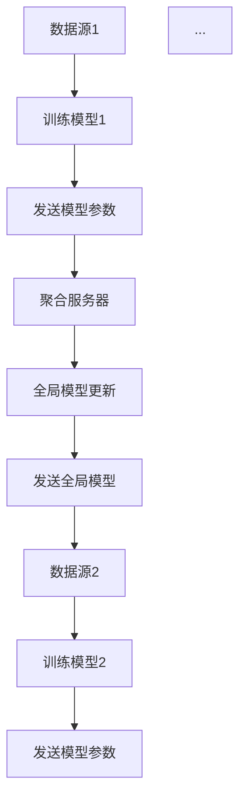
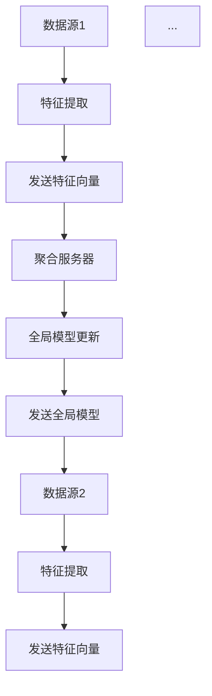
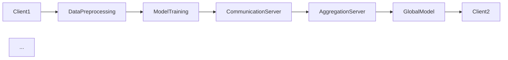

                 


# 《企业AI Agent的联邦学习实践：保护数据隐私》

---

## 关键词  
联邦学习, 数据隐私, AI Agent, 分布式机器学习, 数据安全, 企业应用

---

## 摘要  
随着人工智能技术的快速发展，数据隐私保护成为企业AI Agent应用中的核心挑战。联邦学习作为一种新兴的分布式机器学习技术，能够在不共享原始数据的前提下，实现模型的联合训练和推理，有效保护数据隐私。本文从联邦学习的背景出发，详细讲解其核心概念、算法原理、系统架构设计以及实际应用案例，为企业AI Agent的联邦学习实践提供全面的技术指导。

---

## 第1章：联邦学习的背景与核心概念

### 1.1 数据隐私保护的挑战  
在数字化转型的背景下，企业收集和处理的数据量急剧增加，数据隐私保护成为重中之重。传统的数据共享方式（如集中式训练）容易导致数据泄露风险，而联邦学习通过分布式训练的方式，在保护数据隐私的同时实现模型的联合优化。  

#### 问题背景  
- 数据孤岛问题：不同企业或部门之间数据无法共享，导致模型训练效率低下。  
- 数据隐私泄露风险：集中式数据存储和处理方式容易成为黑客攻击的目标。  
- 数据规模限制：单个企业的数据量有限，难以训练高质量的模型。  

#### 问题解决  
联邦学习通过将模型训练过程分散到数据源端，仅交换模型参数或中间结果，避免了原始数据的共享，从而保护数据隐私。  

---

### 1.2 联邦学习的核心概念  

#### 1.2.1 联邦学习的定义  
联邦学习（Federated Learning）是一种分布式机器学习技术，旨在通过在多个参与方之间联合训练模型，同时保护各方的数据隐私。  

#### 1.2.2 联邦学习的核心要素  
| 核心要素 | 描述 |  
|----------|------|  
| 数据分布 | 数据按地理位置或组织分布 |  
| 通信协议 | 确定参与方之间的数据交换方式 |  
| 模型同步 | 如何将局部模型参数聚合为全局模型 |  

#### 1.2.3 联邦学习与传统机器学习的区别  
| 方面 | 联邦学习 | 传统机器学习 |  
|------|----------|-----------------|  
| 数据存储 | 分散在各参与方 | 集中存储 |  
| 数据共享 | 不共享原始数据 | 共享原始数据 |  
| 计算开销 | 较高 | 较低 |  

---

## 第2章：联邦学习的核心原理  

### 2.1 数据分布与通信机制  

#### 2.1.1 数据分布类型  
- **横向分布**：数据按样本分布（如不同用户的交易记录）。  
- **纵向分布**：数据按特征分布（如不同机构的客户信息）。  

#### 2.1.2 通信协议  
- **加密通信**：通过加密技术确保数据传输过程中的安全性。  
- **差分隐私**：在数据交换过程中添加噪声，保护数据隐私。  

### 2.2 模型同步与更新策略  

#### 2.2.1 模型同步方法  
- **全同步**：所有参与方定期同步模型参数。  
- **异步更新**：参与方可以异步更新模型参数，减少通信开销。  

#### 2.2.2 模型聚合策略  
- **平均法**：将各参与方的模型参数取平均值。  
- **加权法**：根据参与方的数据量或模型性能赋予不同的权重。  

---

## 第3章：横向联邦学习算法  

### 3.1 横向联邦学习的基本原理  

#### 3.1.1 横向联邦学习的流程图  



#### 3.1.2 横向联邦学习的数学模型  

全局模型参数 $\theta$ 的更新公式为：  
$$ \theta_{new} = \frac{1}{N} \sum_{i=1}^{N} \theta_i $$  
其中，$N$ 是参与方的数量，$\theta_i$ 是第 $i$ 个参与方的模型参数。  

---

## 第4章：纵向联邦学习算法  

### 4.1 纵向联邦学习的基本原理  

#### 4.1.1 纵向联邦学习的流程图  



#### 4.1.2 纵向联邦学习的数学模型  

假设参与方的特征向量为 $x_i$，全局模型的参数为 $\theta$，则模型更新公式为：  
$$ \theta_{new} = \theta + \eta \cdot \nabla L(x_i, \theta) $$  
其中，$\eta$ 是学习率，$\nabla L(x_i, \theta)$ 是损失函数的梯度。  

---

## 第5章：系统分析与架构设计  

### 5.1 项目背景  
本文以一个电商企业的客户画像构建项目为例，介绍联邦学习的实际应用。项目目标是通过联邦学习技术，在不共享客户数据的前提下，联合训练客户画像模型。  

### 5.2 系统功能设计  

#### 5.2.1 系统功能模块  
- 数据预处理模块：对数据进行清洗和特征提取。  
- 模型训练模块：负责模型的本地训练和参数更新。  
- 聚合服务器：接收各参与方的模型参数，进行全局模型聚合。  

#### 5.2.2 系统架构图  



---

## 第6章：项目实战  

### 6.1 环境配置  
- 安装Python和相关库（如TensorFlow Federated）。  
- 配置通信服务器（如使用Kafka或gRPC）。  

### 6.2 核心代码实现  

#### 6.2.1 数据准备  

```python
import pandas as pd

# 加载数据
data = pd.read_csv('client_data.csv')

# 数据预处理
data = data.dropna()
data = pd.get_dummies(data)
```

#### 6.2.2 模型训练  

```python
import tensorflow as tf
from tensorflow_federated import tfdf

# 定义模型
model = tf.keras.Sequential([
    tf.keras.layers.Dense(64, activation='relu'),
    tf.keras.layers.Dense(1, activation='sigmoid')
])

# 编译模型
model.compile(optimizer='adam', loss='binary_crossentropy', metrics=['accuracy'])
```

#### 6.2.3 联邦学习训练  

```python
# 初始化全局模型
global_model = model.copy()

# 模型聚合
def aggregate(models):
    return sum(models) / len(models)

# 模型同步
for client in clients:
    client_model = client.train(global_model)
    global_model = aggregate([global_model, client_model])
```

---

## 第7章：最佳实践与总结  

### 7.1 小结  
联邦学习为企业AI Agent的应用提供了有效的数据隐私保护解决方案。通过分布式训练和模型聚合，可以在不共享原始数据的前提下，构建高质量的模型。  

### 7.2 注意事项  
- 数据预处理阶段要确保特征的一致性。  
- 模型聚合过程中要注意权重分配的合理性。  
- 通信协议的选择要兼顾安全性和效率。  

### 7.3 拓展阅读  
- [TensorFlow Federated官方文档](https://www.tensorflow.org/federated)  
- [联邦学习的最新研究进展](https://arxiv.org/abs/2301.00109)  

---

## 作者：AI天才研究院 & 禅与计算机程序设计艺术

---

通过以上目录和内容，您可以逐步撰写完整的文章。希望对您有所帮助！

