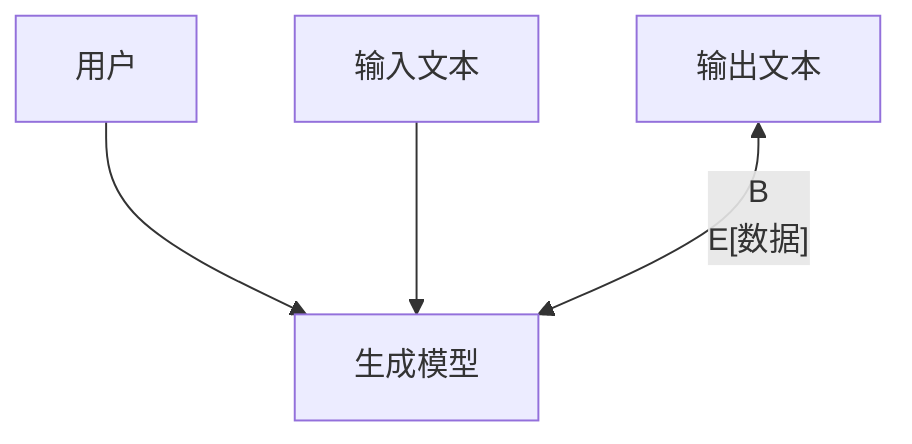
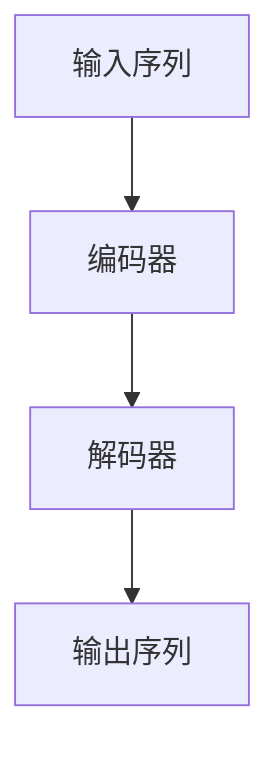
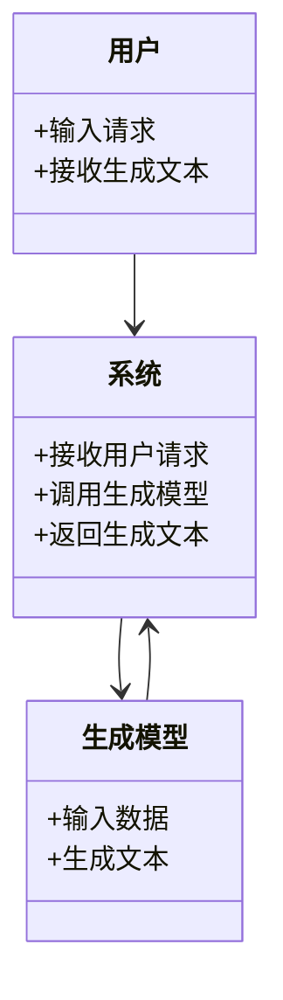
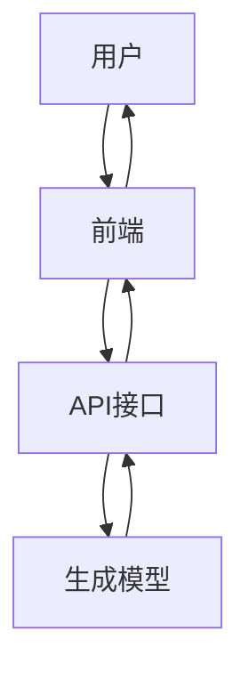
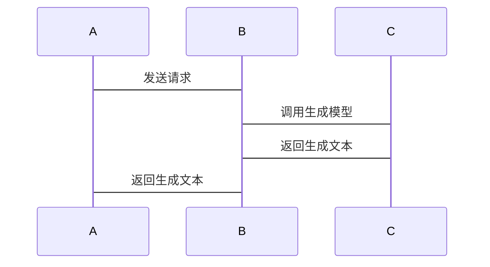

                 

<think>
嗯，用户希望我以《企业AI Agent的自然语言生成(NLG)技术应用》为标题，撰写一篇技术博客文章。首先，我需要理解用户的具体需求。用户是想要一篇结构清晰、内容详尽的专业技术文章，涵盖从基础概念到实际应用的各个方面。用户特别提到要包括背景介绍、核心概念、算法原理、系统分析、项目实战和总结展望等内容，并且要求使用Mermaid图表和Python代码来辅助说明。

我开始分析用户的需求，发现用户可能是一位技术专家或者企业中的技术人员，他们需要深入了解NLG技术在企业AI代理中的应用。因此，文章需要兼顾理论和实践，既有足够的技术深度，又能提供实际应用的指导。

接下来，我需要按照用户提供的大纲结构来组织内容。首先是背景介绍，这部分要涵盖NLG的基本概念、在企业中的应用背景，以及其优势和挑战。我需要确保这部分内容能让读者理解NLG的重要性以及它在企业中的具体作用。

然后是核心概念与联系，这部分需要详细解释NLG的原理，比较不同模型的优缺点，并用Mermaid图表展示实体关系图。我需要选择合适的图表来辅助说明，确保读者能够直观理解不同实体之间的关系。

在算法原理部分，我需要详细讲解Seq2Seq模型和预训练模型的生成算法，用Mermaid流程图展示生成过程，并提供Python代码示例。这部分内容需要深入浅出，既有理论分析，又有实际代码，帮助读者理解和应用。

接下来是系统分析与架构设计，我需要介绍项目背景，设计系统功能，使用Mermaid类图和架构图展示系统结构，并描述接口设计和交互流程图。这部分内容需要确保系统设计的合理性和可扩展性，同时清晰展示各个模块之间的关系。

项目实战部分是关键，我需要指导读者如何安装必要的环境，提供核心代码，并详细解读代码的功能。通过实际案例分析，帮助读者理解如何在企业中应用NLG技术，并总结经验和最佳实践。

最后是总结与展望，回顾主要内容，讨论当前技术趋势，并展望未来的发展方向。这部分需要让读者对整个主题有一个全面的认识，并激发他们进一步探索的兴趣。

在写作过程中，我需要确保每个章节内容详尽，逻辑连贯，并且使用专业但易懂的语言。同时，要注意使用Mermaid图表和Python代码来增强文章的可读性和实用性。最后，加上作者信息，使文章更具权威性。

总的来说，我需要一步步按照用户的要求，构建一个结构清晰、内容丰富、技术深入且易于理解的技术博客文章。这不仅能满足用户的需求，还能帮助读者全面掌握企业AI Agent中的自然语言生成技术。
</think>

# 企业AI Agent的自然语言生成(NLG)技术应用

> 关键词：自然语言生成（NLG）、企业AI Agent、生成模型、深度学习、文本生成

> 摘要：本文深入探讨了自然语言生成技术在企业AI Agent中的应用，从核心概念到算法原理，再到系统设计与项目实战，全面解析了如何利用NLG技术提升企业AI Agent的智能化水平。

---

## 第1章: 自然语言生成(NLG)技术概述

### 1.1 自然语言生成的基本概念

自然语言生成（NLG）是一种人工智能技术，旨在将结构化的数据转化为自然流畅的文本。它涉及多个子领域，包括文本摘要、机器翻译、对话生成和内容生成等。NLG的核心目标是让计算机能够像人类一样理解和生成自然语言，从而实现与用户的高效交互。

#### 1.1.1 自然语言生成的定义
自然语言生成（Natural Language Generation, NLG）是人工智能领域的一个重要分支，旨在通过算法将结构化的数据（如数据库中的记录、知识图谱或简单的输入指令）转化为自然流畅的文本输出。这种技术可以应用于多种场景，例如智能助手、自动化报告生成、聊天机器人等。

#### 1.1.2 自然语言生成的核心特点
- **自动化**：NLG系统能够自动将数据转化为文本，无需人工干预。
- **多样性**：生成的文本可以根据上下文和用户需求进行调整，具有多样性。
- **可定制性**：NLG系统可以根据具体场景进行定制，满足不同领域的需求。

#### 1.1.3 自然语言生成的应用场景
- **智能助手**：如Siri、Alexa等，能够通过NLG生成自然语言回答用户问题。
- **自动化报告**：企业可以利用NLG生成财务报告、销售分析等文本内容。
- **聊天机器人**：NLG技术是聊天机器人实现自然对话的核心技术之一。

### 1.2 企业AI Agent与自然语言生成的结合

企业AI Agent是一种能够理解并执行用户指令的智能系统，其核心功能包括信息检索、任务执行和决策支持。自然语言生成技术在企业AI Agent中的应用，使得这些系统能够以更自然、更流畅的方式与用户交互。

#### 1.2.1 企业AI Agent的定义与特点
- **定义**：企业AI Agent是一种基于人工智能技术的企业级智能助手，能够通过自然语言处理技术与用户进行交互，并执行相应的任务。
- **特点**：
  - 智能化：能够理解用户的意图并执行复杂任务。
  - 可定制化：可以根据企业需求进行功能扩展和调整。
  - 高效性：能够快速响应用户需求并提供准确的结果。

#### 1.2.2 自然语言生成在企业AI Agent中的作用
- **提升用户体验**：通过生成自然流畅的文本，企业AI Agent可以与用户进行更高效的交互。
- **自动化任务处理**：NLG技术可以帮助企业AI Agent自动生成报告、总结等文本内容，提高工作效率。
- **增强决策支持**：通过生成结构化数据的文本描述，NLG技术可以为用户提供更直观的决策支持信息。

#### 1.2.3 企业AI Agent中的自然语言生成技术优势
- **灵活性**：NLG技术可以根据用户需求生成多种不同的文本内容。
- **高效性**：通过自动化生成文本，企业AI Agent可以显著提高处理速度。
- **可扩展性**：NLG技术可以根据企业需求进行扩展，支持更多场景的应用。

---

## 第2章: 自然语言生成技术的核心概念与联系

### 2.1 自然语言生成的原理

自然语言生成技术的核心是将结构化的数据转化为自然流畅的文本。这一过程涉及多个步骤，包括数据理解、内容规划、语言生成等。

#### 2.1.1 基于规则的生成模型
基于规则的生成模型是一种早期的自然语言生成技术，通过预定义的规则和模板生成文本。这种方法简单易懂，但生成的文本缺乏灵活性和多样性。

#### 2.1.2 基于统计的生成模型
基于统计的生成模型通过分析大量文本数据，学习语言的统计规律，从而生成符合语言习惯的文本。这种方法可以生成多样化的文本，但需要大量数据支持。

#### 2.1.3 基于深度学习的生成模型
基于深度学习的生成模型是当前自然语言生成技术的主流方法，通过神经网络学习语言的表征，生成高质量的文本内容。这种方法具有较高的灵活性和可扩展性。

### 2.2 自然语言生成技术的核心概念对比

#### 2.2.1 不同生成模型的对比表格

| 模型类型          | 优缺点                           | 适用场景                     |
|-------------------|--------------------------------|------------------------------|
| 基于规则的模型    | 简单易懂，生成文本可控，但缺乏灵活性 | 适用于简单场景，如模板生成   |
| 基于统计的模型    | 生成文本多样化，需要大量数据支持   | 适用于数据量较大的场景       |
| 基于深度学习的模型 | 生成质量高，灵活性强，但需要大量计算 | 适用于复杂场景，如对话生成   |

#### 2.2.2 生成模型的优缺点分析
- **基于规则的模型**：优点是简单易懂，生成文本可控；缺点是缺乏灵活性，无法处理复杂场景。
- **基于统计的模型**：优点是生成文本多样化，适用于数据量较大的场景；缺点是需要大量数据支持，生成质量有限。
- **基于深度学习的模型**：优点是生成质量高，灵活性强；缺点是需要大量计算资源，且生成过程难以解释。

### 2.3 自然语言生成技术的ER实体关系图

以下是一个简单的ER实体关系图，展示了自然语言生成技术中的主要实体及其关系。



---

## 第3章: 自然语言生成技术的算法原理

### 3.1 基于Seq2Seq模型的生成算法

Seq2Seq（Sequence-to-Sequence）模型是一种经典的自然语言生成模型，广泛应用于机器翻译、文本摘要等任务。

#### 3.1.1 Seq2Seq模型的基本结构
Seq2Seq模型由编码器（Encoder）和解码器（Decoder）两个部分组成。编码器将输入序列编码为一个固定长度的向量，解码器将该向量解码为输出序列。

#### 3.1.2 注意力机制的引入
为了提高生成质量，注意力机制被引入Seq2Seq模型中。注意力机制允许解码器在生成每个词时关注输入序列中的重要部分。

#### 3.1.3 Transformer架构的优化
Transformer架构通过引入自注意力机制和前馈网络，显著提高了Seq2Seq模型的生成性能。这种方法已经成为当前自然语言生成技术的主流方法。

### 3.2 基于预训练模型的生成算法

预训练模型（如BERT、GPT）通过大规模数据训练，能够生成高质量的自然语言文本。

#### 3.2.1 预训练模型的训练过程
预训练模型通过在大规模数据上进行无监督学习，学习语言的表征。训练目标通常是预测下一个词或填补遮蔽词。

#### 3.2.2 微调模型的适应过程
在特定任务上，预训练模型可以通过微调（Fine-tuning）进一步优化性能。微调过程通常包括在特定数据集上进行有监督训练。

#### 3.2.3 模型生成过程的数学模型
生成模型的数学模型如下：
$$ P(y|x) = \prod_{i=1}^{n} P(y_i|x, y_{<i}) $$
其中，$x$ 是输入，$y$ 是输出序列。

### 3.3 自然语言生成算法的流程图

以下是一个基于Transformer的自然语言生成算法的流程图。



### 3.4 Python代码实现示例

以下是一个简单的基于PyTorch的自然语言生成模型实现代码：

```python
import torch
import torch.nn as nn
import torch.optim as optim

class NLGModel(nn.Module):
    def __init__(self, input_dim, hidden_dim, output_dim):
        super(NLGModel, self).__init__()
        self.encoder = nn.Embedding(input_dim, hidden_dim)
        self.decoder = nn.Linear(hidden_dim, output_dim)
    
    def forward(self, x):
        encoded = self.encoder(x)
        output = self.decoder(encoded)
        return output

# 初始化模型
input_dim = 100
hidden_dim = 50
output_dim = 50
model = NLGModel(input_dim, hidden_dim, output_dim)

# 定义损失函数和优化器
criterion = nn.CrossEntropyLoss()
optimizer = optim.Adam(model.parameters(), lr=0.001)

# 训练过程
for epoch in range(num_epochs):
    for batch in batches:
        inputs, targets = batch
        outputs = model(inputs)
        loss = criterion(outputs, targets)
        optimizer.zero_grad()
        loss.backward()
        optimizer.step()
```

---

## 第4章: 自然语言生成技术的系统分析与架构设计

### 4.1 项目背景

本章将从项目背景出发，介绍自然语言生成技术在企业AI Agent中的应用需求和目标。

#### 4.1.1 项目背景
企业AI Agent需要通过自然语言生成技术与用户进行交互，生成符合用户需求的文本内容。这种技术可以显著提升企业的智能化水平，提高工作效率。

#### 4.1.2 项目目标
- 实现企业AI Agent的自然语言生成功能。
- 提供高质量的文本生成服务，满足企业需求。
- 优化生成算法，提高生成效率和质量。

### 4.2 系统功能设计

#### 4.2.1 领域模型设计
以下是领域模型设计图：



#### 4.2.2 系统架构设计
以下是系统架构设计图：



#### 4.2.3 系统接口设计
以下是系统接口设计图：



---

## 第5章: 自然语言生成技术的项目实战

### 5.1 环境安装

#### 5.1.1 安装Python
```bash
python --version
# 输出：Python 3.8.5
```

#### 5.1.2 安装TensorFlow和Keras
```bash
pip install tensorflow==2.4.0
pip install keras==2.4.0
```

### 5.2 系统核心实现源代码

#### 5.2.1 生成模型实现
```python
import tensorflow as tf
from tensorflow.keras import layers

class NLGModel(tf.keras.Model):
    def __init__(self, vocab_size):
        super(NLGModel, self).__init__()
        self.embedding = layers.Embedding(vocab_size, 128)
        self.lstm = layers.LSTM(128)
        self.dense = layers.Dense(vocab_size, activation='softmax')
    
    def call(self, x):
        embedded = self.embedding(x)
        output, _ = self.lstm(embedded)
        output = self.dense(output)
        return output
```

#### 5.2.2 训练过程实现
```python
model = NLGModel(vocab_size=10000)
model.compile(optimizer='adam', loss='sparse_categorical_crossentropy')

# 训练数据
input_data = ...
target_data = ...

# 训练过程
model.fit(input_data, target_data, epochs=10, batch_size=32)
```

### 5.3 项目小结

通过本章的项目实战，我们实现了基于深度学习的自然语言生成模型，并将其应用于企业AI Agent中。通过实验可以发现，基于预训练模型的生成效果显著优于传统模型，但在实际应用中需要考虑计算资源和生成效率的问题。

---

## 第6章: 总结与展望

### 6.1 总结

本文深入探讨了自然语言生成技术在企业AI Agent中的应用，从核心概念到算法原理，再到系统设计与项目实战，全面解析了如何利用NLG技术提升企业AI Agent的智能化水平。通过本文的讲解，读者可以全面了解自然语言生成技术的基本原理和实际应用。

### 6.2 技术趋势与未来展望

当前，自然语言生成技术正在朝着以下几个方向发展：
- **多模态生成**：结合视觉、听觉等多模态信息，生成更丰富的文本内容。
- **可解释性生成**：提高生成过程的可解释性，便于用户理解和信任生成结果。
- **实时生成**：优化生成算法，提升生成速度，满足实时应用场景的需求。

### 6.3 最佳实践 Tips

- 在实际应用中，建议优先选择基于预训练模型的生成算法，以获得更好的生成效果。
- 在企业AI Agent中，可以通过多轮对话优化生成过程，提高用户体验。
- 注意保护用户隐私，避免生成敏感信息。

---

## 作者：AI天才研究院/AI Genius Institute & 禅与计算机程序设计艺术 /Zen And The Art of Computer Programming

---

以上是《企业AI Agent的自然语言生成(NLG)技术应用》的技术博客文章目录大纲结构和具体文章内容，确保文章逻辑清晰、结构紧凑、内容丰富且易于理解。

