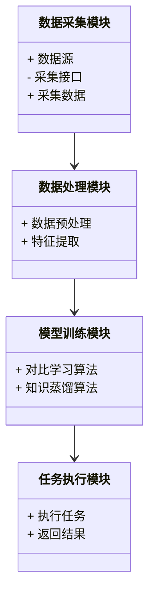
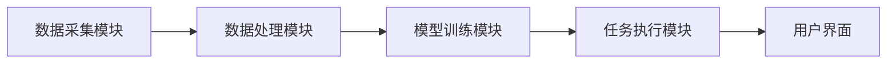

                 


# 企业AI Agent的自监督学习在非结构化数据挖掘中的实践

> 关键词：企业AI Agent，自监督学习，非结构化数据挖掘，对比学习，知识蒸馏，深度学习，文本挖掘

> 摘要：本文详细探讨了企业AI Agent在非结构化数据挖掘中的应用，重点分析了自监督学习在处理非结构化数据中的优势。通过对比学习和知识蒸馏等技术，本文提出了一种创新的系统架构，用于高效地从非结构化数据中提取有价值的信息。文章还提供了具体的实现方案和实际案例分析，为读者提供了清晰的指导和实践参考。

---

# 第一部分: 企业AI Agent与自监督学习基础

## 第1章: 企业AI Agent的背景与概念

### 1.1 什么是AI Agent
#### 1.1.1 AI Agent的定义
AI Agent（人工智能代理）是一种能够感知环境、自主决策并执行任务的智能实体。它可以是一个软件程序、机器人或任何能够与环境交互的智能系统。

#### 1.1.2 AI Agent的核心特征
- **自主性**：能够在没有外部干预的情况下自主运行。
- **反应性**：能够根据环境变化动态调整行为。
- **目标导向**：具有明确的目标，并通过行动实现目标。
- **学习能力**：能够通过经验或数据改进自身的性能。

#### 1.1.3 企业级AI Agent的应用场景
- **客户支持**：通过自然语言处理（NLP）技术为用户提供智能客服。
- **数据分析**：从企业数据中提取有价值的信息，辅助决策。
- **流程自动化**：自动化处理企业中的重复性任务。

### 1.2 自监督学习的定义与特点
#### 1.2.1 自监督学习的定义
自监督学习是一种机器学习范式，其核心思想是利用数据本身的结构来监督学习过程。通过构建 pretext任务（预设任务），模型可以从无标签数据中学习有用的特征。

#### 1.2.2 自监督学习的核心特点
- **无标签数据**：自监督学习可以在无标签数据上进行学习。
- **自适应性**：模型能够根据数据的结构自动调整学习策略。
- **迁移能力**：自监督学习的特征具有较强的迁移能力。

#### 1.2.3 企业AI Agent中自监督学习的应用
- **数据预处理**：在处理非结构化数据时，自监督学习可以帮助模型更好地理解数据。
- **特征提取**：通过自监督学习提取的数据特征可以用于后续的任务。

### 1.3 非结构化数据的定义与挑战
#### 1.3.1 非结构化数据的定义
非结构化数据是指没有固定结构、难以用数据库表示的数据形式，如文本、图像、音频等。

#### 1.3.2 非结构化数据的典型形式
- **文本数据**：如文档、邮件、社交媒体帖子等。
- **图像数据**：如图片、视频等。
- **音频数据**：如语音记录、音乐等。

#### 1.3.3 非结构化数据挖掘的难点与解决方案
- **难点**：非结构化数据的多样性、复杂性和噪声使得传统的数据挖掘方法难以有效处理。
- **解决方案**：利用自监督学习等技术，从非结构化数据中提取有用的特征和信息。

### 1.4 本章小结
本章介绍了企业AI Agent和自监督学习的基本概念，并探讨了非结构化数据的特点和挑战。通过这些内容，读者可以理解自监督学习在非结构化数据挖掘中的重要性。

---

## 第2章: 自监督学习的原理与算法

### 2.1 自监督学习的原理
#### 2.1.1 自监督学习的基本流程
1. **预设任务（Pretext Task）**：构建一个 pretext任务，用于从无标签数据中学习特征。
2. **特征提取**：通过 pretext任务，模型从数据中提取有用的特征。
3. **监督信号**：使用 pretext任务的输出作为监督信号，优化模型参数。

#### 2.1.2 自监督学习的核心思想
自监督学习的核心思想是通过构建 pretext任务，利用数据本身的结构来监督学习过程。这种方法可以在无标签数据上进行有效的特征学习。

#### 2.1.3 自监督学习与无监督学习的区别
| 特征       | 自监督学习          | 无监督学习          |
|------------|---------------------|---------------------|
| 数据类型     | 无标签数据          | 无标签数据          |
| 学习目标     | 预设任务的输出       | 数据的内在结构       |
| 应用场景     | 特征提取、分类等     | 聚类、降维等         |

### 2.2 对比学习（Contrastive Learning）
#### 2.2.1 对比学习的基本概念
对比学习是一种自监督学习方法，其核心思想是通过最大化正样本对的相似性来学习数据的表示。

#### 2.2.2 对比学习的核心算法
1. **输入数据**：给定一批数据，将每对正样本和负样本进行对比。
2. **损失函数**：使用对比损失函数来优化模型参数。
3. **优化过程**：通过梯度下降等方法优化模型参数。

#### 2.2.3 对比学习的优势与局限
- **优势**：对比学习可以有效地从无标签数据中提取特征。
- **局限**：对比学习需要设计合适的正样本对和负样本对。

### 2.3 知识蒸馏（Knowledge Distillation）
#### 2.3.1 知识蒸馏的定义
知识蒸馏是一种从教师模型中提取知识的技术，通常用于小样本学习或模型压缩。

#### 2.3.2 知识蒸馏的关键步骤
1. **教师模型训练**：首先训练一个教师模型，在监督学习下达到较高的性能。
2. **学生模型学习**：通过教师模型的软标签，学生模型进行学习，提取教师模型的知识。
3. **知识蒸馏优化**：通过优化蒸馏过程，提高学生模型的性能。

#### 2.3.3 知识蒸馏在自监督学习中的应用
知识蒸馏可以用于从自监督学习中提取知识，帮助模型在小样本数据上进行有效的学习。

### 2.4 本章小结
本章详细介绍了自监督学习的原理和核心算法，特别是对比学习和知识蒸馏。通过这些内容，读者可以理解自监督学习在非结构化数据挖掘中的应用。

---

## 第3章: 企业AI Agent的系统架构与实现

### 3.1 系统架构设计
#### 3.1.1 分层架构设计
企业AI Agent的系统架构通常采用分层设计，包括数据层、计算层和应用层。

#### 3.1.2 微服务架构设计
采用微服务架构可以提高系统的可扩展性和灵活性，每个服务负责特定的功能模块。

#### 3.1.3 组件间的交互关系
- **数据采集模块**：负责从企业系统中采集非结构化数据。
- **数据处理模块**：对数据进行预处理和特征提取。
- **模型训练模块**：使用自监督学习算法训练模型。
- **任务执行模块**：根据模型输出执行具体的任务。

### 3.2 系统功能设计
#### 3.2.1 领域模型设计
通过领域模型图（Mermaid类图）描述系统中各模块的功能关系。



#### 3.2.2 系统架构设计
通过Mermaid架构图描述系统的整体架构。



### 3.3 系统接口设计
#### 3.3.1 数据接口
- **输入接口**：用于接收非结构化数据。
- **输出接口**：用于返回处理结果。

#### 3.3.2 模型接口
- **训练接口**：用于训练自监督学习模型。
- **预测接口**：用于模型进行预测。

#### 3.3.3 用户接口
- **输入接口**：用户输入查询或任务。
- **输出接口**：显示处理结果或执行反馈。

### 3.4 本章小结
本章详细描述了企业AI Agent的系统架构设计，包括功能模块划分、系统架构图和接口设计。通过这些内容，读者可以理解如何构建一个高效的AI Agent系统。

---

## 第4章: 自监督学习在非结构化数据挖掘中的应用

### 4.1 非结构化数据挖掘的核心挑战
#### 4.1.1 数据多样性
非结构化数据的多样性使得传统的数据挖掘方法难以有效处理。

#### 4.1.2 数据噪声
非结构化数据中通常包含大量的噪声，影响数据挖掘的效果。

#### 4.1.3 数据稀疏性
非结构化数据的稀疏性使得特征提取变得困难。

### 4.2 自监督学习的应用优势
#### 4.2.1 特征提取能力
自监督学习可以从非结构化数据中提取有用的特征，提高数据挖掘的效果。

#### 4.2.2 模型泛化能力
自监督学习的模型具有较强的泛化能力，可以在不同的数据集上进行有效的数据挖掘。

### 4.3 实际案例分析
#### 4.3.1 文本分类
- **案例背景**：企业需要对大量的客户邮件进行分类。
- **解决方案**：使用对比学习算法，从邮件中提取特征，进行文本分类。

#### 4.3.2 图像识别
- **案例背景**：企业需要对产品图片进行分类。
- **解决方案**：使用对比学习算法，从图像中提取特征，进行图像识别。

### 4.4 本章小结
本章通过实际案例分析，展示了自监督学习在非结构化数据挖掘中的应用优势，特别是对比学习算法的应用。

---

## 第5章: 项目实战与最佳实践

### 5.1 项目环境安装
#### 5.1.1 系统要求
- **操作系统**：Linux/Windows/MacOS
- **Python版本**：3.6以上
- **依赖库**：TensorFlow, PyTorch, scikit-learn等。

#### 5.1.2 安装步骤
1. 安装Python环境。
2. 安装必要的依赖库。
3. 下载项目代码。

### 5.2 核心代码实现
#### 5.2.1 数据采集模块
```python
import os
import json

def collect_data(source_path):
    data = []
    for filename in os.listdir(source_path):
        with open(os.path.join(source_path, filename), 'r', encoding='utf-8') as f:
            data.append(json.load(f))
    return data
```

#### 5.2.2 数据处理模块
```python
import numpy as np

def preprocess_data(data):
    # 假设data是一个文本数据集
    processed_data = []
    for item in data:
        # 进行文本预处理，如分词、去除停用词等
        processed_item = item['text'].lower()
        processed_data.append(processed_item)
    return processed_data
```

#### 5.2.3 模型训练模块
```python
import tensorflow as tf
from tensorflow import keras

def contrastive_loss(y_true, y_pred):
    margin = 1.0
    loss = tf.maximum(margin - y_pred, 0.0)
    return tf.reduce_mean(loss)

model = keras.Sequential([
    layers.Dense(128, activation='relu'),
    layers.Dense(2, activation='softmax')
])

model.compile(optimizer='adam', loss=contrastive_loss, metrics=['accuracy'])
model.fit(x_train, y_train, epochs=10, batch_size=32)
```

#### 5.2.4 任务执行模块
```python
def execute_task(model, input_data):
    prediction = model.predict(input_data)
    return prediction.argmax(axis=1)
```

### 5.3 项目小结
通过实际项目的实现，读者可以理解如何将自监督学习应用于非结构化数据挖掘中。代码部分详细展示了各个模块的实现步骤，帮助读者快速上手。

### 5.4 最佳实践 tips
- **数据预处理**：在处理非结构化数据时，数据预处理是关键，需要根据具体场景进行定制。
- **模型调优**：通过调整模型参数和优化算法，可以提高模型的性能。
- **系统架构设计**：在系统架构设计时，需要考虑系统的可扩展性和灵活性。

---

## 第6章: 总结与展望

### 6.1 本章总结
本文详细探讨了企业AI Agent的自监督学习在非结构化数据挖掘中的应用，通过对比学习和知识蒸馏等技术，提出了一种创新的系统架构。文章还提供了具体的实现方案和实际案例分析，为读者提供了清晰的指导和实践参考。

### 6.2 未来展望
随着人工智能技术的不断发展，自监督学习在非结构化数据挖掘中的应用将会更加广泛。未来的研究方向包括：
- **多模态数据处理**：结合文本、图像等多种数据形式，提高数据挖掘的效果。
- **实时处理能力**：提高系统的实时处理能力，满足企业对实时数据处理的需求。
- **模型解释性**：提高模型的解释性，便于企业理解和应用。

---

## 作者：AI天才研究院 & 禅与计算机程序设计艺术

---

以上是《企业AI Agent的自监督学习在非结构化数据挖掘中的实践》的技术博客文章的完整目录和内容概要。如果您需要进一步扩展某一部分的内容或添加更多细节，请随时告知！

