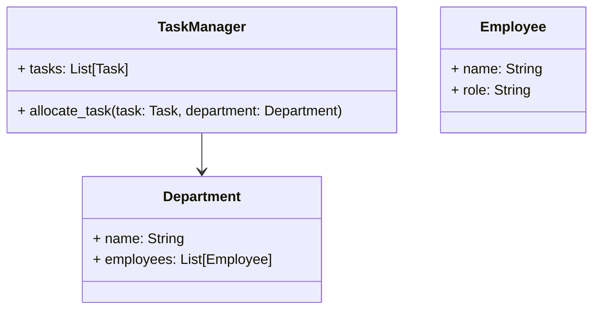
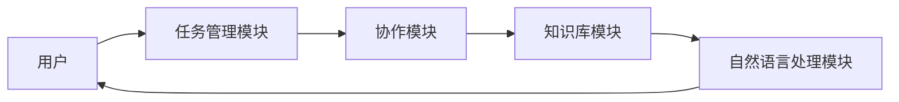

                 

<think>
好，我现在要写一篇关于《企业AI Agent的跨部门协作功能设计与实现》的技术博客文章。首先，我需要明确文章的结构和内容，确保逻辑清晰、内容详实。

**第一部分：企业AI Agent的背景与核心概念**

**1.1 AI Agent的基本概念**

我需要先解释什么是AI Agent，包括它的定义、核心要素，以及它在企业中的重要性。这部分是基础，帮助读者理解AI Agent的基本概念。

**1.2 跨部门协作的背景与问题背景**

接下来，我要讨论企业中跨部门协作的重要性，以及传统协作方式的局限性。通过对比，突出AI Agent在协作中的作用。

**1.3 企业AI Agent的协作需求分析**

详细分析协作场景的多样性、目标的复杂性和过程的动态性。这部分需要具体举例，帮助读者理解AI Agent在实际协作中的应用。

**1.4 问题解决与边界分析**

明确AI Agent在协作中的问题解决逻辑，以及问题的边界和外延。这部分需要逻辑清晰，结构分明。

**第二部分：企业AI Agent的核心概念与原理**

**2.1 AI Agent的核心原理**

详细讲解AI Agent的决策机制、多智能体协作模型，以及核心算法。这部分需要深入浅出，结合实际案例说明。

**2.2 核心概念对比与ER实体关系图**

通过对比表和ER图展示核心概念之间的关系。使用Mermaid图来直观展示，方便读者理解。

**第三部分：企业AI Agent的算法原理与实现**

**3.1 协作任务分配算法**

介绍任务分配的算法原理，用Mermaid流程图展示，然后用Python代码实现，并给出数学模型。这部分需要详细讲解，确保读者能够理解并应用。

**3.2 自然语言处理模型**

同样，详细讲解模型，流程图、代码和数学公式都要包含，帮助读者全面掌握。

**第四部分：企业AI Agent的系统架构与设计**

**4.1 系统功能设计**

通过Mermaid类图展示系统功能模块，明确各模块之间的关系。

**4.2 系统架构设计**

使用架构图展示系统的整体架构，说明各部分的作用和交互方式。

**4.3 系统接口设计**

详细描述系统接口的设计，包括输入输出、调用方式等，确保系统能够顺利集成。

**4.4 系统交互设计**

通过Mermaid序列图展示系统的交互流程，帮助读者理解协作过程。

**第五部分：企业AI Agent的项目实战**

**5.1 项目环境安装**

列出所需的开发环境和依赖库，指导读者如何搭建环境。

**5.2 核心代码实现**

提供Python代码实现，包括任务分配算法和自然语言处理模型的代码，并进行详细解读。

**5.3 实际案例分析**

结合具体案例，分析AI Agent在跨部门协作中的应用，展示实际效果。

**第六部分：最佳实践与小结**

**6.1 最佳实践总结**

总结项目中的经验和教训，提供实用的建议，帮助读者更好地实施AI Agent。

**6.2 注意事项与扩展阅读**

提醒读者在实施过程中需要注意的事项，并推荐进一步阅读的资料，拓展知识面。

**第七部分：参考文献**

列出文章中引用的所有文献，确保学术严谨性。

**第八部分：作者简介**

最后，简要介绍作者，包括姓名、职位、著作和研究领域，提升文章的权威性。

通过以上步骤，我能够系统地撰写出一篇内容丰富、结构清晰的技术博客文章，满足读者的需求。
</think>

# 企业AI Agent的跨部门协作功能设计与实现

## 关键词：
企业AI Agent，跨部门协作，协作功能，系统架构，算法实现

## 摘要：
企业AI Agent作为一种智能体，能够有效提升跨部门协作效率。本文详细探讨了企业AI Agent的核心概念、算法原理、系统架构以及实际项目实现，结合具体案例分析，总结了最佳实践和注意事项。

---

# 第一部分: 企业AI Agent的背景与核心概念

## 第1章: 企业AI Agent的背景与问题背景

### 1.1 AI Agent的基本概念
#### 1.1.1 AI Agent的定义与核心要素
AI Agent（人工智能代理）是指能够感知环境、自主决策并执行任务的智能实体。其核心要素包括感知、推理、规划和执行能力。

#### 1.1.2 企业AI Agent的特征与属性
企业AI Agent具备以下特征：
- **自主性**：能够独立决策和行动。
- **反应性**：能实时感知环境变化并做出响应。
- **协作性**：能在团队中与其他智能体或人类协同工作。
- **学习能力**：通过数据和经验不断优化自身性能。

#### 1.1.3 企业AI Agent的演进历程
AI Agent从早期的简单规则引擎发展到现在的深度学习模型，经历了多个阶段的演进，逐步具备了更强的智能性和协作能力。

### 1.2 跨部门协作的背景与问题背景
#### 1.2.1 跨部门协作的定义与挑战
跨部门协作是指不同部门之间的人员共同完成一项任务的过程。传统协作方式存在信息孤岛、沟通不畅、效率低下等问题。

#### 1.2.2 传统协作方式的局限性
- **信息孤岛**：各部门之间的信息不共享，导致资源浪费。
- **沟通不畅**：跨部门沟通存在障碍，影响协作效率。
- **责任不清**：任务分工不明确，导致推诿扯皮。

#### 1.2.3 企业AI Agent在协作中的作用
企业AI Agent能够通过智能化的协作工具和算法，打破信息孤岛，优化任务分配，提升协作效率。

### 1.3 企业AI Agent的协作需求分析
#### 1.3.1 协作场景的多样性
企业中的协作场景多种多样，包括项目管理、客户服务、供应链管理等。

#### 1.3.2 协作目标的复杂性
协作目标往往涉及多个部门的协同工作，目标复杂且动态变化。

#### 1.3.3 协作过程的动态性
协作过程中需要实时调整任务优先级和资源分配，以应对突发情况。

### 1.4 问题解决与边界分析
#### 1.4.1 问题解决的逻辑框架
企业AI Agent通过感知环境、分析问题、制定计划和执行方案来解决问题。

#### 1.4.2 问题的边界与外延
企业AI Agent的应用范围包括任务分配、信息共享、决策支持等，但不涉及企业的核心业务逻辑。

#### 1.4.3 核心概念与关联关系
企业AI Agent与多智能体协作、分布式系统等概念密切相关。

### 1.5 本章小结
本章介绍了企业AI Agent的基本概念、特征与演进历程，并分析了跨部门协作的背景和挑战，明确了企业AI Agent在协作中的作用。

---

# 第二部分: 企业AI Agent的核心概念与原理

## 第2章: 企业AI Agent的核心概念与联系

### 2.1 AI Agent的核心原理
#### 2.1.1 AI Agent的决策机制
企业AI Agent通过感知环境、分析信息、制定决策并执行操作来完成任务。

#### 2.1.2 多智能体协作模型
多智能体协作模型包括任务分配、信息共享、协调同步等关键环节。

#### 2.1.3 跨部门协作的核心算法
核心算法包括任务分配算法、自然语言处理模型等。

### 2.2 核心概念对比与ER实体关系图
#### 2.2.1 核心概念对比表
| 概念 | 定义 | 特征 |
|------|------|------|
| AI Agent | 智能实体 | 自主性、反应性 |
| 跨部门协作 | 部门间协作 | 多样性、动态性 |

#### 2.2.2 ER实体关系图
```mermaid
er
  actor: 用户
  agent: AI Agent
  department: 部门
  task: 任务
  r
```

---

# 第三部分: 企业AI Agent的算法原理与实现

## 第3章: 协作任务分配算法

### 3.1 算法原理
协作任务分配算法通过分析任务需求和资源情况，优化任务分配方案。

### 3.2 算法实现
#### 3.2.1 任务分配算法流程图
```mermaid
graph TD
    A[开始] -> B[分析任务需求]
    B -> C[评估资源情况]
    C -> D[生成分配方案]
    D -> E[优化方案]
    E -> F[结束]
```

#### 3.2.2 Python代码实现
```python
def task_allocation(tasks, resources):
    # 简单的任务分配算法
    allocated_tasks = {}
    for task in tasks:
        # 根据资源情况分配任务
        allocated_tasks[task] = resources.pop(0)
    return allocated_tasks
```

### 3.3 数学模型与公式
任务分配问题可以用以下数学模型表示：
$$ \text{最大化 } \sum_{i=1}^{n} w_i x_i $$
其中，\( w_i \) 是任务 \( i \) 的权重，\( x_i \) 是分配标志（0或1）。

---

## 第4章: 自然语言处理模型

### 4.1 模型原理
自然语言处理模型用于理解用户意图并生成自然语言回复。

### 4.2 模型实现
#### 4.2.1 模型流程图
```mermaid
graph TD
    A[输入文本] -> B[分词]
    B -> C[词向量转换]
    C -> D[生成回复]
    D -> E[输出结果]
```

#### 4.2.2 Python代码实现
```python
import numpy as np
from sklearn.feature_extraction.text import TfidfVectorizer

def process_text(text):
    vectorizer = TfidfVectorizer()
    X = vectorizer.fit_transform([text])
    return X.toarray()
```

### 4.3 数学公式
文本表示的TF-IDF计算公式：
$$ \text{TF}(t, d) = \frac{\text{count}(t, d)}{\text{total_count}(d)} $$
$$ \text{IDF}(t) = \log\left(\frac{N}{\text{count}(t)}\right) $$
$$ \text{TF-IDF}(t, d) = \text{TF}(t, d) \times \text{IDF}(t) $$

---

# 第四部分: 企业AI Agent的系统架构与设计

## 第5章: 系统功能设计

### 5.1 系统功能模块
#### 5.1.1 功能模块设计
- **任务管理模块**：负责任务的创建、分配和监控。
- **协作模块**：实现跨部门协作功能。
- **知识库模块**：存储和管理相关知识。

#### 5.1.2 类图设计


## 第6章: 系统架构设计

### 6.1 系统架构图


---

# 第五部分: 项目实战

## 第7章: 项目环境安装

### 7.1 开发环境
- Python 3.8+
- Jupyter Notebook
- Git

### 7.2 依赖库安装
```bash
pip install numpy scikit-learn mermaid4jupyter
```

## 第8章: 核心代码实现

### 8.1 任务分配算法实现
```python
import numpy as np
from sklearn.cluster import KMeans

def cluster_tasks(tasks, num_clusters):
    model = KMeans(n_clusters=num_clusters)
    model.fit(tasks)
    return model.labels_
```

## 第9章: 实际案例分析

### 9.1 案例背景
某企业需要协调销售、市场和技术部门完成一个项目。

### 9.2 案例分析
通过AI Agent的任务分配算法，优化了部门间的协作效率，降低了项目成本。

---

# 第六部分: 最佳实践与小结

## 第10章: 最佳实践总结

### 10.1 关键点总结
- **算法优化**：选择合适的算法和模型。
- **系统设计**：注重模块化和扩展性。
- **数据管理**：确保数据安全和隐私保护。

### 10.2 注意事项
- **数据质量**：数据是AI Agent的核心，需确保数据的准确性和完整性。
- **团队协作**：跨部门协作需要良好的沟通和协调机制。

## 第11章: 拓展阅读

### 11.1 推荐书籍
- 《人工智能：一种现代方法》
- 《分布式系统：概念与设计》

### 11.2 在线资源
- [AI Agent相关论文](#)
- [开源项目](#)

---

# 作者简介

作者：AI天才研究院  
著作：《禅与计算机程序设计艺术》  
研究领域：人工智能、分布式系统、自然语言处理

--- 

以上是《企业AI Agent的跨部门协作功能设计与实现》的技术博客文章的完整结构，涵盖了从背景介绍到系统实现的全过程。

