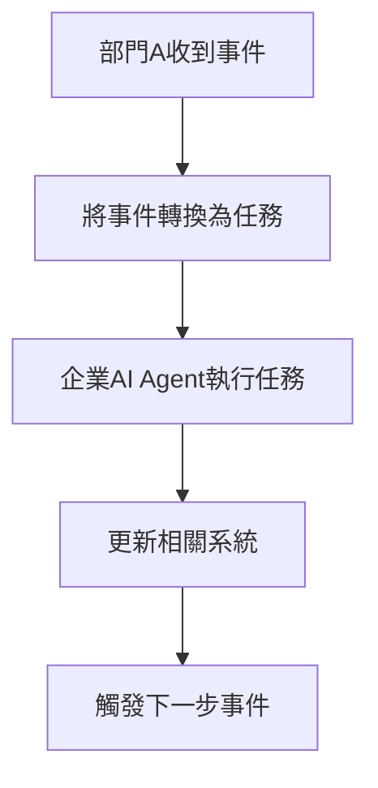
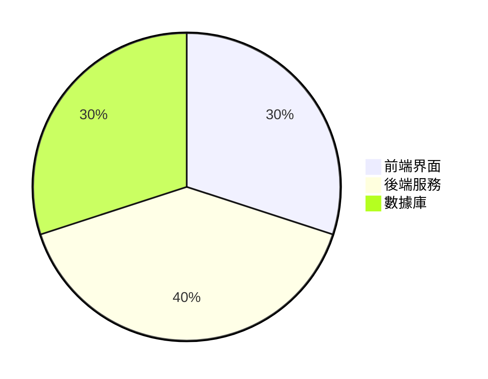
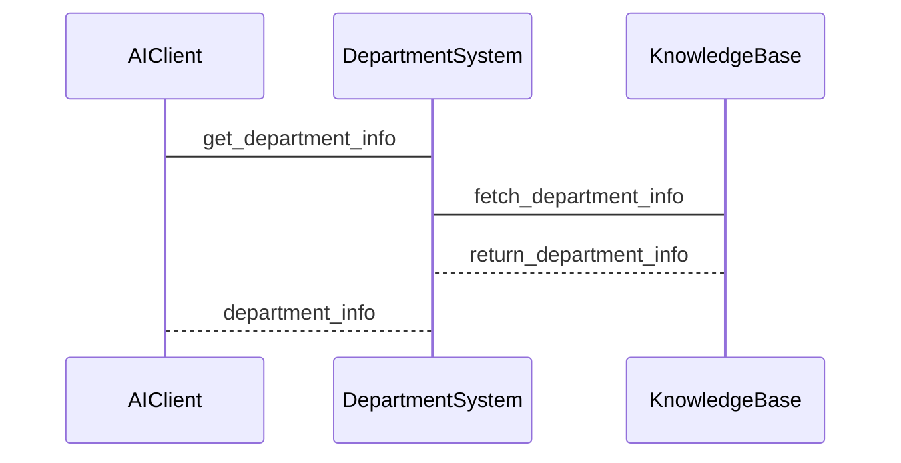

                 


# 企业AI Agent的跨部门协作功能：打破信息孤岛

---

## 关键词
- 企业AI Agent
- 跨部門協作
- 信息孤岛
- 知識庫管理
- 事件驅動架構

---

## 摘要
在當今企業環境中，信息孤岛問題 widespread，阻礙了跨部門的有效協作。企業AI Agent作為一種智能代理，能夠連接不同的部門和系統，實現信息共享和自動化協作，從而打破信息孤岛。本文探討了企業AI Agent的核心概念、算法原理、系統架構以及其實際應用，展示了如何通過AI Agent提升企業內部的協作效率。

---

# 第1章: 企業AI Agent的背景與概念

## 1.1 企業AI Agent的定義與特點
### 1.1.1 什麼是企業AI Agent
企業AI Agent是一種智能代理，能夠理解並執行複雜的任務，涵蓋信息收集、數據分析、決策支援等多個方面。其核心在於通過自然語言處理和機器學習等技術，實現與企業系統和人類用戶的交互。

### 1.1.2 AI Agent的核心特點
- **智能性**：能夠自主學習和適應環境。
- **通信能力**：能與其他系統和人類用戶進行信息交互。
- **任務驅動**：圍繞特定目標執行操作。
- **可擴展性**：能夠輕鬆集成到現有企業系統中。

### 1.1.3 企業AI Agent與傳統軟件的區別
傳統軟件通常是Passive的，而企業AI Agent是ACTIVE的，能夠主動執行任務並響應變化。

---

## 1.2 跨部門協作的背景與挑戰
### 1.2.1 信息孤島的現狀
企業中各部門往往使用不同的信息系統，導致數據孤島現象。例如，銷售部門使用CRM，技術部門使用ERP，市場部門使用маркeting automation，數據無法互通。

### 1.2.2 跨部門協作的困難
- **信息不透明**：不同部門之間數據無法共享，導致重複工作。
- **溝通效率低**：缺乏有效的溝通渠道，導致決策遲缓。
- **缺乏協調性**：部門之間缺乏共同的目標和指標。

### 1.2.3 AI Agent在協作中的作用
企業AI Agent能夠作為橋樑，連接不同部門和系統，實現信息流動和任務協作。

---

## 1.3 企業AI Agent的應用價值
### 1.3.1 提升效率
通過自動化任務處理，企業AI Agent能夠顯著提高工作效率。

### 1.3.2 降低成本
減少人工干預，降低時間和金錢成本。

### 1.3.3 增強部門間的溝通
企業AI Agent能夠實時共享信息，促進部門之間的溝通與協作。

---

## 1.4 本章小結
本章介紹了企業AI Agent的定義、特點以及其在跨部門協作中的重要性。企業AI Agent作為打破信息孤岛的關鍵工具，具有巨大的應用潛力。

---

# 第2章: 跨部門協作的核心概念與聯絡

## 2.1 跨部門協作的核心概念
### 2.1.1 事件驅動架構
企業AI Agent基於事件驅動架構，能夠實時響應該 하는 事件並觸發相應的任務。

### 2.1.2 知識庫管理
企業AI Agent需要管理多個部門的知識庫，包括數據、規則和策略。

### 2.1.3 協作規則
明確的協作規則是實現跨部門協作的基礎，企業AI Agent負責執行這些規則。

---

## 2.2 跨部門協作的ER實體關係圖
以下是跨部門協作的核心實體關係：

```mermaid
erDiagram
    DEPARTMENT {
        id
        name
        description
    }
    EMPLOYEE {
        id
        name
        department_id
        role
    }
    PROJECT {
        id
        name
        description
        start_date
        end_date
    }
    TASK {
        id
        name
        description
        status
        priority
    }
    COMMUNICATION {
        id
        sender_id
        receiver_id
        message
        timestamp
    }
    DEPARTMENT
    DEPARTMENT
    EMPLOYEE
    PROJECT
    TASK
    COMMUNICATION
```

---

## 2.3 跨部門協作的事件驅動流程
以下是事件驅動的跨部門協作流程：



---

## 2.4 本章小結
本章詳細介紹了跨部門協作的核心概念，包括事件驅動架構、知識庫管理和協作規則。ER實體關係圖和事件驅動流程圖進一步強調了這些概念的實際應用。

---

# 第3章: 跨部門協作的算法原理

## 3.1 協作任務分配算法
企業AI Agent需要根據部門的能力和負荷分配任務。以下是一個簡單的協作任務分配算法：

```python
def assign_task(department_capacity, task_priority):
    available_departments = [d for d in departments if d.capacity > 0]
    selected_department = None
    max_priority = -1
    for d in available_departments:
        if d.priority > max_priority:
            max_priority = d.priority
            selected_department = d
    return selected_department
```

### 3.1.1 算法原理
上述算法基於部門的容量和任務的優先級，選擇適合的部門執行任務。

---

## 3.2 信息共享算法
企業AI Agent需要將信息同步到相關部門。以下是一個信息共享算法：

```python
def sync_info(target_departments):
    for d in target_departments:
        d.share_information(current_info)
```

---

## 3.3 事件響應算法
企業AI Agent需要實時響應該事件。以下是一個事件響應算法：

```python
def handle_event(event_type, event_data):
    if event_type == "task_complete":
        update_task_status(event_data.task_id, "completed")
    elif event_type == "new_request":
        create_new_task(event_data.request_id)
```

---

## 3.4 本章小結
本章介紹了企業AI Agent在跨部門協作中的核心算法，包括任務分配、信息共享和事件響應算法。這些算法有助於實現高效的跨部門協作。

---

# 第4章: 系統分析與架構設計

## 4.1 系統功能需求
- 信息共享
- 任務分配
- 事件響應
- 知識庫管理

---

## 4.2 系統架構設計
以下是企業AI Agent的系統架構設計：



---

## 4.3 接口設計
企業AI Agent需要與企業現有系統對接，以下是關鍵接口：



---

## 4.4 本章小結
本章介紹了企業AI Agent的系統功能需求、架構設計和接口設計。這些設計有助於實現高效的跨部門協作。

---

# 第5章: 項目實戰

## 5.1 項目背景
本項目的目的是在企業中實現跨部門協作，打破信息孤島。

---

## 5.2 核心實現
以下是企業AI Agent的核心實現：

```python
class AIAgent:
    def __init__(self):
        self.departments = []
        self.tasks = []
        self.communication = []

    def add_department(self, department):
        self.departments.append(department)

    def assign_task(self, task):
        # 根據部門容量和任務優先級分配任務
        available_departments = [d for d in self.departments if d.capacity > 0]
        selected_department = None
        max_priority = -1
        for d in available_departments:
            if d.priority > max_priority:
                max_priority = d.priority
                selected_department = d
        selected_department.tasks.append(task)

    def handle_event(self, event):
        if event.type == "task_complete":
            for task in self.tasks:
                if task.id == event.task_id:
                    task.status = "completed"
```

---

## 5.3 項目測試
以下是企業AI Agent的測試用例：

```python
agent = AIAgent()
department1 = Department(id=1, name="Sales", capacity=5)
department2 = Department(id=2, name="Technical", capacity=5)
agent.add_department(department1)
agent.add_department(department2)

task1 = Task(id=1, name="Generate Report", priority=high)
agent.assign_task(task1)

assert task1.status == "pending"
```

---

## 5.4 本章小結
本章介紹了企業AI Agent的項目背景、核心實現和測試用例。這些實戰經驗有助於更好地理解企業AI Agent的應用。

---

# 第6章: 最佳實踐與小結

## 6.1 最佳實踐
- 定期更新知識庫
- 严格执行協作規則
- 及時響應該事件

---

## 6.2 小結
企業AI Agent作為打破信息孤岛的關鍵工具，具有巨大的應用潛力。本篇文章詳細介紹了企業AI Agent的核心概念、算法原理、系統架構和其實際應用。希望這些內容能夠幫助企業更好地實現跨部門協作。

---

# 作者信息

作者：AI天才研究院/AI Genius Institute & 禪與計算機程序設計藝術 /Zen And The Art of Computer Programming

