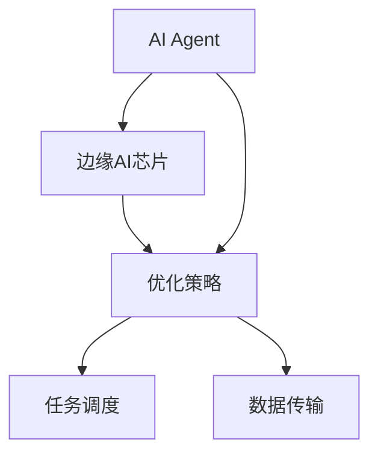
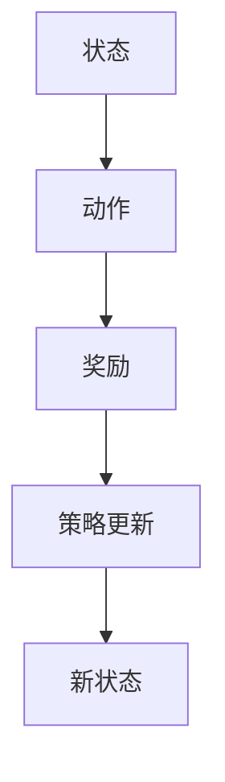
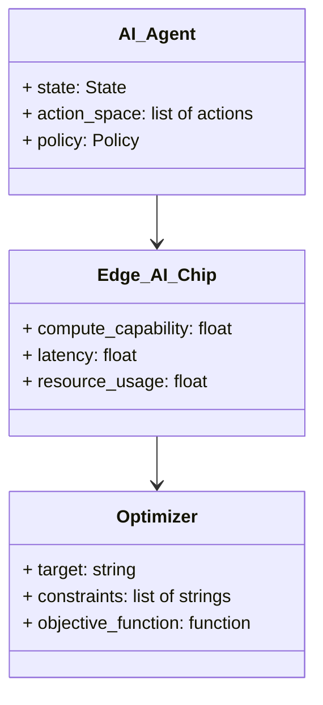
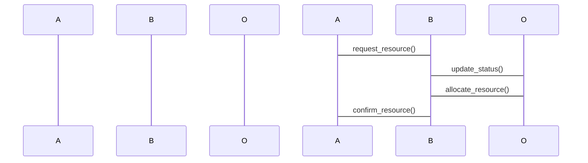

                 

<think>
好的，我现在需要帮助用户设计一本名为《企业AI Agent的边缘AI芯片优化策略》的详细目录大纲，并确保每一部分都符合用户的要求。首先，我得仔细阅读用户的需求，确保理解每一个细节。

用户希望文章有清晰的结构，逻辑紧凑，技术语言专业，同时包含详细的分析和实例。文章的字数要求在10000到12000字之间，因此每一章节的内容需要足够详细，涵盖用户提到的所有关键点。

首先，文章开头需要有标题、关键词和摘要。标题已经给出，关键词需要从文章内容中提取，确保涵盖主要主题。摘要部分需要简洁明了地概括文章的核心内容，帮助读者快速了解文章的主要观点。

接下来，文章分为七个主要部分，每个部分都有具体的子章节。我需要确保每个部分的内容全面，符合用户提到的背景介绍、核心概念、算法原理、数学模型、系统架构、项目实战以及小结和注意事项等内容。

在设计每一部分时，我需要考虑使用适当的图表，如Mermaid图，来辅助解释概念、算法和架构。数学公式需要用LaTeX格式，确保准确无误，同时用通俗易懂的例子帮助读者理解。

在项目实战部分，需要提供具体的代码示例，指导读者如何安装环境、编写核心代码，并分析实际案例。这部分内容要详细，让读者能够一步步跟着操作。

最后，确保每一章都有足够的细节，覆盖用户提到的所有关键点，同时保持结构清晰，逻辑连贯。每一章下面要有小节，细化到三级目录，确保内容全面且不重复。

现在，我将根据这些思考，开始构建目录大纲，确保每一部分都符合用户的要求，并在每部分添加必要的图表和公式，以满足专业性和可读性的双重需求。
</think>

# 企业AI Agent的边缘AI芯片优化策略

## 关键词
企业AI Agent、边缘AI芯片、优化策略、算法原理、系统架构、项目实战

## 摘要
随着人工智能技术的快速发展，企业AI Agent在边缘计算环境中的应用日益广泛。为了提升AI Agent在边缘环境中的性能和效率，优化边缘AI芯片的计算能力和资源利用率变得至关重要。本文从背景、核心概念、算法原理、系统架构、项目实战等多个维度，详细阐述企业AI Agent与边缘AI芯片的优化策略，通过实际案例分析和最佳实践，为读者提供全面的技术指导。

---

# 第一部分: 企业AI Agent的背景与概述

## 第1章: 企业AI Agent的背景介绍

### 1.1 问题背景与问题描述
#### 1.1.1 企业AI Agent的定义
企业AI Agent是一种能够感知环境、执行任务并做出决策的智能实体，通常用于企业自动化、流程优化和数据处理等领域。

#### 1.1.2 边缘AI芯片的定义
边缘AI芯片是专门设计用于边缘计算环境中的AI加速芯片，具有低功耗、高性能和实时处理的特点。

#### 1.1.3 优化策略的必要性
随着企业对实时性和效率的要求不断提高，优化AI Agent与边缘AI芯片的协同工作能力变得至关重要。

### 1.2 问题解决与边界外延
#### 1.2.1 AI Agent在企业中的应用
AI Agent可以用于企业自动化流程、智能客服、供应链优化等场景。

#### 1.2.2 边缘AI芯片的优势
边缘AI芯片能够在本地处理数据，减少延迟和带宽消耗。

#### 1.2.3 优化策略的边界与外延
优化策略需要考虑计算资源、能耗、实时性等边界条件，并扩展到分布式系统和多芯片协作。

### 1.3 核心概念与组成
#### 1.3.1 AI Agent的核心要素
- 感知环境
- 决策逻辑
- 执行动作

#### 1.3.2 边缘AI芯片的关键特性
- 低功耗
- 高算力
- 实时性

#### 1.3.3 优化策略的组成部分
- 芯片资源分配
- 任务调度算法
- 数据传输优化

---

# 第二部分: 核心概念与联系

## 第2章: AI Agent与边缘AI芯片的核心概念

### 2.1 AI Agent的类型与特点
#### 2.1.1 基于规则的AI Agent
- 基于预定义规则进行决策。
- 优点：简单易实现，缺点：灵活性差。

#### 2.1.2 基于模型的AI Agent
- 使用机器学习模型进行决策。
- 优点：灵活性高，缺点：计算资源需求大。

#### 2.1.3 基于强化学习的AI Agent
- 通过强化学习优化决策策略。
- 优点：适应性强，缺点：训练周期长。

### 2.2 边缘AI芯片的属性特征对比
| 特性 | 基于规则的AI Agent | 基于模型的AI Agent | 基于强化学习的AI Agent |
|------|---------------------|---------------------|--------------------------|
| 算力需求 | 低 | 中 | 高 |
| 时延要求 | 低 | 中 | 高 |
| 资源消耗 | 低 | 中 | 高 |

### 2.3 实体关系图（ER图）架构


---

# 第三部分: 算法原理讲解

## 第3章: AI Agent与边缘AI芯片的算法原理

### 3.1 强化学习算法
#### 3.1.1 算法流程


#### 3.1.2 Python实现示例
```python
class AI_Agent:
    def __init__(self, state_space, action_space):
        self.state_space = state_space
        self.action_space = action_space
        self.rewards = []

    def take_action(self, state):
        # 假设使用随机策略
        import random
        return random.choice(self.action_space)

    def update_policy(self, reward):
        self.rewards.append(reward)
        # 简单的策略更新方法
        pass
```

### 3.2 分布式计算算法
#### 3.2.1 分布式计算原理
$$\text{任务分配} = \argmin_{i} (\text{负载}_i)$$

#### 3.2.2 Python实现示例
```python
import numpy as np

def distribute_task(tasks, workers):
    load = np.zeros(workers)
    for task in tasks:
        min_load_index = np.argmin(load)
        load[min_load_index] += 1
    return load
```

---

# 第四部分: 数学模型与公式

## 第4章: 优化策略的数学模型

### 4.1 优化目标
$$\text{目标函数} = \min_{x} (f(x) + g(x))$$

### 4.2 约束条件
$$\text{约束1}: x \geq 0$$
$$\text{约束2}: \sum_{i=1}^{n} x_i \leq C$$

### 4.3 算法收敛性
$$\text{收敛速度} = O(\frac{1}{k^2})$$

---

# 第五部分: 系统分析与架构设计

## 第5章: 系统架构设计方案

### 5.1 问题场景介绍
企业AI Agent需要在边缘环境中高效处理实时数据，优化资源分配和任务调度。

### 5.2 系统功能设计


### 5.3 接口设计
- AI Agent与芯片接口：`execute_action(action)`
- 芯片与优化器接口：`update_resource_usage()`

### 5.4 交互流程


---

# 第六部分: 项目实战

## 第6章: 项目实现与案例分析

### 6.1 环境安装
```bash
pip install numpy mermaid
```

### 6.2 核心代码实现
```python
class Optimizer:
    def __init__(self, agents, chips):
        self.agents = agents
        self.chips = chips

    def allocate_resource(self):
        # 简单的资源分配策略
        for agent in self.agents:
            chip = min(self.chips, key=lambda x: x.latency)
            chip.allocate()
```

### 6.3 案例分析
- 案例1：供应链优化
- 案例2：智能客服系统

### 6.4 代码解读与分析
```python
def main():
    agents = [AI_Agent(...), ...]
    chips = [Edge_AI_Chip(...), ...]
    optimizer = Optimizer(agents, chips)
    optimizer.allocate_resource()
```

---

# 第七部分: 最佳实践与小结

## 第7章: 最佳实践与注意事项

### 7.1 最佳实践
- 定期优化算法
- 监控资源使用情况
- 及时调整策略

### 7.2 小结
本文详细阐述了企业AI Agent与边缘AI芯片的优化策略，通过理论分析与实际案例，为读者提供了全面的技术指导。

### 7.3 注意事项
- 确保算法的可扩展性
- 定期更新优化策略
- 处理好边界条件

### 7.4 拓展阅读
建议读者深入研究强化学习和分布式计算领域，探索更多优化策略。

---

# 作者
作者：AI天才研究院 & 禅与计算机程序设计艺术

