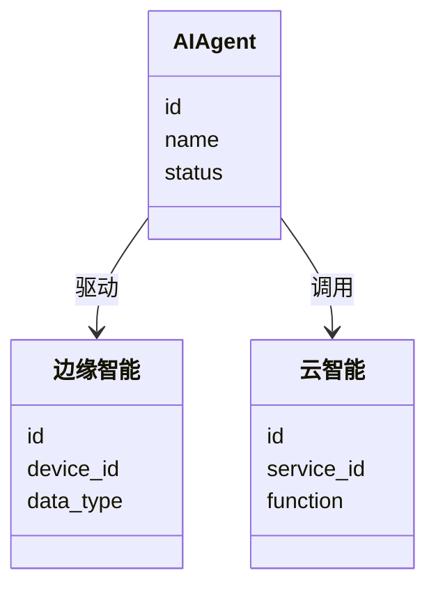
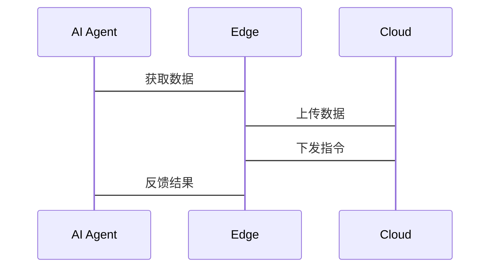

                 


# 企业AI Agent的边缘智能与云智能协同策略

**关键词**：AI Agent，边缘智能，云智能，协同策略，企业应用

**摘要**：本文深入探讨了企业AI Agent在边缘智能与云智能协同策略中的应用。通过分析AI Agent的核心概念、算法原理、系统架构及项目实战，本文为企业在实现智能协同策略提供了理论依据和实践指导。文章结合技术背景、实体关系、算法流程和系统设计，全面阐述了企业级AI Agent的协同策略，并通过具体案例分析，总结了最佳实践和未来发展趋势。

---

## 第1章 企业AI Agent的背景与概述

### 1.1 AI Agent的基本概念

#### 1.1.1 AI Agent的定义
AI Agent（人工智能代理）是一种能够感知环境、做出决策并执行任务的智能实体。它能够通过传感器获取数据，利用算法进行分析，并通过执行器完成目标操作。

#### 1.1.2 AI Agent的核心特征
- **自主性**：能够在没有外部干预的情况下独立运行。
- **反应性**：能够实时感知环境变化并做出响应。
- **学习能力**：能够通过经验改进自身的决策和执行能力。

#### 1.1.3 企业级AI Agent的应用场景
AI Agent在企业中的应用场景包括智能客服、供应链优化、设备维护和数据分析等领域。

---

### 1.2 边缘智能与云智能的基本概念

#### 1.2.1 边缘计算的定义与特点
边缘计算是在数据源附近进行数据处理和分析的计算方式，具有低延迟、高实时性和高效性等特点。

#### 1.2.2 云计算的定义与特点
云计算是一种通过互联网提供计算资源（如计算能力、存储空间）的模式，具有高扩展性、灵活性和资源共享的特点。

#### 1.2.3 边缘智能与云智能的对比分析

| 特性        | 边缘计算          | 云计算            |
|-------------|------------------|-------------------|
| 数据处理位置 | 数据源附近       | 数据中心          |
| 延迟          | 低               | 较高             |
| 资源消耗      | 本地资源         | 远端资源          |
| 适用场景      | 实时性要求高的场景 | 资源共享和弹性的场景 |

---

### 1.3 企业AI Agent的边缘与云协同策略

#### 1.3.1 协同策略的背景与意义
随着企业对实时性和高效性的要求越来越高，单一的边缘计算或云计算模式难以满足需求，边缘智能与云智能的协同策略成为必然选择。

#### 1.3.2 协同策略的核心目标
- 提供实时数据处理能力。
- 利用云计算的资源扩展性。
- 实现数据的高效协同和共享。

#### 1.3.3 协同策略的实现路径
- 数据在边缘端进行预处理和初步分析。
- 将关键数据上传至云端进行深度分析和建模。
- 结合边缘和云端的分析结果，优化决策和执行。

---

## 第2章 企业AI Agent的核心概念与联系

### 2.1 AI Agent的构成要素

#### 2.1.1 感知层
感知层负责从环境中获取数据，包括传感器数据和用户输入数据。

#### 2.1.2 决策层
决策层基于感知层的数据，利用算法进行决策，选择最优的执行方案。

#### 2.1.3 执行层
执行层根据决策层的指令，通过执行器完成具体的任务。

---

### 2.2 边缘智能与云智能的协同关系

#### 2.2.1 边缘计算与云计算的协同模型
协同模型包括数据传输、计算任务分配和结果反馈三个主要环节。

#### 2.2.2 边缘智能与云智能的实体关系图

```mermaid
er
    entity(AI Agent) {
        id
        name
        status
    }
    entity(边缘智能) {
        id
        device_id
        data_type
    }
    entity(云智能) {
        id
        service_id
        function
    }
    AI Agent -- "驱动"--> 边缘智能
    AI Agent -- "调用"--> 云智能
```

---

## 第3章 企业AI Agent的算法原理与协同机制

### 3.1 AI Agent的算法原理

#### 3.1.1 基于强化学习的决策算法
强化学习通过奖励机制，优化AI Agent的决策策略。

#### 3.1.2 基于监督学习的执行算法
监督学习通过标记数据训练AI Agent，使其能够准确执行任务。

#### 3.1.3 基于无监督学习的感知算法
无监督学习用于发现数据中的潜在模式和结构。

---

### 3.2 边缘与云智能的协同算法

#### 3.2.1 边缘计算与云计算的协同流程
协同流程包括数据采集、边缘处理、云端分析和反馈执行四个阶段。

#### 3.2.2 基于联邦学习的协同机制
联邦学习是一种在保护数据隐私的前提下，实现模型联合训练的方法。

#### 3.2.3 基于边缘计算的实时反馈机制
实时反馈机制通过边缘端的数据快速响应，优化云端模型。

---

### 3.3 协同算法的实现步骤

#### 3.3.1 数据预处理
数据预处理包括数据清洗、归一化和特征提取。

#### 3.3.2 模型训练
模型训练使用分布式计算框架，结合边缘和云端的数据进行联合训练。

#### 3.3.3 模型部署与优化
模型部署在边缘和云端，并通过持续优化提高性能。

---

## 第4章 企业AI Agent的数学模型与公式

### 4.1 决策层的数学模型

$$
\text{决策} = \arg\max_{a} Q(s, a)
$$

其中，$s$表示当前状态，$a$表示动作，$Q(s, a)$表示Q值函数。

### 4.2 执行层的数学模型

$$
\text{执行} = f(\text{决策})
$$

其中，$f$表示执行函数。

### 4.3 协同机制的数学模型

$$
\text{协同} = \lambda \cdot \text{边缘数据} + (1 - \lambda) \cdot \text{云端数据}
$$

其中，$\lambda$表示边缘数据的权重。

---

## 第5章 企业AI Agent的系统架构与设计

### 5.1 系统功能设计

#### 5.1.1 领域模型设计



---

### 5.2 系统架构设计

```mermaid
graph TD
    AI Agent --> Edge: 驱动
    Edge --> Cloud: 上传数据
    Cloud --> AI Agent: 反馈结果
```

---

### 5.3 系统交互设计



---

## 第6章 企业AI Agent的项目实战

### 6.1 环境安装与配置

- **Python环境**：安装Python 3.8及以上版本。
- **框架选择**：使用TensorFlow或PyTorch框架。
- **依赖安装**：安装numpy、pandas、scikit-learn等库。

### 6.2 核心代码实现

```python
import numpy as np
from sklearn.metrics import accuracy_score

# 数据预处理
def preprocess(data):
    # 数据清洗和归一化处理
    return normalized_data

# 模型训练
def train_model(X, y):
    model = ...  # 初始化模型
    model.fit(X, y)
    return model

# 模型预测
def predict_model(model, X_test):
    y_pred = model.predict(X_test)
    return y_pred

# 协同算法实现
def collaborative_algorithm(edge_data, cloud_data):
    # 数据融合
    fused_data = ... 
    # 模型训练
    model = train_model(fused_data, labels)
    return model
```

### 6.3 案例分析与解读

#### 案例1：智能客服系统

- **问题描述**：实现智能客服对话系统的实时响应和云端数据分析。
- **解决方案**：利用边缘智能实现本地对话初步处理，结合云端NLP模型进行深度分析和优化。

#### 案例2：供应链优化

- **问题描述**：优化企业的供应链管理，实现高效协同。
- **解决方案**：通过边缘智能实时监控库存数据，结合云端预测模型进行供应链优化。

---

## 第7章 总结与展望

### 7.1 最佳实践 tips

- **数据安全**：在协同过程中，确保数据的安全性和隐私性。
- **模型优化**：持续优化模型，提高协同效率。
- **系统维护**：定期更新系统和模型，确保其稳定性和高性能。

### 7.2 本章小结

本文详细探讨了企业AI Agent的边缘智能与云智能协同策略，从理论到实践，为企业提供了全面的解决方案和实施指导。

### 7.3 未来展望

随着AI技术的不断发展，企业AI Agent的边缘智能与云智能协同策略将更加智能化和高效化，为企业创造更大的价值。

---

## 作者：AI天才研究院（AI Genius Institute） & 禅与计算机程序设计艺术（Zen And The Art of Computer Programming）

---

**本文由AI天才研究院撰写，转载请注明出处。**

