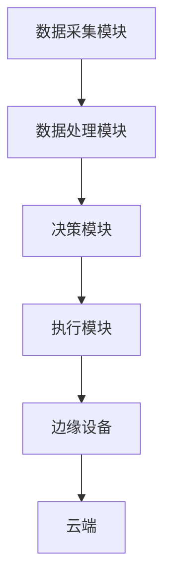
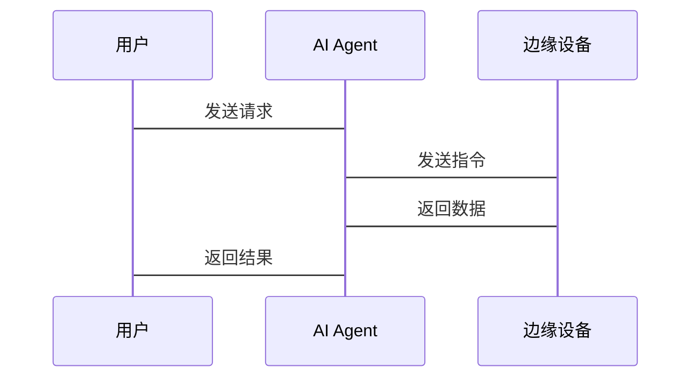

                 


# 企业AI Agent的边缘智能部署策略

> 关键词：AI Agent, 边缘智能, 部署策略, 强化学习, 系统架构

> 摘要：本文详细探讨了企业AI Agent在边缘智能环境中的部署策略。首先介绍了AI Agent和边缘智能的核心概念，然后分析了AI Agent在边缘计算中的工作原理，接着提出了边缘智能部署的具体策略，包括算法优化和资源分配等关键问题。最后通过一个实际案例，详细讲解了AI Agent的部署过程，为读者提供了一套完整的解决方案。

---

# 第一部分: 企业AI Agent的背景与概念

# 第1章: 企业AI Agent概述

## 1.1 AI Agent的基本概念

### 1.1.1 AI Agent的定义与特征

AI Agent（人工智能代理）是一种能够感知环境、自主决策并执行任务的智能实体。它具备以下核心特征：

1. **自主性**：AI Agent能够在没有外部干预的情况下独立执行任务。
2. **反应性**：能够实时感知环境变化并做出相应反应。
3. **目标导向**：以实现特定目标为导向，优化决策过程。
4. **学习能力**：通过数据和经验不断优化自身性能。

**关键术语解释**：
- **感知层**：负责从环境中获取信息，例如传感器数据。
- **决策层**：基于感知信息进行推理和决策。
- **执行层**：将决策转化为具体行动。

### 1.1.2 企业级AI Agent的特点

企业级AI Agent在设计和实现上具有以下特点：

1. **高可靠性**：需要在复杂环境中稳定运行。
2. **可扩展性**：能够处理大规模数据和任务。
3. **安全性**：确保数据和系统的安全性，防止恶意攻击。
4. **可维护性**：方便企业对系统进行维护和升级。

### 1.1.3 AI Agent与传统AI的区别

AI Agent与传统AI的主要区别在于其自主性和目标导向性。传统AI通常需要人工干预，而AI Agent能够自主完成任务，例如自动驾驶汽车和智能客服系统。

## 1.2 边缘智能的基本概念

### 1.2.1 边缘计算的定义

边缘计算是一种分布式计算范式，将数据处理和存储能力从云端移到靠近数据源的位置。边缘计算的核心思想是“计算靠近数据”，从而降低延迟并提高效率。

### 1.2.2 边缘智能的核心技术

边缘智能是边缘计算与人工智能的结合，主要涉及以下技术：

1. **边缘数据处理**：在边缘设备上进行数据预处理和特征提取。
2. **边缘推理**：在边缘设备上运行机器学习模型，进行实时推理。
3. **边缘协同**：不同边缘设备之间的数据共享和协同推理。

### 1.2.3 边缘智能与云计算的对比

| 特性         | 边缘智能                     | 云计算                     |
|--------------|------------------------------|-----------------------------|
| 数据处理位置 | 边缘设备                     | 云端                       |
| 延迟         | 低                          | 高                          |
| 网络依赖     | 较低                        | 较高                        |
| 适用场景     | 实时性要求高的场景           | 数据量大但实时性要求低的场景 |

### 1.2.4 AI Agent在边缘智能中的作用

AI Agent在边缘智能中扮演着关键角色，它能够协调边缘设备之间的数据流动和任务分配，实现高效的资源利用和智能决策。

## 1.3 企业AI Agent的边缘智能部署背景

### 1.3.1 当前企业智能化转型的趋势

随着数字化转型的推进，企业对智能化的需求日益增长。AI Agent作为智能化的核心技术，正在成为企业提升竞争力的关键因素。

### 1.3.2 边缘计算在企业中的应用需求

企业对边缘计算的需求主要源于以下几点：
1. **实时性要求**：边缘计算能够满足企业对实时数据处理的需求。
2. **数据隐私**：通过在本地处理数据，企业可以更好地保护数据隐私。
3. **成本优化**：边缘计算能够降低数据传输到云端的成本。

### 1.3.3 AI Agent在边缘智能中的作用

AI Agent在边缘智能中的作用包括：
1. **数据处理**：对边缘设备产生的数据进行实时处理和分析。
2. **智能决策**：基于实时数据做出最优决策。
3. **任务分配**：协调多个边缘设备的任务分配和资源利用。

## 1.4 本章小结

本章介绍了AI Agent和边缘智能的基本概念，分析了AI Agent在边缘智能中的作用，并探讨了企业部署AI Agent的背景和需求。

---

# 第二部分: 企业AI Agent的核心概念与原理

# 第2章: AI Agent的核心原理

## 2.1 AI Agent的组成结构

### 2.1.1 感知层

感知层负责从环境中获取信息，包括：
1. **传感器数据**：如温度、湿度、图像等。
2. **外部输入**：如用户指令或API调用。

### 2.1.2 决策层

决策层基于感知层提供的信息进行推理和决策，主要包括：
1. **模型推理**：利用机器学习模型进行预测和分类。
2. **策略选择**：基于推理结果选择最优策略。

### 2.1.3 执行层

执行层负责将决策层的决策转化为具体行动，包括：
1. **设备控制**：如驱动机器人执行动作。
2. **数据输出**：如向用户提供反馈信息。

### 2.1.4 交互界面

交互界面是AI Agent与用户或其他系统之间的接口，包括：
1. **用户界面**：如图形界面或语音交互。
2. **API接口**：与其他系统进行数据交换。

## 2.2 边缘智能的核心技术

### 2.2.1 边缘计算架构

边缘计算的典型架构包括以下层次：
1. **边缘设备层**：如传感器、摄像头等。
2. **边缘计算层**：如边缘服务器或网关。
3. **云端层**：用于数据存储和模型训练。

### 2.2.2 边缘数据处理技术

边缘数据处理技术包括：
1. **数据清洗**：去除噪声数据。
2. **特征提取**：提取数据中的关键特征。
3. **数据压缩**：降低数据传输和存储成本。

### 2.2.3 边缘智能算法

边缘智能算法包括：
1. **强化学习**：通过与环境交互来优化决策策略。
2. **图像识别**：利用深度学习模型进行图像分类。
3. **自然语言处理**：进行文本理解和生成。

## 2.3 AI Agent与边缘智能的结合

### 2.3.1 AI Agent在边缘计算中的应用

AI Agent在边缘计算中的应用包括：
1. **智能监控**：实时监控设备状态并进行异常检测。
2. **智能控制**：根据环境变化自动调整设备参数。
3. **智能决策**：基于实时数据做出最优决策。

### 2.3.2 边缘智能对AI Agent的优化

边缘智能对AI Agent的优化体现在以下几个方面：
1. **降低延迟**：通过在边缘设备上进行实时推理，减少数据传输到云端的延迟。
2. **提高效率**：通过分布式计算和资源优化，提高整体计算效率。
3. **增强隐私**：通过在本地处理数据，保护数据隐私。

### 2.3.3 两者的协同工作原理

AI Agent与边缘智能的协同工作原理如下：
1. **数据采集**：边缘设备采集环境数据。
2. **数据处理**：AI Agent在边缘设备上对数据进行处理和分析。
3. **决策制定**：AI Agent基于分析结果制定决策。
4. **任务执行**：AI Agent驱动设备执行具体任务。

## 2.4 本章小结

本章详细介绍了AI Agent的组成结构和边缘智能的核心技术，分析了AI Agent与边缘智能的结合方式及其协同工作原理。

---

# 第三部分: 企业AI Agent的边缘智能部署策略

# 第3章: AI Agent的边缘智能部署策略

## 3.1 部署前的准备工作

### 3.1.1 硬件环境要求

部署AI Agent的硬件环境要求包括：
1. **计算能力**：边缘设备需要具备足够的计算能力，如GPU或TPU。
2. **存储容量**：足够的存储空间用于数据存储和模型训练。
3. **网络连接**：稳定的网络连接用于设备间的通信。

### 3.1.2 软件环境要求

软件环境要求包括：
1. **操作系统**：支持边缘计算的操作系统，如Linux。
2. **框架支持**：支持边缘计算的框架，如TensorFlow Lite、ONNX。
3. **开发工具**：如Python、Jupyter Notebook等。

### 3.1.3 数据准备与预处理

数据准备与预处理包括：
1. **数据收集**：从边缘设备中收集数据。
2. **数据清洗**：去除噪声数据。
3. **数据标注**：对数据进行标注以便后续训练。

## 3.2 AI Agent的边缘部署模式

### 3.2.1 分布式部署模式

分布式部署模式将AI Agent部署在多个边缘设备上，每个设备负责特定的任务，通过通信协议进行协同。

### 3.2.2 集中式部署模式

集中式部署模式将AI Agent部署在中心服务器上，边缘设备仅负责数据采集和初步处理。

### 3.2.3 混合部署模式

混合部署模式结合了分布式和集中式部署的优点，适用于复杂的企业环境。

## 3.3 边缘智能的优化策略

### 3.3.1 数据压缩与优化

数据压缩技术包括：
1. **压缩算法**：如JPEG、PNG等图像压缩算法。
2. **数据降维**：如主成分分析（PCA）。

### 3.3.2 算法优化

算法优化包括：
1. **模型剪枝**：减少模型的复杂度。
2. **模型量化**：降低模型参数的精度，如从浮点数降到定点数。

### 3.3.3 资源分配优化

资源分配优化包括：
1. **任务调度**：根据设备负载动态分配任务。
2. **资源预留**：预留部分资源用于关键任务。

## 3.4 部署中的常见问题与解决方案

### 3.4.1 网络延迟问题

解决方案：
1. **优化网络协议**：使用低延迟的通信协议。
2. **本地缓存**：在边缘设备上缓存常用数据。

### 3.4.2 数据隐私问题

解决方案：
1. **数据加密**：对数据进行加密传输。
2. **隐私保护技术**：如联邦学习（Federated Learning）。

### 3.4.3 系统稳定性问题

解决方案：
1. **冗余设计**：部署备用设备。
2. **故障恢复机制**：如自动重启和任务重新分配。

## 3.5 本章小结

本章提出了AI Agent的边缘智能部署策略，包括硬件和软件环境的准备、不同的部署模式选择以及优化策略，并解决了部署中的常见问题。

---

# 第四部分: 企业AI Agent的算法原理与实现

# 第4章: AI Agent的算法原理

## 4.1 强化学

---

### 4.1.1 强化学的基本概念

强化学（Reinforcement Learning）是一种机器学习范式，通过智能体与环境的交互来优化决策策略。强化学的核心思想是智能体通过试错学习，选择最优的行动以最大化累计奖励。

### 4.1.2 强化学的数学模型

强化学的数学模型可以用以下公式表示：

$$
Q(s, a) = r + \gamma \max_{a'} Q(s', a')
$$

其中：
- \( Q(s, a) \)：状态 \( s \) 下采取行动 \( a \) 的价值。
- \( r \)：立即奖励。
- \( \gamma \)：折扣因子，表示未来奖励的现值。
- \( s' \)：下一个状态。

### 4.1.3 强化学算法实现

以下是一个简单的强化学算法实现：

```python
class Agent:
    def __init__(self, state_space, action_space):
        self.state_space = state_space
        self.action_space = action_space
        self.Q = defaultdict(lambda: 0)

    def take_action(self, state):
        # 探索与利用策略
        if random.random() < 0.1:  # 探索概率
            return random.choice(self.action_space)
        else:
            return np.argmax(self.Q[state])

    def update_Q(self, state, action, reward, next_state):
        self.Q[state] += 0.1 * (reward + 0.9 * max(self.Q[next_state]) - self.Q[state])
```

### 4.1.4 强化学的应用场景

强化学在企业AI Agent中的应用场景包括：
1. **机器人控制**：通过与环境交互学习最优路径。
2. **游戏AI**：在游戏环境中进行策略优化。
3. **资源分配**：优化设备之间的资源分配。

## 4.2 图灵可计算性原理

### 4.2.1 图灵机模型

图灵机模型是计算理论的基础，描述了一个具备无限存储能力的抽象计算机，能够模拟任何算法的计算过程。

### 4.2.2 图灵可计算性与AI Agent的关系

图灵可计算性为AI Agent的理论基础，AI Agent的智能行为可以通过图灵机模型进行模拟。

---

# 第五部分: 企业AI Agent的系统架构与实现

# 第5章: 企业AI Agent的系统架构

## 5.1 系统架构设计

### 5.1.1 系统功能设计

系统功能设计包括：
1. **数据采集模块**：从边缘设备中采集数据。
2. **数据处理模块**：对数据进行清洗和特征提取。
3. **决策模块**：基于数据进行推理和决策。
4. **执行模块**：驱动设备执行具体任务。

### 5.1.2 系统架构图

以下是系统架构图的Mermaid表示：



### 5.1.3 系统接口设计

系统接口设计包括：
1. **API接口**：与其他系统进行数据交互。
2. **通信协议**：如MQTT、HTTP等。

### 5.1.4 系统交互流程图

以下是系统交互流程图的Mermaid表示：



## 5.2 项目实战

### 5.2.1 项目背景与目标

项目背景：实现一个基于边缘智能的AI Agent，用于智能监控和设备控制。

项目目标：通过部署AI Agent，实现设备的实时监控和自动控制。

### 5.2.2 核心代码实现

以下是核心代码实现：

```python
import numpy as np
import random

class AI-Agent:
    def __init__(self):
        self.sensors = ['温度', '湿度', '压力']
        self actuators = ['电机', '阀门', '报警器']

    def感知(self):
        # 获取传感器数据
        data = {sensor: random.uniform(0, 1) for sensor in self.sensors}
        return data

    def决策(self, data):
        # 基于数据进行决策
        if data['温度'] > 0.8:
            return '开启报警器'
        elif data['湿度'] < 0.2:
            return '关闭阀门'
        else:
            return '无动作'

    def执行(self, action):
        # 执行动作
        if action == '开启报警器':
            print('报警器已开启')
        elif action == '关闭阀门':
            print('阀门已关闭')
        else:
            print('无动作')

# 示例运行
agent = AI-Agent()
data = agent.感知()
action = agent.决策(data)
agent.执行(action)
```

### 5.2.3 代码解读与分析

1. **感知方法**：从传感器中获取数据。
2. **决策方法**：基于传感器数据进行推理，选择最优动作。
3. **执行方法**：根据决策结果驱动 actuators 执行具体任务。

### 5.2.4 实际案例分析

以智能监控系统为例，AI Agent可以根据传感器数据（如温度和湿度）做出相应的决策，例如在温度过高时开启报警器，或在湿度过低时关闭阀门。

### 5.2.5 项目小结

通过本项目，我们可以看到AI Agent在边缘智能中的实际应用，以及其如何通过感知、决策和执行三个步骤实现智能控制。

## 5.3 本章小结

本章详细介绍了企业AI Agent的系统架构设计，并通过一个实际案例展示了AI Agent的部署和实现过程。

---

# 第六部分: 总结与展望

## 6.1 总结

本文详细探讨了企业AI Agent的边缘智能部署策略，从基本概念到算法实现，再到系统架构，为读者提供了一套完整的解决方案。

## 6.2 展望

随着边缘计算和人工智能技术的不断发展，AI Agent在边缘智能中的应用前景广阔。未来的研究方向包括：
1. **更高效的算法优化**：进一步提升AI Agent的决策效率。
2. **更安全的数据保护**：增强数据隐私保护技术。
3. **更智能的协同机制**：优化多设备协同工作的机制。

## 6.3 注意事项

在部署AI Agent时，需要注意以下几点：
1. **数据安全**：确保数据在传输和存储过程中的安全性。
2. **系统稳定性**：确保系统在复杂环境下的稳定性。
3. **资源分配**：合理分配资源以避免瓶颈。

## 6.4 拓展阅读

推荐以下书籍和资源，供读者进一步学习：
1. 《深入理解人工智能》
2. 《边缘计算入门与实践》
3. 《强化学习：算法与应用》

---

# 作者：AI天才研究院 & 禅与计算机程序设计艺术

