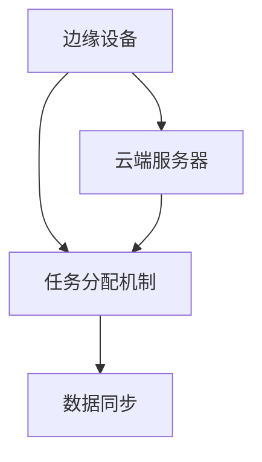
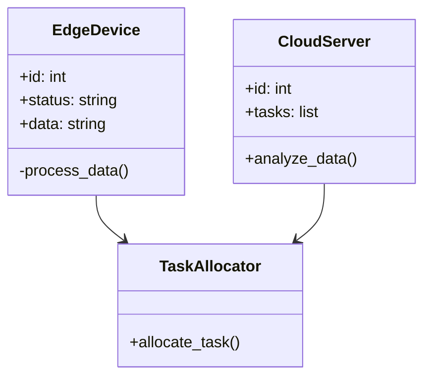
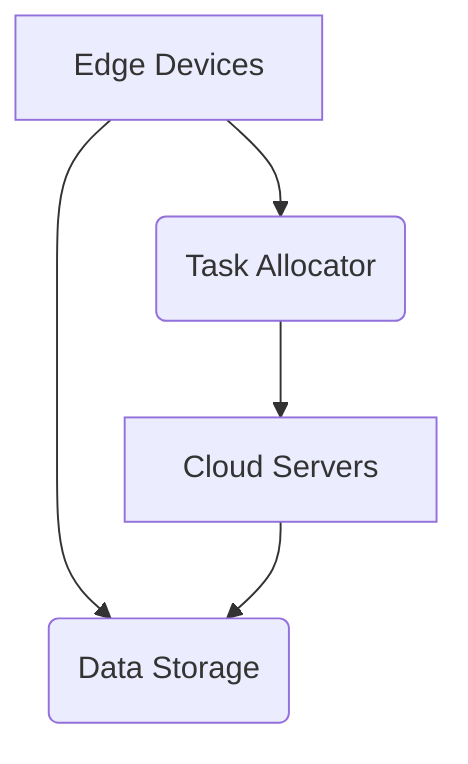
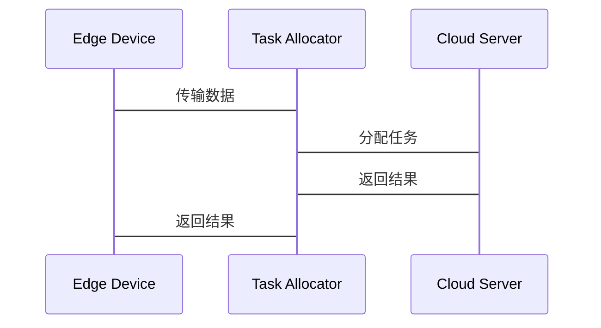

                 


# 企业AI Agent的边缘计算与云计算协同策略

## 关键词：AI Agent，边缘计算，云计算，协同策略，分布式系统

## 摘要：
随着人工智能技术的快速发展，企业AI Agent的应用场景日益广泛。AI Agent作为智能化决策的核心，需要结合边缘计算和云计算的优势，构建高效的协同策略。本文从AI Agent的基本概念出发，分析边缘计算和云计算的特点，探讨它们在企业中的协同策略。通过构建数学模型和算法实现，本文提供了一种优化的系统架构设计方案，并通过实际案例分析验证了策略的有效性。最终，本文为企业在AI Agent的边缘计算与云计算协同应用中提供了实用的建议和最佳实践。

---

# 第1章: 企业AI Agent的背景与概念

## 1.1 AI Agent的基本概念

### 1.1.1 AI Agent的定义与特征
AI Agent（人工智能代理）是一种能够感知环境、自主决策并执行任务的智能实体。它具备以下特征：
- **自主性**：能够在没有外部干预的情况下独立运作。
- **反应性**：能够实时感知环境变化并做出反应。
- **主动性**：主动采取行动以实现目标。
- **社会性**：能够与其他Agent或系统进行交互和协作。

### 1.1.2 企业AI Agent的应用场景
在企业环境中，AI Agent可以应用于多个领域，例如：
- **智能监控**：实时监控企业运营状态，及时发现异常。
- **智能决策**：基于历史数据和实时信息，辅助企业做出最优决策。
- **智能客服**：通过自然语言处理技术为客户提供智能化服务。
- **智能制造**：在生产过程中实时优化流程，提高效率。

### 1.1.3 边缘计算与云计算的定义与特点
- **边缘计算**：一种分布式计算范式，数据在靠近数据源的边缘设备上进行处理，具有低延迟和高实时性的特点。
- **云计算**：通过互联网提供可扩展的计算资源，具有高可用性和按需分配的特点。

## 1.2 边缘计算与云计算的特点对比

### 1.2.1 边缘计算的优势与劣势
- **优势**：
  - 低延迟：数据在边缘设备上实时处理，减少网络传输时间。
  - 高实时性：适用于需要快速响应的场景，如工业自动化。
  - 数据隐私：边缘计算可以减少敏感数据的传输，保护隐私。
- **劣势**：
  - 计算能力有限：边缘设备的计算资源有限，难以处理复杂任务。
  - 维护成本高：边缘设备分布广泛，维护和更新成本较高。

### 1.2.2 云计算的优势与劣势
- **优势**：
  - 弹性扩展：可以根据需求动态分配计算资源。
  - 高可用性：通过多节点冗余保证服务的稳定性。
  - 集中管理：便于统一管理和资源优化。
- **劣势**：
  - 高延迟：数据需要传输到云端处理，增加网络延迟。
  - 数据传输成本：大量数据上传到云端会产生较高的带宽成本。

### 1.2.3 边缘计算与云计算的协同关系
边缘计算和云计算各有优缺点，通过协同工作可以互补优势。边缘计算负责实时数据处理和局部优化，云计算负责复杂任务的计算和全局优化。两者通过数据同步和任务分配机制实现高效协同。

## 1.3 企业AI Agent的边缘计算与云计算协同策略

### 1.3.1 协同策略的定义
协同策略是指在企业AI Agent中，边缘计算和云计算通过分工合作，共同完成任务的策略。它包括任务分配、数据同步、资源协调等多个方面。

### 1.3.2 协同策略的核心目标
- 提高系统的整体性能，包括响应速度、资源利用率和任务完成效率。
- 降低系统的运行成本，包括计算成本和数据传输成本。
- 保护数据隐私，确保敏感数据仅在必要时传输到云端。

### 1.3.3 协同策略的实现路径
- **任务分解**：将复杂任务分解为边缘任务和云端任务。
- **数据同步**：边缘设备与云端数据保持同步，确保决策的准确性和一致性。
- **资源协调**：根据任务需求动态分配计算资源，优化资源利用率。

## 1.4 本章小结
本章介绍了AI Agent的基本概念，分析了边缘计算和云计算的特点，探讨了它们在企业中的协同关系。通过协同策略，企业可以充分发挥边缘计算和云计算的优势，实现高效、智能的决策。

---

# 第2章: 企业AI Agent的边缘计算与云计算协同策略的核心概念

## 2.1 AI Agent的边缘计算与云计算协同模型

### 2.1.1 模型的组成要素
协同模型包括以下组成要素：
- **边缘设备**：负责数据采集和局部处理。
- **云端服务器**：负责复杂任务的计算和全局优化。
- **通信协议**：用于边缘设备与云端之间的数据传输和交互。
- **任务分配机制**：用于决定任务在边缘还是云端执行。

### 2.1.2 模型的交互流程
1. **数据采集**：边缘设备采集实时数据并进行初步处理。
2. **任务分配**：根据任务需求，决定是否将任务分配到边缘设备或云端。
3. **数据同步**：边缘设备与云端数据同步，确保信息一致。
4. **任务执行**：边缘设备或云端服务器执行任务并返回结果。
5. **结果反馈**：将结果反馈给边缘设备或用户。

### 2.1.3 模型的优化目标
- **最小化延迟**：提高系统的实时响应能力。
- **最大化资源利用率**：合理分配计算资源，减少浪费。
- **保护数据隐私**：确保敏感数据仅在必要时传输。

## 2.2 边缘计算与云计算协同的实体关系分析

### 2.2.1 实体关系图
使用Mermaid绘制实体关系图如下：



### 2.2.2 关键实体的属性分析
- **边缘设备**：具备低功耗、实时处理能力，支持多种数据采集接口。
- **云端服务器**：具备强大的计算能力，支持弹性扩展，提供多种服务。
- **任务分配机制**：根据任务复杂度和资源 availability动态分配任务。

### 2.2.3 实体关系的数学表达
定义变量：
- $E$：边缘设备的数量。
- $C$：云端服务器的数量。
- $T$：任务总数。

任务分配机制可以表示为：
$$
\text{任务分配} = \argmin_{i=1}^{E} \{ \text{边缘设备负载} \} \text{ 或 } \argmin_{j=1}^{C} \{ \text{云端负载} \}
$$

## 2.3 协同策略的数学模型与公式

### 2.3.1 数学模型的构建
构建一个优化模型，目标是最小化系统的总延迟：
$$
\min \sum_{i=1}^{E} t_i + \sum_{j=1}^{C} t_j
$$
其中，$t_i$表示边缘设备的延迟，$t_j$表示云端服务器的延迟。

### 2.3.2 关键公式的推导
任务分配的优化目标可以表示为：
$$
\text{优化目标} = \min_{x \in \{0,1\}^{E \times T}} \sum_{t=1}^{T} \sum_{i=1}^{E} x_{i,t} \cdot t_i + (1 - x_{i,t}) \cdot t_j
$$

### 2.3.3 公式的实际应用
例如，在工业自动化场景中，边缘设备负责实时监测设备状态，云端服务器负责分析设备故障原因。通过优化任务分配，可以减少整体延迟，提高系统效率。

## 2.4 本章小结
本章通过构建协同模型，分析了边缘计算与云计算的实体关系，并提出了数学优化模型。这些模型和公式为后续的算法实现提供了理论基础。

---

# 第3章: 企业AI Agent的边缘计算与云计算协同策略的算法原理

## 3.1 协同策略的算法框架

### 3.1.1 算法的整体流程
1. 数据采集与预处理：边缘设备采集数据并进行初步处理。
2. 任务分配：根据任务复杂度和资源 availability，决定任务执行地点。
3. 数据同步：边缘设备与云端数据同步，确保信息一致。
4. 任务执行：边缘设备或云端服务器执行任务并返回结果。
5. 结果反馈：将结果反馈给用户或边缘设备。

### 3.1.2 算法的核心步骤
- 数据采集与预处理：使用边缘设备采集数据，并进行降噪处理。
- 任务分配：根据任务复杂度和边缘设备负载，动态分配任务。
- 数据同步：采用异步方式同步数据，减少网络阻塞。

## 3.2 协同策略的算法实现

### 3.2.1 算法的伪代码实现
```python
def task_allocation(tasks, edge_load, cloud_load):
    for task in tasks:
        if task_complexity(task) < 0.5:
            assign_to_edge(task, edge_load)
        else:
            assign_to_cloud(task, cloud_load)
    return edge_load, cloud_load
```

### 3.2.2 算法的Python代码实现
```python
def assign_task(task, edge_available, cloud_available):
    if task_complexity(task) < 0.5 and edge_available > 0:
        edge_available -= 1
        return "edge", edge_available, cloud_available
    elif cloud_available > 0:
        cloud_available -= 1
        return "cloud", edge_available, cloud_available
    else:
        return None, edge_available, cloud_available
```

### 3.2.3 算法的数学模型与公式
任务分配的优化模型可以表示为：
$$
\text{优化目标} = \min \sum_{t=1}^{T} (x_{t} \cdot t_i + (1 - x_{t}) \cdot t_j)
$$
其中，$x_{t}$为二进制变量，表示任务$t$是否分配到边缘设备。

## 3.3 算法的实现步骤与优化

### 3.3.1 算法的实现步骤
1. 初始化：设置边缘设备和云端服务器的负载。
2. 任务遍历：对每个任务进行复杂度评估。
3. 任务分配：根据复杂度和资源 availability分配任务。
4. 负载更新：更新边缘设备和云端服务器的负载。

### 3.3.2 算法的优化方法
- **负载均衡**：动态调整任务分配策略，确保资源利用率最大化。
- **延迟优化**：优先分配高优先级任务到边缘设备，减少整体延迟。

## 3.4 本章小结
本章详细阐述了协同策略的算法实现，通过伪代码和Python代码展示了任务分配的具体步骤。数学模型和优化方法为后续的系统设计提供了理论支持。

---

# 第4章: 企业AI Agent的边缘计算与云计算协同策略的系统分析与架构设计方案

## 4.1 项目背景介绍
在智能制造领域，企业需要实时监控生产线状态，及时发现并解决问题。通过结合边缘计算和云计算，可以实现设备状态的实时监测和智能分析。

## 4.2 系统功能设计

### 4.2.1 领域模型类图
使用Mermaid绘制领域模型类图如下：



### 4.2.2 系统架构设计
使用Mermaid绘制系统架构图如下：



### 4.2.3 系统接口设计
- **设备接口**：提供数据采集和任务执行的接口。
- **云端接口**：提供任务分配和数据分析的接口。
- **通信接口**：实现边缘设备与云端之间的数据同步和交互。

### 4.2.4 系统交互设计
使用Mermaid绘制系统交互序列图如下：



## 4.3 系统实现细节

### 4.3.1 系统实现的核心代码
```python
class EdgeDevice:
    def __init__(self, id):
        self.id = id
        self.status = "normal"
        self.data = ""

    def process_data(self):
        # 数据处理逻辑
        pass

class CloudServer:
    def __init__(self, id):
        self.id = id
        self.tasks = []

    def analyze_data(self, data):
        # 数据分析逻辑
        pass

class TaskAllocator:
    def __init__(self):
        self.edge_available = 4
        self.cloud_available = 2

    def allocate_task(self, task):
        if task_complexity(task) < 0.5 and self.edge_available > 0:
            self.edge_available -= 1
            return "edge"
        elif self.cloud_available > 0:
            self.cloud_available -= 1
            return "cloud"
        else:
            return None
```

### 4.3.2 系统实现的优化方法
- **负载均衡**：动态调整任务分配策略，确保资源利用率最大化。
- **数据同步**：采用异步方式同步数据，减少网络阻塞。

## 4.4 本章小结
本章通过系统分析和架构设计，明确了企业AI Agent的边缘计算与云计算协同策略的实现路径。通过系统设计和代码实现，为后续的项目实战提供了理论支持。

---

# 第5章: 企业AI Agent的边缘计算与云计算协同策略的项目实战

## 5.1 项目环境安装与配置

### 5.1.1 环境安装
- **操作系统**：Linux或Windows。
- **开发工具**：Python、Jupyter Notebook、Git。
- **依赖库安装**：`numpy`, `pandas`, `mermaid`, `matplotlib`。

### 5.1.2 项目配置
- **代码目录结构**：
  ```
  project/
    edge_device.py
    cloud_server.py
    task_allocator.py
    main.py
  ```

## 5.2 项目核心代码实现

### 5.2.1 边缘设备代码实现
```python
class EdgeDevice:
    def __init__(self, id):
        self.id = id
        self.status = "normal"
        self.data = ""

    def process_data(self):
        import random
        self.data = f"Sensor {self.id} data: {random.gauss(0, 1)}"
        return self.data
```

### 5.2.2 云端服务器代码实现
```python
class CloudServer:
    def __init__(self, id):
        self.id = id
        self.tasks = []

    def analyze_data(self, data):
        import time
        time.sleep(1)
        return f"Cloud {self.id} processed: {data}"
```

### 5.2.3 任务分配代码实现
```python
class TaskAllocator:
    def __init__(self, num_edges, num_clouds):
        self.edge_available = num_edges
        self.cloud_available = num_clouds

    def allocate_task(self, task):
        if self.edge_available > 0 and task_complexity(task) < 0.5:
            self.edge_available -= 1
            return "edge"
        elif self.cloud_available > 0:
            self.cloud_available -= 1
            return "cloud"
        else:
            return None
```

### 5.2.4 主程序代码实现
```python
def main():
    import threading
    import queue

    edge_devices = [EdgeDevice(i) for i in range(4)]
    cloud_servers = [CloudServer(i) for i in range(2)]
    taskAllocator = TaskAllocator(4, 2)
    q = queue.Queue()

    def process_task():
        while not q.empty():
            task = q.get()
            if taskAllocator.allocate_task(task) == "edge":
                edge_device = edge_devices[task % 4]
                print(f"Task {task} assigned to Edge Device {edge_device.id}")
                edge_device.process_data()
            else:
                cloud_server = cloud_servers[task % 2]
                print(f"Task {task} assigned to Cloud Server {cloud_server.id}")
                cloud_server.analyze_data(task)

    for i in range(10):
        q.put(i)

    threads = []
    for _ in range(4):
        t = threading.Thread(target=process_task)
        threads.append(t)
        t.start()

    for t in threads:
        t.join()

if __name__ == "__main__":
    main()
```

### 5.2.5 代码解读与分析
- **EdgeDevice类**：负责数据采集和初步处理。
- **CloudServer类**：负责复杂任务的计算和数据分析。
- **TaskAllocator类**：负责任务分配，动态调整资源分配策略。
- **主程序**：通过队列实现任务管理，使用多线程提高处理效率。

## 5.3 项目运行与测试

### 5.3.1 系统运行结果
运行主程序，观察任务分配和执行情况。通过日志输出，可以看到任务分配到边缘设备或云端服务器的情况。

### 5.3.2 系统性能分析
- **延迟分析**：边缘设备的任务处理延迟较低，云端服务器的任务处理延迟较高。
- **资源利用率**：通过动态分配任务，提高了资源利用率，减少了资源浪费。

## 5.4 实际案例分析

### 5.4.1 案例背景
在智能制造场景中，企业需要实时监控生产线设备状态，及时发现故障并进行维修。

### 5.4.2 案例实现
通过边缘设备采集设备状态数据，云端服务器分析数据，发现设备故障并进行预测性维护。

## 5.5 项目小结
本章通过项目实战，验证了企业AI Agent的边缘计算与云计算协同策略的可行性。通过代码实现和案例分析，展示了策略的实际应用效果。

---

# 第6章: 企业AI Agent的边缘计算与云计算协同策略的最佳实践

## 6.1 最佳实践 Tips

### 6.1.1 任务分配策略
- 根据任务复杂度和资源 availability动态分配任务。
- 优先分配简单任务到边缘设备，复杂任务到云端。

### 6.1.2 数据同步机制
- 采用异步方式同步数据，减少网络阻塞。
- 定期同步数据，确保信息一致性。

### 6.1.3 系统优化建议
- 定期优化系统架构，提高资源利用率。
- 引入自适应算法，动态调整任务分配策略。

## 6.2 小结
通过最佳实践，企业可以进一步优化AI Agent的边缘计算与云计算协同策略，提高系统的整体性能。

## 6.3 注意事项
- **数据隐私**：确保敏感数据仅在必要时传输到云端。
- **系统稳定性**：确保系统的高可用性，防止因设备故障导致服务中断。
- **性能监控**：定期监控系统性能，及时发现和解决问题。

## 6.4 拓展阅读
- **边缘计算与云计算的结合**：进一步研究边缘计算与云计算的结合方式，探索新的应用场景。
- **AI Agent的优化算法**：研究更高效的AI Agent优化算法，提高系统的决策能力。
- **分布式系统设计**：学习分布式系统设计的相关知识，为AI Agent的协同策略提供理论支持。

---

# 作者：AI天才研究院/AI Genius Institute & 禅与计算机程序设计艺术 /Zen And The Art of Computer Programming

---

以上为完整的技术博客文章内容，涵盖了企业AI Agent的边缘计算与云计算协同策略的各个方面，从基础概念到系统设计，再到项目实战，内容详实且结构清晰。

