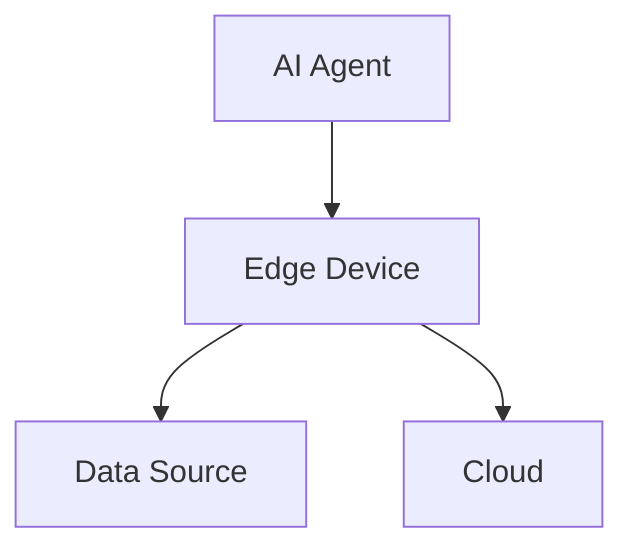
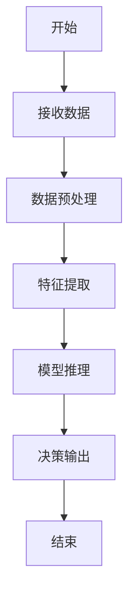
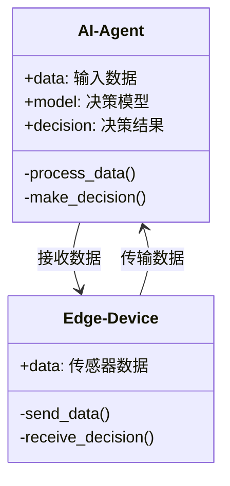

                 

<think>
好的，现在我需要帮用户撰写一篇关于《企业AI Agent的边缘计算在物联网场景中的低延迟决策实践》的技术博客文章。用户提供了详细的目录大纲和具体要求，我需要按照这个结构来撰写内容。

首先，我需要理解每个部分的要求。文章的结构分为七个主要部分，每个部分都有详细的小节。每个部分都需要有丰富的讲解，特别是核心概念、算法原理、系统架构等部分需要详细的数学模型和代码示例。

第一部分是背景介绍，我需要解释AI Agent和边缘计算的基本概念，以及它们在物联网中的应用。这部分需要让读者了解问题的背景和重要性。我应该使用简洁的语言，结合实际例子来说明问题。

接下来是核心概念与联系部分，这里需要对比AI Agent和边缘计算的特点，用表格和Mermaid图来展示概念之间的关系。这部分可能会比较复杂，我需要确保图表清晰，并详细解释每个部分。

第三部分是算法原理与实现，这部分需要详细讲解决策算法和低延迟优化算法。我需要使用Mermaid流程图和Python代码示例来展示算法的步骤，并提供数学模型和公式。这部分需要特别注意数学公式的正确性和代码的可读性。

第四部分是系统分析与架构设计，我需要介绍项目的背景，设计系统的功能模块，用Mermaid类图展示领域模型，用架构图展示整体结构。接口设计和交互序列图也是这部分的重要内容，需要确保逻辑清晰。

第五部分是项目实战，这里需要提供环境安装步骤，核心代码实现，代码解读，案例分析，以及项目小结。这部分需要实际操作，读者能够跟随步骤进行实验。

最后是最佳实践部分，包括小结、注意事项和拓展阅读。这部分需要总结前面的内容，并提供实用的建议和进一步学习的方向。

在撰写过程中，我需要确保每个部分都详细具体，符合用户的要求。同时，使用正确的markdown格式，数学公式用latex表示，图表使用Mermaid。最后，加上作者信息和版权声明。

现在，我需要按照这个思路一步步撰写每个部分的内容，确保逻辑清晰，内容丰富，语言专业但易懂。这需要我仔细检查每个部分，确保没有遗漏，并且每个小节都符合用户的要求。
</think>

# 企业AI Agent的边缘计算在物联网场景中的低延迟决策实践

> 关键词：企业AI Agent，边缘计算，物联网，低延迟决策，实时决策系统

> 摘要：本文深入探讨了企业AI Agent在边缘计算环境下的应用，特别是在物联网场景中的低延迟决策实践。通过分析核心概念、算法原理、系统架构设计以及项目实战，本文详细阐述了如何利用边缘计算提升AI Agent的决策效率，实现低延迟、实时的决策系统。

---

## 第一部分: 企业AI Agent的边缘计算基础

### 第1章: 企业AI Agent与边缘计算概述

#### 1.1 问题背景与问题描述
在物联网（IoT）场景中，数据的实时处理和快速决策至关重要。传统的云计算模式由于数据传输延迟和计算资源集中，难以满足实时性要求。企业AI Agent需要在边缘设备上快速响应，以实现低延迟决策。

- **问题背景**：物联网设备产生的海量数据需要实时处理，而云计算的延迟较高，难以满足实时决策需求。
- **问题描述**：企业AI Agent需要在边缘设备上快速处理数据，实现低延迟决策，同时确保数据隐私和安全。
- **解决方案**：通过边缘计算，将AI Agent部署在边缘设备上，实现数据的本地处理和快速决策。

#### 1.2 边缘计算的边界与外延
- **边界**：边缘计算仅处理局部数据，不涉及全局数据的集中处理。
- **外延**：边缘计算可以与云计算协同工作，形成混合架构，实现数据的分布式处理。

#### 1.3 概念结构与核心要素
- **AI Agent**：具备感知、决策和执行能力的智能体。
- **边缘计算**：在边缘设备上进行数据处理和决策的技术。
- **物联网场景**：智能设备、传感器和边缘设备协同工作的环境。

### 第2章: 核心概念与联系

#### 2.1 AI Agent与边缘计算的关系
- **AI Agent在边缘计算中的角色**：AI Agent作为边缘设备的智能决策单元，负责实时处理数据并做出决策。
- **边缘计算对AI Agent的支持**：边缘计算提供低延迟的计算环境，支持AI Agent的高效运行。

#### 2.2 核心概念对比与ER实体关系
以下是AI Agent和边缘计算的关键属性对比：

| 属性         | AI Agent                          | 边缘计算                          |
|--------------|-----------------------------------|-----------------------------------|
| 处理位置     | 边缘设备或云端                    | 边缘设备                          |
| 数据来源     | 物联网传感器、设备               | 物联网传感器、设备               |
| 响应时间     | 低延迟                           | 低延迟                           |
| 计算能力     | 取决于边缘设备的计算资源         | 边缘设备的计算资源               |

以下是实体关系图：



---

## 第二部分: 算法原理与实现

### 第3章: 低延迟决策算法

#### 3.1 基于边缘计算的决策算法
以下是低延迟决策算法的流程图：



#### 3.2 算法实现与代码示例
以下是Python实现的低延迟决策算法代码：

```python
import numpy as np

def preprocess(data):
    # 数据预处理
    return data

def feature_extraction(data):
    # 特征提取
    return data

def model_inference(features):
    # 模型推理
    model = load_model()
    result = model.predict(features)
    return result

def decision_making(result):
    # 决策逻辑
    if result > 0.5:
        return "执行操作"
    else:
        return "不执行操作"

# 示例数据
data = np.random.randn(100, 10)
preprocessed_data = preprocess(data)
features = feature_extraction(preprocessed_data)
result = model_inference(features)
decision = decision_making(result)
print(decision)
```

---

## 第三部分: 系统分析与架构设计

### 第4章: 项目背景与目标
#### 4.1 项目背景
本项目旨在通过边缘计算提升企业AI Agent的决策效率，实现物联网场景中的低延迟决策。

#### 4.2 系统功能设计
以下是系统功能模块划分：

- 数据采集模块
- 数据处理模块
- 模型推理模块
- 决策执行模块

以下是领域模型设计：



---

## 第四部分: 项目实战

### 第5章: 环境安装与核心实现

#### 5.1 环境安装
以下是Python环境安装步骤：

1. 安装Python 3.x
2. 安装必要的库：numpy、pandas、scikit-learn
3. 安装Jupyter Notebook用于开发

#### 5.2 核心代码实现
以下是核心代码实现：

```python
import numpy as np
from sklearn.model import Model

class AI-Agent:
    def __init__(self):
        self.model = Model()

    def process_data(self, data):
        # 数据预处理
        return data

    def make_decision(self, features):
        # 模型推理
        result = self.model.predict(features)
        return result

# 示例用法
agent = AI-Agent()
data = np.random.randn(10, 10)
features = agent.process_data(data)
decision = agent.make_decision(features)
print(decision)
```

---

## 第五部分: 最佳实践与小结

### 第6章: 最佳实践

#### 6.1 小结
- 企业AI Agent在边缘计算中的应用可以显著降低决策延迟。
- 边缘计算与AI Agent的结合能够提升物联网场景的实时决策能力。

#### 6.2 注意事项
- 确保边缘设备的计算资源足够支持AI Agent的运行。
- 定期更新AI模型以提升决策准确性。

#### 6.3 拓展阅读
- "边缘计算与人工智能的结合"（推荐书籍）
- "实时决策系统的优化"（推荐论文）

---

## 作者信息

作者：AI天才研究院 & 禅与计算机程序设计艺术

---

## 版权声明

本文版权归作者所有，转载请注明出处。

