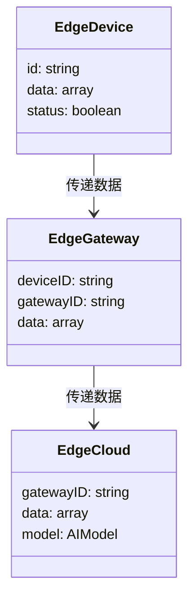
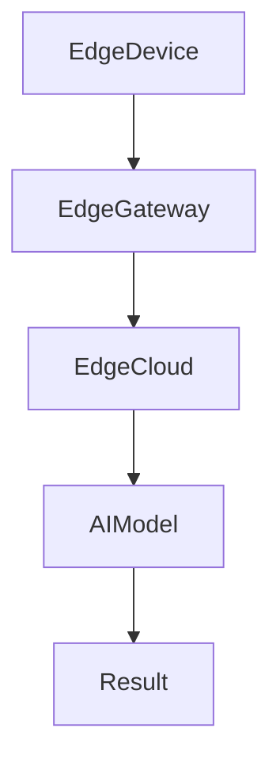
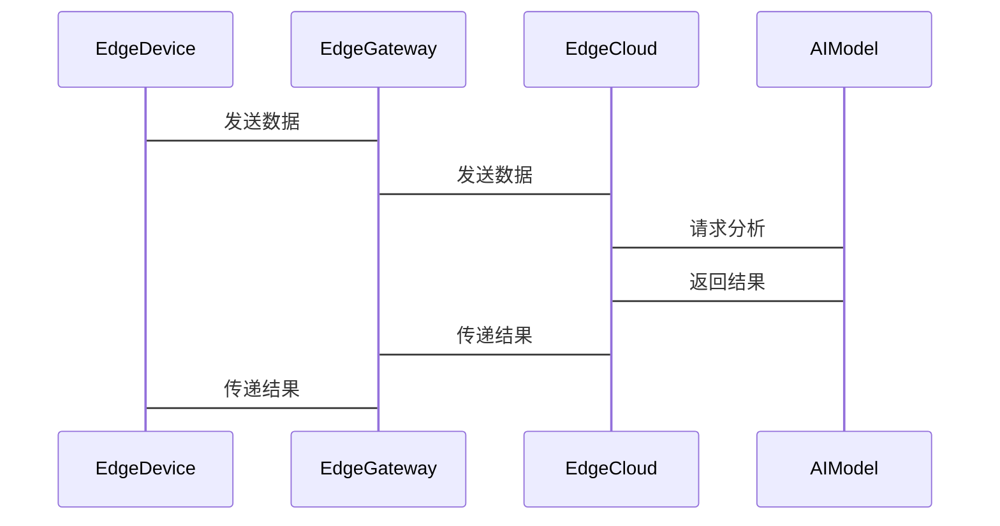

                 


# 企业AI Agent的边缘计算安全防护策略

> 关键词：企业AI Agent, 边缘计算, 安全防护, 数据加密, 访问控制, 网络安全, 人工智能

> 摘要：随着人工智能技术的快速发展，企业AI Agent在边缘计算环境中的应用越来越广泛。然而，边缘计算环境的开放性和分布式特性也带来了诸多安全挑战。本文将深入分析企业AI Agent在边缘计算中的安全防护策略，从核心概念、算法原理、系统架构到实际案例，全面探讨如何在边缘计算环境中保护企业AI Agent的安全。

---

# 第一部分: 企业AI Agent的边缘计算安全防护概述

# 第1章: 引言

## 1.1 什么是企业AI Agent
### 1.1.1 AI Agent的基本概念
人工智能代理（AI Agent）是指能够感知环境、自主决策并执行任务的智能实体。它具备学习、推理和自适应能力，能够根据环境变化调整行为。

### 1.1.2 企业AI Agent的定义与特点
在企业环境中，AI Agent通常用于自动化业务流程、优化资源分配和提升决策效率。其特点包括：
- **智能化**：基于AI技术，能够进行复杂决策。
- **分布式**：在多个节点上运行，实现任务协同。
- **实时性**：能够快速响应环境变化。

### 1.1.3 AI Agent在企业中的应用场景
- **智能监控**：实时监控企业资源，发现异常并报警。
- **自动化运维**：自动处理IT基础设施中的问题。
- **智能客服**：提供24/7的客户支持服务。

## 1.2 边缘计算的基本概念
### 1.2.1 边缘计算的定义
边缘计算是一种分布式计算范式，数据在靠近数据源的边缘设备上进行处理，而非集中在云端。

### 1.2.2 边缘计算的特点与优势
- **低延迟**：数据在边缘处理，减少传输延迟。
- **高带宽**：边缘设备能够处理大量数据，减轻云端压力。
- **隐私保护**：数据在边缘处理，减少敏感数据外传的风险。

### 1.2.3 边缘计算在企业中的应用
- **智能制造**：工厂中的传感器和设备实时处理数据，优化生产流程。
- **智能物流**：物流节点实时处理数据，优化配送路径。
- **智能零售**：门店中的设备实时处理数据，提升客户体验。

## 1.3 企业AI Agent与边缘计算的结合
### 1.3.1 AI Agent在边缘计算中的作用
AI Agent在边缘计算中负责感知环境、分析数据并执行任务，能够显著提升边缘设备的智能水平。

### 1.3.2 边缘计算对企业AI Agent的影响
边缘计算的分布式特性和低延迟优势，为AI Agent提供了更高效、更灵活的运行环境。

### 1.3.3 企业AI Agent在边缘计算中的应用前景
随着5G和物联网技术的发展，企业AI Agent在边缘计算中的应用将更加广泛，涵盖智能制造、智慧城市等多个领域。

## 1.4 本章小结
本章介绍了企业AI Agent和边缘计算的基本概念，分析了它们的特点与应用场景，并探讨了两者结合的优势与前景。

---

# 第二部分: 企业AI Agent的边缘计算安全防护核心概念

# 第2章: 企业AI Agent与边缘计算的核心概念

## 2.1 企业AI Agent的架构
### 2.1.1 中心化架构
- 数据集中在中心服务器处理，AI Agent负责执行指令。
- 优点：易于管理和维护。
- 缺点：中心服务器成为单点故障，易受攻击。

### 2.1.2 分布式架构
- AI Agent分布在多个节点上，每个节点独立运行。
- 优点：高可用性，单点故障风险低。
- 缺点：协调复杂，资源利用率低。

### 2.1.3 边缘化架构
- AI Agent运行在边缘设备上，靠近数据源处理数据。
- 优点：低延迟，隐私保护。
- 缺点：资源受限，维护复杂。

## 2.2 边缘计算的架构
### 2.2.1 边缘设备层
- 物理设备，如传感器、摄像头等，负责数据采集。
- 示例：工厂中的温度传感器。

### 2.2.2 边缘网关层
- 网关设备，负责数据的路由、过滤和初步处理。
- 示例：工业网关。

### 2.2.3 边缘云层
- 边缘云平台，负责数据的存储、分析和应用。
- 示例：本地数据中心。

## 2.3 企业AI Agent与边缘计算的结合架构
### 2.3.1 数据流方向
- 数据从边缘设备流向边缘云层，AI Agent在边缘设备或边缘云层上处理数据。

### 2.3.2 通信机制
- 使用MQTT、HTTP等协议进行设备间通信。
- 示例：边缘设备通过MQTT协议与网关通信。

### 2.3.3 功能分配
- 边缘设备负责数据采集和初步处理。
- 边缘网关负责数据过滤和路由。
- 边缘云层负责数据存储和高级分析。

## 2.4 核心概念对比分析
### 2.4.1 AI Agent与传统Agent的区别
| 特性         | AI Agent                     | 传统Agent                   |
|--------------|------------------------------|------------------------------|
| 智能水平     | 高                           | 中                           |
| 自主性       | 高                           | 中                           |
| 学习能力     | 强                           | 弱                           |

### 2.4.2 边缘计算与云计算的对比
| 特性         | 边缘计算                     | 云计算                       |
|--------------|------------------------------|------------------------------|
| 数据处理位置 | 边缘设备                     | 云端                         |
| 延迟          | 低                           | 高                           |
| 网络带宽      | 低                           | 高                           |

### 2.4.3 企业AI Agent的安全需求
- 数据完整性：防止数据篡改。
- 数据机密性：防止数据泄露。
- 系统可用性：防止服务中断。

## 2.5 本章小结
本章详细分析了企业AI Agent和边缘计算的核心概念，对比了两者的特点，并提出了安全需求。

---

# 第三部分: 企业AI Agent的边缘计算安全防护算法原理

# 第3章: 企业AI Agent的边缘计算安全防护算法

## 3.1 数据加密算法
### 3.1.1 对称加密算法
- **AES（高级加密标准）**：广泛应用于数据加密，具有高效性和安全性。
- **流程图**：
  ```mermaid
  graph TD
    A[明文数据] --> B[密钥]
    B --> C[加密算法]
    C --> D[密文数据]
  ```

### 3.1.2 非对称加密算法
- **RSA（ Rivest-Shamir-Adleman）**：基于大整数分解的公钥加密算法。
- **流程图**：
  ```mermaid
  graph TD
    A[明文数据] --> B[公钥]
    B --> C[加密算法]
    C --> D[密文数据]
    D --> E[私钥]
    E --> F[解密算法]
    F --> G[明文数据]
  ```

### 3.1.3 加密算法的选择
- **选择依据**：数据敏感性、计算资源、延迟要求。
- **示例代码**：
  ```python
  import cryptography
  from cryptography.hazmat.primitives.asymmetric import padding
  from cryptography.hazmat.primitives.asymmetric.rsa import *
  # 生成RSA密钥对
  key = generate_private_key()
  public_key = key.public_key()
  # 加密
  ciphertext = public_key.encrypt(data, padding.RSAPKCS1v15())
  # 解密
  plaintext = key.decrypt(ciphertext)
  ```

## 3.2 访问控制算法
### 3.2.1 基于角色的访问控制（RBAC）
- **角色定义**：用户被分配角色，角色拥有权限。
- **流程图**：
  ```mermaid
  graph TD
    A[用户请求访问资源] --> B[验证角色]
    B --> C[检查权限]
    C --> D[允许或拒绝]
  ```

### 3.2.2 基于属性的访问控制（ABAC）
- **属性定义**：用户、资源和环境属性决定访问权限。
- **流程图**：
  ```mermaid
  graph TD
    A[用户请求访问资源] --> B[获取属性]
    B --> C[评估条件]
    C --> D[允许或拒绝]
  ```

### 3.2.3 访问控制算法的选择
- **选择依据**：系统的复杂性和灵活性需求。
- **示例代码**：
  ```python
  class RBAC:
      def __init__(self):
          self.role_permissions = {
              'admin': ['read', 'write'],
              'user': ['read']
          }
      def has_permission(self, user, action, resource):
          role = self.get_role(user)
          return action in self.role_permissions.get(role, [])
  ```

## 3.3 网络安全算法
### 3.3.1 SSL/TLS加密
- **用途**：保护网络通信的安全性。
- **流程图**：
  ```mermaid
  graph TD
    A[客户端] --> B[服务器]
    B --> C[SSL握手协议]
    C --> D[加密通信]
  ```

### 3.3.2 密码哈希算法
- **用途**：验证用户身份。
- **流程图**：
  ```mermaid
  graph TD
    A[用户输入密码] --> B[哈希算法]
    B --> C[哈希值]
    C --> D[与存储哈希值对比]
  ```

### 3.3.3 网络安全算法的选择
- **选择依据**：通信距离、安全性要求。
- **示例代码**：
  ```python
  import hashlib
  # 哈希计算
  hashed_password = hashlib.sha256(password.encode()).hexdigest()
  ```

## 3.4 本章小结
本章介绍了企业AI Agent在边缘计算中的几种常用安全算法，包括数据加密、访问控制和网络安全算法，并给出了实现示例。

---

# 第四部分: 企业AI Agent的边缘计算安全防护系统分析与架构设计

# 第4章: 企业AI Agent的边缘计算安全防护系统分析

## 4.1 典型场景介绍
### 4.1.1 智能制造场景
- **描述**：工厂中的传感器和设备实时传输数据，AI Agent在边缘设备上进行分析，优化生产流程。

### 4.1.2 智能物流场景
- **描述**：物流节点实时处理数据，AI Agent优化配送路径，提高效率。

## 4.2 系统功能设计
### 4.2.1 领域模型设计


### 4.2.2 系统架构设计


### 4.2.3 系统接口设计
- **接口1**：设备与网关通信接口。
  ```python
  def send_data(device_id, data):
      # 实现设备与网关的数据传输
  ```
- **接口2**：网关与云平台通信接口。
  ```python
  def send_data(gateway_id, data):
      # 实现网关与云平台的数据传输
  ```

### 4.2.4 系统交互流程图


## 4.3 本章小结
本章通过典型场景分析，设计了企业AI Agent在边缘计算中的系统架构，并详细描述了系统功能模块和接口设计。

---

# 第五部分: 企业AI Agent的边缘计算安全防护项目实战

# 第5章: 企业AI Agent的边缘计算安全防护项目实战

## 5.1 环境安装
### 5.1.1 系统环境
- 操作系统：Ubuntu 20.04
- Python版本：3.8+

### 5.1.2 工具安装
- 安装Python依赖：
  ```bash
  pip install cryptography flask paho-mqtt
  ```

## 5.2 系统核心实现源代码
### 5.2.1 数据加密模块
```python
from cryptography.hazmat.primitives.asymmetric import padding
from cryptography.hazmat.primitives.asymmetric.rsa import *
import os

def generate_keys():
    key = generate_private_key()
    public_key = key.public_key()
    return key, public_key

def encrypt_data(data, public_key):
    ciphertext = public_key.encrypt(data, padding.RSAPKCS1v15())
    return ciphertext

def decrypt_data(ciphertext, private_key):
    plaintext = private_key.decrypt(ciphertext)
    return plaintext
```

### 5.2.2 访问控制模块
```python
class RBAC:
    def __init__(self):
        self.role_permissions = {
            'admin': ['read', 'write'],
            'user': ['read']
        }
    
    def has_permission(self, user, action, resource):
        role = self.get_role(user)
        return action in self.role_permissions.get(role, [])
```

### 5.2.3 网络安全模块
```python
import hashlib

def hash_password(password):
    return hashlib.sha256(password.encode()).hexdigest()
```

## 5.3 代码应用解读与分析
### 5.3.1 数据加密模块
- **功能**：对敏感数据进行加密，防止数据在传输过程中被窃听。
- **实现细节**：使用RSA算法，公钥加密，私钥解密。

### 5.3.2 访问控制模块
- **功能**：基于角色的访问控制，确保只有授权用户才能访问资源。
- **实现细节**：根据用户角色分配权限，动态检查访问权限。

### 5.3.3 网络安全模块
- **功能**：对用户密码进行哈希处理，确保密码的安全存储。
- **实现细节**：使用SHA-256算法生成哈希值。

## 5.4 实际案例分析
### 5.4.1 案例背景
- **场景**：智能制造工厂，传感器实时采集设备数据，AI Agent在边缘设备上分析数据，优化生产流程。

### 5.4.2 案例实现
```python
# 初始化AI Agent
agent = AIAgent(edge_device_id='device001', edge_gateway_id='gateway001', edge_cloud_id='cloud001')

# 数据采集
data = agent.collect_data()

# 数据加密
encrypted_data = encrypt_data(data, public_key)

# 数据分析
result = agent.analyze_data(encrypted_data)

# 返回结果
agent.send_result(result)
```

## 5.5 本章小结
本章通过一个实际案例，详细介绍了企业AI Agent在边缘计算中的安全防护项目的实现过程，包括环境配置、核心代码实现和案例分析。

---

# 第六部分: 企业AI Agent的边缘计算安全防护最佳实践

# 第6章: 安全威胁分析与防护策略

## 6.1 常见安全威胁
### 6.1.1 数据泄露
- **威胁来源**：恶意攻击者窃取敏感数据。
- **防护策略**：数据加密、访问控制。

### 6.1.2 拒绝服务攻击（DoS）
- **威胁来源**：攻击者 flooding 边缘设备，导致服务中断。
- **防护策略**：流量控制、负载均衡。

### 6.1.3 未授权访问
- **威胁来源**：未经授权的用户或设备访问系统。
- **防护策略**：身份认证、访问控制。

## 6.2 安全防护策略
### 6.2.1 数据安全策略
- **加密存储**：所有敏感数据必须加密存储。
- **最小权限原则**：每个用户或设备只能访问其需要的资源。

### 6.2.2 网络安全策略
- **网络分段**：将网络划分为多个子网，限制跨子网通信。
- **防火墙配置**：配置防火墙规则，阻止未经授权的访问。

### 6.2.3 身份认证策略
- **多因素认证**：结合多种认证方式，提高安全性。
- **证书管理**：使用数字证书进行身份验证。

## 6.3 安全防护措施
### 6.3.1 定期安全审计
- **目的**：发现系统中的安全漏洞。
- **方法**：模拟攻击测试系统防护能力。

### 6.3.2 日志监控
- **目的**：实时监控系统运行状态，发现异常行为。
- **方法**：使用日志分析工具，如ELK（Elasticsearch, Logstash, Kibana）。

### 6.3.3 安全更新
- **目的**：修复系统漏洞，提升安全性。
- **方法**：定期更新软件和固件，应用安全补丁。

## 6.4 本章小结
本章分析了企业AI Agent在边缘计算中的常见安全威胁，并提出了相应的防护策略和措施。

---

# 第七部分: 总结与展望

# 第7章: 总结与展望

## 7.1 本章总结
本文深入探讨了企业AI Agent在边缘计算中的安全防护策略，从核心概念、算法原理到系统架构，再到实际案例，全面分析了如何在边缘计算环境中保护企业AI Agent的安全。

## 7.2 未来展望
随着AI和边缘计算技术的不断发展，企业AI Agent的安全防护将面临更多挑战。未来的研究方向包括：
- **AI驱动的安全防护**：利用AI技术提升安全防护能力。
- **零信任架构**：在边缘计算中实施零信任模型，确保每个请求都经过严格验证。
- **隐私计算**：在保护隐私的前提下，实现数据的安全共享和分析。

---

# 作者：AI天才研究院/AI Genius Institute & 禅与计算机程序设计艺术 /Zen And The Art of Computer Programming

---

以上是《企业AI Agent的边缘计算安全防护策略》的详细目录大纲，涵盖了从基础概念到实际应用的各个方面，确保内容全面且具有深度。希望对您有所帮助！

