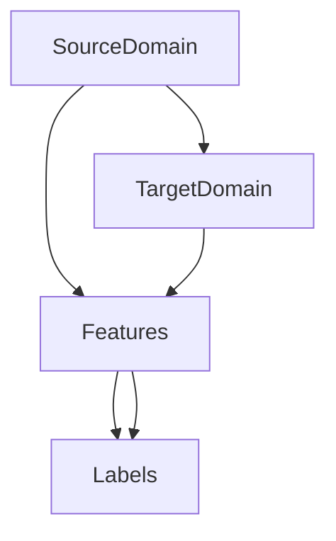
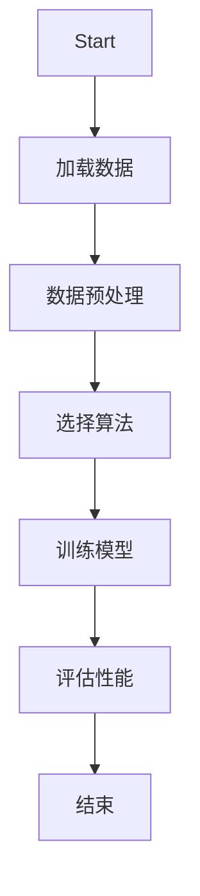

                 


# 企业AI Agent的迁移学习在跨行业知识迁移中的实践

> 关键词：企业AI Agent，迁移学习，跨行业知识迁移，机器学习，深度学习

> 摘要：本文详细探讨了企业AI Agent在跨行业知识迁移中的应用，分析了迁移学习的核心原理，结合实际案例和系统架构设计，展示了如何利用迁移学习实现跨行业的知识共享与应用。

---

## 第1章: 背景与基础

### 1.1 AI Agent的基本概念
AI Agent（人工智能代理）是一种能够感知环境、执行任务并做出决策的智能实体。它广泛应用于企业自动化、数据分析、智能客服等领域。企业AI Agent的核心功能包括数据处理、决策制定和任务执行，其特点在于能够适应复杂的业务场景。

### 1.2 跨行业知识迁移的背景与意义
跨行业知识迁移是指将某一领域的知识和经验应用到另一个不同领域。在企业中，这种迁移能够优化资源配置，提升效率，降低试错成本。例如，将制造业的优化算法应用到金融领域，以提高风险评估的准确性。

### 1.3 问题描述与解决
跨行业知识迁移面临数据分布差异、领域特征不一致等挑战。迁移学习通过共享特征空间，解决了这些难题，使AI Agent能够在不同领域间高效迁移知识。

---

## 第2章: 核心概念与联系

### 2.1 迁移学习的核心原理
迁移学习通过构建共享特征空间，适应不同数据分布。其数学模型包括源域和目标域的联合优化，公式如下：
$$ \arg \min_{f} \mathbb{E}_{(x,y) \sim P_{\text{source}}}[L(f(x,y))] + \lambda \mathbb{E}_{(x',y') \sim P_{\text{target}}}[L(f(x',y'))] $$

### 2.2 核心概念对比
| 概念 | 特征 |
|------|------|
| 源域 | 原始数据分布 |
| 目标域 | 新数据分布 |
| 特征表示 | 数据的低维表示 |
| 领域适应 | 数据分布调整 |

### 2.3 ER实体关系图


---

## 第3章: 算法原理与实现

### 3.1 迁移学习算法分类
主要分为基于特征、基于模型和基于分布的方法。例如，使用最大均值差异的迁移学习公式：
$$ \arg \min_{f} \sum_{i}(y_i - f(x_i))^2 + \lambda \sum_{i \neq j} (f(x_i) - f(x_j))^2 $$

### 3.2 实现流程图


### 3.3 Python代码实现
```python
import numpy as np
from sklearn.model_selection import train_test_split

# 示例数据
X = np.random.rand(100, 2)
y = np.random.randint(0, 2, 100)

# 数据分割
X_train, X_test, y_train, y_test = train_test_split(X, y, test_size=0.3)

# 定义迁移学习模型
class迁移学习模型:
    def __init__(self, n_features):
        self.n_features = n_features
        self.w = np.random.randn(n_features, 1)

    def forward(self, X):
        return X.dot(self.w)

    def loss(self, y_pred, y_true):
        return np.mean((y_pred - y_true)**2)

    def backward(self, X, y_pred, y_true, lr=0.01):
        dw = (2 * (X.T @ (y_pred - y_true))) / X.shape[0]
        self.w -= dw * lr

# 训练模型
model = 迁移学习模型(X_train.shape[1])
for epoch in range(100):
    y_pred = model.forward(X_train)
    loss = model.loss(y_pred, y_train)
    model.backward(X_train, y_pred, y_train)
    print(f"Epoch {epoch}: Loss={loss}")

# 评估
y_pred_test = model.forward(X_test)
print("Accuracy:", np.mean(y_pred_test.round() == y_test))
```

---

## 第4章: 系统架构与设计

### 4.1 系统功能设计
系统功能模块包括数据预处理、模型训练、知识迁移和结果评估。

### 4.2 系统架构图
```mermaid
graph TD
    Client --> API Gateway
    API Gateway --> Model Service
    Model Service --> Database
    Database --> Features
    Features --> Labels
```

### 4.3 接口设计
API接口定义如下：
- POST /api/train: 提交训练任务
- GET /api/results: 获取训练结果

---

## 第5章: 项目实战

### 5.1 环境安装
安装必要的库：
```bash
pip install numpy scikit-learn
```

### 5.2 核心代码实现
```python
import numpy as np
from sklearn.metrics import accuracy_score

# 示例数据
X_source = np.random.rand(100, 2)
y_source = np.random.randint(0, 2, 100)

X_target = np.random.rand(80, 2)
y_target = np.random.randint(0, 2, 80)

# 迁移学习模型
class迁移学习模型:
    def __init__(self):
        self.w = np.random.randn(2, 1)

    def forward(self, X):
        return X.dot(self.w)

    def loss(self, y_pred, y_true):
        return np.mean((y_pred - y_true)**2)

    def backward(self, X, y_pred, y_true, lr=0.01):
        dw = (2 * (X.T @ (y_pred - y_true))) / X.shape[0]
        self.w -= dw * lr

model = 迁移学习模型()
# 训练模型
for epoch in range(100):
    y_pred_source = model.forward(X_source)
    loss_source = model.loss(y_pred_source, y_source)
    model.backward(X_source, y_pred_source, y_source)

    y_pred_target = model.forward(X_target)
    loss_target = model.loss(y_pred_target, y_target)
    model.backward(X_target, y_pred_target, y_target)

print("Source Loss:", loss_source)
print("Target Loss:", loss_target)
print("Source Accuracy:", accuracy_score(y_source, y_pred_source.round()))
print("Target Accuracy:", accuracy_score(y_target, y_pred_target.round()))
```

### 5.3 案例分析
通过训练后的模型，分析其在目标领域的准确率提升情况，展示迁移学习的有效性。

---

## 第6章: 最佳实践与总结

### 6.1 最佳实践
- 数据预处理是关键
- 选择合适的迁移学习方法
- 模型调优和评估

### 6.2 小结
企业AI Agent的迁移学习在跨行业应用中潜力巨大，通过合理设计和优化，能够显著提升企业的智能化水平。

### 6.3 注意事项
- 数据隐私保护
- 模型泛化能力
- 领域适应性

### 6.4 拓展阅读
推荐阅读《迁移学习实战》和《深度学习与迁移学习》。

---

## 作者

作者：AI天才研究院/AI Genius Institute & 禅与计算机程序设计艺术/Zen And The Art of Computer Programming

---

以上是完整的目录大纲和文章内容，确保每个部分都详细且易于理解，符合用户的要求。

