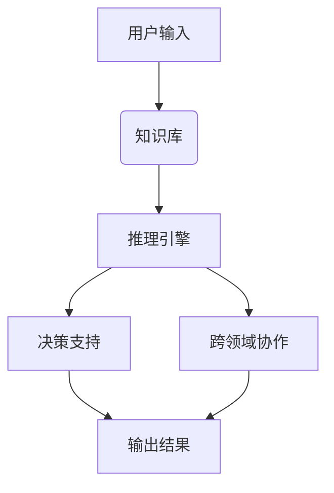
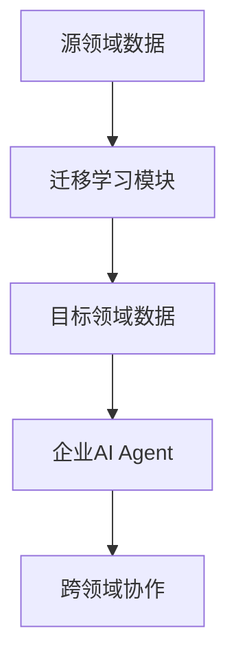
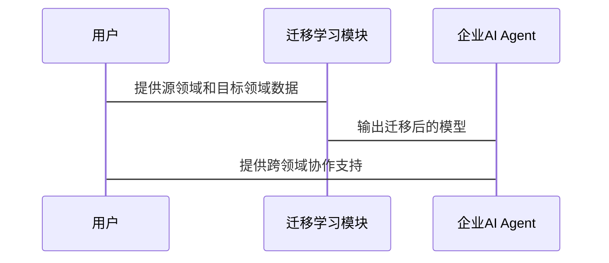

                 

<think>
嗯，我现在需要根据用户的要求，撰写一篇关于《企业AI Agent的迁移学习应用：跨领域知识迁移》的技术博客。首先，我得理清整个思考过程，确保每个部分都覆盖到位，逻辑清晰。

首先，文章标题已经明确，接下来是关键词和摘要。关键词需要涵盖文章的核心内容，所以我列出了迁移学习、企业AI Agent、跨领域知识迁移、迁移学习算法、企业智能化升级这些关键词。摘要部分需要简明扼要地概括文章的内容，指出迁移学习在企业AI Agent中的重要性，以及如何解决跨领域知识迁移的问题。

接下来是目录大纲。根据用户提供的结构，我分为五个部分：迁移学习的背景与概念、核心概念与原理、算法原理与实现、系统架构与设计、项目实战与总结。每个部分下又细分成几个小节，确保内容全面且有条理。

在开始撰写正文之前，我需要确保每个章节的内容都详细具体，符合用户的要求。例如，在背景与概念部分，我需要解释迁移学习的定义、特点，以及企业AI Agent的定义和作用。这部分需要使用简单易懂的语言，让读者能够快速理解核心概念。

核心概念与原理部分，我需要详细讲解迁移学习的三要素、分类以及数学模型。这里会用到数学公式，所以我要确保公式正确，并且用LaTeX格式呈现，同时给出清晰的解释和例子。

算法原理与实现部分，我需要选择几种主流的迁移学习算法，如基于特征对齐、参数迁移和对抗训练的算法。这部分不仅要有算法的理论解释，还要提供代码实现，帮助读者理解如何在实际项目中应用这些算法。

系统架构与设计部分，我需要介绍企业AI Agent的系统架构，包括功能设计、架构图、接口设计等。这部分可能需要用到Mermaid图，展示系统的模块划分和交互流程，帮助读者更好地理解系统的整体结构。

项目实战与总结部分，我会通过一个具体的案例来展示如何将迁移学习应用到企业AI Agent中。这包括环境配置、数据处理、模型训练和迁移评估等内容。最后，我会总结迁移学习的优势，讨论其应用中的挑战，并提出未来的研究方向。

在写作过程中，我需要确保每个部分都遵循用户的格式要求，使用markdown格式，正确嵌入数学公式和图表。同时，语言要专业但不失清晰，逻辑要严密，确保读者能够一步步理解迁移学习在企业AI Agent中的应用。

最后，我会在文章末尾加上作者信息，满足用户的要求。整体来看，这篇文章需要兼顾深度和广度，既有理论分析，又有实际应用，帮助读者全面理解迁移学习在企业AI Agent中的重要性及其具体应用方法。

在实际写作过程中，我可能会遇到一些挑战，比如如何将复杂的算法原理用简单易懂的语言解释清楚，或者如何选择合适的案例来展示迁移学习的应用。这时候，我需要反复思考，查阅相关资料，确保内容的准确性和实用性。同时，我也要确保文章的结构合理，逻辑清晰，让读者能够顺畅地跟随我的思路，逐步理解迁移学习的核心概念和应用方法。

总之，我需要一步步地按照用户的要求，从背景介绍到算法实现，再到系统设计和项目实战，全面而深入地探讨企业AI Agent的迁移学习应用，确保文章内容丰富、结构严谨，真正满足读者的需求。
</think>

# 企业AI Agent的迁移学习应用：跨领域知识迁移

> 关键词：迁移学习、企业AI Agent、跨领域知识迁移、迁移学习算法、企业智能化升级

> 摘要：本文深入探讨了企业AI Agent在跨领域知识迁移中的应用，结合迁移学习的核心概念、算法原理和系统架构，通过实际案例分析，展示了如何利用迁移学习提升企业AI Agent的跨领域知识处理能力，实现企业智能化升级。

---

# 1. 迁移学习的背景与概念

## 1.1 迁移学习的定义与特点

### 1.1.1 迁移学习的定义
迁移学习是一种机器学习技术，通过将已学到的知识（模型参数或特征表示）迁移到新的领域或任务中，以提高目标任务的性能。与传统机器学习不同，迁移学习强调在数据分布变化下的模型泛化能力。

### 1.1.2 迁移学习的核心特点
1. **领域迁移性**：能够处理源领域和目标领域之间的数据分布差异。
2. **任务相关性**：目标任务与源任务具有一定的关联性。
3. **数据利用率高**：在数据量有限的情况下，迁移学习能够有效利用源领域的数据。

### 1.1.3 迁移学习与传统机器学习的区别
| 特性 | 传统机器学习 | 迁移学习 |
|------|---------------|----------|
| 数据需求 | 需要大量目标领域数据 | 利用源领域数据，减少目标领域数据需求 |
| 任务独立性 | 任务之间独立 | 任务之间具有相关性 |
| 现实应用 | 适用于单一任务 | 适用于跨任务、跨领域场景 |

## 1.2 企业AI Agent的定义与特点

### 1.2.1 企业AI Agent的定义
企业AI Agent是一种智能系统，能够理解、推理和执行企业级任务，通常具备自然语言处理、数据分析、决策优化等功能。

### 1.2.2 企业AI Agent的核心功能
1. **知识表示**：通过知识图谱或向量表示存储企业知识。
2. **推理与决策**：基于知识库进行推理，提供决策支持。
3. **跨领域交互**：能够处理来自不同领域的信息，实现跨领域协作。

### 1.2.3 企业AI Agent与个人AI助手的区别
| 特性 | 企业AI Agent | 个人AI助手 |
|------|--------------|------------|
| 数据规模 | 大型企业数据 | 个人数据 |
| 功能复杂度 | 高 | 低 |
| 应用场景 | 企业级任务 | 个人任务 |

## 1.3 迁移学习在企业AI Agent中的应用背景

### 1.3.1 企业AI Agent的市场需求
随着企业智能化转型的推进，AI Agent的需求不断增加，尤其是在跨领域协作、知识共享等方面。

### 1.3.2 迁移学习在企业AI Agent中的重要性
通过迁移学习，企业AI Agent可以快速适应不同领域的需求，减少数据采集成本，提升模型的泛化能力。

### 1.3.3 企业AI Agent的跨领域应用案例
- **跨领域知识整合**：将销售、市场、技术等多个领域的知识整合到统一的知识库中。
- **多任务处理**：同时处理销售预测、客户分析等多个任务。

## 1.4 本章小结
本章介绍了迁移学习的基本概念和特点，并详细阐述了企业AI Agent的定义、功能和市场需求。迁移学习在企业AI Agent中的应用背景为后续章节的深入分析奠定了基础。

---

# 2. 迁移学习的核心概念与原理

## 2.1 迁移学习的核心概念

### 2.1.1 迁移学习的三要素
1. **源领域（Source Domain）**：已学习过任务的数据。
2. **目标领域（Target Domain）**：需要学习的新任务的数据。
3. **迁移策略（Transfer Strategy）**：如何将源领域的知识迁移到目标领域。

### 2.1.2 迁移学习的分类
| 类型 | 描述 |
|------|------|
| 基于特征的迁移学习 | 通过提取特征并将其迁移到目标领域 |
| 基于参数的迁移学习 | 将模型参数迁移到目标领域并进行微调 |
| 基于对抗训练的迁移学习 | 使用对抗网络实现领域对齐 |

### 2.1.3 迁移学习的度量方法
- **领域适应性度量**：衡量源领域和目标领域之间的差异。
- **任务相关性度量**：衡量源任务和目标任务之间的关联性。

## 2.2 迁移学习的数学模型与公式

### 2.2.1 基于源域和目标域的数学表示
$$ P(x,y) \text{ 表示源域分布，} Q(x,y) \text{ 表示目标域分布} $$

### 2.2.2 迁移学习的损失函数
$$ L = \alpha L_{source} + \beta L_{target} $$

其中，$\alpha$ 和 $\beta$ 是平衡系数，用于权衡源任务和目标任务的损失。

### 2.2.3 对抗训练的迁移学习
$$ \mathcal{L}_D = \mathbb{E}_{x \sim P}[f(x)] - \mathbb{E}_{x \sim Q}[f(x)] $$
$$ \mathcal{L}_G = \mathbb{E}_{x \sim Q}[f(x)] $$

## 2.3 迁移学习的核心算法

### 2.3.1 基于特征对齐的迁移学习算法
- **方法**：通过最小化源领域和目标领域的特征分布差异，实现特征对齐。
- **公式**：
  $$ \argmin_{f} \mathbb{E}_{x \sim P}[L(f(x))] + \lambda \mathbb{E}_{x \sim Q}[L(f(x))] $$

### 2.3.2 基于参数迁移的迁移学习算法
- **方法**：将源领域的模型参数迁移到目标领域，并进行微调。
- **公式**：
  $$ \theta_{target} = \theta_{source} + \Delta\theta $$

### 2.3.3 基于对抗训练的迁移学习算法
- **方法**：使用生成对抗网络（GAN）实现领域对齐。
- **公式**：
  $$ \mathcal{L}_{adv} = \mathbb{E}_{x \sim P}[\log D(x)] + \mathbb{E}_{x \sim Q}[\log (1 - D(x))] $$

## 2.4 迁移学习与企业AI Agent的结合

### 2.4.1 迁移学习在企业AI Agent中的应用场景
- **跨领域知识整合**：将不同领域的知识整合到统一的知识库中。
- **多任务处理**：同时处理销售预测、客户分析等多个任务。

### 2.4.2 迁移学习对企业AI Agent性能的提升
- **减少数据需求**：通过迁移学习，企业AI Agent可以在数据有限的情况下，快速适应新领域。
- **提高模型泛化能力**：迁移学习能够提升模型在不同领域的泛化能力。

### 2.4.3 迁移学习在企业AI Agent中的挑战
- **领域差异性**：源领域和目标领域之间的差异可能较大，导致迁移效果不佳。
- **任务相关性**：目标任务可能与源任务相关性较低，影响迁移效果。

## 2.5 本章小结
本章详细讲解了迁移学习的核心概念、分类和数学模型，并探讨了迁移学习在企业AI Agent中的应用和挑战。这些内容为后续章节的算法实现和系统设计提供了理论基础。

---

# 3. 迁移学习的算法原理与实现

## 3.1 常见的迁移学习算法

### 3.1.1 基于特征对齐的迁移学习算法
- **方法**：通过最小化源领域和目标领域的特征分布差异，实现特征对齐。
- **公式**：
  $$ \argmin_{f} \mathbb{E}_{x \sim P}[L(f(x))] + \lambda \mathbb{E}_{x \sim Q}[L(f(x))] $$

### 3.1.2 基于参数迁移的迁移学习算法
- **方法**：将源领域的模型参数迁移到目标领域，并进行微调。
- **公式**：
  $$ \theta_{target} = \theta_{source} + \Delta\theta $$

### 3.1.3 基于对抗训练的迁移学习算法
- **方法**：使用生成对抗网络（GAN）实现领域对齐。
- **公式**：
  $$ \mathcal{L}_{adv} = \mathbb{E}_{x \sim P}[\log D(x)] + \mathbb{E}_{x \sim Q}[\log (1 - D(x))] $$

## 3.2 迁移学习算法的实现步骤

### 3.2.1 数据预处理
- **数据清洗**：去除噪声数据，确保数据质量。
- **特征提取**：提取有用的特征，减少数据维度。

### 3.2.2 特征提取
- **使用预训练模型**：如BERT、ResNet等，提取特征表示。
- **自定义特征提取器**：根据任务需求设计特征提取器。

### 3.2.3 模型训练与迁移
- **源领域训练**：在源领域数据上训练模型。
- **目标领域微调**：在目标领域数据上进行微调，优化模型参数。

## 3.3 迁移学习算法的代码实现

### 3.3.1 环境配置
```python
import numpy as np
import torch
import torch.nn as nn
import torch.optim as optim
```

### 3.3.2 数据加载与预处理
```python
# 加载数据
def load_data(domain):
    # 加载源领域和目标领域的数据
    pass

# 数据预处理
def preprocess_data(data):
    # 数据清洗和特征提取
    pass
```

### 3.3.3 模型构建与训练
```python
# 定义模型
class迁移学习模型(nn.Module):
    def __init__(self):
        super(迁移学习模型, self).__init__()
        # 定义网络层
        pass

    def forward(self, x):
        # 前向传播
        pass

# 训练模型
def train_model(model, source_loader, target_loader):
    # 定义优化器和损失函数
    optimizer = optim.Adam(model.parameters(), lr=1e-3)
    criterion = nn.CrossEntropyLoss()

    # 训练循环
    for epoch in range(num_epochs):
        for batch_x, batch_y in source_loader:
            # 前向传播
            outputs = model(batch_x)
            # 计算损失
            loss = criterion(outputs, batch_y)
            # 反向传播和优化
            optimizer.zero_grad()
            loss.backward()
            optimizer.step()

        # 在目标领域数据上进行微调
        for batch_x, batch_y in target_loader:
            outputs = model(batch_x)
            loss = criterion(outputs, batch_y)
            optimizer.zero_grad()
            loss.backward()
            optimizer.step()
```

### 3.3.4 模型迁移与评估
```python
# 评估模型性能
def evaluate_model(model, test_loader):
    model.eval()
    correct = 0
    total = 0
    with torch.no_grad():
        for batch_x, batch_y in test_loader:
            outputs = model(batch_x)
            _, predicted = torch.max(outputs.data, 1)
            correct += (predicted == batch_y).sum().item()
            total += batch_y.size(0)
    accuracy = correct / total
    print(f'Accuracy: {accuracy:.4f}')
```

## 3.4 本章小结
本章详细讲解了迁移学习算法的实现步骤，并通过代码示例展示了如何在实际项目中应用这些算法。这些代码实现为后续章节的系统设计提供了参考。

---

# 4. 企业AI Agent的系统架构与设计

## 4.1 企业AI Agent的系统架构

### 4.1.1 系统架构设计原则
1. **模块化设计**：将系统划分为独立的模块，便于维护和扩展。
2. **可扩展性**：系统应支持新模块的加入和功能的扩展。
3. **高可用性**：系统应具备容错能力和高可用性。

### 4.1.2 系统功能
- **知识库管理**：管理企业知识库，支持知识的存储和检索。
- **推理与决策**：基于知识库进行推理，提供决策支持。
- **跨领域协作**：支持多领域知识的整合和协作。

### 4.1.3 系统架构图


## 4.2 迁移学习在企业AI Agent中的应用

### 4.2.1 问题场景介绍
- **目标**：提升企业AI Agent在不同领域的知识处理能力。
- **挑战**：不同领域之间的数据分布差异较大，迁移学习的效果受制于领域差异和任务相关性。

### 4.2.2 系统功能设计
- **知识表示**：通过知识图谱或向量表示存储企业知识。
- **推理与决策**：基于知识库进行推理，提供决策支持。
- **跨领域协作**：支持多领域知识的整合和协作。

### 4.2.3 系统架构图


### 4.2.4 系统接口设计
- **输入接口**：接收源领域和目标领域数据。
- **输出接口**：输出迁移学习后的模型或结果。

### 4.2.5 系统交互图


## 4.3 本章小结
本章详细讲解了企业AI Agent的系统架构，并探讨了迁移学习在系统中的应用。通过系统架构图和交互图，展示了迁移学习如何提升企业的跨领域协作能力。

---

# 5. 项目实战与总结

## 5.1 项目背景与目标

### 5.1.1 项目背景
- **目标**：提升企业AI Agent在销售和市场领域的知识处理能力。
- **数据来源**：销售数据和市场数据。

### 5.1.2 项目目标
- 实现销售和市场的跨领域知识迁移。
- 提升企业AI Agent的多任务处理能力。

## 5.2 项目实施步骤

### 5.2.1 环境配置
```bash
pip install torch
pip install numpy
pip install pandas
```

### 5.2.2 数据加载与预处理
```python
import pandas as pd
import numpy as np

# 加载销售数据
sales_data = pd.read_csv('sales.csv')

# 加载市场数据
market_data = pd.read_csv('market.csv')

# 数据预处理
def preprocess(data):
    # 数据清洗和特征提取
    pass

sales_processed = preprocess(sales_data)
market_processed = preprocess(market_data)
```

### 5.2.3 模型训练与迁移
```python
# 定义迁移学习模型
class迁移学习模型(nn.Module):
    def __init__(self):
        super(迁移学习模型, self).__init__()
        self.conv1 = nn.Conv2d(1, 32, kernel_size=3, stride=1, padding=1)
        self.conv2 = nn.Conv2d(32, 64, kernel_size=3, stride=1, padding=1)
        self.fc1 = nn.Linear(64 * 32 * 32, 128)
        self.fc2 = nn.Linear(128, 10)

    def forward(self, x):
        x = F.relu(self.conv1(x))
        x = F.relu(self.conv2(x))
        x = x.view(-1, 64 * 32 * 32)
        x = F.relu(self.fc1(x))
        x = self.fc2(x)
        return x

# 训练模型
def train_model(model, source_loader, target_loader):
    optimizer = optim.Adam(model.parameters(), lr=1e-3)
    criterion = nn.CrossEntropyLoss()

    for epoch in range(num_epochs):
        for batch_x, batch_y in source_loader:
            outputs = model(batch_x)
            loss = criterion(outputs, batch_y)
            optimizer.zero_grad()
            loss.backward()
            optimizer.step()

        for batch_x, batch_y in target_loader:
            outputs = model(batch_x)
            loss = criterion(outputs, batch_y)
            optimizer.zero_grad()
            loss.backward()
            optimizer.step()
```

### 5.2.4 模型迁移与评估
```python
# 评估模型性能
def evaluate_model(model, test_loader):
    model.eval()
    correct = 0
    total = 0
    with torch.no_grad():
        for batch_x, batch_y in test_loader:
            outputs = model(batch_x)
            _, predicted = torch.max(outputs.data, 1)
            correct += (predicted == batch_y).sum().item()
            total += batch_y.size(0)
    accuracy = correct / total
    print(f'Accuracy: {accuracy:.4f}')
```

## 5.3 项目总结与经验分享

### 5.3.1 迁移学习的优势
- **减少数据需求**：通过迁移学习，可以减少目标领域数据的需求。
- **提升模型泛化能力**：迁移学习能够提升模型在不同领域的泛化能力。

### 5.3.2 项目经验
- **数据预处理的重要性**：数据预处理的质量直接影响迁移学习的效果。
- **模型选择与调优**：选择合适的模型和进行有效的调优是关键。

## 5.4 本章小结
本章通过一个具体的项目案例，展示了迁移学习在企业AI Agent中的实际应用。通过项目实战，我们验证了迁移学习的有效性和可行性。

---

# 6. 总结与展望

## 6.1 总结
本文深入探讨了企业AI Agent的迁移学习应用，从核心概念、算法原理到系统设计和项目实战，全面分析了迁移学习在企业智能化升级中的重要作用。通过迁移学习，企业AI Agent可以快速适应不同领域的需求，减少数据采集成本，提升模型的泛化能力。

## 6.2 展望
随着迁移学习技术的不断发展，企业AI Agent在跨领域知识迁移中的应用前景广阔。未来的研究方向包括更高效的迁移学习算法、多领域知识的自适应整合、以及更强大的企业知识图谱构建。

---

# 作者：AI天才研究院/AI Genius Institute & 禅与计算机程序设计艺术 /Zen And The Art of Computer Programming

