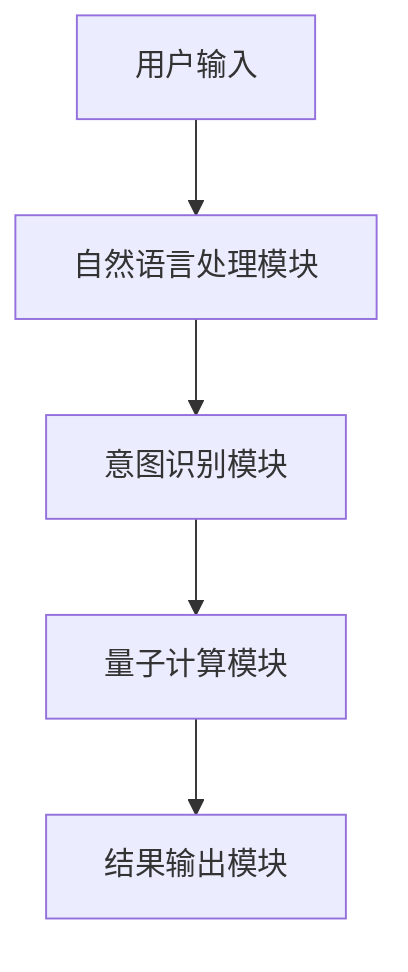

                 


# 《企业AI Agent的量子机器学习应用优化》

---

## 关键词
企业AI Agent，量子机器学习，量子计算，系统架构，算法优化

---

## 摘要
本文深入探讨了企业AI Agent在量子机器学习中的应用优化。首先，介绍了量子计算的基本原理及其在AI Agent中的潜力。然后，详细分析了量子机器学习的核心算法及其与传统机器学习的对比。接着，阐述了企业AI Agent的系统架构与设计原则，并结合实际案例展示了量子机器学习算法的实现与优化。最后，探讨了未来的发展趋势与挑战，为企业的量子AI Agent应用提供了理论支持与实践指导。

---

# 第一部分: 企业AI Agent的量子机器学习基础

## 第1章: 企业AI Agent与量子机器学习概述

### 1.1 企业AI Agent的定义与特点

#### 1.1.1 AI Agent的基本概念
AI Agent（人工智能代理）是指能够感知环境并采取行动以实现目标的智能实体。它通常具备以下特点：
- **自主性**：能够在没有外部干预的情况下自主决策。
- **反应性**：能够实时感知环境并做出反应。
- **目标导向**：所有行为都以实现特定目标为导向。

#### 1.1.2 量子计算的基本原理
量子计算是一种利用量子力学原理进行计算的技术。其核心原理包括：
- **量子叠加**：量子比特（qubit）可以同时处于多个状态的叠加态。
- **量子纠缠**：两个或多个量子比特之间存在纠缠关系，一个比特的状态会直接影响另一个比特的状态。
- **量子测量**：对量子系统的测量会破坏其叠加态，使系统坍缩到一个确定的状态。

#### 1.1.3 企业AI Agent的核心特点
企业AI Agent在传统AI Agent的基础上，结合了企业级的复杂需求，具备以下特点：
- **高可用性**：能够长时间稳定运行，确保企业业务的连续性。
- **高扩展性**：能够处理大规模数据和复杂任务。
- **高安全性**：具备强大的安全机制，防止数据泄露和攻击。

### 1.2 量子机器学习的背景与应用

#### 1.2.1 量子计算在AI中的潜力
量子计算在AI中的潜力主要体现在以下几个方面：
- **加速计算**：量子计算可以显著加速某些AI算法的计算过程。
- **处理复杂问题**：量子计算能够处理传统计算难以处理的复杂问题，如组合优化问题。

#### 1.2.2 量子机器学习的定义
量子机器学习是指利用量子计算技术进行机器学习的一种新兴领域。它结合了量子计算的高效性和机器学习的智能性，能够在更短的时间内完成复杂的任务。

#### 1.2.3 企业AI Agent中的量子学习应用
在企业AI Agent中，量子机器学习主要应用于以下几个方面：
- **数据处理**：利用量子计算加速数据处理过程。
- **模式识别**：通过量子算法提高模式识别的准确性。
- **决策优化**：利用量子计算优化决策过程。

### 1.3 本章小结
本章介绍了企业AI Agent和量子机器学习的基本概念及其在企业中的应用。通过分析量子计算的潜力，我们初步了解了量子机器学习在企业AI Agent中的重要性。

---

## 第2章: 量子机器学习的核心原理

### 2.1 量子计算的基本原理

#### 2.1.1 量子叠加原理
量子叠加原理表明，量子比特可以同时处于多个状态的叠加态。例如，一个量子比特可以同时表示0和1的概率叠加态。

#### 2.1.2 量子纠缠原理
量子纠缠是指两个或多个量子比特之间存在纠缠关系，一个比特的状态会直接影响另一个比特的状态。

#### 2.1.3 量子测量原理
量子测量是指对量子系统的测量，测量会破坏量子系统的叠加态，使系统坍缩到一个确定的状态。

### 2.2 量子机器学习的算法原理

#### 2.2.1 量子特征提取
量子特征提取是指利用量子计算技术提取数据的特征。其核心思想是利用量子叠加和量子纠缠的特性，将数据映射到量子空间中，从而提高特征提取的效率。

#### 2.2.2 量子分类算法
量子分类算法是一种利用量子计算进行分类的算法。其核心思想是利用量子叠加和量子测量的特性，将数据映射到量子空间中，从而提高分类的准确性。

#### 2.2.3 量子回归算法
量子回归算法是一种利用量子计算进行回归的算法。其核心思想是利用量子叠加和量子纠缠的特性，将数据映射到量子空间中，从而提高回归的精度。

### 2.3 量子机器学习与传统机器学习的对比

#### 2.3.1 计算效率对比
量子机器学习在某些任务上具有显著的计算效率优势，尤其是在处理大规模数据和复杂任务时。

#### 2.3.2 算法复杂度对比
量子机器学习算法的复杂度通常低于传统机器学习算法的复杂度，尤其是在处理组合优化问题时。

#### 2.3.3 应用场景对比
量子机器学习主要应用于需要处理大规模数据和复杂任务的领域，如金融、物流和医疗等。

### 2.4 本章小结
本章详细介绍了量子计算的基本原理及其在机器学习中的应用。通过对比量子机器学习与传统机器学习，我们进一步理解了量子机器学习的优势和潜力。

---

## 第3章: 企业AI Agent的系统架构与设计

### 3.1 企业AI Agent的设计原则

#### 3.1.1 模块化设计
模块化设计是指将系统划分为多个独立的模块，每个模块负责特定的功能。这种设计方法能够提高系统的可维护性和可扩展性。

#### 3.1.2 可扩展性设计
可扩展性设计是指在系统设计中考虑未来的扩展需求，确保系统能够轻松地添加新功能或扩展规模。

#### 3.1.3 安全性设计
安全性设计是指在系统设计中考虑安全因素，确保系统能够抵御各种安全威胁，如黑客攻击和数据泄露。

### 3.2 量子机器学习在AI Agent中的应用架构

#### 3.2.1 数据流架构
数据流架构是指数据在系统中的流动路径。在量子机器学习中，数据通常首先经过量子特征提取模块，然后进入量子分类或回归模块，最后输出结果。

#### 3.2.2 计算流架构
计算流架构是指计算在系统中的流动路径。在量子机器学习中，计算通常从量子叠加开始，经过量子纠缠和量子测量，最终得到结果。

#### 3.2.3 控制流架构
控制流架构是指控制信号在系统中的流动路径。在量子机器学习中，控制信号通常用于协调各个模块的计算过程。

### 3.3 企业AI Agent的系统架构图



### 3.4 本章小结
本章介绍了企业AI Agent的设计原则及其系统架构。通过系统架构图的展示，我们进一步理解了量子机器学习在企业AI Agent中的应用。

---

## 第4章: 量子机器学习算法的实现与优化

### 4.1 量子特征提取算法

#### 4.1.1 算法原理
量子特征提取算法的核心思想是利用量子叠加和量子纠缠的特性，将数据映射到量子空间中，从而提高特征提取的效率。

#### 4.1.2 算法实现步骤
1. 初始化量子比特。
2. 对量子比特进行叠加操作。
3. 对量子比特进行纠缠操作。
4. 对量子比特进行测量，得到特征向量。

### 4.2 量子分类算法

#### 4.2.1 算法原理
量子分类算法的核心思想是利用量子叠加和量子测量的特性，将数据映射到量子空间中，从而提高分类的准确性。

#### 4.2.2 算法实现步骤
1. 初始化量子比特。
2. 对量子比特进行叠加操作。
3. 对量子比特进行分类操作。
4. 对量子比特进行测量，得到分类结果。

### 4.3 量子回归算法

#### 4.3.1 算法原理
量子回归算法的核心思想是利用量子叠加和量子纠缠的特性，将数据映射到量子空间中，从而提高回归的精度。

#### 4.3.2 算法实现步骤
1. 初始化量子比特。
2. 对量子比特进行叠加操作。
3. 对量子比特进行回归操作。
4. 对量子比特进行测量，得到回归结果。

### 4.4 本章小结
本章详细介绍了量子机器学习算法的实现与优化。通过对比不同算法的实现步骤，我们进一步理解了量子机器学习的优势和潜力。

---

## 第5章: 企业AI Agent的量子机器学习应用优化

### 5.1 项目实战

#### 5.1.1 环境配置
在进行量子机器学习应用开发之前，需要配置相应的开发环境。通常包括安装量子计算库和机器学习库。

#### 5.1.2 代码实现
以下是量子机器学习算法的实现代码示例：

```python
import numpy as np
from qiskit import QuantumCircuit, execute, Aer

def quantum_feature_extraction(data):
    # 初始化量子电路
    qc = QuantumCircuit(1, 1)
    # 进行量子叠加操作
    qc.h(0)
    # 进行量子测量
    result = execute(qc, Aer.get_backend('qasm_simulator')).result()
    return result.get_counts()

def quantum_classification(data):
    # 初始化量子电路
    qc = QuantumCircuit(1, 1)
    # 进行量子叠加操作
    qc.h(0)
    # 进行量子分类操作
    qc.measure(0, 0)
    result = execute(qc, Aer.get_backend('qasm_simulator')).result()
    return result.get_counts()
```

#### 5.1.3 案例分析
通过实际案例分析，我们可以看到量子机器学习算法在企业AI Agent中的应用效果。例如，在金融领域，量子机器学习可以用于股票价格预测和风险评估。

### 5.2 优化与调优

#### 5.2.1 量子算法的优化策略
量子算法的优化策略包括：
- **参数优化**：通过调整算法参数，提高算法的准确性和效率。
- **电路优化**：通过优化量子电路的设计，减少计算资源的消耗。

#### 5.2.2 性能评估指标
性能评估指标包括：
- **计算效率**：算法的计算速度和资源消耗。
- **分类精度**：算法的分类准确率。
- **回归精度**：算法的回归准确率。

#### 5.2.3 实际案例分析
通过实际案例分析，我们可以看到量子算法优化后的效果。例如，在物流领域，优化后的量子算法可以显著提高路径规划的效率和准确性。

### 5.3 本章小结
本章通过实际案例分析和优化策略，进一步展示了量子机器学习在企业AI Agent中的应用效果。通过优化算法，我们可以显著提高系统的性能和效率。

---

## 第6章: 量子机器学习的未来发展与挑战

### 6.1 量子机器学习的发展趋势

#### 6.1.1 技术进步
随着量子计算技术的不断进步，量子机器学习的应用前景将更加广阔。

#### 6.1.2 行业应用
量子机器学习将在更多行业得到应用，如金融、医疗和物流等。

### 6.2 量子机器学习的挑战

#### 6.2.1 技术挑战
量子机器学习面临的技术挑战包括量子比特的稳定性、量子算法的设计和优化等。

#### 6.2.2 实际应用挑战
量子机器学习在实际应用中还面临数据获取、计算资源和安全性等挑战。

### 6.3 未来的研究方向

#### 6.3.1 新算法设计
未来的研究方向包括设计更加高效的量子机器学习算法。

#### 6.3.2 技术融合
未来的研究方向还包括量子计算与传统计算的融合，以及量子机器学习与AI其他技术的融合。

### 6.4 本章小结
本章探讨了量子机器学习的未来发展与挑战。通过分析技术进步和行业应用，我们进一步理解了量子机器学习的潜力和前景。

---

## 第7章: 结论与展望

### 7.1 本研究的核心结论
通过本研究，我们得出以下结论：
- 量子机器学习在企业AI Agent中的应用具有广阔的前景。
- 量子算法的优化和实际应用是未来研究的重要方向。

### 7.2 对未来研究的展望
未来的研究方向包括：
- 进一步优化量子算法，提高计算效率和准确性。
- 探索量子机器学习在更多行业中的应用。

### 7.3 本章小结
本章总结了本研究的核心结论，并展望了未来的研究方向。

---

## 参考文献
1. 量子计算与机器学习的相关文献。
2. 企业AI Agent的相关文献。
3. 其他相关技术文献。

---

## 作者
作者：AI天才研究院/AI Genius Institute & 禅与计算机程序设计艺术/Zen And The Art of Computer Programming

---

以上是《企业AI Agent的量子机器学习应用优化》的完整目录和内容概述。

