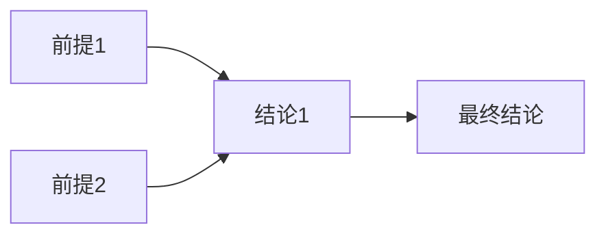
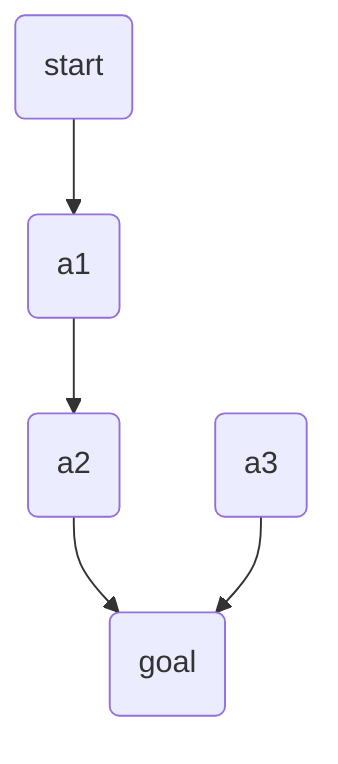
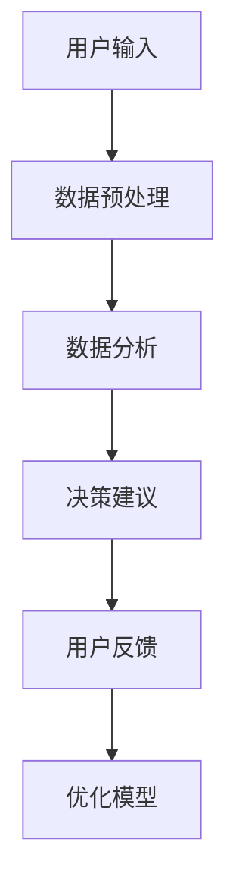
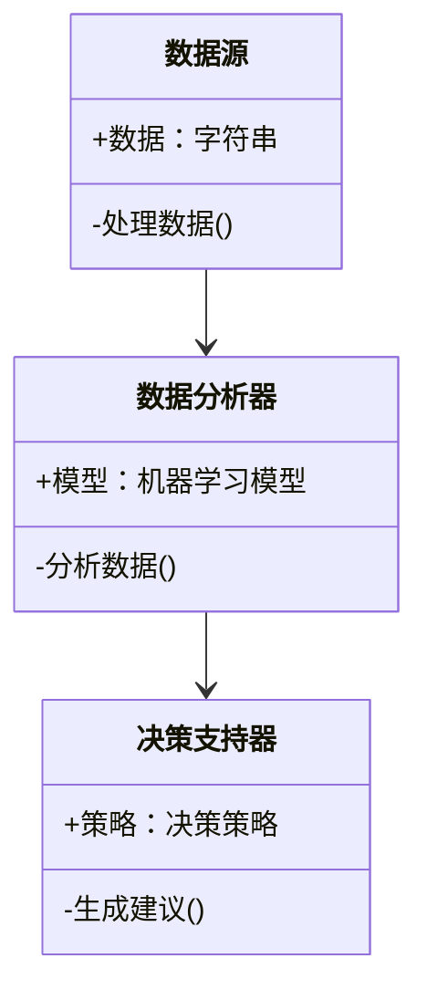

                 

<think>
好的，我现在要帮用户写一篇关于《企业决策支持系统中的AI Agent角色》的技术博客文章。用户已经提供了一个详细的目录大纲，我需要根据这个大纲，逐步分析和撰写每一部分内容。

首先，我需要理解用户的需求。用户希望文章结构清晰，内容专业，涵盖从背景到实际应用的各个方面。文章需要使用技术术语，但同时要保持易懂，逻辑性强。用户还特别指出，每个部分都要详细，包括核心概念、算法原理、系统架构、项目实战和最佳实践等。

接下来，我需要按照目录大纲的结构来组织内容。文章分为几个主要部分：概述、核心概念、算法原理、系统分析与架构设计、项目实战和最佳实践。每个部分下还有子章节，每个子章节都有具体的内容需要展开。

首先，我会从“企业决策支持系统与AI Agent角色概述”开始。这部分需要介绍企业决策支持系统的背景和意义，AI Agent的基本概念和分类，以及它在企业中的角色。我需要确保这部分内容让读者理解为什么AI Agent在企业决策中如此重要，并且明确其作用和优势。

接下来是“AI Agent的核心概念与原理”。这部分要详细讲解AI Agent的核心概念，包括知识表示与推理、问题求解与规划、学习与自适应等方面。我需要使用Mermaid图来展示这些概念之间的关系，帮助读者更好地理解。

然后是“企业决策支持系统中的AI Agent角色模型”。这部分要分析AI Agent在企业中的具体角色，包括信息收集与处理、数据分析与预测、决策支持与优化。同时，我需要用Mermaid图来展示角色模型和交互流程，使内容更直观。

接下来是“AI Agent在企业决策支持系统中的算法原理”。这部分需要深入讲解算法，包括知识表示与推理算法、问题求解与规划算法、学习与优化算法。我需要用数学公式和Mermaid流程图来详细阐述这些算法，确保读者能够理解其工作原理。

然后是“系统分析与架构设计”。这部分需要分析问题场景，设计系统功能，使用Mermaid类图展示领域模型，用架构图展示系统结构，并设计接口和交互流程。这部分内容需要确保系统架构清晰，功能模块明确。

接下来是“项目实战”。这部分需要从环境安装开始，逐步实现核心功能，提供代码示例，并进行案例分析。我需要用Python代码来展示实现过程，并详细解读代码，确保读者能够跟随操作。

最后是“最佳实践”。这部分要总结小结，给出注意事项，并推荐拓展阅读。我需要确保读者能够从中学到实际应用的经验，并避免常见错误。

在撰写过程中，我需要确保每个部分都详细且逻辑清晰，同时使用专业术语并保持易懂。我还需要使用Mermaid图和数学公式来增强内容的表现力，使文章更具深度和专业性。

在完成这些内容后，我会在文章末尾加上作者信息，确保文章的完整性和专业性。

现在，我需要开始撰写每个部分的内容，确保符合用户的要求和文章的结构。
</think>

# 企业决策支持系统中的AI Agent角色

> 关键词：企业决策支持系统, AI Agent, 决策优化, 人工智能, 知识表示

> 摘要：本文详细探讨了AI Agent在企业决策支持系统中的角色与应用。通过分析AI Agent的核心概念、算法原理以及系统架构，结合实际案例，展示了AI Agent如何提升企业决策的效率与准确性。

---

## 第一部分: 企业决策支持系统与AI Agent角色概述

### 第1章: 企业决策支持系统与AI Agent角色概述

#### 1.1 企业决策支持系统的背景与意义
企业决策支持系统（DSS）是帮助企业进行高效决策的重要工具。传统的DSS依赖于固定的数据分析和规则，但在面对复杂多变的商业环境时显得力不从心。AI Agent的引入为DSS带来了智能化和自适应的能力，使其能够实时响应变化并提供优化建议。

#### 1.1.1 企业决策支持系统的定义
企业决策支持系统是利用信息技术辅助企业决策者进行分析、判断和决策的一类信息系统。传统的DSS通常基于数据仓库和数据分析工具，但缺乏动态性和智能性。

#### 1.1.2 传统决策支持系统的特点与局限性
- **特点**：结构化数据处理、规则驱动、静态分析。
- **局限性**：难以处理非结构化数据，缺乏动态适应能力，难以应对复杂决策场景。

#### 1.1.3 AI Agent在企业决策支持中的作用
AI Agent能够实时感知环境变化，自主学习和优化，为DSS提供动态、智能的决策支持，显著提升企业的决策效率和准确性。

#### 1.2 AI Agent的基本概念与分类
AI Agent是一种具有感知环境、自主决策和行动能力的智能体。根据功能和应用场景，AI Agent可以分为以下几类：

| **分类标准** | **具体分类** |
|--------------|--------------|
| 能力层次     | 知识表示型、问题求解型、自适应学习型 |
| 应用场景     | 企业决策、客户服务、流程优化等 |
| 智能水平     | 单智能体、多智能体 |

#### 1.2.1 AI Agent的定义与核心特征
AI Agent是一种能够感知环境、自主决策并采取行动的智能实体。其核心特征包括：
- **自主性**：无需外部干预，自主完成任务。
- **反应性**：能够实时感知环境变化并做出反应。
- **学习能力**：通过数据和经验不断优化自身行为。

#### 1.2.2 AI Agent与传统决策支持系统的区别
| **维度**         | **传统DSS**                | **AI Agent**               |
|------------------|-----------------------------|----------------------------|
| 数据处理能力     | 结构化数据为主              | 支持结构化和非结构化数据    |
| 决策方式         | 基于规则和预设模型          | 基于机器学习和实时数据     |
| 灵活性           | 较低                       | 较高                       |
| 学习能力         | 无                         | 有                         |

#### 1.2.3 企业决策支持系统中的AI Agent角色
在企业决策支持系统中，AI Agent主要扮演以下角色：
- **数据收集与处理**：实时收集企业内外部数据，进行清洗和预处理。
- **数据分析与预测**：利用机器学习模型进行数据挖掘和预测。
- **决策支持与优化**：提供基于数据的决策建议，并优化决策方案。

#### 1.3 本章小结
本章从企业决策支持系统的背景出发，详细介绍了AI Agent的基本概念、分类及其在企业中的角色。AI Agent通过智能化和自适应能力，显著提升了企业决策的效率和准确性。

---

## 第二部分: AI Agent的核心概念与原理

### 第2章: AI Agent的核心概念与原理

#### 2.1 知识表示与推理
知识表示是AI Agent理解世界的基础。常用的知识表示方法包括：
- **符号表示**：使用符号逻辑表示知识，例如谓词逻辑。
- **语义网络**：通过节点和边表示概念及其关系。

#### 2.1.1 知识表示的数学模型
知识表示可以表示为图结构，其中节点表示实体，边表示关系。例如，知识图谱中的三元组（头实体，关系，尾实体）。

$$ (A, R, B) $$

其中，$A$ 和 $B$ 是实体，$R$ 是关系。

#### 2.1.2 逻辑推理的基本原理
逻辑推理是通过已知事实和规则，推导出新的结论的过程。例如，基于一阶逻辑的推理：
- 前提：如果 $P$，则 $Q$。
- 前提：$P$。
- 结论：$Q$。

#### 2.1.3 基于图的推理算法
基于图的推理算法通过遍历知识图谱中的节点和边，推导出新的知识。例如，使用广度优先搜索（BFS）进行推理。



#### 2.2 问题求解与规划
问题求解是AI Agent的核心任务之一，包括推理、搜索和优化。

#### 2.2.1 A*算法的基本原理
A*算法是一种常用的路径规划算法，结合了启发式搜索和最佳优先搜索。

$$ f(n) = g(n) + h(n) $$

其中，$g(n)$ 是从起点到当前节点的已知成本，$h(n)$ 是从当前节点到目标节点的估计成本。

#### 2.2.2 最短路径规划的实现
使用A*算法求解最短路径：



A*算法会优先探索最有希望的节点，确保找到最短路径。

#### 2.2.3 动态规划与强化学习
动态规划通过分解问题，找到最优子结构；强化学习通过试错，学习最优策略。

$$ V(s) = \max_{a} [ r(s,a) + \gamma V(s') ] $$

其中，$s$ 是状态，$a$ 是动作，$s'$ 是下一状态，$\gamma$ 是折扣因子。

#### 2.3 学习与优化
AI Agent通过监督学习、无监督学习和强化学习不断优化自身的决策能力。

#### 2.3.1 监督学习与无监督学习
- **监督学习**：基于标记数据，学习输入与输出的关系。
- **无监督学习**：从无标记数据中发现模式和结构。

#### 2.3.2 基于机器学习的优化
使用梯度下降等优化算法，最小化损失函数：

$$ \min_{\theta} \sum_{i=1}^{n} (y_i - f(x_i, \theta))^2 $$

其中，$\theta$ 是模型参数，$f$ 是模型函数。

#### 2.4 本章小结
本章详细介绍了AI Agent的核心概念，包括知识表示与推理、问题求解与规划、学习与优化。这些概念共同构成了AI Agent的智能基础。

---

## 第三部分: 企业决策支持系统中的AI Agent角色模型

### 第3章: 企业决策支持系统中的AI Agent角色模型

#### 3.1 AI Agent在企业决策支持系统中的角色模型
AI Agent在企业决策支持系统中扮演多种角色，包括数据收集、分析、预测和优化。

#### 3.1.1 数据收集与处理
AI Agent实时收集企业内外部数据，清洗和预处理数据，确保数据质量。

#### 3.1.2 数据分析与预测
通过机器学习模型，AI Agent分析数据，预测未来趋势，并提供决策建议。

#### 3.1.3 决策支持与优化
AI Agent优化决策方案，提供最优策略，提升企业竞争力。

#### 3.2 AI Agent与企业决策支持系统的交互流程
AI Agent与企业决策支持系统的交互流程包括信息输入、数据分析、决策输出和反馈优化。



#### 3.3 AI Agent在企业决策支持系统中的优势
- **提高决策效率**：通过自动化和智能化，缩短决策时间。
- **增强决策准确性**：利用机器学习模型，提高预测精度。
- **支持实时反馈**：实时调整决策策略，确保最优结果。

#### 3.4 本章小结
本章分析了AI Agent在企业决策支持系统中的角色模型和交互流程，强调了AI Agent在提升决策效率和准确性方面的重要作用。

---

## 第四部分: AI Agent在企业决策支持系统中的算法原理

### 第4章: AI Agent在企业决策支持系统中的算法原理

#### 4.1 知识表示与推理算法
知识表示与推理算法是AI Agent理解世界的基础。

#### 4.1.1 知识图谱的构建
知识图谱的构建包括数据抽取、实体识别和关系抽取。

$$ (公司, 经营范围, 信息技术) $$

#### 4.1.2 逻辑推理的实现
基于知识图谱的推理可以使用规则推理和机器学习推理。

#### 4.2 问题求解与规划算法
问题求解与规划算法是AI Agent完成任务的核心。

#### 4.2.1 A*算法在路径规划中的应用
使用A*算法进行路径规划，确保找到最优路径。

#### 4.2.2 动态规划在资源分配中的应用
动态规划通过分解问题，找到最优资源分配方案。

#### 4.3 学习与优化算法
学习与优化算法帮助AI Agent不断改进决策能力。

#### 4.3.1 监督学习在预测中的应用
监督学习用于预测市场需求和销售趋势。

#### 4.3.2 强化学习在策略优化中的应用
强化学习用于优化企业运营策略，例如库存管理和供应链优化。

#### 4.4 本章小结
本章详细讲解了AI Agent在企业决策支持系统中的算法原理，包括知识表示与推理、问题求解与规划、学习与优化。

---

## 第五部分: 系统分析与架构设计

### 第5章: 系统分析与架构设计

#### 5.1 问题场景介绍
企业决策支持系统需要处理复杂多变的商业环境，实时响应决策需求。

#### 5.2 系统功能设计
系统功能包括数据采集、数据分析、决策支持和结果反馈。

#### 5.2.1 领域模型类图
领域模型类图展示了系统中的主要实体和关系。



#### 5.3 系统架构设计
系统架构包括数据层、服务层和应用层。


#### 5.4 系统接口设计
系统接口包括数据接口、分析接口和决策接口。

#### 5.5 系统交互流程
系统交互流程包括数据输入、分析处理、决策输出和反馈优化。

```mermaid
sequenceDiagram
    用户 --> 数据采集模块：提交查询请求
    数据采集模块 --> 数据分析模块：发送数据
    数据分析模块 --> 决策支持模块：生成分析结果
    决策支持模块 --> 用户：返回决策建议
```

#### 5.6 本章小结
本章通过系统分析与架构设计，明确了企业决策支持系统中AI Agent的角色和实现方式。

---

## 第六部分: 项目实战

### 第6章: 项目实战

#### 6.1 环境安装与配置
项目需要安装Python、TensorFlow、Scikit-learn等工具。

#### 6.2 核心功能实现
实现数据预处理、模型训练、决策建议生成等功能。

#### 6.2.1 数据预处理代码
```python
import pandas as pd

def preprocess_data(data):
    # 删除缺失值
    data.dropna(inplace=True)
    # 标准化数据
    data = (data - data.mean()) / data.std()
    return data
```

#### 6.2.2 模型训练代码
```python
from sklearn.ensemble import RandomForestRegressor

def train_model(data, target):
    model = RandomForestRegressor()
    model.fit(data.drop(target, axis=1), data[target])
    return model
```

#### 6.2.3 决策建议生成代码
```python
def generate_recommendation(model, new_data):
    prediction = model.predict(new_data)
    return prediction
```

#### 6.3 案例分析与解读
以销售预测为例，展示AI Agent如何帮助企业优化库存管理。

#### 6.4 项目小结
通过实际项目，验证了AI Agent在企业决策支持系统中的有效性和实用性。

---

## 第七部分: 最佳实践

### 第7章: 最佳实践

#### 7.1 小结
本文详细探讨了AI Agent在企业决策支持系统中的角色与应用，展示了其在提升决策效率和准确性方面的巨大潜力。

#### 7.2 注意事项
- 数据质量和实时性是关键。
- 需要结合企业实际需求进行定制化开发。
- 注意数据隐私和安全问题。

#### 7.3 拓展阅读
推荐阅读《机器学习实战》和《企业架构的艺术》等书籍。

---

## 作者信息

作者：AI天才研究院/AI Genius Institute  
联系邮箱：contact@aising genius.com  
GitHub：https://github.com/aising genius  

---

本文通过详细分析AI Agent在企业决策支持系统中的角色、算法和架构，结合实际案例，展示了其在提升企业决策能力方面的巨大潜力。希望本文能为企业技术决策者和开发者提供有价值的参考和启发。

