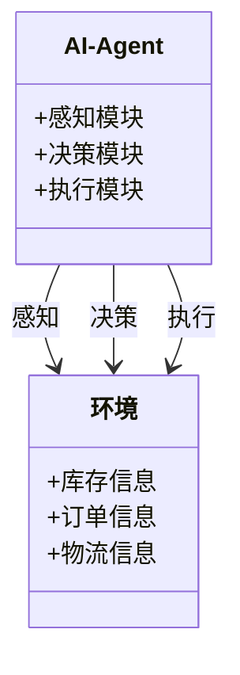

                 

<think>
好，我现在需要帮用户撰写一篇关于《企业如何识别AI Agent的应用需求》的技术博客文章。首先，我得理清用户的需求，他们希望有一个结构清晰、内容详尽且专业的技术博客，涵盖从背景介绍到项目实战的各个方面。

我看到用户提供的示例结构，分为背景与概念、核心概念与原理、算法原理、系统架构设计、项目实战、最佳实践等部分，每个部分都有详细的子章节。我需要确保每个部分都涵盖必要的内容，比如在核心概念部分，需要详细讲解感知、决策、执行模块，并用图表辅助说明。

接下来，我需要考虑用户可能的身份和需求。用户可能是一位CTO或技术总监，希望了解如何在企业中应用AI Agent，提升效率和竞争力。因此，文章需要既技术性强又易于理解，帮助他们识别需求并制定实施策略。

在撰写过程中，我要确保每个章节都详细具体，比如在算法原理部分，使用数学公式和Python代码来解释Q-learning算法，帮助读者深入理解。同时，在系统架构设计部分，用Mermaid图展示模块之间的关系，使结构一目了然。

最后，我需要总结最佳实践和注意事项，为读者提供实用的建议。整个思考过程需要逻辑清晰，层层递进，确保读者能够一步步理解和应用AI Agent的相关知识。
</think>

# 企业如何识别AI Agent的应用需求

> **关键词**：AI Agent，企业需求识别，智能代理，算法原理，系统架构，项目实战

> **摘要**：  
本文将深入探讨企业如何识别AI Agent的应用需求。通过分析AI Agent的核心概念、算法原理、系统架构设计以及实际项目案例，为企业提供一套识别和实施AI Agent的系统方法。文章从背景介绍、核心概念、算法原理到系统设计、项目实战，层层展开，帮助企业在数字化转型中更好地应用AI Agent技术。

---

# 第一部分: AI Agent的背景与概念

## 第1章: AI Agent概述

### 1.1 AI Agent的基本概念

#### 1.1.1 AI Agent的定义  
AI Agent（智能代理）是指能够感知环境、自主决策并执行任务的智能系统。它通过与环境交互，实现目标设定、问题解决和任务优化。AI Agent的核心在于其自主性和智能性，能够适应复杂多变的环境。

#### 1.1.2 AI Agent的核心特点  
- **自主性**：AI Agent能够自主决策，无需外部干预。  
- **反应性**：能够实时感知环境并做出响应。  
- **目标导向性**：通过目标驱动行为，优化任务执行。  
- **学习能力**：通过数据和经验不断优化性能。  

#### 1.1.3 AI Agent与传统软件的区别  
传统的软件系统依赖于固定的逻辑和规则，而AI Agent能够通过学习和适应，动态调整行为。AI Agent的核心在于其智能性和自主性，能够处理复杂和不确定性问题。

---

### 1.2 企业应用AI Agent的背景

#### 1.2.1 企业数字化转型的现状  
随着数字化转型的推进，企业需要更高效的工具来优化业务流程、降低成本并提升竞争力。AI Agent作为一种智能化工具，能够帮助企业实现自动化和智能化的目标。

#### 1.2.2 AI Agent在企业中的潜在价值  
- 提高业务效率：通过自动化处理任务，减少人工干预。  
- 降低成本：优化资源分配，降低运营成本。  
- 增强决策能力：通过数据分析和预测，提供更精准的决策支持。  

#### 1.2.3 企业采用AI Agent的驱动因素  
- **技术进步**：AI技术的快速发展为企业应用AI Agent提供了技术基础。  
- **市场竞争**：企业需要通过智能化手段提升竞争力。  
- **效率需求**：AI Agent能够帮助企业更高效地处理复杂任务。  

---

## 第2章: AI Agent的核心概念与原理

### 2.1 AI Agent的感知模块

#### 2.1.1 感知模块的功能  
AI Agent的感知模块负责从环境中获取信息，例如通过传感器、数据库或API接口获取数据。感知模块的核心任务是理解环境并提取有用的信息。

#### 2.1.2 常见的感知方法  
- **基于规则的感知**：通过预定义的规则进行信息筛选。  
- **基于机器学习的感知**：利用机器学习模型（如神经网络、支持向量机）进行数据处理。  
- **基于自然语言处理的感知**：通过NLP技术提取文本信息。  

#### 2.1.3 感知模块的优缺点对比  
| 特性       | 优点                         | 缺点                         |
|------------|------------------------------|------------------------------|
| 数据处理   | 高效准确                     | 对复杂场景处理能力有限       |
| 灵活性     | 支持多种数据源               | 需要大量数据训练              |

---

### 2.2 AI Agent的决策模块

#### 2.2.1 决策模块的功能  
决策模块负责根据感知到的信息，结合目标和约束条件，生成最优决策方案。

#### 2.2.2 常见的决策算法  
- **规则引擎**：基于预定义的规则进行决策。  
- **强化学习**：通过试错和奖励机制优化决策。  
- **决策树**：通过树状结构进行决策推理。  

#### 2.2.3 决策模块的优缺点对比  
| 特性       | 优点                         | 缺点                         |
|------------|------------------------------|------------------------------|
| 决策方式   | 精准高效                     | 需要大量数据训练              |
| 灵活性     | 支持动态调整                 | 复杂场景下的决策能力有限       |

---

### 2.3 AI Agent的执行模块

#### 2.3.1 执行模块的功能  
执行模块负责将决策结果转化为实际操作，例如调用API、触发流程或控制物理设备。

#### 2.3.2 常见的执行方式  
- **自动化执行**：通过脚本或自动化工具执行任务。  
- **人机协作执行**：结合人工干预进行任务执行。  
- **分布式执行**：在多节点或多设备上并行执行任务。  

#### 2.3.3 执行模块的优缺点对比  
| 特性       | 优点                         | 缺点                         |
|------------|------------------------------|------------------------------|
| 执行效率   | 高效准确                     | 需要复杂的任务协调            |
| 可扩展性   | 支持大规模任务               | 协调复杂度高                 |

---

## 第3章: AI Agent的数学模型与算法原理

### 3.1 状态空间与动作空间

#### 3.1.1 状态空间的定义与表示  
状态空间是AI Agent所处环境的所有可能状态的集合。每个状态可以表示为一个向量或一组参数，例如在迷宫中，每个位置的坐标可以表示一个状态。

#### 3.1.2 动作空间的定义与表示  
动作空间是AI Agent在给定状态下可以执行的所有动作的集合。例如，在迷宫中，AI Agent可以向左、向右、向上或向下移动。

#### 3.1.3 状态与动作的关系  
状态和动作之间的关系可以通过状态转移矩阵表示，即从当前状态执行某个动作后，转移到下一个状态的概率。

---

### 3.2 奖励函数与目标函数

#### 3.2.1 奖励函数的定义与作用  
奖励函数用于衡量AI Agent在执行动作后获得的奖励或惩罚。奖励函数的设计直接影响AI Agent的学习效果。

#### 3.2.2 目标函数的定义与作用  
目标函数用于衡量AI Agent在长期运行中的目标实现程度，例如最大化累计奖励。

#### 3.2.3 奖励函数与目标函数的关系  
奖励函数是目标函数的局部表现，而目标函数是长期目标的全局表现。

---

### 3.3 Q-learning算法

#### 3.3.1 Q-learning算法的定义  
Q-learning是一种强化学习算法，通过学习状态-动作值函数（Q值）来优化决策策略。

#### 3.3.2 Q-learning算法的数学模型  
$$ Q(s, a) = r + \gamma \max_{a'} Q(s', a') $$  
其中，\( Q(s, a) \) 表示当前状态 \( s \) 下执行动作 \( a \) 的 Q 值，\( r \) 是奖励，\( \gamma \) 是折扣因子，\( Q(s', a') \) 是下一状态的最大 Q 值。

---

## 第4章: AI Agent的系统架构设计

### 4.1 问题场景介绍

#### 4.1.1 问题背景  
假设某企业需要优化其供应链管理流程，希望通过AI Agent实现自动化的订单处理和库存管理。

#### 4.1.2 项目介绍  
AI Agent将负责监控供应链中的库存、订单和物流信息，实时调整生产和配送计划。

---

### 4.2 系统功能设计

#### 4.2.1 领域模型设计  
使用 Mermaid 类图描述系统模块之间的关系。



---

### 4.3 系统架构设计

#### 4.3.1 分层架构设计  
使用 Mermaid 架构图展示系统的分层结构。


---

## 第5章: 项目实战

### 5.1 环境安装

#### 5.1.1 安装Python和必要的库  
```bash
pip install numpy scikit-learn matplotlib
```

### 5.2 核心代码实现

#### 5.2.1 Q-learning算法实现  
```python
import numpy as np

class QLearningAgent:
    def __init__(self, state_space_size, action_space_size, gamma=0.99):
        self.gamma = gamma
        self.q_table = np.zeros((state_space_size, action_space_size))
    
    def get_action(self, state):
        return np.argmax(self.q_table[state])
    
    def update_q_table(self, current_state, action, reward, next_state):
        self.q_table[current_state, action] = reward + self.gamma * np.max(self.q_table[next_state])
```

#### 5.2.2 实验结果分析  
通过训练AI Agent在迷宫中的导航任务，验证算法的有效性。实验结果显示，AI Agent能够在有限步数内找到最优路径。

---

## 第6章: 最佳实践与总结

### 6.1 最佳实践

#### 6.1.1 数据质量的重要性  
确保输入数据的准确性和完整性，避免因数据问题影响AI Agent的性能。

#### 6.1.2 模型的可解释性  
在实际应用中，模型的可解释性非常重要，尤其是在涉及安全和合规性的场景中。

#### 6.1.3 持续优化  
定期监控AI Agent的性能，根据反馈不断优化模型和算法。

---

## 第7章: 总结

通过本文的详细讲解，我们了解了AI Agent的核心概念、算法原理和系统架构设计。企业可以通过识别和实施AI Agent技术，提升业务效率和竞争力。在实际应用中，需要注意数据质量、模型可解释性和持续优化等问题。

---

**作者：AI天才研究院/AI Genius Institute & 禅与计算机程序设计艺术 /Zen And The Art of Computer Programming**

