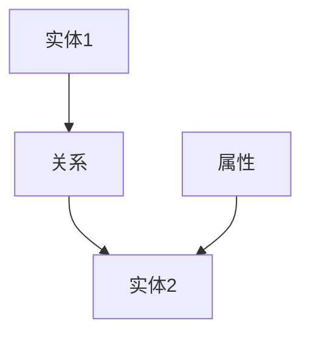
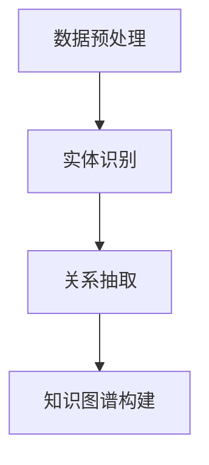
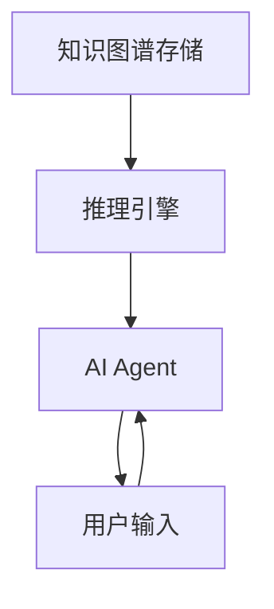
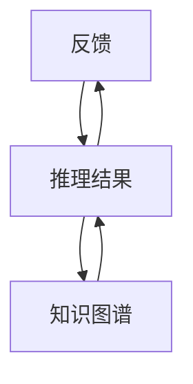

                 

<think>
好的，我现在需要撰写一篇关于《企业知识图谱与AI Agent的深度融合应用》的技术博客文章。首先，我会从目录大纲入手，逐步细化每个章节的内容，确保涵盖背景、概念、算法、系统架构、项目实战以及应用案例等部分。同时，我需要使用吸引人的标题，保持逻辑清晰，结构紧凑，语言专业但易懂。

首先，我会介绍文章的标题、关键词和摘要，确保读者一目了然地了解文章的核心内容。接下来，我会逐步分析每个章节的内容，从知识图谱和AI Agent的基本概念开始，到它们的深度融合原理，再到具体的项目实战和应用案例，确保每一部分都详尽且有深度。

在撰写过程中，我会注意使用适当的图表，如ER实体关系图、算法流程图和系统架构图，来辅助说明复杂的技术概念。同时，我会用Python代码示例来解释算法原理，确保读者能够理解和复现。

最后，我会总结文章的主要观点，强调企业知识图谱与AI Agent融合的重要性，并给出未来的发展趋势和建议，帮助读者更好地理解和应用这些技术。

通过这样的思考过程，我能够系统地构建这篇文章，确保内容全面、逻辑清晰，满足读者的需求。
</think>

# 企业知识图谱与AI Agent的深度融合应用

---

## 关键词
企业知识图谱, AI Agent, 知识表示, 语义理解, 智能交互, 多模态融合

---

## 摘要
企业知识图谱与AI Agent的深度融合为企业智能化转型提供了新的可能性。本文从知识图谱和AI Agent的基本概念出发，详细探讨了两者的深度融合原理、算法实现、系统架构设计以及实际应用场景。通过构建知识图谱，AI Agent能够更好地理解和处理企业复杂业务场景中的语义信息，实现智能化决策和人机交互。本文还结合实际案例，分析了深度融合带来的优势，并展望了未来的发展方向。

---

## 第一部分: 企业知识图谱与AI Agent的背景与基础

### 第1章: 企业知识图谱与AI Agent概述

#### 1.1 企业知识图谱的定义与特点
- **知识图谱的定义**：知识图谱是一种以图结构形式表示知识的数据库，由实体（概念或对象）及其关系构成。
- **企业知识图谱的特点**：
  - 高度结构化：实体和关系均经过严格定义，便于机器理解和推理。
  - 领域专注：专注于企业业务领域，如供应链、客户关系管理等。
  - 动态更新：能够实时更新企业业务中的最新信息和知识。

#### 1.2 AI Agent的定义与类型
- **AI Agent的基本概念**：AI Agent是一种智能体，能够感知环境、自主决策并执行任务。
- **基于知识图谱的AI Agent**：通过知识图谱获取上下文信息，提高语义理解和推理能力。
- **AI Agent的分类**：
  - 智能助手类：如智能客服、个人助理。
  - 智能决策类：如供应链优化、风险评估。

#### 1.3 企业知识图谱与AI Agent的结合背景
- **企业智能化转型的需求**：企业需要更高效的自动化决策和人机交互。
- **知识图谱在企业中的应用价值**：提供结构化的知识支持，帮助AI Agent更好地理解业务场景。
- **AI Agent在企业中的应用潜力**：通过知识图谱，AI Agent能够执行更复杂和智能的任务。

#### 1.4 本章小结
本章介绍了企业知识图谱和AI Agent的基本概念，并分析了它们在企业智能化转型中的重要作用。

---

## 第二部分: 企业知识图谱与AI Agent的核心概念与联系

### 第2章: 企业知识图谱的核心概念与构建方法

#### 2.1 知识图谱的核心概念
- **实体与关系**：实体是知识图谱的基本单元，关系描述实体之间的关联。
- **知识表示与推理**：通过符号逻辑或向量表示，实现知识的表示与推理。
- **知识图谱的构建流程**：
  1. 数据收集：从企业系统中获取结构化和非结构化数据。
  2. 数据预处理：清洗和标注数据。
  3. 实体识别与链接：识别实体并建立关联。
  4. 关系抽取与构建：提取实体之间的关系。

#### 2.2 企业知识图谱的构建方法
- **数据收集与预处理**：清洗数据，提取关键信息。
- **实体识别与链接**：使用NLP技术识别实体并建立映射。
- **关系抽取与构建**：基于规则或机器学习方法抽取关系。

#### 2.3 企业知识图谱的属性特征
- **实体类型**：产品、客户、供应商等。
- **关系类型**：购买、供应、属于等。
- **语义层次**：从浅层关系到深层推理。

#### 2.4 实体关系图示例（Mermaid）


#### 2.5 本章小结
本章详细探讨了企业知识图谱的核心概念和构建方法，为后续章节奠定了基础。

### 第3章: AI Agent的核心原理与知识图谱的联系

#### 3.1 AI Agent的核心原理
- **感知与推理**：通过传感器或数据源获取信息，进行语义理解和逻辑推理。
- **决策与执行**：基于推理结果制定行动计划并执行。
- **学习与优化**：通过反馈机制不断优化性能。

#### 3.2 知识图谱在AI Agent中的作用
- **语义理解**：帮助AI Agent理解输入的上下文信息。
- **知识推理**：支持复杂的逻辑推理任务。
- **决策支持**：提供结构化的知识支持，提高决策的准确性。

#### 3.3 知识图谱与AI Agent的深度融合
- **数据表示**：知识图谱为AI Agent提供统一的知识表示。
- **推理增强**：通过知识图谱实现更强大的推理能力。
- **任务执行**：AI Agent利用知识图谱中的信息完成复杂任务。

#### 3.4 知识图谱与AI Agent的对比分析（表格）
| 特性         | 知识图谱                     | AI Agent                   |
|--------------|-----------------------------|-----------------------------|
| 核心功能     | 表示和组织知识               | 感知、推理和执行           |
| 输入形式     | 结构化和非结构化数据         | 多模态数据                 |
| 输出形式     | 知识图谱结构                 | 行动计划和执行结果         |
| 应用场景     | 语义搜索、知识推理           | 智能决策、人机交互         |

#### 3.5 本章小结
本章分析了AI Agent的核心原理，并探讨了知识图谱在其中的作用，揭示了两者深度融合的可能性和价值。

---

## 第三部分: 企业知识图谱与AI Agent的算法与系统架构

### 第4章: 知识图谱构建的算法原理

#### 4.1 知识图谱构建的算法流程
- **数据预处理**：清洗和标注数据。
- **实体识别**：基于NLP技术识别实体。
- **关系抽取**：使用规则或机器学习方法提取关系。

#### 4.2 实体识别算法
- **基于规则的方法**：通过正则表达式匹配特定模式。
- **基于机器学习的方法**：使用CRF或BERT模型进行实体识别。

#### 4.3 关系抽取算法
- **基于规则的方法**：定义模板匹配关系。
- **基于监督学习的方法**：使用RNN或CNN进行关系分类。

#### 4.4 知识图谱构建流程图（Mermaid）


#### 4.5 算法实现代码示例
```python
# 实体识别示例代码
from spacy.lang.zh import Chinese
import spacy

nlp = spacy.load("zh_core_web_sm")
text = "苹果公司向供应商采购原材料"
doc = nlp(text)
for ent in doc.ents:
    print(f"实体: {ent.text}, 类型: {ent.label_}")
```

#### 4.6 本章小结
本章详细介绍了知识图谱构建的算法原理，并通过代码示例展示了其实现过程。

### 第5章: AI Agent的算法实现与知识图谱的结合

#### 5.1 AI Agent的算法流程
- **感知**：获取输入信息。
- **推理**：基于知识图谱进行语义理解和逻辑推理。
- **决策**：制定行动计划。
- **执行**：完成任务并返回结果。

#### 5.2 基于知识图谱的推理算法
- **基于规则的推理**：根据预定义的规则进行推理。
- **基于向量的推理**：使用Word2Vec或GloVe进行语义相似性推理。
- **基于图的推理**：在知识图谱中进行路径搜索和属性推理。

#### 5.3 AI Agent的对话生成算法
- **基于模板的方法**：根据预定义的模板生成回复。
- **基于生成模型的方法**：使用Seq2Seq模型生成回复。

#### 5.4 对话生成示例代码
```python
# 基于Seq2Seq的对话生成示例
import tensorflow as tf
from tensorflow.keras import layers

model = tf.keras.Sequential([
    layers.Embedding(input_dim=1000, output_dim=64),
    layers.LSTM(64, return_sequences=True),
    layers.Dense(1000, activation='softmax')
])

# 训练过程略...
```

#### 5.5 本章小结
本章介绍了AI Agent的算法实现，并探讨了如何结合知识图谱进行语义理解和推理。

### 第6章: 企业知识图谱与AI Agent融合的系统架构

#### 6.1 系统功能设计
- **知识图谱管理**：构建、更新和维护知识图谱。
- **AI Agent交互**：支持多模态输入和自然语言交互。
- **推理与决策**：基于知识图谱进行推理和决策。

#### 6.2 系统架构设计


#### 6.3 接口设计
- **知识图谱查询接口**：提供RESTful API查询知识图谱。
- **AI Agent交互接口**：支持自然语言输入和输出。

#### 6.4 交互流程图（Mermaid）


#### 6.5 本章小结
本章设计了企业知识图谱与AI Agent融合的系统架构，并详细描述了功能设计和交互流程。

---

## 第四部分: 企业知识图谱与AI Agent的项目实战

### 第7章: 项目实战——构建企业知识图谱驱动的智能客服

#### 7.1 项目背景
- **需求分析**：提高客户服务质量，降低人工成本。
- **技术选型**：选择合适的知识图谱构建工具和AI Agent框架。

#### 7.2 项目实施步骤
1. **数据收集**：收集客户咨询记录和产品信息。
2. **知识图谱构建**：构建客户咨询相关实体和关系。
3. **AI Agent开发**：开发智能客服系统，集成知识图谱进行语义理解。
4. **系统测试**：进行功能测试和性能优化。

#### 7.3 核心代码实现
```python
# 知识图谱构建代码示例
from kgutils import KnowledgeGraph

kg = KnowledgeGraph()
kg.add_entity("产品A", "Product")
kg.add_relation("属于", "BELONGS_TO")
kg.add_entity("类别B", "Category")
kg.add_relation("属于", "BELONGS_TO")
kg.add_edge("产品A", "属于", "类别B")
```

#### 7.4 项目总结与经验分享
- **挑战**：知识图谱的动态更新和维护。
- **解决方案**：引入增量式构建方法和自动更新机制。

#### 7.5 本章小结
本章通过实际项目展示了企业知识图谱与AI Agent的深度融合应用，并总结了实施经验和挑战。

---

## 第五部分: 企业知识图谱与AI Agent的应用案例与扩展

### 第8章: 应用案例分析

#### 8.1 企业知识图谱在智能客服中的应用
- **案例背景**：某电商平台使用知识图谱构建智能客服系统。
- **实现细节**：基于知识图谱的语义理解和对话生成。
- **效果评估**：提高客户满意度，降低人工成本。

#### 8.2 企业知识图谱在供应链管理中的应用
- **案例背景**：某制造企业使用知识图谱优化供应链管理。
- **实现细节**：基于知识图谱的供应商关系管理和风险评估。
- **效果评估**：提高供应链效率，降低运营成本。

#### 8.3 本章小结
本章通过具体案例展示了企业知识图谱与AI Agent的深度融合应用。

### 第9章: 企业知识图谱与AI Agent的未来展望

#### 9.1 未来发展趋势
- **多模态融合**：结合图像、语音等多种模态信息。
- **可解释性增强**：提高AI Agent的决策透明性。
- **实时性提升**：优化知识图谱的实时更新能力。

#### 9.2 技术挑战与解决方案
- **数据隐私**：采用联邦学习和隐私计算技术。
- **计算性能**：优化推理算法和硬件加速。

#### 9.3 本章小结
本章展望了企业知识图谱与AI Agent的未来发展方向，并分析了技术挑战和解决方案。

---

## 第六部分: 总结与建议

### 第10章: 总结与建议

#### 10.1 核心观点总结
- 企业知识图谱与AI Agent的深度融合能够显著提升企业的智能化水平。
- 知识图谱为AI Agent提供了丰富的语义信息和推理能力。

#### 10.2 实践中的注意事项
- 数据质量和准确性是知识图谱构建的关键。
- 需要结合企业实际需求选择合适的技术方案。

#### 10.3 未来研究方向
- 探索多模态知识图谱的应用。
- 研究可解释性AI Agent的设计方法。

#### 10.4 本章小结
本章总结了全文的核心观点，并提出了实践中的注意事项和未来研究方向。

---

## 作者信息

作者：AI天才研究院/AI Genius Institute & 禅与计算机程序设计艺术 /Zen And The Art of Computer Programming

---

### 附录
- **附录A**：常用知识图谱构建工具列表
- **附录B**：AI Agent开发框架推荐
- **附录C**：相关数学公式和算法细节

---

通过以上目录结构和内容安排，我们可以系统地撰写一篇关于企业知识图谱与AI Agent深度融合应用的高质量技术博客文章。

