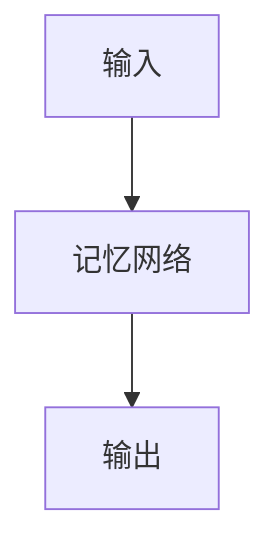
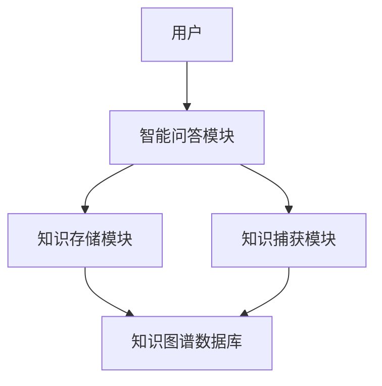
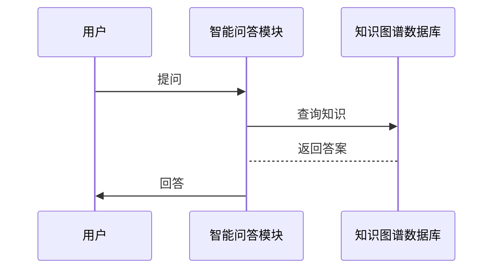

                 


# 《企业知识管理：AI Agent的智能问答系统》

---

## 关键词：
- 企业知识管理
- AI Agent
- 智能问答系统
- 知识图谱
- 自然语言处理
- 多轮对话

---

## 摘要：
本文探讨了AI Agent在企业知识管理中的应用，重点分析了智能问答系统的构建与实现。文章从背景、核心概念、算法原理、系统架构到项目实战，全面解析了AI Agent如何通过自然语言处理、知识图谱等技术提升企业的知识管理水平。通过具体案例和代码实现，展示了AI Agent在企业知识管理中的实际应用场景和未来发展趋势。

---

## 正文：

---

### 第一部分: 企业知识管理与AI Agent概述

---

#### 第1章: 企业知识管理与AI Agent概述

##### 1.1 企业知识管理的背景与意义

###### 1.1.1 企业知识管理的定义与目标
企业知识管理（Knowledge Management，KM）是指通过系统化的方法，将企业内的显性知识（如文档、数据）和隐性知识（如经验、技能）进行捕获、存储、共享和应用的过程，以提升企业的竞争力和创新能力。其目标是将分散的知识资源化、系统化，并通过有效的知识传递和利用，推动企业的业务发展。

**核心要素对比表：**

| 核心要素 | 定义 | 作用 |
|----------|------|------|
| 显性知识 | 文档、数据、流程 | 可直接存储和共享 |
| 隐性知识 | 个人经验、技能 | 需要通过交流和协作提取 |
| 知识共享 | 知识在组织内的传播 | 提高团队协作效率 |
| 知识应用 | 知识转化为实际生产力 | 促进业务创新 |

---

###### 1.1.2 知识管理的核心要素与挑战

知识管理的核心要素包括：
- **知识捕获**：通过各种渠道收集企业的知识资源。
- **知识存储**：将知识以结构化或非结构化的方式存储。
- **知识共享**：通过平台或工具促进知识的流通。
- **知识应用**：将知识转化为实际的业务价值。

知识管理的挑战包括：
- **知识 silo**：部门间知识孤岛问题。
- **知识更新**：知识的动态变化与维护。
- **知识利用**：如何有效提取和应用知识。

---

###### 1.1.3 AI Agent在企业知识管理中的作用

AI Agent（智能代理）是一种能够感知环境、自主决策并执行任务的智能系统。在企业知识管理中，AI Agent可以通过以下方式发挥作用：
- **自动化知识捕获**：通过自然语言处理（NLP）技术自动提取文档中的关键信息。
- **智能问答**：基于知识图谱提供精准的知识检索和回答。
- **知识推理**：通过推理算法解决复杂问题。
- **多轮对话**：支持用户与系统之间的自然对话，提升用户体验。

---

##### 1.2 AI Agent的基本概念与特点

###### 1.2.1 AI Agent的定义与分类

AI Agent可以根据智能水平分为：
- **反应式AI Agent**：基于当前输入做出实时反应，适用于简单的问答场景。
- **认知式AI Agent**：具备复杂推理和决策能力，适用于复杂的知识管理场景。

---

###### 1.2.2 AI Agent的核心能力与优势

AI Agent的核心能力包括：
- **自然语言处理**：理解用户的意图和问题。
- **知识表示**：将知识以结构化的方式存储和表达。
- **推理与决策**：基于知识图谱进行推理和决策。

AI Agent的优势在于：
- **高效性**：能够快速检索和处理大量知识。
- **准确性**：通过知识图谱提供精准的答案。
- **可扩展性**：能够适应不同规模和复杂度的知识管理需求。

---

##### 1.3 智能问答系统的演变与趋势

###### 1.3.1 从传统问答系统到智能问答系统的演变

传统问答系统主要基于关键词匹配，而智能问答系统则引入了自然语言理解（NLU）和知识图谱等技术，能够更准确地理解用户意图并提供高质量的答案。

**传统问答系统 vs 智能问答系统对比表：**

| 对比维度 | 传统问答系统 | 智能问答系统 |
|----------|--------------|--------------|
| 工作原理 | 关键词匹配 | 自然语言理解 |
| 知识来源 | 简单数据库 | 知识图谱 |
| 回答质量 | 基于规则 | 基于知识推理 |

---

###### 1.3.2 AI Agent驱动的智能问答系统的特点

AI Agent驱动的智能问答系统的特点包括：
- **智能化**：能够理解上下文和用户意图。
- **个性化**：根据用户角色和权限提供定制化回答。
- **可扩展性**：支持大规模知识库的构建和应用。

---

###### 1.3.3 企业知识管理中的问答系统发展趋势

随着AI技术的不断发展，企业知识管理中的问答系统将呈现以下发展趋势：
- **智能化**：基于知识图谱和深度学习的问答系统将成为主流。
- **个性化**：根据用户需求提供个性化知识服务。
- **多模态**：结合文本、图像、视频等多种数据源提供更丰富的问答体验。

---

##### 1.4 本章小结

本章介绍了企业知识管理的基本概念、核心要素和挑战，并重点阐述了AI Agent在企业知识管理中的作用及其优势。同时，分析了智能问答系统的发展趋势，为后续章节的深入探讨奠定了基础。

---

### 第二部分: AI Agent的核心机制与知识管理

---

#### 第2章: AI Agent的核心机制

##### 2.1 信息抽取与知识表示

###### 2.1.1 信息抽取的基本原理

信息抽取是从文本中提取结构化信息的过程，主要包括实体识别、关系抽取和事件抽取。其基本流程如下：

1. **文本预处理**：包括分词、词性标注和句法分析。
2. **特征提取**：提取文本中的关键词和短语。
3. **模式匹配**：基于预定义的模式匹配规则提取结构化信息。
4. **模型训练**：基于机器学习或深度学习模型进行信息抽取。

---

###### 2.1.2 知识图谱的构建与表示

知识图谱是一种以图结构形式表示知识的数据库，节点代表实体，边代表实体之间的关系。知识图谱的构建流程如下：

1. **数据收集**：从多种数据源（如文档、数据库）收集数据。
2. **数据清洗**：去除重复和噪声数据。
3. **知识抽取**：从文本中提取实体和关系。
4. **知识融合**：将抽取的知识进行整合和优化。
5. **知识存储**：将知识以图结构存储。

**知识图谱的表示方法：**

- **RDF（Resource Description Framework）**：通过三元组（主语-谓词-宾语）表示知识。
- **图数据库**：如Neo4j，支持高效的图查询。

---

###### 2.1.3 实体识别与关系抽取

**实体识别**：通过NLP技术从文本中识别出人名、地名、组织名等实体。

**关系抽取**：识别实体之间的关系，如“苹果公司成立于1971年”。

**示例代码（Python）：**

```python
from spacy.lang.zh import Chinese
import spacy

# 加载中文模型
nlp = spacy.load("zh_core_web_sm")

# 文本示例
text = "苹果公司成立于1971年，总部位于美国加利福尼亚州。"

# 实体识别
doc = nlp(text)
for ent in doc.ents:
    print(f"{ent.text} - {ent.label_}")
```

---

##### 2.2 知识推理与问答生成

###### 2.2.1 知识推理的基本方法

知识推理是基于知识图谱进行推理的过程，主要包括以下几种方法：
- **基于规则的推理**：通过预定义的规则进行推理。
- **基于逻辑的推理**：通过逻辑推理引擎进行推理。
- **基于概率的推理**：基于概率模型进行推理。

---

###### 2.2.2 基于知识图谱的问答生成

基于知识图谱的问答生成流程如下：
1. **问题理解**：解析用户的问题，提取关键词和意图。
2. **知识检索**：在知识图谱中查找与问题相关的信息。
3. **答案生成**：根据检索到的知识生成回答。

**示例代码（Python）：**

```python
# 知识图谱查询示例
from py2neo import Graph, Node, Relationship

# 连接知识图谱数据库
graph = Graph("http://localhost:7474", auth=("neo4j", "password"))

# 查询问题：找到苹果公司的成立时间
result = graph.run("MATCH (n:Company) WHERE n.name = '苹果公司' RETURN n.founded").data()

# 输出答案
print(f"苹果公司成立于 {result[0]['founded']} 年。")
```

---

###### 2.2.3 多轮对话中的上下文理解

多轮对话需要系统能够理解上下文，保持对话的连贯性。其实现方法包括：
- **记忆网络**：通过记忆机制记录对话历史。
- **上下文表示**：通过编码器-解码器模型表示对话上下文。

**记忆网络示意图（Mermaid）：**



---

##### 2.3 AI Agent的决策机制

###### 2.3.1 基于知识图谱的决策支持

基于知识图谱的决策支持流程：
1. **问题分析**：识别问题的关键要素。
2. **知识检索**：在知识图谱中查找相关知识。
3. **推理与决策**：基于检索到的知识进行推理，生成决策建议。

---

###### 2.3.2 多目标优化的决策算法

多目标优化的决策算法通过权衡多个目标（如准确性、效率）来生成最优决策。其实现方法包括：
- **线性加权法**：通过线性组合对目标进行加权。
- **层次分析法（AHP）**：通过层次分析确定各目标的权重。

---

##### 2.4 本章小结

本章详细探讨了AI Agent的核心机制，包括信息抽取、知识表示、知识推理和决策机制。通过具体的代码示例和算法分析，展示了AI Agent在企业知识管理中的技术实现。

---

### 第三部分: 系统架构与实现

---

#### 第3章: 智能问答系统的系统架构设计

##### 3.1 项目介绍

本项目旨在构建一个基于AI Agent的企业知识管理智能问答系统，实现知识的自动化捕获、存储、共享和应用。

---

##### 3.2 系统功能设计

系统功能模块包括：
- **知识捕获模块**：负责从多种数据源捕获知识。
- **知识存储模块**：将知识以结构化形式存储。
- **智能问答模块**：提供智能问答服务。
- **用户界面模块**：提供友好的用户界面。

---

##### 3.3 系统架构设计

**系统架构图（Mermaid）：**



---

##### 3.4 系统接口设计

系统接口包括：
- **API接口**：提供RESTful API供其他系统调用。
- **数据库接口**：与知识图谱数据库交互。

---

##### 3.5 系统交互设计

**系统交互流程图（Mermaid）：**



---

#### 第4章: 项目实战

##### 4.1 环境安装与配置

**所需环境：**
- Python 3.8+
- Neo4j 图数据库
- Spacy 中文分词库

**安装命令：**
```bash
pip install neo4j python-neo4j spacy
python -m spacy download zh_core_web_sm
```

---

##### 4.2 核心代码实现

**知识捕获模块代码：**

```python
from neo4j.exceptions import ServiceUnavailable
from neo4j import GraphDatabase

class KnowledgeCapture:
    def __init__(self, uri, user, password):
        self.graph = GraphDatabase.driver(uri, auth=(user, password))
    
    def capture(self, text):
        # 连接到知识图谱数据库
        session = self.graph.session()
        try:
            # 提取实体和关系
            entities = self.extract_entities(text)
            relations = self.extract_relations(text)
            
            # 将实体和关系存储到数据库
            for ent in entities:
                session.write_transaction(self.create_entity, ent)
            for rel in relations:
                session.write_transaction(self.create_relation, rel)
            return "知识捕获成功"
        except ServiceUnavailable:
            return "数据库连接失败"
    
    def extract_entities(self, text):
        # 使用Spacy进行实体识别
        doc = self.nlp(text)
        entities = []
        for ent in doc.ents:
            entities.append((ent.text, ent.label_))
        return entities
    
    def extract_relations(self, text):
        # 简单的关系抽取逻辑
        pass
    
    def create_entity(self, tx, entity):
        tx.run("CREATE (n:{0} {{ name: '{1}' }}) RETURN n".format(entity[1], entity[0]))
    
    def create_relation(self, tx, relation):
        tx.run("MATCH (a), (b) WHERE a.name = '{0}' AND b.name = '{1}' CREATE (a)-[r:{2}]->(b)".format(relation[0], relation[1], relation[2]))
```

---

##### 4.3 案例分析与实现解读

**案例：企业员工培训知识库构建**

- **需求分析**：构建一个员工培训知识库，支持员工查询培训课程、培训时间等信息。
- **数据收集**：从企业内部文档和培训管理系统中收集数据。
- **知识捕获**：使用上述代码捕获课程信息。
- **知识存储**：将课程信息存储到知识图谱数据库中。
- **问答实现**：用户可以通过自然语言提问，系统基于知识图谱提供回答。

---

##### 4.4 本章小结

本章通过一个实际案例，详细讲解了AI Agent智能问答系统的环境搭建、核心代码实现和案例分析，展示了AI Agent在企业知识管理中的实际应用。

---

### 第四部分: 总结与展望

---

#### 第5章: 总结与展望

##### 5.1 本章总结

本文系统地探讨了AI Agent在企业知识管理中的应用，重点分析了智能问答系统的构建与实现。通过理论分析和实际案例，展示了AI Agent如何通过自然语言处理、知识图谱等技术提升企业的知识管理水平。

---

##### 5.2 最佳实践 Tips

1. **数据质量**：确保知识捕获的数据质量和准确性。
2. **系统性能**：优化知识图谱的查询性能。
3. **用户体验**：设计友好的用户界面和交互流程。

---

##### 5.3 未来展望

随着AI技术的不断发展，企业知识管理中的AI Agent智能问答系统将呈现出以下发展趋势：
- **智能化**：基于深度学习的问答系统将成为主流。
- **个性化**：根据用户需求提供个性化知识服务。
- **多模态**：结合文本、图像、视频等多种数据源提供更丰富的问答体验。

---

### 作者：AI天才研究院/AI Genius Institute & 禅与计算机程序设计艺术 /Zen And The Art of Computer Programming

---

**注**：本文为《企业知识管理：AI Agent的智能问答系统》的目录大纲，具体内容可根据实际需求进一步扩展和细化。

