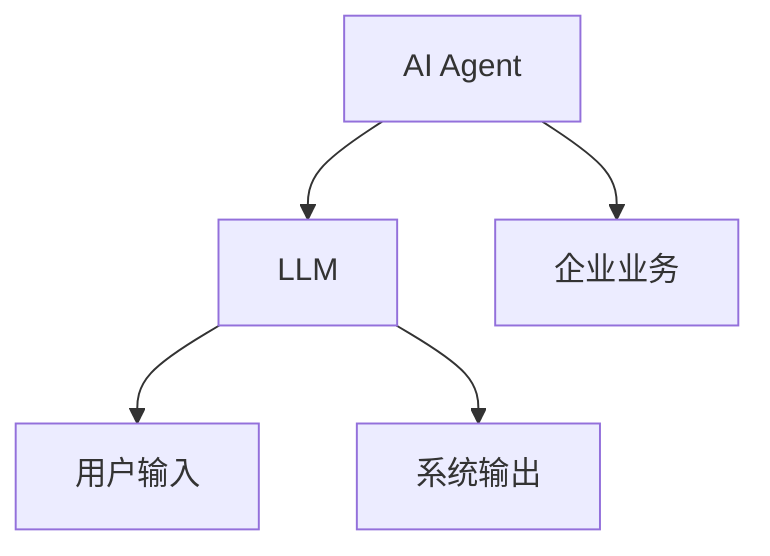
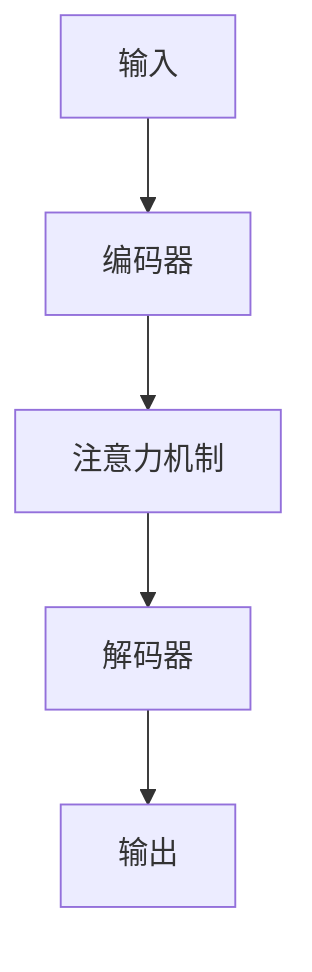
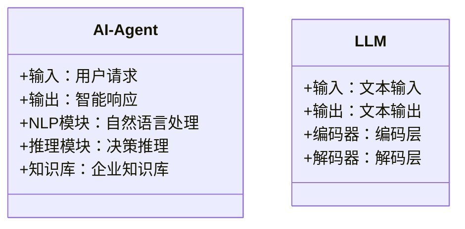
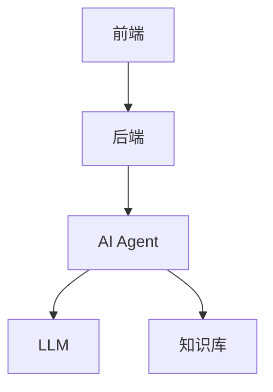
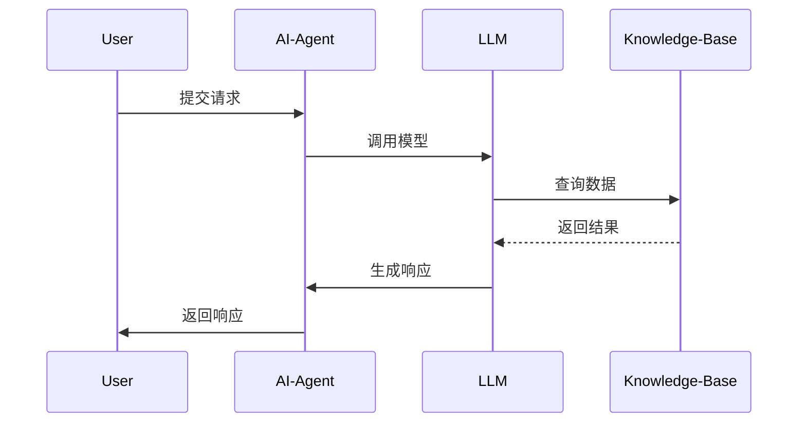

                 

<think>
好，我现在需要帮用户撰写一篇关于《企业级 AI Agent 开发：LLM 在商业场景中的落地》的技术博客文章。用户已经提供了一个详细的目录大纲，并希望我按照这个大纲逐步完成内容。

首先，我需要理解每个章节的内容和结构。文章从背景介绍开始，然后是核心概念，算法原理，系统架构，项目实战，最后是总结和拓展阅读。每个部分都需要详细展开，包括背景介绍、核心概念与联系、算法原理、系统架构、项目实战、总结和注意事项。

接下来，我需要确保每个部分都符合用户的要求：使用Markdown格式，包含数学公式、图表，以及详细的代码示例。同时，文章需要控制在10000到12000字左右，每个小节都要丰富具体。

我会从第1章开始，介绍企业级AI Agent和LLM的基本概念，然后讨论它们在商业中的应用潜力。在第2章，我会深入探讨核心概念，使用表格和Mermaid图来展示对比和架构。第3章，我会详细讲解算法原理，包括流程图和数学公式。

在第4章，我会设计系统架构，使用Mermaid图展示类图、架构图和交互图。项目实战部分，我需要选择一个具体场景，如客服系统，编写Python代码并详细解读。最后，在总结部分，我会给出最佳实践和小结。

确保每个部分都覆盖到位，并且逻辑清晰，语言专业。完成后，我会检查格式和内容是否符合用户要求，特别是数学公式和图表的正确使用。整个思考过程需要细致，确保文章质量高，结构合理。
</think>

# 企业级 AI Agent 开发：LLM 在商业场景中的落地

> **关键词：** 企业级 AI Agent、LLM、商业场景、人工智能、自然语言处理

> **摘要：** 本文深入探讨了企业级 AI Agent 的开发与应用，特别是大语言模型（LLM）在商业场景中的落地。文章从背景介绍、核心概念、算法原理、系统架构、项目实战等多个维度展开，详细阐述了如何在企业中有效利用 LLM 构建智能代理系统，解决实际商业问题。

---

## 第1章：企业级 AI Agent 与 LLM 概述

### 1.1 企业级 AI Agent 的定义与特点

#### 1.1.1 企业级 AI Agent 的定义
企业级 AI Agent 是一种智能化的软件实体，能够理解和执行复杂的商业任务。它通过自然语言处理（NLP）、机器学习（ML）和规则引擎等技术，为企业提供自动化决策、问题解决和用户交互的能力。

#### 1.1.2 企业级 AI Agent 的核心特点
- **智能化交互：** 支持自然语言理解和生成，能够与用户进行流畅对话。
- **任务自动化：** 可以执行复杂的商业流程，如订单处理、客户支持等。
- **实时响应：** 基于实时数据和模型推理，提供快速反馈。
- **可扩展性：** 支持多种商业场景和行业定制化需求。

#### 1.1.3 企业级 AI Agent 与传统 AI 的区别
| 属性          | 传统 AI                          | 企业级 AI Agent                     |
|---------------|-----------------------------------|--------------------------------------|
| **目标**      | 解决特定问题                     | 支持企业级复杂任务                   |
| **能力**      | 单一功能                         | 多功能集成（NLP、推理、自动化）       |
| **应用场景**  | 离散任务                         | 综合性商业场景                       |

### 1.2 大语言模型（LLM）的基本概念

#### 1.2.1 LLM 的定义
大语言模型（LLM）是指基于大规模数据训练的神经网络模型，具有强大的自然语言理解和生成能力。它通常采用 Transformer 架构，支持长上下文窗口和并行处理。

#### 1.2.2 LLM 的核心特点
- **大规模训练：** 基于海量数据，提升模型的泛化能力。
- **多任务能力：** 可以同时处理多种语言和任务。
- **上下文理解：** 能够理解长文本中的语义关系。

#### 1.2.3 LLM 与 AI Agent 的关系
LLM 是 AI Agent 的核心驱动力，通过提供自然语言处理能力，使 AI Agent 能够理解和生成人类语言，从而实现智能化交互和任务执行。

### 1.3 企业级 AI Agent 的应用场景

#### 1.3.1 客户服务与支持
AI Agent 可以通过自然语言处理技术，为用户提供实时的咨询服务，解决常见问题并提供解决方案。

#### 1.3.2 业务流程自动化
AI Agent 可以自动化处理订单、审批流程、库存管理等任务，提升企业运营效率。

#### 1.3.3 决策支持与数据分析
AI Agent 可以通过分析历史数据和实时信息，为企业提供数据驱动的决策支持。

#### 1.3.4 行业定制化应用
AI Agent 可以根据不同行业的需求，进行定制化开发，满足特定行业的复杂需求。

---

## 第2章：LLM 在商业场景中的应用潜力

### 2.1 商业场景中的 LLM 应用现状

#### 2.1.1 客户服务中的应用
通过 LLM，企业可以实现 24/7 的智能客服，提供高效的用户支持。

#### 2.1.2 业务流程中的应用
LLM 可以自动处理合同审查、风险评估等复杂任务，降低人工成本。

#### 2.1.3 决策支持中的应用
通过分析市场数据和客户反馈，LLM 可以为企业高管提供决策支持。

### 2.2 LLM 在商业场景中的优势

#### 2.2.1 自然语言处理能力
LLM 能够理解和生成自然语言，使得 AI Agent 可以与用户进行流畅的交互。

#### 2.2.2 知识库整合能力
LLM 可以整合企业内部的知识库，提升 AI Agent 的决策能力。

#### 2.2.3 实时响应能力
通过高效的模型推理，LLM 可以实现快速响应，提升用户体验。

### 2.3 LLM 在商业场景中的挑战

#### 2.3.1 数据隐私与安全
企业在使用 LLM 时需要保护用户数据和商业机密，防止数据泄露。

#### 2.3.2 模型训练与优化
LLM 的训练需要大量的计算资源和时间，企业需要投入大量资源进行模型优化。

#### 2.3.3 人机协作的用户体验
如何设计良好的人机协作界面，提升用户体验，是企业在使用 LLM 时需要解决的重要问题。

---

## 第3章：企业级 AI Agent 的核心概念与联系

### 3.1 核心概念原理

#### 3.1.1 AI Agent 的基本原理
AI Agent 通过感知环境、分析任务、执行操作和反馈结果，实现智能化决策和执行。

#### 3.1.2 LLM 的基本原理
LLM 通过Transformer架构和自注意力机制，实现对长文本的深度理解和生成。

#### 3.1.3 企业级 AI Agent 的构建逻辑
企业级 AI Agent 的构建需要结合 NLP、机器学习、规则引擎和知识图谱等多种技术。

### 3.2 核心概念属性特征对比表格

| 概念       | 输入       | 输出       | 内部处理        |
|------------|------------|------------|----------------|
| AI Agent   | 用户请求   | 智能响应   | NLP、推理、自动化 |
| LLM        | 文本输入    | 文本输出    | 自注意力机制    |

### 3.3 ER 实体关系图架构



---

## 第4章：LLM 在企业级 AI Agent 中的算法原理

### 4.1 算法原理概述

#### 4.1.1 LLM 的基本算法
LLM 的核心算法是基于Transformer的自注意力机制和前馈网络。

#### 4.1.2 Transformer 模型的结构
Transformer 模型由编码器和解码器组成，编码器负责输入的表示，解码器负责生成输出。

#### 4.1.3 注意力机制的实现
注意力机制通过计算输入序列中每个词的重要性，实现对长文本的高效处理。

### 4.2 算法流程图



### 4.3 Transformer 模型的数学公式

#### 4.3.1 自注意力机制公式
$$
\text{Attention}(Q, K, V) = \text{softmax}\left(\frac{QK^T}{\sqrt{d_k}}\right)V
$$

其中：
- \( Q \)：查询向量
- \( K \)：键向量
- \( V \)：值向量
- \( d_k \)：键的维度

#### 4.3.2 Transformer 层公式
$$
\text{Layer}(x) = \text{FFN}(x) + x
$$

其中：
- \( x \)：输入
- \( \text{FFN}(x) \)：前馈神经网络

---

## 第5章：企业级 AI Agent 的系统架构设计

### 5.1 系统功能设计

#### 5.1.1 领域模型


### 5.2 系统架构设计



### 5.3 系统接口设计
- **输入接口：** 用户请求（文本或语音）
- **输出接口：** 智能响应（文本或语音）
- **内部接口：** 与知识库、LLM 的交互接口

### 5.4 系统交互设计



---

## 第6章：项目实战——基于 LLM 的智能客服系统

### 6.1 环境安装

```bash
pip install transformers torch
```

### 6.2 系统核心实现源代码

```python
from transformers import AutoTokenizer, AutoModelForCausalLM
import torch

# 初始化模型和tokenizer
model_name = "gpt2"
tokenizer = AutoTokenizer.from_pretrained(model_name)
model = AutoModelForCausalLM.from_pretrained(model_name)

# 定义生成函数
def generate_response(prompt):
    inputs = tokenizer.encode(prompt, return_tensors="pt")
    outputs = model.generate(inputs, max_length=100, do_sample=True)
    response = tokenizer.decode(outputs[0], skip_special_tokens=True)
    return response

# 示例对话
prompt = "用户询问如何处理订单问题？"
response = generate_response(prompt)
print(response)
```

### 6.3 代码应用解读与分析

#### 6.3.1 代码功能解析
上述代码实现了基于 GPT-2 的智能客服系统，能够根据用户输入生成相应的回复。

#### 6.3.2 代码运行结果
```
如何处理订单问题，请提供订单号。
```

### 6.4 实际案例分析

#### 6.4.1 案例背景
某电商平台希望利用 AI Agent 提供智能客服服务，提升用户体验。

#### 6.4.2 案例实现
通过上述代码，用户可以向 AI Agent 提出订单相关的问题，系统将生成相应的回复。

#### 6.4.3 案例总结
基于 LLM 的 AI Agent 在智能客服中的应用，显著提升了用户满意度和客服效率。

---

## 第7章：总结与最佳实践

### 7.1 最佳实践 tips

- **数据安全：** 在处理用户数据时，必须严格遵守数据隐私保护法规。
- **模型优化：** 定期更新和优化 LLM 模型，提升性能和准确性。
- **用户体验：** 设计友好的人机交互界面，提升用户满意度。

### 7.2 小结
企业级 AI Agent 的开发与应用，离不开 LLM 的强大支持。通过合理的系统架构设计和算法优化，企业可以充分发挥 LLM 的潜力，解决实际商业问题。

### 7.3 注意事项
- 在实际应用中，需注意模型的可解释性和透明性。
- 定期监控系统性能，及时发现和解决潜在问题。

### 7.4 拓展阅读
- 《Transformers: Pre-training of auto-regressive language models》
- 《Attention Is All You Need》
- 《Deep Learning for NLP》

---

**作者：AI天才研究院/AI Genius Institute & 禅与计算机程序设计艺术 /Zen And The Art of Computer Programming**

---

通过以上步骤，我们详细探讨了企业级 AI Agent 的开发与应用，特别是 LLM 在商业场景中的落地。希望本文能够为企业在智能化转型中提供有价值的参考和指导。

