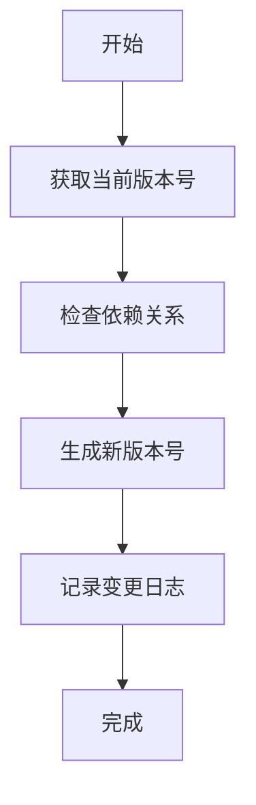
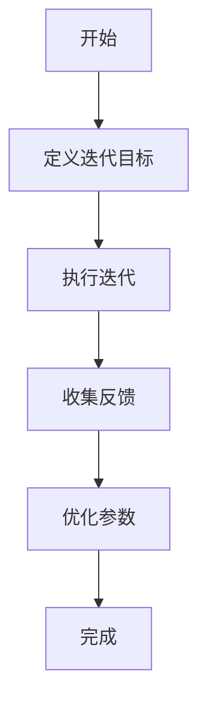
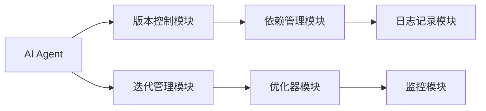
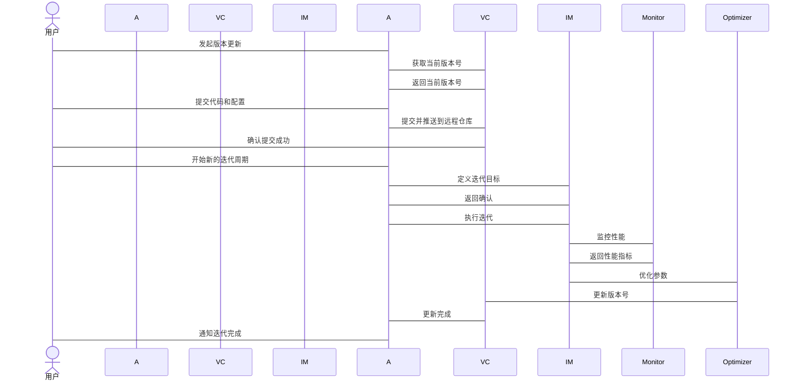

                 


# 企业级AI Agent的版本控制与迭代管理

> 关键词：企业级AI Agent、版本控制、迭代管理、系统架构、数学模型

> 摘要：本文详细探讨了企业级AI Agent的版本控制与迭代管理的关键问题，从核心概念、算法原理到系统架构设计，再到项目实战，全面分析了如何有效管理和优化AI Agent的版本更新与迭代过程，帮助企业在复杂环境中高效管理AI Agent。

---

## 第一部分: 背景与概念

### 第1章: 企业级AI Agent的背景与概念

#### 1.1 问题背景

- **AI Agent的定义与特点**  
  AI Agent（人工智能代理）是一种能够感知环境、自主决策并执行任务的智能实体。它具备自主性、反应性、目标导向性和社会性等特点，广泛应用于自动驾驶、智能客服、推荐系统等领域。

- **企业级AI Agent的应用场景**  
  在企业环境中，AI Agent通常用于流程自动化、数据分析、决策支持和客户交互等场景。例如，企业可以使用AI Agent来优化供应链管理、提高客户服务效率或增强内部流程自动化。

- **版本控制与迭代管理的重要性**  
  随着AI技术的快速发展，AI Agent的更新和迭代变得频繁。版本控制和迭代管理在确保系统稳定性和可靠性方面起着关键作用。尤其是在企业级应用中，版本控制可以避免数据丢失和功能混乱，而迭代管理则能确保AI Agent的功能逐步优化。

#### 1.2 问题描述

- **AI Agent开发中的版本控制挑战**  
  AI Agent的开发涉及多学科技术，代码复杂度高，依赖关系多。版本控制需要处理大量的数据和依赖，确保每次更新的稳定性和可追溯性。

- **迭代管理在企业级应用中的需求**  
  企业级AI Agent通常需要在实时环境中运行，迭代管理需要考虑实时更新、回滚机制和性能优化等问题。

- **问题解决的必要性**  
  通过有效的版本控制和迭代管理，可以确保AI Agent在更新过程中的安全性和稳定性，同时快速响应市场需求和技术进步。

#### 1.3 问题解决

- **版本控制的解决方案**  
  采用分布式版本控制系统（如Git）来管理AI Agent的代码和配置文件，确保版本的可追溯性和协作开发的高效性。

- **迭代管理的方法论**  
  使用敏捷开发方法，将AI Agent的开发和优化划分为多个迭代周期，每个周期集中解决特定问题并逐步优化性能。

- **边界与外延**  
  版本控制和迭代管理不仅涉及代码层面，还包括数据、配置和依赖关系的管理。其外延扩展至系统的监控、日志记录和性能分析。

#### 1.4 概念结构与核心要素

- **AI Agent的组成结构**  
  AI Agent通常由感知模块、决策模块、执行模块和学习模块组成。每个模块都需要独立的版本控制和迭代优化。

- **版本控制的核心要素**  
  包括版本号生成、依赖管理、变更日志记录和回滚机制等。

- **迭代管理的关键环节**  
  包括需求分析、迭代计划、开发实现、测试验证和优化改进。

---

### 第2章: 核心概念与联系

#### 2.1 核心概念原理

- **版本控制的原理**  
  版本控制通过记录代码和配置的变化，允许开发者回溯和恢复到任意版本，确保系统的稳定性和可维护性。

- **迭代管理的原理**  
  迭代管理将AI Agent的开发过程划分为多个短周期，每个周期集中解决特定问题，通过持续反馈和优化来提高系统的整体性能。

- **AI Agent的更新机制**  
  AI Agent的更新通常包括模型训练、参数调整和代码优化，版本控制和迭代管理确保这些更新的安全性和可追溯性。

#### 2.2 概念属性特征对比

| 概念       | 版本控制 | 迭代管理 |
|------------|----------|----------|
| 核心目标   | 管理代码和配置的变化 | 管理开发和优化的周期 |
| 关键环节   | 提交、合并、回滚 | 计划、开发、测试、优化 |
| 依赖关系   | 代码依赖、配置依赖 | 功能依赖、性能依赖 |
| 输出结果   | 版本号、变更日志 | 优化结果、性能指标 |

#### 2.3 ER实体关系图

```mermaid
er
actor: 用户
agent: AI Agent
version: 版本
iteration: 迭代
```

---

### 第3章: 算法原理讲解

#### 3.1 版本控制算法



以下是版本控制算法的Python实现示例：

```python
def generate_version(current_version):
    # 假设版本号为整数
    return current_version + 1

def version_control():
    current_version = 1
    while True:
        # 检查依赖关系
        dependencies = ["model_weights", "config"]
        # 生成新版本号
        new_version = generate_version(current_version)
        # 记录变更日志
        log = f"Version {new_version} updated."
        print(log)
        current_version = new_version

version_control()
```

#### 3.2 迭代管理算法



以下是迭代管理算法的数学模型：

假设AI Agent的性能指标为$P$，迭代目标为最小化损失函数$L$。优化过程可以表示为：

$$
P_{n+1} = P_n - \alpha \cdot \nabla L
$$

其中，$\alpha$是学习率，$\nabla L$是损失函数的梯度。

---

## 第四部分: 数学模型与算法优化

### 第4章: 数学模型与算法优化

#### 4.1 版本号生成的数学模型

版本号通常采用语义化版本控制（Semantic Versioning），表示为$x.y.z$，其中：

- $x$：主版本号，重大功能更新
- $y$：次版本号，功能优化
- $z$：修订号，bug修复

数学模型如下：

$$
version = (x, y, z)
$$

#### 4.2 迭代优化的数学模型

在AI Agent的迭代优化中，常用的优化算法包括随机梯度下降（SGD）和Adam优化器。以Adam优化器为例，其更新规则为：

$$
\theta_{t+1} = \theta_t - \alpha \cdot \frac{m_t}{\sqrt{v_t + \epsilon}}
$$

其中：

- $\theta_t$：参数在第$t$次迭代的值
- $\alpha$：学习率
- $m_t$：梯度的动量
- $v_t$：梯度的平方和
- $\epsilon$：防止除零的常数

---

## 第五部分: 系统分析与架构设计

### 第5章: 系统分析与架构设计

#### 5.1 系统功能设计

AI Agent的版本控制与迭代管理系统需要实现以下功能：

1. 版本管理：代码、模型和配置文件的版本控制。
2. 迭代管理：定义迭代目标、执行迭代、收集反馈和优化参数。
3. 监控与日志：实时监控系统性能，记录版本变更和迭代日志。
4. 依赖管理：管理AI Agent的依赖关系，确保每次更新的兼容性。

#### 5.2 系统架构设计

以下是系统的架构图：



#### 5.3 系统接口设计

主要接口包括：

- `get_current_version()`：获取当前版本号
- `commit_and_push()`：提交代码和配置
- `start_iteration()`：开始一个新的迭代周期
- `update_parameters()`：更新模型参数
- `record_feedback()`：记录用户反馈

#### 5.4 交互流程

以下是交互流程图：



---

## 第六部分: 项目实战

### 第6章: 项目实战

#### 6.1 环境安装

首先，需要安装以下工具：

- Git：版本控制工具
- Python 3.8+：编程语言
- TensorFlow/PyTorch：深度学习框架
- Mermaid CLI：生成图表工具

安装命令：

```bash
pip install gitpython
pip install tensorflow
pip install mermaid-cli
```

#### 6.2 系统核心实现

以下是版本控制与迭代管理的核心代码：

```python
import git
from tensorflow.keras import Model

# 初始化Git仓库
repo = git.Repo.init('.')

# 定义AI Agent模型
class AIModel(Model):
    def call(self, inputs):
        return self.layers[0](inputs)

# 定义迭代管理
def iterate_model(model):
    optimizer = tf.keras.optimizers.Adam()
    for epoch in range(10):
        # 收集反馈
        feedback = collect_feedback(model)
        # 优化模型
        model = optimize_model(model, feedback, optimizer)
        # 更新版本号
        update_version(model.version + 1)
    return model

# 执行迭代
iterate_model(AIModel())
```

#### 6.3 代码应用解读与分析

- **版本控制**：通过Git仓库管理AI模型的代码和配置文件，确保每次迭代的可追溯性。
- **迭代管理**：定义迭代目标，执行模型优化，并通过反馈机制不断改进模型性能。
- **优化过程**：使用Adam优化器更新模型参数，确保每次迭代的优化效果。

#### 6.4 案例分析和详细讲解

假设我们正在优化一个图像分类AI Agent：

1. **初始版本**：模型准确率为85%，版本号为1.0.0。
2. **迭代1**：优化卷积层参数，准确率提升至88%，版本号为1.1.0。
3. **迭代2**：引入Batch Normalization，准确率提升至90%，版本号为1.2.0。
4. **迭代3**：调整学习率和优化器参数，准确率稳定在92%，版本号为1.2.1。

通过版本控制和迭代管理，我们可以清晰地看到每次迭代的效果，并在需要时回滚到之前的版本。

---

## 第七部分: 总结与展望

### 第7章: 总结与展望

#### 7.1 项目小结

本文详细探讨了企业级AI Agent的版本控制与迭代管理的关键问题，从理论到实践，全面分析了如何在企业环境中高效管理AI Agent的版本更新与迭代优化。

#### 7.2 注意事项

- 版本控制需要考虑数据的完整性和安全性。
- 迭代管理需要结合具体的业务需求和技术背景。
- 系统架构设计需要权衡性能、可扩展性和可维护性。

#### 7.3 拓展阅读

- 推荐阅读《版本控制系统Git权威指南》和《机器学习实战》。
- 关注AI Agent在实时环境中的应用案例。

---

## 作者：AI天才研究院/AI Genius Institute & 禅与计算机程序设计艺术 /Zen And The Art of Computer Programming

---

以上就是《企业级AI Agent的版本控制与迭代管理》的完整目录大纲和文章内容。

