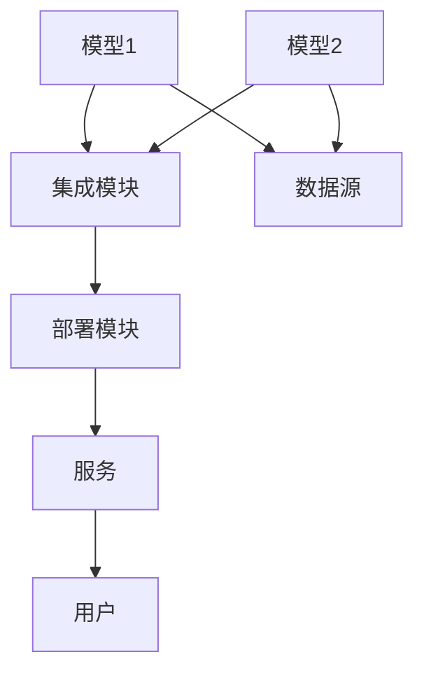
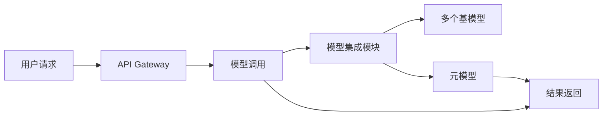

                 


# 企业级AI模型的集成与部署策略

## 关键词：企业级AI模型、集成部署、模型优化、系统架构、实战案例、深度解读

## 摘要：  
随着人工智能技术的快速发展，企业级AI模型的集成与部署已成为技术落地的关键环节。本文从企业级AI模型的背景出发，深入探讨其集成与部署的核心概念、算法原理、系统架构设计以及实际项目中的应用。通过理论与实践相结合的方式，本文为读者提供从模型选择到系统优化的全链路指导，帮助企业在复杂场景中高效落地AI模型。

---

## 第一部分: 企业级AI模型集成与部署的背景与概念

### 第1章: 企业级AI模型集成与部署概述

#### 1.1 问题背景与定义  
企业级AI模型的集成与部署是指将多个AI模型有机结合起来，并在企业级环境下稳定运行的过程。这一过程不仅涉及技术实现，还需要考虑企业架构、数据安全、资源分配等多方面因素。  
**企业级AI模型**是指能够支持企业级数据处理、服务优化和决策支持的AI模型。其核心目标是通过集成多个模型的优势，提升系统的性能、稳定性和扩展性。  

#### 1.2 企业级AI模型的特点  
企业级AI模型具有以下显著特点：  
1. **高可用性**：确保模型在高负载和复杂环境下的稳定运行。  
2. **高扩展性**：支持动态扩展和灵活部署，适应企业业务的快速变化。  
3. **高效性**：模型推理和响应速度需满足企业级实时性要求。  
4. **可解释性**：模型的决策过程需可追溯和解释，以符合企业合规性要求。  

#### 1.3 企业级AI模型的应用场景  
企业级AI模型广泛应用于以下场景：  
1. **企业内部数据处理**：如数据分析、预测、推荐系统等。  
2. **客户交互与服务优化**：如智能客服、个性化推荐、用户行为分析等。  
3. **行业特定应用**：如金融领域的风险评估、医疗领域的诊断辅助等。  

#### 1.4 本章小结  
本章通过定义和特点的分析，明确了企业级AI模型的核心概念，并介绍了其在企业中的应用场景。这为后续的集成与部署策略奠定了基础。

---

## 第二部分: 企业级AI模型集成与部署的核心概念

### 第2章: 集成与部署的核心概念与联系  

#### 2.1 核心概念原理  
1. **模型集成的原理**：通过组合多个模型的结果，提升整体性能。  
2. **模型部署的原理**：将模型封装为可执行服务，确保其在目标环境中的稳定运行。  
3. **集成与部署的关系**：集成是部署的基础，而部署是集成的最终目标。  

#### 2.2 核心概念属性对比  
下表对比了模型集成与部署的核心属性：  

| 属性          | 集成（Integration）          | 部署（Deployment）          |  
|---------------|------------------------------|-----------------------------|  
| 目标          | 提升模型性能与鲁棒性        | 确保模型在生产环境中的可用性 |  
| 关键技术      | 票决法、加权平均、堆叠模型    | 容器化、微服务、模型压缩    |  
| 约束条件      | 数据一致性、模型兼容性      | 资源限制、环境依赖性        |  

#### 2.3 ER实体关系图架构  
以下是一个简单的ER实体关系图：  



---

## 第三部分: 企业级AI模型集成与部署的算法原理

### 第3章: 模型集成算法原理  

#### 3.1 模型集成方法  
1. **投票法（Voting）**：通过多个模型的预测结果进行投票，选择多数结果作为最终输出。  
   ```python
   def voting_classifier(models, X):
       predictions = []
       for model in models:
           predictions.append(model.predict(X))
       return np.array([np.argmax(np.bincount(x, minlength=len(models))) for x in predictions]).T
   ```  

2. **加权平均法（Weighted Average）**：根据模型的性能，赋予不同的权重，最终输出加权平均结果。  
   ```python
   def weighted_average(models, weights, X):
       predictions = [model.predict(X) for model in models]
       weighted_preds = np.zeros_like(predictions[0])
       for i in range(len(models)):
           weighted_preds += weights[i] * predictions[i]
       return weighted_preds
   ```  

3. **堆叠模型（Stacking）**：将多个基模型的输出作为输入，构建一个元模型进行预测。  
   ```python
   def stacking(models, meta_model, X):
       meta_X = np.array([model.predict(X) for model in models]).T
       return meta_model.predict(meta_X)
   ```  

#### 3.2 部署技术  
1. **容器化部署（Containerization）**：使用Docker等技术，确保模型在不同环境下的一致性运行。  
2. **微服务化（Microservices）**：将模型拆分为独立的服务，便于扩展和维护。  
3. **模型压缩与优化（Model Compression）**：通过剪枝、量化等技术，减少模型大小，提升部署效率。  

---

## 第四部分: 企业级AI模型集成与部署的系统架构设计

### 第4章: 系统分析与架构设计方案  

#### 4.1 问题场景分析  
企业级AI模型的集成与部署通常面临以下问题：  
1. **数据一致性**：不同模型的数据输入格式不一致。  
2. **性能瓶颈**：大规模数据处理导致响应速度慢。  
3. **资源限制**：服务器资源有限，难以支持大规模模型。  

#### 4.2 系统功能设计  
1. **数据预处理模块**：负责数据清洗、特征提取和格式转换。  
2. **模型集成模块**：实现多个模型的集成，输出最终结果。  
3. **模型部署模块**：将集成后的模型封装为服务，供外部调用。  

#### 4.3 系统架构设计  
以下是一个典型的系统架构图：  



---

## 第五部分: 企业级AI模型集成与部署的项目实战

### 第5章: 项目实战  

#### 5.1 环境安装  
1. 安装必要的依赖：  
   ```bash
   pip install numpy scikit-learn docker-compose
   ```  

#### 5.2 核心代码实现  
1. 模型集成代码示例：  
   ```python
   from sklearn.ensemble import VotingClassifier
   from sklearn.linear_model import LogisticRegression
   from sklearn.svm import SVC

   models = [
       ('lr', LogisticRegression()),
       ('svc', SVC()),
   ]
   classifier = VotingClassifier(estimators=models, voting='hard')
   classifier.fit(X_train, y_train)
   ```

2. 模型部署代码示例：  
   ```python
   import docker

   client = docker.from_env()
   container = client.containers.run('model-service:latest', detach=True)
   ```

#### 5.3 案例分析  
以一个在线推荐系统为例，详细分析模型集成与部署的流程，包括数据预处理、模型训练、集成优化和最终部署。  

#### 5.4 项目总结  
通过实际案例，总结企业级AI模型集成与部署的关键点和注意事项。

---

## 第六部分: 企业级AI模型集成与部署的最佳实践

### 第6章: 最佳实践  

#### 6.1 经验总结  
1. 在模型集成前，确保数据的一致性和质量。  
2. 部署时，优先选择容器化和微服务化方案。  
3. 定期监控模型性能，及时优化和更新。  

#### 6.2 注意事项  
1. 注意模型的可解释性，避免“黑箱”模型。  
2. 确保数据安全，防止数据泄露。  
3. 在资源有限的情况下，优先选择模型压缩技术。  

#### 6.3 未来展望  
随着AI技术的不断发展，企业级AI模型的集成与部署将更加智能化和自动化。未来可能会出现更多高效的模型集成算法和自动化部署工具。

---

## 附录  

### 附录A: 工具清单  
1. Python  
2. Scikit-learn  
3. Docker  
4. Kubernetes  

### 附录B: 术语表  
1. **模型集成**：将多个模型的结果进行整合，以提升性能。  
2. **容器化部署**：使用容器技术确保模型在不同环境下的一致性运行。  

### 附录C: 参考文献  
1. 《机器学习实战》  
2. 《深度学习导论》  

---

## 作者：AI天才研究院/AI Genius Institute & 禅与计算机程序设计艺术 /Zen And The Art of Computer Programming

