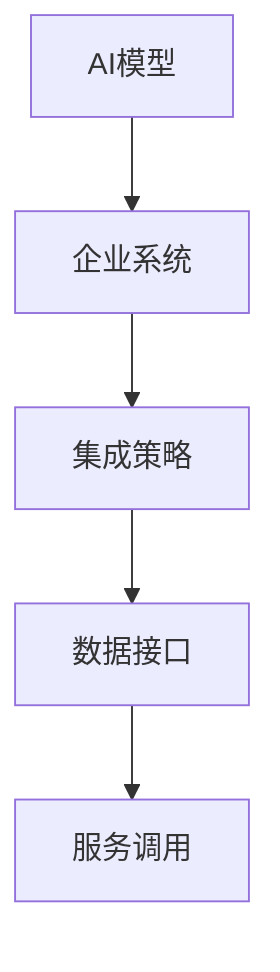
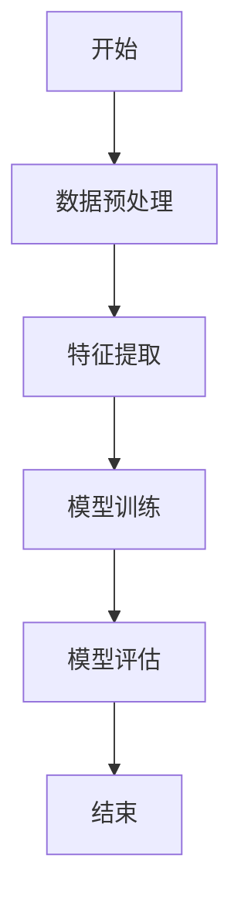
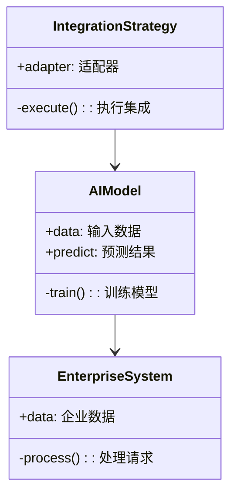
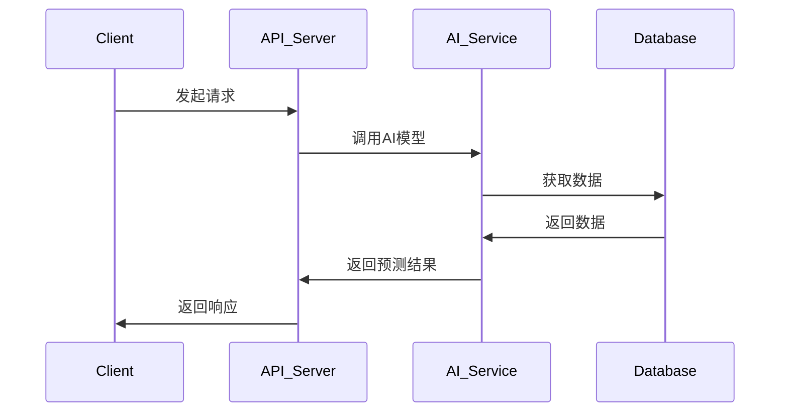

                 


# 企业级AI模型的集成策略：无缝对接现有系统

**关键词**：企业级AI模型，系统集成，AI技术，企业系统，集成策略

**摘要**：本文详细探讨了在企业数字化转型中，如何将AI模型无缝集成到现有系统中的策略。通过分析核心概念、算法原理、系统架构设计和项目实战，本文为企业提供了具体的集成方法和实现步骤，帮助企业在不中断现有业务的情况下，充分利用AI技术提升效率。

---

# 第一部分: 企业级AI模型集成的背景与概念

## 第1章: 企业级AI模型集成的背景与问题背景

### 1.1 企业级AI模型集成的背景
#### 1.1.1 企业数字化转型与AI技术的结合
企业正在加速数字化转型，AI技术成为推动业务创新的核心力量。如何将AI模型与现有系统无缝集成，是企业面临的关键挑战。

#### 1.1.2 当前企业系统集成的主要挑战
传统企业系统通常复杂且多样化，集成AI模型需要解决数据孤岛、接口兼容性、性能优化等问题。

#### 1.1.3 企业级AI模型集成的必要性
AI模型能够提升企业决策效率、优化业务流程，但其价值只有在与现有系统无缝对接时才能最大化。

### 1.2 问题背景与问题描述
#### 1.2.1 传统企业系统集成的主要问题
现有系统可能采用多种技术栈，数据格式和接口标准不统一，导致集成复杂性高。

#### 1.2.2 AI模型集成的核心问题
AI模型对计算资源需求高，且模型更新频繁，如何保证实时性与稳定性是关键。

#### 1.2.3 企业级AI模型集成的目标与边界
目标是在不中断业务的情况下，实现AI模型与现有系统的高效交互；边界包括数据隔离、性能优化和安全合规。

---

# 第二部分: 企业级AI模型集成的核心概念与联系

## 第2章: 核心概念与概念联系

### 2.1 核心概念原理
#### 2.1.1 AI模型的核心原理
AI模型通过训练数据生成预测结果，需要与企业系统进行数据交互和功能调用。

#### 2.1.2 企业系统集成的核心原理
企业系统集成涉及数据流、服务调用和资源管理，确保各模块协同工作。

#### 2.1.3 集成策略的核心原理
集成策略通过优化数据接口和资源分配，平衡AI模型的性能与系统稳定性。

### 2.2 概念属性特征对比
| 概念 | 属性 | 特征 |
|------|------|------|
| AI模型 | 数据需求 | 高实时性、高准确性 |
| 企业系统 | 技术架构 | 多平台支持、可扩展性 |
| 集成策略 | 实现方式 | 适应性、可维护性 |

### 2.3 ER实体关系图架构


### 2.4 本章小结
本章通过核心概念的分析，明确了AI模型、企业系统和集成策略之间的关系，为后续的算法设计和系统架构提供了理论基础。

---

# 第三部分: 企业级AI模型集成的算法原理

## 第3章: 算法原理与流程图

### 3.1 算法原理
#### 3.1.1 特征提取与数据预处理
从企业系统中提取相关特征，进行数据清洗和格式转换，确保AI模型能够处理。

#### 3.1.2 模型训练与优化
使用训练数据训练AI模型，并通过调参优化模型性能。

#### 3.1.3 模型评估与调优
通过评估指标（如准确率、召回率）评估模型性能，并进行持续优化。

### 3.2 算法流程图


### 3.3 算法实现代码
```python
def train_model(data, labels):
    # 数据预处理
    processed_data = preprocess(data)
    # 特征提取
    features = extract_features(processed_data)
    # 模型训练
    model = train(features, labels)
    return model
```

### 3.4 数学模型与公式
#### 3.4.1 损失函数
$$ L = \frac{1}{n}\sum_{i=1}^{n}(y_i - \hat{y}_i)^2 $$
其中，$y_i$ 是真实值，$\hat{y}_i$ 是预测值。

#### 3.4.2 评估指标
$$ accuracy = \frac{\text{正确预测数}}{\text{总预测数}} $$

### 3.5 示例说明
#### 3.5.1 数据预处理示例
将原始数据中的缺失值填充为均值。

#### 3.5.2 模型训练与评估示例
使用训练数据训练模型，并在验证集上评估准确率。

### 3.6 本章小结
本章通过算法流程图和代码示例，详细讲解了AI模型集成的实现步骤，为后续系统架构设计奠定了基础。

---

# 第四部分: 企业级AI模型集成的系统架构设计

## 第4章: 系统分析与架构设计

### 4.1 项目背景介绍
企业在数字化转型中，需要将AI模型集成到现有系统中，以提升业务效率。

### 4.2 系统功能设计
#### 4.2.1 领域模型类图


### 4.3 系统架构设计
#### 4.3.1 系统架构图


### 4.4 系统接口设计
定义统一的API接口，确保AI模型与企业系统之间的数据交互符合标准。

### 4.5 系统交互流程图


### 4.6 本章小结
本章通过系统架构设计，明确了AI模型集成的整体结构和交互流程，为项目实施提供了指导。

---

# 第五部分: 企业级AI模型集成的项目实战

## 第5章: 项目实战与案例分析

### 5.1 环境安装与配置
安装必要的开发工具和依赖库，如Python、TensorFlow、Flask等。

### 5.2 核心代码实现
#### 5.2.1 适配器实现
```python
class Adapter:
    def __init__(self, model):
        self.model = model

    def predict(self, input):
        return self.model.predict(input)
```

#### 5.2.2 API接口实现
```python
from flask import Flask, request, jsonify

app = Flask(__name__)

@app.route('/predict', methods=['POST'])
def predict():
    data = request.json['data']
    result = adapter.predict(data)
    return jsonify({'result': result})

if __name__ == '__main__':
    app.run()
```

### 5.3 案例分析与解读
以一个实际案例为例，详细讲解AI模型如何与企业系统集成，包括数据流、服务调用和结果反馈。

### 5.4 项目小结
总结项目实施过程中的关键点，提出改进建议。

---

# 第六部分: 总结与展望

## 第6章: 总结与展望

### 6.1 核心内容总结
本文详细讲解了企业级AI模型集成的策略与方法，包括背景分析、算法设计、系统架构和项目实战。

### 6.2 未来展望与改进建议
随着AI技术的发展，未来的集成策略将更加智能化和自动化，建议企业持续关注技术动态，优化集成方案。

### 6.3 注意事项与最佳实践
在集成过程中，应注重数据安全、性能优化和系统稳定性，确保AI模型的高效运行。

### 6.4 拓展阅读
推荐相关的技术书籍和论文，供读者深入学习。

---

# 作者

作者：AI天才研究院/AI Genius Institute & 禅与计算机程序设计艺术/Zen And The Art of Computer Programming

---

通过以上详细的大纲，可以清晰地看到文章的结构和内容安排。每一部分都围绕企业级AI模型的集成策略展开，从理论到实践，逐步深入，确保读者能够全面理解和掌握相关知识。

