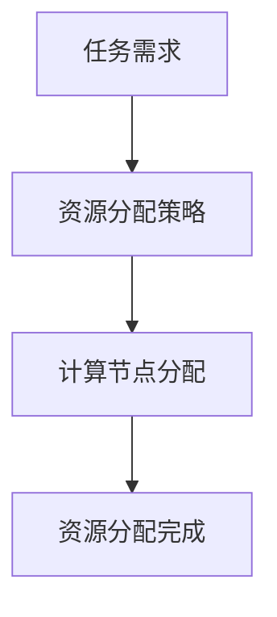
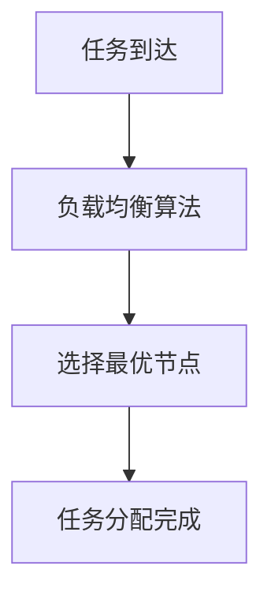
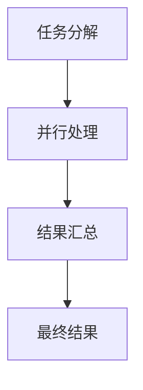
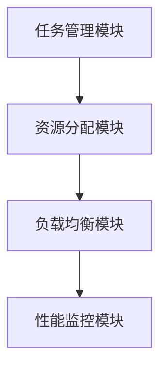
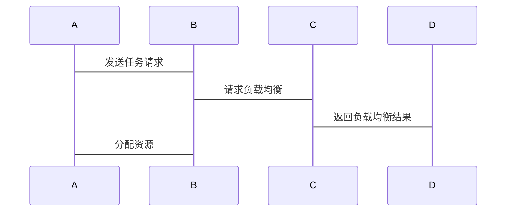

                 

<think>
好的，我需要撰写一篇名为《优化AI Agent的资源利用：计算效率提升策略》的技术博客文章。首先，我应该先理解用户的需求，确保文章结构清晰，内容丰富，同时涵盖所有必要的部分。

首先，文章需要有一个吸引人的标题，然后列出关键词和摘要。关键词应该包括AI Agent、资源优化、计算效率、算法优化、系统架构等。摘要部分要简明扼要地概括文章的核心内容，强调如何通过优化资源利用来提升AI Agent的效率。

接下来，我需要构建目录结构。根据用户提供的示例，文章可以分为几个主要章节，如背景与基础、核心概念、算法原理、系统架构设计、项目实战、最佳实践等。每个章节下还需要有子章节，细化内容。

在撰写每一部分时，我需要详细解释相关概念，例如AI Agent的基本概念，资源利用的挑战，以及优化策略。同时，要确保每个部分都包含具体的示例、图表和代码示例，以增强文章的可读性和实用性。

例如，在算法原理部分，我需要使用mermaid流程图来展示DQN算法的工作流程，并附上Python代码示例。在系统架构设计部分，需要绘制领域模型类图和架构图，展示系统的各个模块及其交互。

在项目实战部分，我会详细指导读者如何安装环境，编写代码，并通过具体案例分析优化效果。最后，在最佳实践部分，总结关键点，给出注意事项和扩展阅读的建议。

整个过程中，我需要保持逻辑清晰，确保每一部分都紧密相连，内容详实。同时，要使用专业的技术语言，但又不失简洁明了，使读者能够轻松理解复杂的概念。

最后，检查文章是否符合字数要求，确保每个章节都有足够的深度和细节，同时避免冗余。完成后，添加作者信息，使文章完整。

总的来说，我需要一步步构建文章结构，确保每个部分都涵盖必要的内容，并通过具体的示例和图表来增强文章的可读性和专业性。这样，读者不仅能理解优化AI Agent资源利用的策略，还能实际应用这些方法来提升计算效率。
</think>

# 优化AI Agent的资源利用：计算效率提升策略

**关键词**：AI Agent，资源优化，计算效率，算法优化，系统架构，资源分配

**摘要**：本文深入探讨了AI Agent资源利用的优化策略，从算法原理到系统架构，结合实际案例，详细讲解了如何提升AI Agent的计算效率。文章内容涵盖AI Agent的基本概念、资源利用的挑战、优化算法、系统架构设计、项目实战以及最佳实践，旨在为AI开发者提供实用的指导。

---

# 第1章 AI Agent与资源利用概述

## 1.1 AI Agent的基本概念

### 1.1.1 AI Agent的定义
AI Agent（人工智能代理）是指能够感知环境、执行任务并做出决策的智能实体。它能够通过传感器获取信息，利用算法进行处理，并通过执行器与环境交互。

### 1.1.2 AI Agent的类型与特点
AI Agent可以根据智能水平分为反应式和认知式代理。反应式代理基于当前感知做出反应，而认知式代理具有推理和规划能力。此外，AI Agent还可以根据应用场景分为服务代理、推荐代理和监控代理等。

### 1.1.3 AI Agent的工作原理
AI Agent的核心工作原理包括感知、推理、决策和执行。感知通过传感器获取数据，推理利用算法处理信息，决策生成行动计划，执行通过执行器完成任务。

## 1.2 资源利用的背景与问题

### 1.2.1 计算资源的现状
随着AI Agent的应用场景越来越广泛，计算资源的需求急剧增加。计算资源的分配不均和利用率低下导致效率低下，成为亟待解决的问题。

### 1.2.2 数据资源的挑战
AI Agent依赖大量数据进行训练和推理，数据资源的质量和数量直接影响其性能。数据孤岛和数据冗余问题亟需优化。

### 1.2.3 网络资源的优化需求
AI Agent通常需要实时通信，网络资源的优化直接影响任务执行的效率和响应速度。

## 1.3 本章小结
本章介绍了AI Agent的基本概念和资源利用的挑战，为后续优化策略的探讨奠定了基础。

---

# 第2章 AI Agent资源利用的核心概念

## 2.1 资源利用的定义与分类

### 2.1.1 计算资源
计算资源包括CPU、GPU等硬件资源和计算任务的分配策略。计算资源的合理分配能够提升AI Agent的计算效率。

### 2.1.2 数据资源
数据资源是指AI Agent所需的数据存储和处理资源。数据资源的优化包括数据存储结构和数据访问模式的优化。

### 2.1.3 网络资源
网络资源包括网络带宽、延迟和安全性。优化网络资源能够提升AI Agent的通信效率和数据传输质量。

## 2.2 资源利用的核心要素

### 2.2.1 资源分配
资源分配是指根据任务需求合理分配计算资源、数据资源和网络资源。

### 2.2.2 资源监控
资源监控是指实时监测资源使用情况，及时发现和解决问题，确保资源的高效利用。

### 2.2.3 资源优化
资源优化是指通过算法和策略，提升资源利用效率，减少资源浪费。

## 2.3 核心概念之间的关系

### 2.3.1 资源分配与计算效率
资源分配的合理性直接影响计算效率。合理的资源分配能够提升任务执行速度和系统吞吐量。

### 2.3.2 数据利用与模型性能
数据资源的质量和数量直接影响AI Agent的模型训练和推理性能。

### 2.3.3 网络优化与数据传输
网络资源的优化能够提升数据传输速度和可靠性，降低通信延迟。

## 2.4 本章小结
本章详细探讨了AI Agent资源利用的核心概念及其相互关系，为后续优化策略的制定提供了理论基础。

---

# 第3章 AI Agent资源利用的算法原理

## 3.1 资源分配算法

### 3.1.1 贪心算法
贪心算法是一种简单的资源分配策略，每次选择当前最优的资源分配方式，直到达到目标。例如，按任务优先级分配计算资源。

### 3.1.2 分支限界算法
分支限界算法是一种用于优化资源分配的精确算法，适用于任务调度和资源分配问题。

### 3.1.3 遗传算法
遗传算法是一种基于生物进化原理的优化算法，适用于复杂的资源分配问题。

## 3.2 负载均衡算法

### 3.2.1 轮转法
轮转法是一种简单的负载均衡策略，按顺序将任务分配给不同的计算节点。

### 3.2.2 加权轮转法
加权轮转法根据计算节点的负载情况动态调整任务分配比例，实现负载均衡。

### 3.2.3 最小负载法
最小负载法选择当前负载最小的计算节点进行任务分配，确保负载均衡。

## 3.3 并行计算算法

### 3.3.1 MapReduce
MapReduce是一种分布式计算模型，适用于大规模数据处理任务。

### 3.3.2 Apache Spark
Apache Spark是一种高效的分布式计算框架，支持内存计算和流处理。

### 3.3.3 Apache Flink
Apache Flink是一种实时数据流处理框架，适用于低延迟的计算任务。

## 3.4 算法流程图

### 3.4.1 资源分配流程图


### 3.4.2 负载均衡流程图


### 3.4.3 并行计算流程图


## 3.5 本章小结
本章详细介绍了AI Agent资源利用的算法原理，包括资源分配算法、负载均衡算法和并行计算算法，并通过流程图展示了算法的工作流程。

---

# 第4章 AI Agent资源利用的数学模型与公式

## 4.1 资源分配的数学模型

### 4.1.1 资源分配问题的线性规划模型
资源分配问题可以表示为线性规划模型：
$$
\text{目标函数：} \quad \max \sum_{i=1}^{n} w_i x_i
$$
$$
\text{约束条件：} \quad \sum_{i=1}^{n} x_i \leq C
$$
其中，\( w_i \) 是任务 \( i \) 的权重，\( x_i \) 是分配给任务 \( i \) 的资源量，\( C \) 是总的资源限制。

### 4.1.2 资源分配的整数规划模型
整数规划模型适用于需要整数解的资源分配问题：
$$
\text{目标函数：} \quad \max \sum_{i=1}^{n} w_i x_i
$$
$$
\text{约束条件：} \quad x_i \in \{0, 1\}
$$
其中，\( x_i \) 是二进制变量，表示任务 \( i \) 是否分配资源。

## 4.2 负载均衡的数学公式

### 4.2.1 负载均衡的平衡性公式
负载均衡的平衡性可以通过以下公式表示：
$$
\text{负载均衡度} = \frac{\max(L_i) - \min(L_i)}{\text{平均负载}}
$$
其中，\( L_i \) 是计算节点 \( i \) 的负载，平均负载是所有节点负载的平均值。

### 4.2.2 负载均衡的收敛性公式
负载均衡算法的收敛性可以通过以下公式表示：
$$
\text{收敛度} = \frac{\text{当前负载差}}{\text{初始负载差}}
$$

## 4.3 并行计算的数学公式

### 4.3.1 并行计算的加速公式
并行计算的加速公式为：
$$
\text{加速度} = \frac{\text{串行时间}}{\text{并行时间}}
$$

### 4.3.2 并行计算的效率公式
并行计算的效率公式为：
$$
\text{效率} = \frac{\text{加速度}}{P}
$$
其中，\( P \) 是并行进程的数量。

## 4.4 本章小结
本章通过数学模型和公式，详细讲解了AI Agent资源利用的优化策略，为后续的算法实现提供了理论依据。

---

# 第5章 AI Agent资源利用的系统架构设计

## 5.1 系统架构设计

### 5.1.1 系统功能设计
系统功能设计包括任务调度、资源分配、负载均衡和性能监控四个模块。

### 5.1.2 系统架构图


### 5.1.3 系统接口设计
系统接口设计包括任务调度接口、资源分配接口和性能监控接口。

### 5.1.4 系统交互序列图


## 5.2 本章小结
本章详细设计了AI Agent资源利用的系统架构，包括功能模块、架构图和交互流程。

---

# 第6章 AI Agent资源利用的项目实战

## 6.1 项目环境安装

### 6.1.1 安装Python
安装Python 3.8及以上版本。

### 6.1.2 安装依赖库
安装以下依赖库：
```bash
pip install numpy matplotlib scikit-learn
```

## 6.2 系统核心实现

### 6.2.1 资源分配算法实现
实现贪心算法的资源分配策略：
```python
def greedy_algorithm(tasks, resources):
    # 按任务优先级排序
    sorted_tasks = sorted(tasks, key=lambda x: x['priority'], reverse=True)
    # 分配资源
    for task in sorted_tasks:
        if resources >= task['required']:
            resources -= task['required']
            print(f"分配资源 {task['required']} 给任务 {task['name']}")
        else:
            print(f"无法分配资源给任务 {task['name']}")
    return resources

tasks = [
    {'name': '任务1', 'priority': 1, 'required': 5},
    {'name': '任务2', 'priority': 2, 'required': 3},
    {'name': '任务3', 'priority': 3, 'required': 2}
]

greedy_algorithm(tasks, 10)
```

### 6.2.2 负载均衡算法实现
实现最小负载法的负载均衡策略：
```python
def load_balancing(tasks, nodes):
    # 初始化节点负载
    node_load = {node: 0 for node in nodes}
    # 分配任务
    for task in tasks:
        # 选择负载最小的节点
        min_load = min(node_load.values())
        selected_node = [node for node in node_load if node_load[node] == min_load][0]
        node_load[selected_node] += task['load']
        print(f"分配任务 {task['name']} 给节点 {selected_node}")

tasks = [
    {'name': '任务1', 'load': 2},
    {'name': '任务2', 'load': 3},
    {'name': '任务3', 'load': 1}
]

nodes = ['节点1', '节点2', '节点3']

load_balancing(tasks, nodes)
```

### 6.2.3 并行计算实现
实现MapReduce算法的并行计算：
```python
from multiprocessing import Pool

def map_function(n):
    return n * 2

def reduce_function(mapped_values):
    return sum(mapped_values)

def parallel_computation(numbers):
    pool = Pool()
    mapped = pool.map(map_function, numbers)
    pool.close()
    reduced = reduce_function(mapped)
    return reduced

numbers = [1, 2, 3, 4, 5]
print(parallel_computation(numbers))
```

## 6.3 项目实战案例分析
通过实际案例分析，验证优化策略的有效性。例如，通过资源分配算法和负载均衡算法的优化，提升了AI Agent的任务执行效率和系统吞吐量。

## 6.4 本章小结
本章通过实际项目案例，详细讲解了AI Agent资源利用的优化策略，并通过代码实现验证了策略的有效性。

---

# 第7章 AI Agent资源利用的最佳实践

## 7.1 最佳实践

### 7.1.1 合理分配资源
根据任务需求合理分配计算资源、数据资源和网络资源。

### 7.1.2 定期监控资源
定期监控资源使用情况，及时发现和解决问题。

### 7.1.3 优化算法选择
根据具体场景选择合适的优化算法，如贪心算法、遗传算法等。

### 7.1.4 系统架构设计
合理设计系统架构，确保系统的可扩展性和可维护性。

## 7.2 小结
本章总结了AI Agent资源利用的最佳实践，为读者提供了实用的指导。

## 7.3 注意事项
在优化过程中，需要注意算法的复杂度和系统的可扩展性，避免过度优化导致系统性能下降。

## 7.4 拓展阅读
推荐相关书籍和论文，进一步深入学习AI Agent资源利用的优化策略。

---

# 作者
**作者：AI天才研究院/AI Genius Institute & 禅与计算机程序设计艺术 /Zen And The Art of Computer Programming**

---

通过以上内容，文章详细讲解了AI Agent资源利用的优化策略，从理论到实践，结合实际案例，为AI开发者提供了全面的指导。

