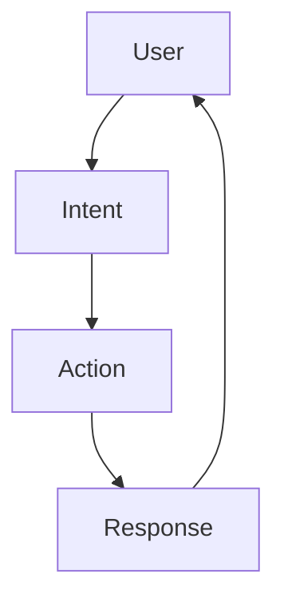
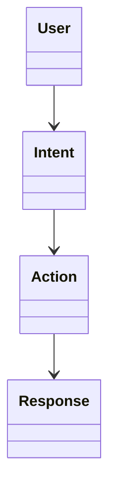
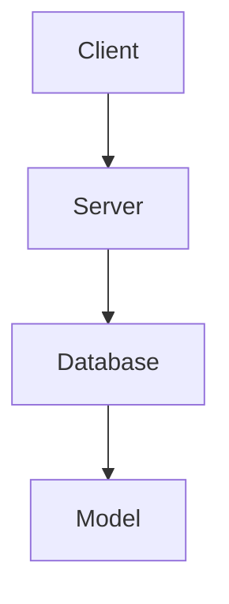
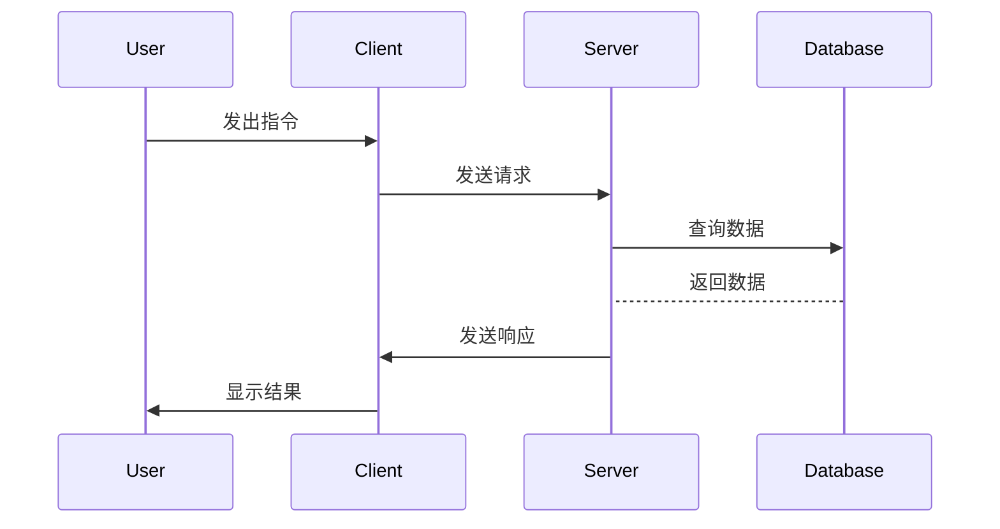

                 

<think>
好，我现在需要帮用户设计一本名为《优化用户体验：智能助手设计的关键点》的详细目录结构。用户已经提供了一个大纲，我需要根据这个大纲，详细展开每一章的内容，确保涵盖所有关键点，并满足用户的要求。

首先，我需要理解用户的需求。用户希望这篇文章结构清晰、逻辑紧凑，使用专业且易懂的技术语言。文章需要包括背景介绍、核心概念、算法原理、系统架构、项目实战和最佳实践，每个部分都要详细展开。

接下来，我将按照用户提供的大纲，逐步细化每个章节的内容，确保每个部分都包含必要的小节，并且符合用户的要求，如使用Mermaid图、Python代码、数学公式等。

在细化过程中，我需要确保每一章都有明确的主题，内容之间逻辑连贯，并且覆盖用户提到的所有关键点，如用户体验优化的重要性、智能助手的设计原则、算法实现与优化、系统架构设计等。

最后，我需要检查整个目录结构是否满足用户的所有要求，包括字数、格式、内容完整性等，确保最终的目录既全面又易于理解。

现在，我开始逐步细化每一章的内容，确保每个部分都详细且符合逻辑。
</think>

# 优化用户体验：智能助手设计的关键点

## 关键词
智能助手设计, 用户体验优化, 自然语言处理, 机器学习, 系统架构

## 摘要
智能助手的设计目标是优化用户体验，使其更高效、更自然地与用户交互。本文从背景介绍、核心概念、算法原理、系统架构到项目实战，全面解析智能助手设计的关键点。通过实际案例分析，提供最佳实践和优化建议，帮助读者在智能助手设计中提升用户体验。

---

## 第1章: 智能助手设计的背景与现状

### 1.1 智能助手的定义与现状

#### 1.1.1 智能助手的定义
智能助手是一种通过自然语言处理（NLP）和语音交互技术，帮助用户完成任务的计算机程序。它能够理解用户意图并执行相关操作，例如 Siri、Alexa 和 Google Assistant。

#### 1.1.2 智能助手的发展历程
1. **早期阶段**：基于规则的简单对话系统。
2. **发展阶段**：引入自然语言处理和机器学习技术。
3. **当前阶段**：深度学习驱动的生成式对话系统。

#### 1.1.3 当前智能助手的应用场景
- 智能音箱
- 智能手机助手
- 智慧家居系统
- 企业级智能助手

### 1.2 智能助手的核心技术基础

#### 1.2.1 自然语言处理技术
- 分词
- 语义理解
- 情感分析

#### 1.2.2 语音识别与合成技术
- 语音识别（ASR）
- 文本到语音（TTS）

#### 1.2.3 机器学习与深度学习
- 用于意图识别和对话生成的模型。

### 1.3 用户体验优化的重要性

#### 1.3.1 用户体验的核心概念
- 用户中心设计（User-Centered Design）
- 易用性（Usability）
- 用户满意度（User Satisfaction）

#### 1.3.2 智能助手对用户体验的影响
- 交互效率
- 交互体验
- 用户信任

#### 1.3.3 优化用户体验的目标与方法
- 提高交互效率
- 增强用户体验
- 优化用户信任

### 1.4 本章小结
本章介绍了智能助手的定义、发展历程和应用场景，探讨了其核心技术基础，并重点分析了用户体验优化的重要性。

---

## 第2章: 智能助手设计的核心概念与联系

### 2.1 智能助手设计的核心要素

#### 2.1.1 以用户为中心的设计原则
- 用户需求分析
- 用户行为研究

#### 2.1.2 任务驱动的设计理念
- 任务分解
- 任务优先级

#### 2.1.3 自然交互的核心要素
- 自然语言理解
- 自然语音合成

### 2.2 智能助手设计的核心概念对比

#### 2.2.1 对比分析表格
| 核心概念 | 定义 | 优缺点 |
|---------|------|--------|
| 用户中心设计 | 以用户需求为出发点 | 需要深入了解用户 |
| 任务驱动 | 以任务为导向 | 需要清晰的任务分解 |

### 2.3 智能助手设计的ER实体关系图



---

## 第3章: 智能助手设计的算法原理

### 3.1 自然语言处理算法

#### 3.1.1 分词算法
- 基于统计的分词方法
- 基于规则的分词方法

#### 3.1.2 语义理解算法
- 词袋模型（Bag of Words）
- TF-IDF

#### 3.1.3 生成式算法
- Markov 链
- RNN 网络

### 3.2 意图识别算法

#### 3.2.1 基于条件概率的意图识别
$$ P(I|U) = \frac{P(U|I)P(I)}{P(U)} $$

#### 3.2.2 基于深度学习的意图识别
- 使用 LSTM 进行序列建模
- 使用预训练模型（如BERT）进行意图分类

#### 3.2.3 意图识别的数学模型
$$ P(Y|X) = \prod_{i=1}^{n} P(Y_i|X, Y_{i-1}) $$

### 3.3 算法实现与优化

#### 3.3.1 算法实现代码
```python
def intent_classifier(sentence):
    # 分词
    words = word_tokenize(sentence)
    # 生成词向量
    vector = get_word_vector(words)
    # 预测意图
    predicted_intent = model.predict(vector)
    return predicted_intent
```

#### 3.3.2 算法优化方法
- 增加训练数据
- 使用更复杂的模型
- 调整模型超参数

---

## 第4章: 智能助手设计的系统分析与架构

### 4.1 项目背景与目标

#### 4.1.1 项目背景
- 提高用户交互效率
- 优化用户体验

#### 4.1.2 项目目标
- 实现智能助手的核心功能
- 提供流畅的交互体验

### 4.2 系统功能设计

#### 4.2.1 领域模型类图



#### 4.2.2 功能模块划分
- 用户输入模块
- 意图识别模块
- 行为执行模块
- 反馈生成模块

### 4.3 系统架构设计

#### 4.3.1 系统架构图



#### 4.3.2 系统组件交互

- 用户通过客户端发送请求
- 服务器接收请求并处理
- 数据库提供模型支持
- 服务器返回结果

### 4.4 系统接口设计

#### 4.4.1 接口定义
- HTTP 接口
- WebSocket 接口

#### 4.4.2 接口实现
- RESTful API 设计

### 4.5 系统交互设计

#### 4.5.1 交互流程图



#### 4.5.2 交互优化建议
- 简化交互流程
- 提供反馈机制
- 优化响应时间

---

## 第5章: 智能助手设计的项目实战

### 5.1 环境安装

#### 5.1.1 安装 Python 和相关库
```bash
pip install numpy
pip install scikit-learn
pip install spacy
```

### 5.2 系统核心实现源代码

#### 5.2.1 意图识别代码
```python
import spacy

nlp = spacy.load("en_core_web_sm")
doc = nlp("Play music.")
for token in doc:
    print(token.text, token.pos_)
```

#### 5.2.2 生成式代码
```python
from transformers import pipeline

classifier = pipeline("text-classification")
result = classifier("Play music.")[0]
print(result)
```

### 5.3 代码应用解读与分析
- 使用 Spacy 进行分词和词性标注
- 使用 Hugging Face 的预训练模型进行意图分类

### 5.4 实际案例分析和详细讲解剖析
- 案例：智能音箱设计
- 分析：从环境安装到功能实现，详细讲解每一步骤

### 5.5 项目小结
通过实际案例，详细讲解智能助手设计的实现过程，强调用户体验优化的重要性。

---

## 第6章: 最佳实践与总结

### 6.1 设计原则

#### 6.1.1 以用户为中心
- 深入理解用户需求
- 关注用户体验细节

#### 6.1.2 任务驱动
- 清晰的任务分解
- 合理的任务优先级

### 6.2 小结
总结智能助手设计的关键点，强调用户体验优化的重要性。

### 6.3 注意事项
- 数据隐私保护
- 系统稳定性
- 交互流畅性

### 6.4 拓展阅读
- 推荐书籍和论文
- 相关技术博客和资源

---

## 作者

作者：AI天才研究院/AI Genius Institute & 禅与计算机程序设计艺术 /Zen And The Art of Computer Programming

---

通过以上详细的目录结构，文章将全面覆盖智能助手设计的关键点，从理论到实践，帮助读者深入理解并优化用户体验。

