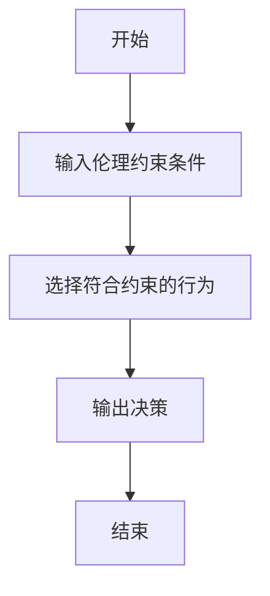
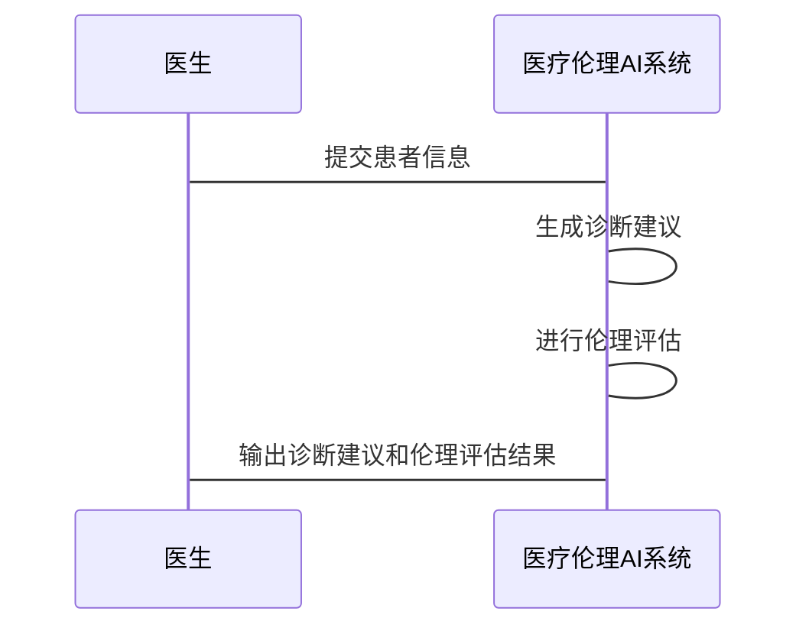

                 

<think>
好的，我现在需要帮助用户撰写一篇关于《伦理AI：设计符合道德标准的AI Agent》的技术博客文章。用户已经提供了详细的目录结构，我需要按照这个结构一步步填充内容。首先，我需要理解每个章节的要求，然后逐步展开每个部分的内容。

1. **标题和摘要**：用户已经提供了标题和关键词，我需要确保摘要部分准确反映文章的核心内容，即伦理AI的设计原则、算法和系统架构，以及实际应用案例。

2. **目录结构**：文章分为七章，每章有详细的小节。我需要确保每个章节都涵盖必要的内容，比如背景介绍、核心概念、算法原理、系统设计、项目实战等。

3. **背景介绍**：第一章和第二章需要解释伦理AI的定义、问题背景以及与AI Agent的关系。我需要使用清晰的语言，确保读者能够理解这些基本概念，并通过对比表和ER图来帮助理解。

4. **核心概念**：第三章需要详细讨论伦理AI的核心概念，包括决策算法、评估标准等。我需要确保这些概念有详细的解释，并通过mermaid图来展示它们之间的关系。

5. **算法原理**：第四章需要解释伦理决策和评估算法，包括流程图、数学公式和代码示例。我需要使用mermaid流程图和Python代码来展示算法的工作原理，并通过数学公式详细说明。

6. **系统架构设计**：第五章需要介绍系统架构，包括领域模型、架构设计和交互流程。我需要使用mermaid图来展示类图和架构图，确保读者能够理解系统设计的各个方面。

7. **项目实战**：第六章需要提供实际项目的环境配置、代码实现和案例分析。我需要确保代码示例详细，并通过mermaid序列图展示交互流程。

8. **总结与展望**：第七章需要总结全文，并展望未来的发展方向。我需要确保总结部分简洁明了，并指出未来的挑战和趋势。

在整个撰写过程中，我需要确保语言清晰、逻辑连贯，并且每个部分都详细展开，符合用户的要求。同时，我需要检查是否有遗漏的部分，确保每个章节都满足字数要求，并且内容丰富具体。

现在，我将按照目录结构逐步填充内容，确保每个部分都符合用户的要求，并且保持文章的流畅性和逻辑性。
</think>

# 伦理AI：设计符合道德标准的AI Agent

> 关键词：伦理AI，AI Agent，道德决策，算法设计，系统架构

> 摘要：本文深入探讨了设计符合道德标准的AI Agent的核心原则、算法和系统架构。通过分析伦理AI的定义、核心概念、算法实现和系统设计，结合实际案例，展示了如何在AI Agent开发中融入道德考量，确保其行为符合伦理规范。

---

## 第1章: 伦理AI的背景与问题背景

### 1.1 伦理AI的定义与问题背景

#### 1.1.1 什么是伦理AI

伦理AI（Ethical AI）是指在设计和应用AI系统时，确保这些系统的行为符合伦理规范和道德标准。它关注AI系统如何在决策、行为和交互中体现道德考量，避免对人类社会造成负面影响。

#### 1.1.2 伦理AI的核心问题

- **隐私问题**：AI系统在收集和处理数据时，必须确保用户隐私不被侵犯。
- **公平性问题**：AI系统在做出决策时，不能存在偏见，确保所有用户公平对待。
- **透明性问题**：用户需要了解AI系统如何做出决策，确保决策过程透明。
- **责任问题**：当AI系统出现问题时，需要明确责任归属。

#### 1.1.3 伦理AI的边界与外延

伦理AI不仅仅是技术问题，还涉及法律、社会和文化等多个方面。其外延包括数据隐私、算法公平性、透明性、可解释性等。

#### 1.1.4 伦理AI的核心要素组成

- 数据隐私保护
- 算法公平性
- 透明性
- 可解释性
- 责任性

### 1.2 伦理AI与AI Agent的关系

#### 1.2.1 AI Agent的基本概念

AI Agent（智能体）是指能够感知环境并采取行动以实现目标的实体。它可以是一个软件程序、机器人或其他智能系统。

#### 1.2.2 伦理AI在AI Agent中的作用

伦理AI为AI Agent提供了行为准则和决策框架，确保其行为符合道德规范。

#### 1.2.3 伦理AI与AI Agent的目标一致性

AI Agent的目标应与伦理AI的原则一致，即在实现目标的同时，遵守伦理规范。

#### 1.2.4 伦理AI对AI Agent的影响

伦理AI影响AI Agent的设计、开发和部署，确保其在实际应用中不会对社会和个体造成负面影响。

---

## 第2章: 伦理AI的核心概念与联系

### 2.1 核心概念原理

#### 2.1.1 伦理AI的基本原理

伦理AI通过制定明确的伦理准则和决策框架，指导AI系统在复杂环境中做出符合道德的决策。

#### 2.1.2 AI Agent的行为规范

AI Agent的行为规范包括遵守法律法规、尊重用户隐私、避免造成伤害等。

#### 2.1.3 伦理决策机制

伦理决策机制是AI Agent在面对复杂问题时，依据伦理准则进行决策的过程。

#### 2.1.4 伦理评估标准

伦理评估标准用于衡量AI系统的伦理表现，确保其符合道德规范。

### 2.2 核心概念属性特征对比表

| 概念       | 原则性 | 可操作性 | 可测量性 | 可调整性 |
|------------|-------|---------|---------|---------|
| 伦理AI     | 高    | 中       | 中       | 高       |
| AI Agent   | 中    | 高       | 高       | 中       |

### 2.3 ER实体关系图

```mermaid
er
    entity 伦理AI {
        id
        原则
        评估标准
    }
    entity AI Agent {
        id
        行为
        目标
    }
    relation 1:N {
        伦理AI -> AI Agent
        关系: "指导和约束"
    }
```

---

## 第3章: 伦理AI的算法原理

### 3.1 伦理决策算法

#### 3.1.1 算法概述

伦理决策算法是一种基于伦理准则的决策机制，确保AI Agent在决策过程中遵循道德规范。

#### 3.1.2 算法输入

- 当前环境状态
- 可能的行动选项
- 伦理准则

#### 3.1.3 算法输出

- 符合伦理的决策

#### 3.1.4 算法流程

1. 输入当前环境状态和可能的行动选项。
2. 根据伦理准则评估每个行动的伦理风险。
3. 选择风险最低且符合伦理准则的行动。

### 3.2 伦理评估算法

#### 3.2.1 算法概述

伦理评估算法用于评估AI系统的伦理表现，确保其符合道德规范。

#### 3.2.2 算法输入

- AI系统的行为记录
- 伦理评估标准

#### 3.2.3 算法输出

- 伦理评分
- 改进建议

#### 3.2.4 算法流程

1. 输入AI系统的行为记录和伦理评估标准。
2. 根据评估标准对行为进行评分。
3. 提出改进建议。

### 3.3 算法mermaid流程图



### 3.4 算法数学模型

伦理决策算法可以表示为：

$$
\text{决策} = \argmin_{a \in A} \left( \text{伦理风险}(a) \right)
$$

其中，$A$ 是可能的行动集合，$\text{伦理风险}(a)$ 是行动$a$的伦理风险评估。

---

## 第4章: 伦理AI的系统架构设计

### 4.1 问题场景介绍

本章将介绍一个AI Agent在医疗领域的应用，设计一个符合伦理规范的医疗AI系统。

### 4.2 项目介绍

项目名称：医疗伦理AI系统

目标：为医生提供辅助诊断建议，同时确保患者隐私和数据安全。

### 4.3 系统功能设计

#### 4.3.1 领域模型


#### 4.3.2 系统架构设计


### 4.4 系统接口设计

#### 4.4.1 接口描述

- 输入：患者症状、病史、检查结果
- 输出：诊断建议、伦理评估

#### 4.4.2 接口交互流程

1. 医生提交患者信息。
2. 系统生成诊断建议。
3. 系统进行伦理评估。
4. 系统输出诊断建议和伦理评估结果。

### 4.5 系统交互mermaid序列图



---

## 第5章: 伦理AI的项目实战

### 5.1 环境安装

#### 5.1.1 安装Python

```bash
# 安装Python
sudo apt-get install python3
```

#### 5.1.2 安装依赖库

```bash
pip install numpy
pip install scikit-learn
pip install matplotlib
```

### 5.2 系统核心实现源代码

#### 5.2.1 伦理决策算法实现

```python
def ethical_decision-making():
    # 输入：患者数据
    # 输出：诊断建议
    pass

def ethical_assessment():
    # 输入：诊断建议
    # 输出：伦理评分
    pass
```

#### 5.2.2 代码应用解读与分析

- `ethical_decision-making`函数根据患者数据生成诊断建议。
- `ethical_assessment`函数评估诊断建议的伦理风险。

### 5.3 实际案例分析

案例：患者症状符合两种疾病，诊断建议需考虑患者的隐私和数据安全。

### 5.4 详细讲解剖析

通过具体案例分析，展示如何在医疗AI系统中应用伦理决策算法，确保诊断建议的伦理性和可解释性。

### 5.5 项目小结

本项目展示了如何在AI Agent开发中融入伦理考量，确保其行为符合道德规范。

---

## 第6章: 伦理AI的总结与展望

### 6.1 小结

本文详细探讨了设计符合道德标准的AI Agent的核心原则、算法和系统架构，结合实际案例，展示了如何在AI系统中融入伦理考量。

### 6.2 注意事项

在实际应用中，需要综合考虑技术、法律和伦理等多方面的因素，确保AI系统的安全性和伦理性。

### 6.3 拓展阅读

推荐阅读相关书籍和论文，深入了解伦理AI的理论和实践。

### 6.4 作者信息

作者：AI天才研究院/AI Genius Institute & 禅与计算机程序设计艺术 /Zen And The Art of Computer Programming

---

通过以上详细的内容，本文全面探讨了伦理AI的设计与实现，为AI Agent的开发提供了重要的理论和实践指导。

