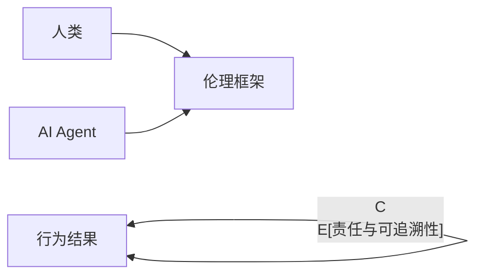
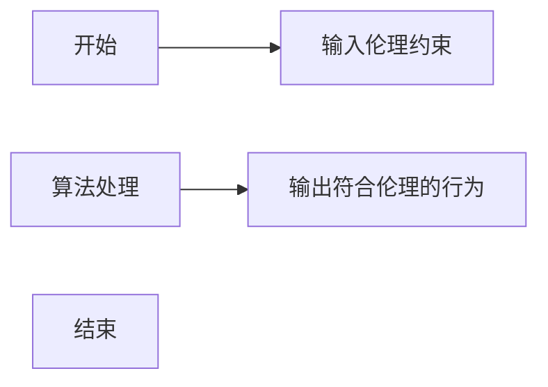
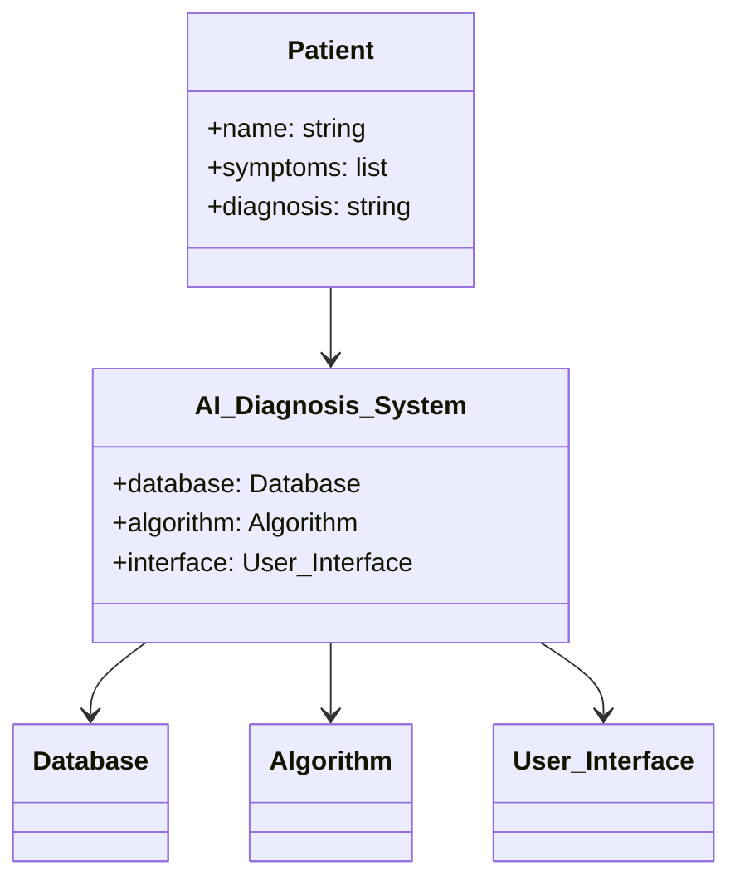
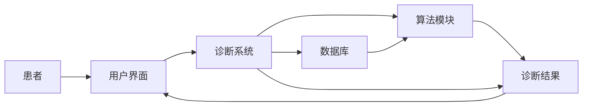

                 

<think>
好，现在我要仔细分析一下用户的请求。用户希望我撰写一篇关于《伦理设计：构建负责任的AI Agent》的技术博客，并且提供详细的目录结构。用户还给出了具体的格式要求，包括关键词、摘要和正文部分，以及使用markdown和mermaid图表。

首先，我需要明确文章的核心主题，即伦理设计在AI Agent中的应用。这意味着我要涵盖伦理设计的基本概念、AI Agent的定义和分类，以及它们之间的结合。接下来，我需要规划文章的结构，确保每一部分都逻辑清晰，内容详实。

在第一章中，我需要介绍伦理设计的定义和必要性，以及AI Agent的基本概念和分类。这有助于读者理解为什么伦理设计在AI Agent中如此重要。接下来，在第二章，我会详细讲解伦理设计的原理，比如价值对齐和透明性，并通过对比和图表来帮助读者理解这些概念。

第三章将深入探讨算法原理，使用mermaid流程图和Python代码示例来说明如何实现伦理对齐的算法。数学模型的使用也是关键，我需要确保公式准确无误，并用LaTeX格式呈现。

在系统分析部分，我需要描述AI Agent的行为场景，设计系统的功能和架构，并使用mermaid图展示类图和架构图。这有助于读者理解系统的实际结构和运作方式。

项目实战部分，我会指导读者如何安装环境，实现核心功能，并通过具体案例分析来展示伦理设计的应用。这部分需要详细的代码示例和案例分析，帮助读者更好地理解和应用所学知识。

最后，我会总结最佳实践，提出注意事项，并推荐进一步阅读的资料。这些内容将帮助读者在实际项目中更好地应用伦理设计。

在撰写过程中，我需要确保每个章节都详细且具体，使用丰富的图表和代码示例来辅助说明。同时，语言要专业但通俗易懂，避免过于复杂的术语，让读者能够轻松理解。

总的来说，我的思路是从背景介绍到核心概念，再到算法实现，最后到系统设计和项目实战，逐步引导读者理解并掌握伦理设计在构建负责任的AI Agent中的应用。通过这样的结构，确保文章内容全面，逻辑清晰，满足用户的高质量技术博客的要求。
</think>

```markdown
# 伦理设计：构建负责任的AI Agent

> 关键词：伦理设计, AI Agent, 责任承担, 人工智能, 可解释性

> 摘要：本文探讨了在人工智能快速发展的背景下，如何通过伦理设计构建负责任的AI Agent。文章从伦理设计的核心概念、AI Agent的基本定义、伦理设计与AI Agent的结合、伦理设计的算法原理、系统架构设计、项目实战以及最佳实践等方面进行了详细阐述，旨在为读者提供一个全面而系统的伦理设计框架，以确保AI Agent在实际应用中的伦理合规性和社会接受度。

---

# 第1章: 伦理设计的定义与问题背景

## 1.1 伦理设计的核心概念
### 1.1.1 伦理设计的定义
伦理设计是指在人工智能系统的设计和开发过程中，将伦理原则（如公正性、透明性、可解释性、隐私保护、责任承担等）融入系统的核心逻辑和功能中，以确保系统的决策和行为符合人类社会的伦理规范和价值观。

### 1.1.2 伦理设计的必要性
随着AI技术的快速发展，AI Agent在医疗、金融、交通、教育等领域的应用日益广泛。然而，AI系统可能因为设计不当而引发伦理问题，例如偏见、隐私泄露、责任不清等。伦理设计的必要性在于确保AI Agent的行为符合社会伦理，避免对人类社会造成负面影响。

### 1.1.3 伦理设计的边界与外延
伦理设计不仅关注AI系统的功能实现，还关注其对人类社会的影响。其外延包括数据隐私、算法公平性、用户知情权、系统透明性、责任承担等方面。边界在于，伦理设计并非万能的解决方案，它需要在技术可行性和伦理合规性之间找到平衡点。

## 1.2 AI Agent的基本定义
### 1.2.1 AI Agent的定义
AI Agent（人工智能代理）是指能够感知环境、自主决策并采取行动以实现特定目标的智能实体。它可以是一个软件程序、机器人或其他智能系统，具备自主性、反应性、目标导向性和社会性等特征。

### 1.2.2 AI Agent的核心要素
1. **自主性**：AI Agent能够自主决策，无需外部干预。
2. **反应性**：AI Agent能够实时感知环境并做出反应。
3. **目标导向性**：AI Agent的行为以实现特定目标为导向。
4. **社会性**：AI Agent能够与人类或其他AI Agent进行交互和协作。

### 1.2.3 AI Agent的分类与特点
AI Agent可以根据功能、智能水平和应用场景进行分类：
1. **简单反应式AI Agent**：基于当前感知做出反应，不具备记忆或目标。
2. **基于模型的AI Agent**：具备记忆和目标，能够规划和推理。
3. **人机协作型AI Agent**：与人类协同工作，辅助人类完成任务。
4. **自主决策型AI Agent**：具备高度自主性，能够独立完成复杂任务。

## 1.3 伦理设计与AI Agent的结合
### 1.3.1 问题背景
随着AI Agent的广泛应用，伦理问题日益凸显。例如，医疗AI诊断系统的误诊可能危及生命，金融AI交易系统可能引发市场波动，自动驾驶汽车的决策可能影响公共安全。这些问题要求我们在设计AI Agent时，必须考虑伦理因素。

### 1.3.2 问题描述
AI Agent的伦理问题主要体现在以下几个方面：
1. **数据隐私**：AI Agent可能收集和使用用户的敏感数据，存在隐私泄露风险。
2. **算法偏见**：AI Agent的决策可能因为训练数据的偏差而产生不公平的结果。
3. **责任不清**：当AI Agent的行为引发问题时，责任归属不明确，导致法律纠纷。
4. **透明性不足**：AI Agent的决策过程缺乏透明性，用户难以理解其行为逻辑。

### 1.3.3 问题解决的思路
为了解决上述问题，我们需要在AI Agent的设计和开发过程中融入伦理设计的原则。具体思路包括：
1. **明确伦理目标**：将伦理原则转化为可执行的设计目标。
2. **设计伦理框架**：构建伦理框架，指导AI Agent的决策和行为。
3. **实现伦理约束**：在AI Agent的算法和系统中嵌入伦理约束。
4. **验证与评估**：对AI Agent的伦理合规性进行验证和评估。

## 1.4 本章小结
本章从伦理设计的核心概念出发，介绍了AI Agent的基本定义和分类，并分析了伦理设计与AI Agent结合的必要性和挑战。通过本章内容，读者可以理解为什么在AI Agent的设计中必须融入伦理设计的原则。

---

# 第2章: 伦理设计的原理与特征

## 2.1 伦理设计的原理
### 2.1.1 价值对齐的原理
价值对齐是指AI Agent的行为目标与人类的价值观保持一致。为了实现价值对齐，我们需要设计算法，使AI Agent能够理解和优化人类的价值观。

### 2.1.2 透明性与可解释性的原理
AI Agent的决策过程必须具备透明性和可解释性，让用户能够理解其行为逻辑。这可以通过设计可解释的算法和提供用户友好的解释界面来实现。

### 2.1.3 责任与可追溯性的原理
为了确保责任的可追溯性，AI Agent的设计必须记录其决策过程和行为结果，以便在出现问题时能够追溯原因并追究责任。

## 2.2 核心概念的特征对比
### 2.2.1 伦理设计与传统设计的对比
| 特征 | 伦理设计 | 传统设计 |
|------|----------|----------|
| 目标 | 符合伦理原则 | 实现功能需求 |
| 方法 | 嵌入伦理约束 | 专注于技术实现 |
| 考量 | 责任承担、隐私保护 | 性能、效率 |

### 2.2.2 AI Agent行为与人类行为的对比
| 特征 | AI Agent行为 | 人类行为 |
|------|--------------|----------|
| 自主性 | 高 | 中 |
| 可控性 | 可编程 | 需要外部干预 |
| 可解释性 | 可设计 | 受主观因素影响 |
| 责任承担 | 明确 | 模糊 |

### 2.2.3 不同伦理框架的对比
| 伦理框架 | 描述 | 适用场景 |
|----------|------|----------|
| 功利主义 | 追求最大幸福 | 公共政策 |
|义务论 | 遵循道德义务 | 医疗伦理 |
| 人际主义 | 保护个体权益 | 个人隐私 |

## 2.3 实体关系图
### 2.3.1 Mermaid流程图展示伦理设计的核心要素


## 2.4 本章小结
本章详细阐述了伦理设计的原理，包括价值对齐、透明性与可解释性、责任与可追溯性等。通过对比分析，明确了伦理设计与传统设计、AI Agent行为与人类行为之间的差异，为后续章节的设计奠定了基础。

---

# 第3章: AI Agent的算法基础

## 3.1 伦理设计的算法原理
### 3.1.1 强化学习的伦理对齐
强化学习是一种通过奖励机制优化AI Agent行为的算法。为了实现伦理对齐，我们需要设计奖励函数，使AI Agent的决策不仅考虑自身利益，还要考虑伦理原则。

### 3.1.2 监督学习的伦理约束
监督学习通过标注数据训练AI Agent。为了实现伦理约束，我们需要确保训练数据中不存在偏见，并设计算法以避免不公平的预测。

### 3.1.3 生成模型的伦理控制
生成模型（如GAN）可以用于生成新的内容。为了实现伦理控制，我们需要设计算法以避免生成违反伦理的内容。

## 3.2 算法流程图
### 3.2.1 Mermaid流程图展示算法处理流程


## 3.3 Python代码实现
### 3.3.1 简单伦理对齐算法示例
```python
def ethical_alignment(action, constraints):
    if constraints.check(action):
        return action
    else:
        return alternative_action()
```

## 3.4 数学模型与公式
### 3.4.1 伦理对齐的数学模型
$$ P(\text{行为} | \text{伦理约束}) = \sum_{i=1}^{n} w_i \cdot f_i(\text{约束}) $$
其中，\( w_i \) 是权重，\( f_i \) 是特征函数。

## 3.5 本章小结
本章通过算法原理和数学模型，详细讲解了如何将伦理设计融入AI Agent的算法实现中。通过代码示例和流程图，读者可以理解如何在实际应用中实现伦理对齐。

---

# 第4章: 系统分析与架构设计

## 4.1 问题场景介绍
### 4.1.1 AI Agent的行为场景
以医疗AI诊断系统为例，AI Agent需要对患者的病情进行诊断，并给出治疗建议。

### 4.1.2 系统功能设计
- 患者信息输入
- 病症诊断
- 治疗方案推荐
- 诊断结果解释

## 4.2 系统架构设计
### 4.2.1 领域模型设计


### 4.2.2 系统架构图


### 4.2.3 接口与交互设计
- 用户输入接口：患者输入症状
- 系统输出接口：诊断结果和治疗建议
- 交互流程：患者输入症状 → 系统诊断 → 输出结果

## 4.3 本章小结
本章通过实际问题场景，详细描述了AI Agent的系统功能设计和架构设计。通过类图和架构图，展示了如何在系统中实现伦理设计。

---

# 第5章: 项目实战

## 5.1 环境安装
- 安装Python和相关库（如TensorFlow、Scikit-learn）
- 安装Mermaid图表工具

## 5.2 系统核心实现
### 5.2.1 伦理对齐模块实现
```python
class EthicalAlignment:
    def __init__(self, constraints):
        self.constraints = constraints

    def align_action(self, action):
        if self.constraints.is_ethical(action):
            return action
        else:
            return self.find_alternative_action(action)
```

### 5.2.2 诊断系统实现
```python
class AI_Diagnosis_System:
    def __init__(self, database, algorithm):
        self.database = database
        self.algorithm = algorithm

    def diagnose(self, symptoms):
        diagnosis = self.algorithm.predict(symptoms)
        return diagnosis
```

## 5.3 代码应用解读与分析
- 伦理对齐模块通过约束检查确保AI Agent的行为符合伦理原则。
- 诊断系统通过算法模块实现病情诊断，确保诊断结果的伦理合规性。

## 5.4 案例分析
### 5.4.1 案例背景
一名患者输入症状，系统诊断出病情并给出治疗建议。

### 5.4.2 实际案例分析
AI诊断系统的诊断结果需要符合伦理原则，例如避免因为患者性别或种族而产生不公平的诊断结果。

## 5.5 本章小结
本章通过实际项目案例，展示了如何在AI Agent的开发中实现伦理设计。通过代码实现和案例分析，读者可以理解如何将伦理原则融入系统设计中。

---

# 第6章: 最佳实践与注意事项

## 6.1 最佳实践
### 6.1.1 伦理设计的实施步骤
1. 明确伦理目标
2. 设计伦理框架
3. 实现伦理约束
4. 验证与评估

### 6.1.2 伦理设计的工具与资源
- 伦理框架设计工具
- 数据隐私保护工具
- 算法公平性评估工具

## 6.2 注意事项
### 6.2.1 数据隐私保护
在设计AI Agent时，必须确保用户数据的隐私和安全。

### 6.2.2 算法公平性
避免算法偏见，确保AI Agent的决策公平公正。

### 6.2.3 责任承担
明确AI Agent的行为责任，确保在出现问题时能够追溯和处理。

## 6.3 拓展阅读
推荐阅读以下书籍和论文：
- 《AI伦理与社会影响》
- 《伦理设计的理论与实践》
- 《人工智能与伦理学》

## 6.4 本章小结
本章总结了伦理设计的实施步骤和注意事项，并给出了拓展阅读的建议。通过这些内容，读者可以更好地理解和应用伦理设计的原则。

---

# 作者：AI天才研究院/AI Genius Institute & 禅与计算机程序设计艺术/Zen And The Art of Computer Programming
```

