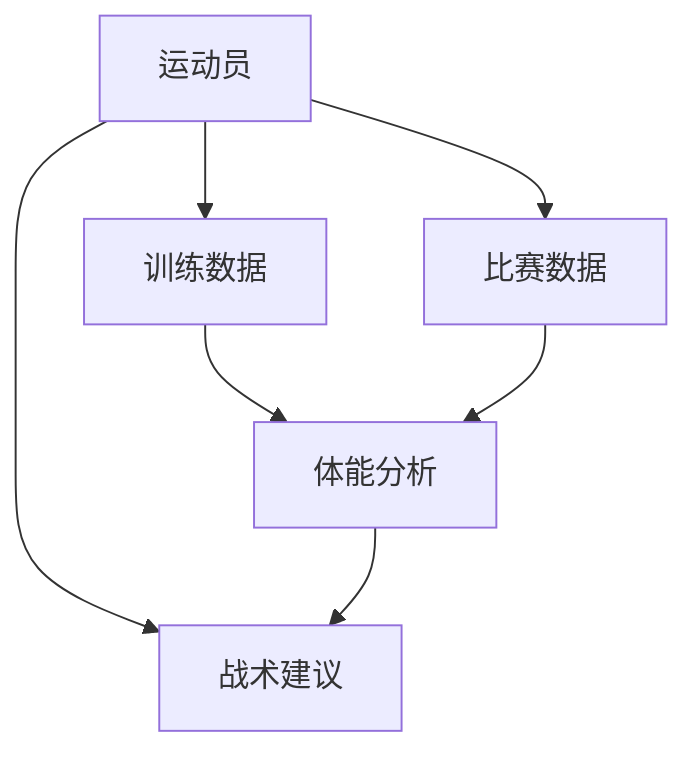
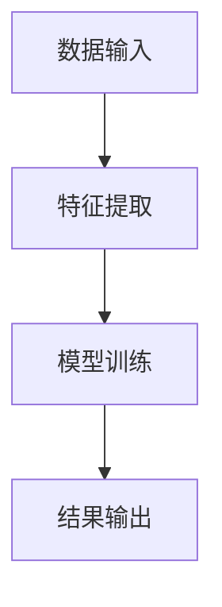
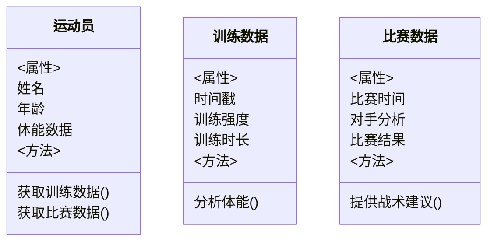
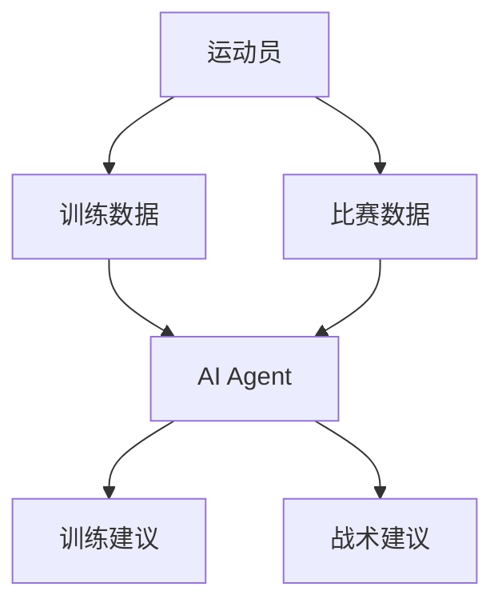
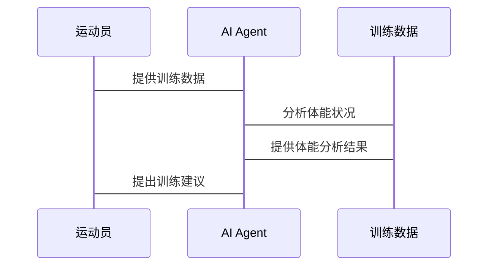

                 


# 体育AI Agent：赛事分析与训练辅助

## 关键词

体育AI Agent, 赛事分析, 训练辅助, 人工智能, 数据分析, 算法原理

## 摘要

本文将深入探讨体育AI Agent在赛事分析与训练辅助中的应用。通过分析体育AI Agent的核心概念、算法原理、系统架构以及实际案例，本文旨在揭示AI技术如何在体育领域中发挥重要作用，为运动员和教练提供科学的训练计划和比赛策略。文章内容涵盖从基础理论到实际应用的各个方面，结合丰富的图表和代码示例，帮助读者全面理解体育AI Agent的技术与应用。

---

## 第1章：体育AI Agent概述

### 1.1 体育AI Agent的定义与背景

#### 1.1.1 什么是体育AI Agent

体育AI Agent是一种基于人工智能技术的智能系统，能够通过分析海量体育数据，提供赛事分析、训练优化、战术建议等服务，帮助运动员和教练做出更科学的决策。

#### 1.1.2 体育AI Agent的发展背景

随着人工智能技术的飞速发展，体育领域对数据的依赖性越来越强。通过AI技术，可以对运动员的表现、比赛战术、体能状况等进行深入分析，从而提高训练效率和比赛成绩。

#### 1.1.3 体育AI Agent的核心目标与价值

- **目标**：通过数据驱动的方法，优化训练计划和比赛策略。
- **价值**：提高运动员的表现，降低受伤风险，提升教练的决策效率。

### 1.2 体育AI Agent的应用场景

#### 1.2.1 赛事分析与战术优化

AI Agent可以通过分析比赛录像、球员数据，提供对手分析、战术建议等，帮助教练制定最优比赛策略。

#### 1.2.2 运动员训练与体能管理

通过AI技术，可以对运动员的训练数据进行分析，制定个性化的训练计划，实时监测体能状况，预防运动损伤。

#### 1.2.3 体育数据可视化与决策支持

AI Agent可以将复杂的体育数据进行可视化处理，帮助教练和运动员更直观地了解数据背后的规律。

---

## 第2章：体育AI Agent的核心概念与联系

### 2.1 核心概念原理

#### 2.1.1 AI Agent的基本原理

AI Agent通过感知环境、分析数据、做出决策并执行操作，实现对体育场景的智能化管理。

#### 2.1.2 体育数据的特征与属性

- **特征**：运动员的技术指标、比赛数据、体能数据等。
- **属性**：数据的时间性、空间性、相关性等。

#### 2.1.3 体育AI Agent的决策机制

基于机器学习模型，AI Agent能够根据输入的数据，预测最优的训练方案或比赛策略。

### 2.2 核心概念对比表

| 对比维度 | 传统数据分析 | AI Agent分析 |
|----------|--------------|--------------|
| 数据处理 | 离线分析，依赖人工经验 | 实时分析，基于机器学习模型 |
| 决策效率 | 低效，依赖人工经验 | 高效，基于数据驱动的决策 |
| 可扩展性 | 有限，依赖人工经验 | 强大，支持海量数据处理 |

### 2.3 ER实体关系图



---

## 第3章：体育AI Agent的算法原理

### 3.1 常见算法概述

#### 3.1.1 监督学习

- **定义**：通过标注数据训练模型，使其能够预测新的数据。
- **应用**：运动员表现预测、比赛结果预测。

#### 3.1.2 无监督学习

- **定义**：通过数据的内在结构发现隐藏的模式。
- **应用**：训练数据的聚类分析、异常检测。

#### 3.1.3 强化学习

- **定义**：通过与环境的交互，学习最优策略。
- **应用**：训练计划优化、动态调整比赛策略。

### 3.2 算法原理与流程图



### 3.3 算法实现代码

```python
# 示例代码：基于强化学习的训练优化
import numpy as np
import random

class AI-Agent:
    def __init__(self):
        self.state = "初始状态"
    
    def perceive(self, environment):
        # 感知环境，获取数据
        self.state = environment
    
    def decide(self):
        # 基于当前状态做出决策
        if self.state == "高强度训练":
            return "降低强度"
        elif self.state == "低强度训练":
            return "增加强度"
        else:
            return "保持当前强度"
```

---

## 第4章：体育AI Agent的系统分析与架构设计

### 4.1 问题场景介绍

在体育训练中，运动员需要根据自身状况调整训练计划，而教练需要根据团队表现制定比赛策略。传统的训练和比赛决策依赖人工经验，效率低下且容易出错。

### 4.2 项目介绍

本项目旨在开发一个基于AI的训练辅助系统，通过分析运动员的训练数据和比赛数据，提供个性化的训练建议和战术优化方案。

### 4.3 系统功能设计

#### 4.3.1 领域模型



#### 4.3.2 系统架构设计



#### 4.3.3 系统接口设计

- **输入接口**：运动员的训练数据和比赛数据。
- **输出接口**：个性化的训练建议和战术优化方案。

#### 4.3.4 系统交互流程



---

## 第5章：体育AI Agent的项目实战

### 5.1 环境安装

#### 5.1.1 安装Python环境

```bash
python --version
pip install numpy
pip install scikit-learn
```

#### 5.1.2 安装机器学习库

```bash
pip install scikit-learn
pip install tensorflow
```

### 5.2 系统核心实现

#### 5.2.1 训练数据处理

```python
import numpy as np
import pandas as pd

# 加载训练数据
data = pd.read_csv("training_data.csv")

# 数据预处理
data = data.dropna()
data = (data - data.mean()) / data.std()
```

#### 5.2.2 模型训练

```python
from sklearn.linear_model import LinearRegression
from sklearn.model_selection import train_test_split

# 划分训练集和测试集
X = data[['age', 'training_intensity']]
y = data['performance']

X_train, X_test, y_train, y_test = train_test_split(X, y, test_size=0.2, random_state=42)

# 训练模型
model = LinearRegression()
model.fit(X_train, y_train)
```

#### 5.2.3 模型预测

```python
# 预测测试集结果
y_pred = model.predict(X_test)

# 评估模型
print('均方误差:', np.mean((y_pred - y_test) ** 2))
print('决定系数:', model.score(X_test, y_test))
```

### 5.3 案例分析

#### 5.3.1 训练计划优化

假设一个运动员的训练数据如下：

| 时间戳 | 训练强度 | 训练时长 | 体能数据 |
|--------|----------|----------|----------|
| 1      | 70%      | 60分钟    | 80%      |
| 2      | 75%      | 65分钟    | 85%      |
| 3      | 80%      | 70分钟    | 90%      |

通过AI Agent分析，建议在接下来的训练中逐步增加训练强度，以进一步提升体能。

#### 5.3.2 比赛策略优化

根据对手的战术特点，AI Agent建议在比赛中加强防守，尤其是在对手的强侧进行重点防守。

---

## 第6章：体育AI Agent的最佳实践

### 6.1 小结

体育AI Agent通过数据分析和机器学习技术，为运动员和教练提供了科学的训练计划和比赛策略，显著提高了训练效率和比赛成绩。

### 6.2 注意事项

- 数据的质量直接影响AI Agent的效果，需要确保数据的准确性和完整性。
- 在实际应用中，需要结合运动员的实际情况，灵活调整AI Agent的建议。

### 6.3 拓展阅读

- 《机器学习实战》
- 《深度学习》
- 《体育数据分析与应用》

---

## 作者

作者：AI天才研究院 & 禅与计算机程序设计艺术

--- 

以上是完整的《体育AI Agent：赛事分析与训练辅助》的技术博客文章，涵盖了从基础理论到实际应用的各个方面，结合丰富的图表和代码示例，帮助读者全面理解体育AI Agent的技术与应用。

