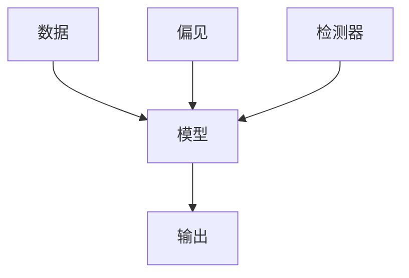
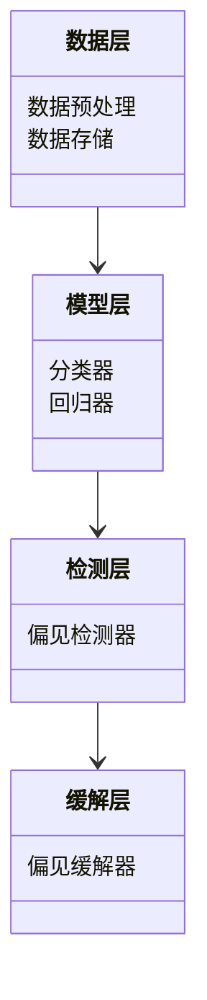
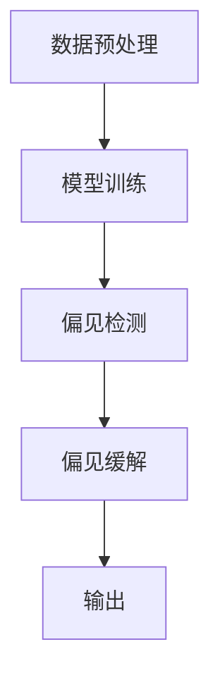
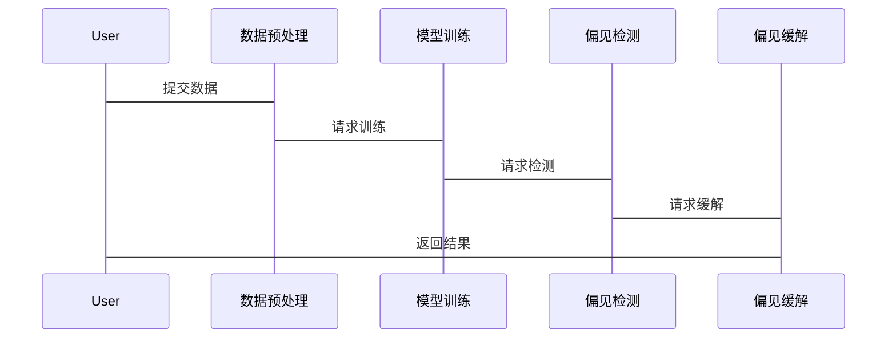

                 


# 偏见检测与缓解：提高AI Agent的公平性

## 关键词：偏见检测、AI Agent、公平性、算法公平性、数据偏见、偏见缓解

## 摘要：  
在人工智能快速发展的今天，AI Agent的应用越来越广泛，但其决策过程中的偏见问题也随之浮现。本文从偏见的来源、检测方法和缓解策略入手，深入探讨如何提高AI Agent的公平性。通过分析偏见的类型、数据和模型中的偏见，以及法律和伦理问题，本文为读者提供了一套完整的偏见检测与缓解框架。结合实际案例和系统设计，本文详细介绍了偏见检测与缓解的算法原理、系统架构和项目实现，帮助读者在实际应用中解决偏见问题。

---

# 第1章: 偏见的来源与影响

## 1.1 偏见的定义与分类

### 1.1.1 什么是偏见  
偏见是指在数据、算法或模型中，由于历史、社会或文化等因素的影响，导致某些群体在AI系统中受到不公平对待的现象。  

### 1.1.2 偏见的类型  
- **显性偏见**：直接存在于数据或算法中的不公平倾向。  
- **隐性偏见**：潜藏在数据或算法中的间接不公平倾向。  
- **系统性偏见**：由于数据分布不均衡或模型设计不合理导致的长期存在的偏见。  

### 1.1.3 偏见的来源  
- 数据偏差：训练数据中的样本分布不均衡。  
- 算法偏差：算法设计中的不公平假设或目标函数设计不合理。  
- 社会偏见：社会文化中固有的偏见被数据或算法放大。  

## 1.2 AI Agent中的偏见问题

### 1.2.1 AI Agent的定义与特点  
AI Agent是一种能够感知环境、自主决策并执行任务的智能实体。其特点包括自主性、反应性、目标导向和社交能力。  

### 1.2.2 偏见对AI Agent的影响  
- **决策错误**：偏见可能导致AI Agent在决策中对某些群体不公平对待。  
- **信任缺失**：偏见的存在会降低用户对AI Agent的信任。  
- **法律风险**：偏见可能导致AI Agent的应用违反相关法律法规。  

### 1.2.3 偏见在AI Agent中的具体表现  
- 在招聘系统中，AI Agent可能对女性或少数群体的职位申请给予不公平的拒绝。  
- 在推荐系统中，AI Agent可能优先推荐某一类用户而不公平地忽略另一类用户。  

## 1.3 偏见检测与缓解的重要性

### 1.3.1 公平性的重要性  
公平性是AI系统设计中的核心原则，直接关系到AI系统的社会接受度和用户信任。  

### 1.3.2 偏见检测与缓解的必要性  
通过检测和缓解偏见，可以确保AI Agent的决策过程公平、透明和可解释。  

### 1.3.3 偏见检测与缓解的边界与外延  
- 偏见检测的边界：如何在公平性和效率之间找到平衡？  
- 偏见缓解的外延：如何在不同场景下应用通用的偏见检测与缓解方法？  

---

# 第2章: 偏见检测的核心概念

## 2.1 偏见检测的基本原理

### 2.1.1 偏见检测的定义  
偏见检测是指通过分析数据或模型，识别其中存在的不公平倾向的过程。  

### 2.1.2 偏见检测的关键技术  
- 数据分析技术：统计分析、分布分析。  
- 模型分析技术：基于模型的公平性指标计算。  

### 2.1.3 偏见检测的数学模型  
偏见检测可以通过以下数学模型实现：  
$$ P(y|x) \neq P(y) $$  
其中，$y$表示决策结果，$x$表示输入特征，$P(y|x)$表示条件概率，$P(y)$表示先验概率。  

## 2.2 偏见检测的分类与对比

### 2.2.1 数据层面的偏见  
数据层面的偏见是指训练数据中存在不公平的样本分布。例如，招聘系统中女性候选人的样本数量少于男性候选人。  

### 2.2.2 模型层面的偏见  
模型层面的偏见是指模型在学习过程中引入的不公平倾向。例如，推荐系统中对少数群体用户的推荐比例偏低。  

### 2.2.3 算法层面的偏见  
算法层面的偏见是指算法设计中固有的不公平假设。例如，某些排序算法对某些特征的偏好可能导致偏见。  

## 2.3 偏见检测的实体关系图



---

# 第3章: 偏见缓解的核心概念

## 3.1 偏见缓解的基本原理

### 3.1.1 偏见缓解的定义  
偏见缓解是指通过调整数据、算法或模型，减少或消除其中的不公平倾向的过程。  

### 3.1.2 偏见缓解的关键技术  
- 数据层面：重新采样、数据增强。  
- 模型层面：修改损失函数、引入公平性约束。  
- 算法层面：调整算法参数、引入公平性指标。  

### 3.1.3 偏见缓解的数学模型  
偏见缓解可以通过以下数学模型实现：  
$$ L(y, y_{\text{pred}}) = \text{损失函数} + \lambda \cdot \text{公平性约束} $$  
其中，$\lambda$是调节参数，用于平衡损失函数和公平性约束的影响。  

## 3.2 偏见缓解的分类与对比

### 3.2.1 数据层面的缓解  
数据层面的缓解包括重新采样、数据增强等技术。例如，通过过采样少数群体样本，平衡数据分布。  

### 3.2.2 模型层面的缓解  
模型层面的缓解包括引入公平性约束、修改损失函数等技术。例如，通过引入公平性约束，确保模型在不同群体上的预测概率均衡。  

### 3.2.3 算法层面的缓解  
算法层面的缓解包括调整算法参数、引入公平性指标等技术。例如，通过调整排序算法的参数，减少对某些特征的偏好。  

## 3.3 偏见缓解的实体关系图


---

# 第4章: 偏见检测与缓解的算法原理

## 4.1 偏见检测的算法流程

### 4.1.1 数据预处理  
- 数据清洗：去除噪声数据。  
- 数据标注：标注数据中的偏见。  

### 4.1.2 偏见检测的数学模型  
$$ P(y|x) = \frac{P(x|y)P(y)}{P(x)} $$  

### 4.1.3 偏见检测的实现步骤  
1. 数据预处理：清洗和标注数据。  
2. 模型训练：训练分类器或回归器。  
3. 偏见检测：计算公平性指标，识别偏见。  

## 4.2 偏见缓解的算法流程

### 4.2.1 偏见识别  
- 通过统计分析识别数据中的偏见。  
- 通过模型分析识别模型中的偏见。  

### 4.2.2 偏见缓解的数学模型  
$$ L(y, y_{\text{pred}}) = \text{损失函数} + \lambda \cdot \text{公平性约束} $$  

### 4.2.3 偏见缓解的实现步骤  
1. 偏见识别：通过统计或模型分析找到偏见。  
2. 数据或模型调整：重新采样或修改损失函数。  
3. 模型再训练：训练调整后的模型。  

## 4.3 偏见检测与缓解的算法对比

### 4.3.1 常见偏见检测算法  
- 统计方法：卡方检验、t检验。  
- 基于模型的方法：公平性指标计算。  

### 4.3.2 常见偏见缓解算法  
- 数据层面：过采样、欠采样。  
- 模型层面：公平性约束、对抗训练。  

### 4.3.3 算法优缺点对比  
| 技术 | 优点 | 缺点 |  
|------|------|------|  
| 统计方法 | 简单易懂 | 无法检测模型层面的偏见 |  
| 基于模型的方法 | 可检测模型层面的偏见 | 实施复杂 |  

---

# 第5章: 偏见检测与缓解的数学模型

## 5.1 偏见检测的数学模型

### 5.1.1 基于统计的偏见检测  
$$ P(y|x) \neq P(y) $$  

### 5.1.2 基于模型的偏见检测  
$$ \text{公平性指标} = \text{分类器输出的差异} $$  

## 5.2 偏见缓解的数学模型

### 5.2.1 数据层面的缓解  
$$ y_{\text{new}} = y_{\text{旧}} + \lambda \cdot (P(y_{\text{旧}}) - P(y_{\text{目标}})) $$  

### 5.2.2 模型层面的缓解  
$$ L(y, y_{\text{pred}}) = \text{损失函数} + \lambda \cdot \text{公平性约束} $$  

---

# 第6章: 偏见检测与缓解的系统设计

## 6.1 系统功能设计

### 6.1.1 领域模型  


### 6.1.2 系统架构设计  


### 6.1.3 系统接口设计  
- 数据输入接口：接收原始数据。  
- 模型接口：调用分类器或回归器。  
- 检测接口：返回偏见检测结果。  
- 缓解接口：返回偏见缓解后的数据或模型。  

### 6.1.4 系统交互设计  


---

# 第7章: 项目实战

## 7.1 环境安装

### 7.1.1 安装Python环境  
- 安装Python 3.8及以上版本。  
- 安装必要的库：scikit-learn、numpy、pandas。  

### 7.1.2 安装依赖  
```bash
pip install scikit-learn numpy pandas
```

## 7.2 系统核心实现源代码

### 7.2.1 偏见检测代码  
```python
from sklearn.metrics import classification_report
from sklearn.tree import DecisionTreeClassifier
import numpy as np
import pandas as pd

# 数据加载
data = pd.read_csv('data.csv')
X = data.drop('label', axis=1)
y = data['label']

# 模型训练
model = DecisionTreeClassifier()
model.fit(X, y)

# 偏见检测
y_pred = model.predict(X)
print(classification_report(y, y_pred))
```

### 7.2.2 偏见缓解代码  
```python
from imblearn.over_sampling import SMOTE
from sklearn.model_selection import train_test_split
from sklearn.ensemble import RandomForestClassifier

# 数据加载
data = pd.read_csv('data.csv')
X = data.drop('label', axis=1)
y = data['label']

# 数据增强
oversampler = SMOTE(random_state=42)
X_res, y_res = oversampler.fit_resample(X, y)

# 模型训练
model = RandomForestClassifier()
model.fit(X_res, y_res)

# 偏见缓解验证
y_pred = model.predict(X)
print(classification_report(y, y_pred))
```

## 7.3 代码应用解读与分析

### 7.3.1 偏见检测代码解读  
- 数据加载：读取数据并分割特征和标签。  
- 模型训练：使用决策树模型训练分类器。  
- 偏见检测：预测并输出分类报告，分析模型的公平性。  

### 7.3.2 偏见缓解代码解读  
- 数据增强：使用SMOTE算法平衡数据分布。  
- 模型训练：使用随机森林模型训练分类器。  
- 偏见缓解验证：预测并输出分类报告，验证偏见是否缓解。  

## 7.4 实际案例分析

### 7.4.1 案例背景  
某招聘系统存在性别偏见，女性候选人的推荐比例远低于男性。  

### 7.4.2 数据分析  
- 女性候选人的样本数量较少。  
- 模型在预测时对女性候选人的推荐比例偏低。  

### 7.4.3 应用偏见检测与缓解代码  
1. 数据增强：增加女性候选人的样本数量。  
2. 模型训练：重新训练模型，引入公平性约束。  
3. 偏见缓解验证：验证模型是否减少性别偏见。  

## 7.5 项目小结

### 7.5.1 项目总结  
通过偏见检测与缓解算法，可以有效减少AI Agent中的偏见，提高决策的公平性。  

### 7.5.2 项目经验  
- 数据层面的偏见检测与缓解较为简单，模型层面的偏见检测与缓解更具挑战性。  
- 综合使用数据增强和公平性约束，可以有效缓解偏见问题。  

---

# 第8章: 最佳实践

## 8.1 小结

### 8.1.1 偏见检测与缓解的关键点  
- 数据层面：重新采样、数据增强。  
- 模型层面：引入公平性约束、对抗训练。  

## 8.2 注意事项

### 8.2.1 数据层面  
- 数据增强可能会引入噪声。  
- 数据平衡需要谨慎处理。  

### 8.2.2 模型层面  
- 公平性约束可能会影响模型性能。  
- 对抗训练可能需要更多的计算资源。  

## 8.3 拓展阅读

### 8.3.1 推荐书籍  
- 《偏见检测与缓解：从理论到实践》  
- 《算法公平性：理论与应用》  

### 8.3.2 推荐论文  
- "A survey on bias and fairness in machine learning"  
- "Fairness in machine learning: A review and future directions"  

---

# 作者：AI天才研究院/AI Genius Institute & 禅与计算机程序设计艺术 /Zen And The Art of Computer Programming

