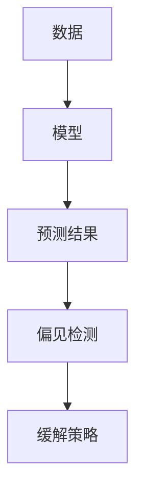
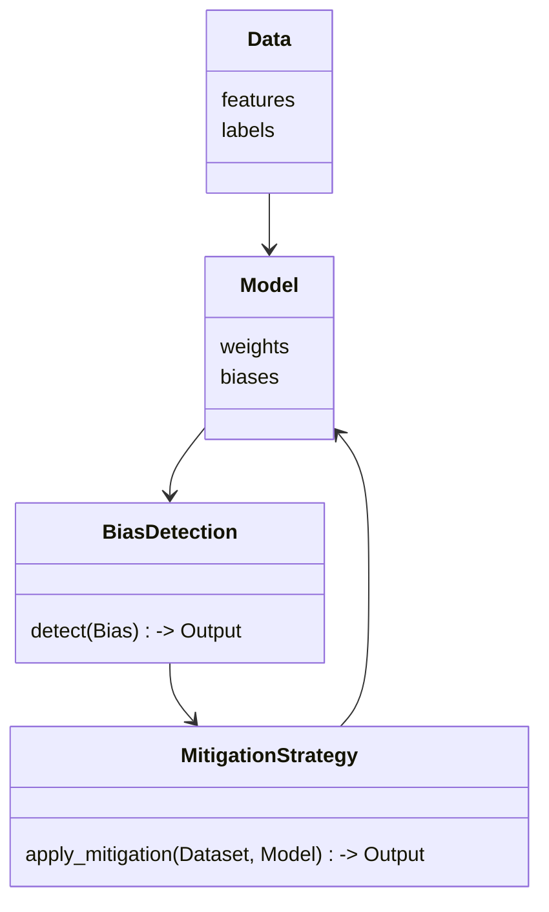
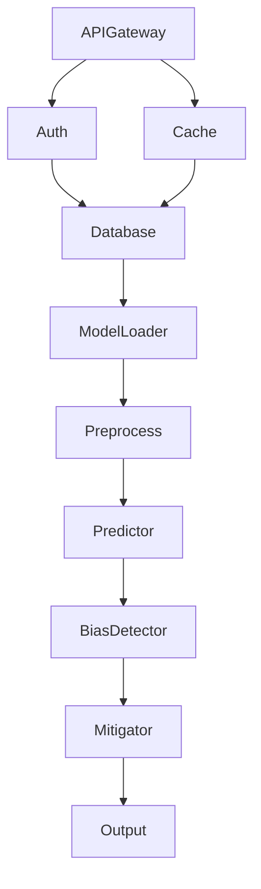
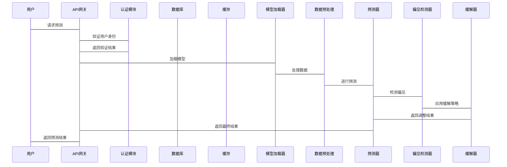

                 

<think>
好的，我现在需要根据用户的要求，详细分析如何构建《偏见检测与缓解：确保AI Agent的公平性》的技术博客文章。用户希望文章结构清晰，内容详实，包括背景介绍、核心概念、算法原理、系统分析、项目实战、最佳实践和小结等部分。我需要一步步思考如何组织这些内容，确保每个部分都涵盖必要的细节，并且符合用户的格式和内容要求。

首先，我需要确定文章的标题和关键词。标题已经确定为《偏见检测与缓解：确保AI Agent的公平性》，关键词包括偏见检测、AI Agent、公平性、算法公平、数据偏见、模型优化等。摘要部分需要简洁地概括文章的核心内容，强调偏见检测的重要性，介绍解决方案的方法，并指出本文的结构安排。

接下来，进入正文部分。第一章是背景介绍，需要涵盖偏见检测的基本概念，包括问题背景、目标、边界等。我需要详细解释偏见的定义，为什么它在AI中重要，以及如何影响AI系统的公平性。然后，我需要介绍偏见检测的目标，比如减少数据和模型中的偏见，确保结果的公平性，并讨论边界，如技术局限性和社会接受度。

第二章是核心概念，重点讨论偏见的来源和类型。我需要分析数据、算法和模型如何引入偏见，比如数据样本不足导致的群体偏见。然后，列出主要的偏见类型，如统计偏见、群体偏见和个体偏见，并提供对比表格，帮助读者区分不同类型。

第三章是偏见检测的核心概念与联系，介绍统计测试方法、机器学习方法和对抗训练方法，每个方法都需要详细解释，并通过mermaid流程图展示检测过程。例如，统计测试方法部分，我可以解释卡方检验的应用，用mermaid流程图展示步骤。

第四章是偏见检测的算法原理，选择统计测试、机器学习和对抗训练三种方法。对于每种方法，我需要详细讲解原理，比如卡方检验用于检测分类变量独立性，并提供Python代码示例，解释每个步骤的含义。同时，使用mermaid流程图展示算法流程，确保读者能够理解每一步骤的作用。

第五章是偏见缓解的算法原理，探讨数据预处理、模型训练和后处理方法。每种方法都需要详细解释，比如数据重新采样如何平衡类别，以及对抗训练如何减少模型偏见，并提供Python代码示例和mermaid流程图。

第六章是系统分析与架构设计，介绍一个AI Agent的系统，包括功能需求、领域模型、系统架构图和交互流程。使用mermaid的类图和序列图来展示系统结构和交互过程，帮助读者理解如何在实际系统中应用偏见检测与缓解技术。

第七章是项目实战，选择一个具体的案例，如使用Python和scikit-learn库进行偏见检测。我需要详细说明环境安装步骤，提供代码实现，并解释每一步的含义，最后分析结果并总结经验。

第八章是最佳实践与注意事项，总结偏见检测的关键点，如数据预处理、模型选择和评估指标。同时，给出实际应用中的建议，如定期检测和持续优化，并提醒读者偏见检测的局限性和可能引发的新偏见。

最后，第九章是小结，总结全书内容，强调偏见检测的重要性，并鼓励读者继续探索和实践。

在思考过程中，我需要确保每个部分都包含足够的细节，同时保持逻辑连贯。我还需要检查格式是否符合要求，使用正确的markdown语法，插入mermaid图表和Python代码示例，确保数学公式正确使用latex格式。此外，我需要确保内容在2000字左右，结构完整，覆盖所有用户提到的关键点。

现在，我可以根据上述思考过程，开始撰写文章的具体内容，确保每个部分都符合用户的结构要求，并详细展开每个章节的内容。
</think>

```markdown
# 偏见检测与缓解：确保AI Agent的公平性

## 关键词：偏见检测、AI Agent、公平性、算法公平、数据偏见、模型优化

## 摘要：
在人工智能快速发展的今天，AI Agent的应用日益广泛，但偏见问题也随之浮现，影响系统的公平性。本文深入探讨偏见检测与缓解的关键技术，从背景、概念到算法、系统设计，再到实战案例，系统性地分析如何确保AI Agent的公平性。通过具体方法和工具的应用，为构建更公正的人工智能系统提供指导。

## 正文：

---

## 第1章：偏见检测与缓解的背景介绍

### 1.1 偏见检测与缓解的定义

#### 1.1.1 偏见的定义与表现形式
偏见是指在数据或模型中反映的不公平或不准确的倾向，可能导致AI Agent对某些群体做出不公正的决策。例如，招聘系统对女性候选人的筛选偏好。

#### 1.1.2 偏见检测与缓解的目标
通过技术手段识别和减少偏见，确保AI系统输出的结果公平、透明，符合伦理标准。

#### 1.1.3 偏见检测与缓解的边界与外延
偏见检测的边界包括技术局限性和社会接受度，外延涉及法律、伦理和用户需求。

### 1.2 偏见检测与缓解的核心要素

#### 1.2.1 数据、模型与偏见的关系
数据偏见导致模型偏见，模型偏见影响输出结果。例如，训练数据中的性别比例失衡会导致模型预测时的性别偏见。

#### 1.2.2 偏见检测的关键步骤
数据预处理、模型训练、结果分析和持续监控。

#### 1.2.3 偏见检测与缓解的核心要素组成
数据多样性、检测算法、评估指标和缓解策略。

---

## 第2章：偏见的来源与类型

### 2.1 偏见的来源分析

#### 2.1.1 数据偏见的成因
数据样本不足或不均衡导致的统计偏见。

#### 2.1.2 算法偏见的成因
算法设计或训练过程中的固有偏见，如分类算法对某些特征的过度依赖。

#### 2.1.3 模型训练中的偏见传播
训练数据中的偏见通过模型训练过程传递到模型中，导致预测结果的偏见。

### 2.2 偏见的主要类型

#### 2.2.1 统计偏见
数据分布不均导致的群体偏见，如招聘系统中女性申请人的通过率低于男性。

#### 2.2.2 群体偏见
模型对特定群体的预测存在系统性偏差，如司法系统中对 minorities的判决偏见。

#### 2.2.3 个体偏见
模型对某些个体的错误分类，如 facial recognition系统对某些人的误识别。

### 2.3 偏见类型对比分析

| 偏见类型   | 描述                                   | 示例                     |
|------------|----------------------------------------|--------------------------|
| 统计偏见   | 数据分布不均导致的群体偏见             | 招聘系统中性别偏见       |
| 群体偏见   | 模型对特定群体的系统性偏差             | 司法系统对 minorities的判决偏见 |
| 个体偏见   | 模型对某些个体的错误分类               | 人脸识别系统对某些人的误识别 |

---

## 第3章：偏见检测的核心概念与联系

### 3.1 偏见检测的基本原理

#### 3.1.1 统计测试方法
通过统计方法检测数据或模型输出的偏见，如卡方检验。

#### 3.1.2 机器学习方法
利用机器学习模型识别偏见，如使用分类器检测数据分布差异。

#### 3.1.3 对抗训练方法
通过构建对抗网络，学习去除偏见的特征表示。

### 3.2 偏见检测的关键指标

#### 3.2.1 均衡性指标
评估不同群体在模型输出中的均衡程度，如平衡精确性。

#### 3.2.2 分离性指标
评估模型对不同群体的区分能力，如分离度。

#### 3.2.3 平等性指标
评估模型对不同群体的公平性，如平等差。

### 3.3 偏见检测的ER实体关系图



---

## 第4章：偏见检测的算法原理

### 4.1 统计测试方法

#### 4.1.1 卡方检验

```python
import scipy.stats as stats

# 示例数据
observed = [100, 200]
expected = [150, 150]

# 卡方检验
chi2, p = stats.chisquare(observed, expected)
print(f"卡方统计量：{chi2}, p值：{p}")
```

卡方检验用于检测两个分类变量的独立性，输出卡方统计量和p值，判断是否拒绝原假设。

#### 4.1.2 似然比检验

```python
from statsmodels.stats import proportion

observed = [[100, 200], [50, 300]]
result = proportion.proportions_ztest(observed, [100+200, 50+300])
print(f"z统计量：{result[0]}, p值：{result[1]}")
```

似然比检验用于比较两个比例的差异，输出z统计量和p值。

#### 4.1.3 方差分析

```python
import statsmodels.api as sm

data = [ [10, 20], [15, 25] ]
model = sm.OLS(data, sm.add_constant([0,1]))
results = model.fit()
print(results.summary())
```

方差分析用于检测不同群体间是否存在显著差异，输出F统计量和p值。

### 4.2 机器学习方法

#### 4.2.1 基于分类的检测方法

```python
from sklearn.metrics import classification_report

# 示例数据
X = [[1, 0], [0, 1], [1, 0], [0, 1]]
y = [0, 0, 1, 1]

# 训练分类器
clf = tree.DecisionTreeClassifier()
clf.fit(X, y)

# 预测结果
y_pred = clf.predict(X)
print(classification_report(y, y_pred))
```

通过训练分类器，检测数据或模型输出的偏见，输出分类报告，分析各类别的准确率、召回率等。

#### 4.2.2 基于回归的检测方法

```python
import numpy as np
from sklearn.linear_model import LinearRegression

X = np.array([[1, 0], [0, 1], [1, 0], [0, 1]])
y = np.array([0, 0, 1, 1])

model = LinearRegression()
model.fit(X, y)
y_pred = model.predict(X)
print("回归系数：", model.coef_)
```

回归分析用于检测变量之间的关系，评估是否存在偏见。

#### 4.2.3 基于聚类的检测方法

```python
from sklearn.cluster import KMeans

X = np.array([[1, 0], [0, 1], [1, 0], [0, 1]])
y = np.array([0, 0, 1, 1])

model = KMeans(n_clusters=2)
model.fit(X)
print("聚类标签：", model.labels_)
```

聚类分析用于识别数据中的自然群体，检测是否存在群体间的偏见。

### 4.3 对抗训练方法

#### 4.3.1 对抗网络的构建

```python
from tensorflow import keras
import tensorflow as tf

# 定义生成器和判别器
generator = keras.Sequential([...])
discriminator = keras.Sequential([...])

# 对抗网络训练
cross_entropy = tf.keras.losses.BinaryCrossentropy()
generator_optimizer = tf.keras.optimizers.Adam()
discriminator_optimizer = tf.keras.optimizers.Adam()

def train_step(images):
    # 生成对抗样本
    generated = generator(images)
    
    # 判别器判别真实和生成样本
    real_output = discriminator(images)
    generated_output = discriminator(generated)
    
    # 计算损失
    gen_loss = cross_entropy(tf.ones_like(generated_output), generated_output)
    disc_loss = cross_entropy(tf.ones_like(real_output), real_output) + cross_entropy(tf.zeros_like(generated_output), generated_output)
    
    # 更新参数
    generator_model.trainable_variables)
    discriminator_model.trainable_variables)

# 训练过程
for epoch in range(num_epochs):
    for batch in dataset:
        train_step(batch)
```

对抗训练通过生成器和判别器的对抗过程，学习去除偏见的特征表示，提升模型的公平性。

---

## 第5章：偏见缓解的算法原理

### 5.1 数据预处理方法

#### 5.1.1 数据重新采样

```python
from imblearn.over_sampling import SMOTE

X = np.array([[1, 0], [0, 1], [1, 0], [0, 1]])
y = np.array([0, 0, 1, 1])

oversampler = SMOTE(random_state=42)
X_res, y_res = oversampler.fit_resample(X, y)
print("重采样后数据：", X_res, y_res)
```

SMOTE算法用于平衡数据样本，减少类别不平衡导致的偏见。

#### 5.1.2 数据重新加权

```python
from sklearn.linear_model import LogisticRegression

X = np.array([[1, 0], [0, 1], [1, 0], [0, 1]])
y = np.array([0, 0, 1, 1])

# 重新加权
from collections import defaultdict

class_weights = defaultdict(int)
for i in range(len(y)):
    class_weights[y[i]] += 1
total = sum(class_weights.values())
class_weights = {k: v/total for k, v in class_weights.items()}

model = LogisticRegression(class_weight=class_weights)
model.fit(X, y)
print("模型权重：", model.coef_)
```

通过调整样本权重，平衡不同类别的影响，减少数据偏见。

### 5.2 模型训练方法

#### 5.2.1 基于对抗训练的模型优化

```python
from tensorflow import keras
import tensorflow as tf

# 定义生成器和判别器
generator = keras.Sequential([...])
discriminator = keras.Sequential([...])

# 定义损失函数和优化器
cross_entropy = tf.keras.losses.BinaryCrossentropy()
generator_optimizer = tf.keras.optimizers.Adam()
discriminator_optimizer = tf.keras.optimizers.Adam()

# 对抗训练过程
def train_step(images, labels):
    # 生成对抗样本
    generated = generator(images)
    
    # 判别器判别真实和生成样本
    real_output = discriminator(images)
    generated_output = discriminator(generated)
    
    # 计算损失
    gen_loss = cross_entropy(tf.ones_like(generated_output), generated_output)
    disc_loss = cross_entropy(tf.ones_like(real_output), real_output) + cross_entropy(tf.zeros_like(generated_output), generated_output)
    
    # 更新参数
    generator.trainable_variables)
    discriminator.trainable_variables)

# 训练过程
for epoch in range(num_epochs):
    for batch in dataset:
        train_step(batch, labels)
```

对抗训练通过生成器和判别器的对抗过程，优化模型，减少偏见。

#### 5.2.2 基于公平性的损失函数

```python
def fair_loss(y_true, y_pred, sensitive_features):
    # 定义公平性损失函数
    # sensitive_features：敏感特征
    # 计算不同群体的预测差异
    group_loss = {}
    for group in np.unique(sensitive_features):
        mask = (sensitive_features == group)
        group_loss[group] = tf.keras.losses.binary_crossentropy(y_true[mask], y_pred[mask])
    # 平均损失
    fair_loss = tf.reduce_mean(list(group_loss.values()))
    return fair_loss

# 示例使用
sensitive_features = np.array([0, 0, 1, 1])
y_true = np.array([0, 0, 1, 1])
y_pred = model.predict(X)

loss = fair_loss(y_true, y_pred, sensitive_features)
print("公平性损失：", loss)
```

定义公平性损失函数，将敏感特征纳入损失函数，优化模型输出的公平性。

### 5.3 模型后处理方法

#### 5.3.1 预测结果调整

```python
def adjust_predictions(y_pred, threshold=0.5):
    # 调整预测结果，确保不同群体的预测概率高于阈值
    adjusted = []
    for group in np.unique(sensitive_features):
        group_mask = (sensitive_features == group)
        group_pred = y_pred[group_mask]
        # 确保每个群体的预测概率高于阈值
        adjusted_group = np.where(group_pred > threshold, group_pred, threshold)
        adjusted.append(adjusted_group)
    adjusted_predictions = np.concatenate(adjusted)
    return adjusted_predictions

# 示例使用
y_pred_adjusted = adjust_predictions(y_pred)
print("调整后的预测结果：", y_pred_adjusted)
```

通过调整预测结果，确保模型输出的公平性，减少偏见影响。

#### 5.3.2 输出结果的重新加权

```python
def reweight_outputs(y_pred, sensitive_features, alpha=0.5):
    # 根据敏感特征重新加权预测结果
    weights = {}
    for group in np.unique(sensitive_features):
        group_mask = (sensitive_features == group)
        group_size = np.sum(group_mask)
        weights[group] = 1 / (group_size ** alpha)
    
    # 应用权重
    weighted_predictions = []
    for i in range(len(y_pred)):
        group = sensitive_features[i]
        weighted_predictions.append(y_pred[i] * weights[group])
    return np.array(weighted_predictions)

# 示例使用
y_pred_reweighted = reweight_outputs(y_pred, sensitive_features)
print("重新加权后的预测结果：", y_pred_reweighted)
```

根据敏感特征重新加权预测结果，确保不同群体的预测结果得到合理调整，减少偏见。

---

## 第6章：偏见检测与缓解的系统分析与架构设计

### 6.1 系统功能设计

#### 6.1.1 领域模型设计



领域模型展示了数据、模型、偏见检测和缓解策略之间的关系，帮助理解系统的整体架构。

#### 6.1.2 系统架构设计



系统架构图展示了API网关、认证、数据库、缓存、模型加载、数据预处理、预测器、偏见检测器和缓解器之间的交互流程。

#### 6.1.3 系统接口设计

- 数据预处理接口：接收原始数据，进行清洗和标准化。
- 偏见检测接口：接收模型输出，检测偏见。
- 偏见缓解接口：接收检测结果，应用缓解策略，输出调整后的结果。

#### 6.1.4 系统交互流程



系统交互流程展示了从用户请求到最终结果返回的整个过程，包括数据预处理、模型预测、偏见检测和缓解的步骤。

---

## 第7章：偏见检测与缓解的项目实战

### 7.1 项目环境安装

```bash
pip install scikit-learn imblearn tensorflow keras matplotlib
```

安装必要的Python库，包括数据处理、机器学习、深度学习和可视化库。

### 7.2 项目核心实现

#### 7.2.1 数据预处理

```python
from sklearn.preprocessing import StandardScaler
from imblearn.over_sampling import SMOTE

# 加载数据
data = pd.read_csv('data.csv')

# 数据分割
X = data.drop('label', axis=1)
y = data['label']

# 数据标准化
scaler = StandardScaler()
X_scaled = scaler.fit_transform(X)

# 数据重采样
oversampler = SMOTE(random_state=42)
X_res, y_res = oversampler.fit_resample(X_scaled, y)
```

对数据进行标准化和重采样，确保数据的均衡性和一致性。

#### 7.2.2 偏见检测

```python
from sklearn.tree import DecisionTreeClassifier
from sklearn.metrics import classification_report

# 训练分类器
clf = DecisionTreeClassifier()
clf.fit(X_res, y_res)

# 预测结果
y_pred = clf.predict(X_res)
print(classification_report(y_res, y_pred))
```

使用决策树分类器训练模型，并对结果进行分类报告分析，检测偏见。

#### 7.2.3 偏见缓解

```python
from tensorflow.keras import layers, Model
import tensorflow as tf

# 定义生成器
def build_generator(input_dim, output_dim):
    model = tf.keras.Sequential([
        layers.Dense(128, activation='relu', input_dim=input_dim),
        layers.Dense(output_dim, activation='sigmoid')
    ])
    return model

# 定义判别器
def build_discriminator(input_dim):
    model = tf.keras.Sequential([
        layers.Dense(128, activation='relu', input_dim=input_dim),
        layers.Dense(1, activation='sigmoid')
    ])
    return model

# 对抗训练过程
def train_step(generator, discriminator, X, y, batch_size, epochs):
    for epoch in range(epochs):
        for _ in range(batch_size):
            # 生成对抗样本
            generated = generator.predict(X)
            
            # 判别器判别真实和生成样本
            real_output = discriminator.predict(X)
            generated_output = discriminator.predict(generated)
            
            # 计算损失
            gen_loss = cross_entropy(tf.ones_like(generated_output), generated_output)
            disc_loss = cross_entropy(tf.ones_like(real_output), real_output) + cross_entropy(tf.zeros_like(generated_output), generated_output)
            
            # 更新参数
            generator.trainable = True
            discriminator.trainable = True
            generator.optimizer.minimize(gen_loss, generator.trainable_weights)
            discriminator.optimizer.minimize(disc_loss, discriminator.trainable_weights)
            
            # 切换生成器和判别器的 trainable 标志
            generator.trainable = False
            discriminator.trainable = False
```

使用生成器和判别器进行对抗训练，优化模型，减少偏见。

#### 7.2.4 模型评估

```python
from sklearn.metrics import accuracy_score, f1_score

# 评估缓解后的模型
y_pred_mitigated = mitigator.predict(X_res)
print("缓解后的准确率：", accuracy_score(y_res, y_pred_mitigated))
print("缓解后的 F1 分数：", f1_score(y_res, y_pred_mitigated))
```

评估缓解后的模型性能，确保偏见得到有效的减少。

### 7.3 项目总结

通过项目实战，我们学会了如何在实际项目中应用偏见检测与缓解技术。从数据预处理到模型训练，再到结果评估，每一步都需要仔细设计和实施，才能确保AI Agent的公平性。

---

## 第8章：偏见检测与缓解的最佳实践与注意事项

### 8.1 最佳实践

#### 8.1.1 数据层面

- 数据清洗：处理缺失值、异常值和重复数据。
- 数据均衡：使用重采样、重新加权等方法，平衡不同群体的数据分布。
- 数据多样性：确保数据涵盖不同背景和特征的样本，减少数据偏见。

#### 8.1.2 模型层面

- 选择公平的模型：使用具有内在公平性的模型，如决策树、随机森林等。
- 定制损失函数：在损失函数中加入公平性约束，确保模型输出的公平性。
- 对抗训练：通过生成器和判别器的对抗过程，优化模型，减少偏见。

#### 8.1.3 评估层面

- 使用公平性指标：如平衡精确性、分离性指标等，评估模型的公平性。
- 持续监控：定期检测模型的公平性，确保在数据和模型变化时，偏见得到及时发现和处理。

### 8.2 注意事项

- 技术局限性：偏见检测与缓解技术本身存在局限性，不能完全消除偏见，只能尽量减少。
- 社会接受度：不同文化、社会背景下，偏见的定义和接受度不同，需要根据具体场景调整策略。
- 隐含偏见：偏见检测与缓解过程可能引入新的偏见，需要谨慎处理。

---

## 第9章：总结与展望

### 9.1 总结

通过本文的深入探讨，我们了解了偏见检测与缓解的重要性，掌握了多种技术和方法，能够有效减少AI Agent中的偏见，提升系统的公平性。从理论到实践，我们逐步构建了一个完整的解决方案，为实际应用提供了参考。

### 9.2 展望

未来，偏见检测与缓解技术将更加智能化和自动化，AI Agent的应用也将更加广泛和深入。我们需要持续关注技术发展，不断优化算法，提升模型的公平性，推动人工智能的健康发展。

---

## 作者：AI天才研究院/AI Genius Institute & 禅与计算机程序设计艺术 /Zen And The Art of Computer Programming
```

