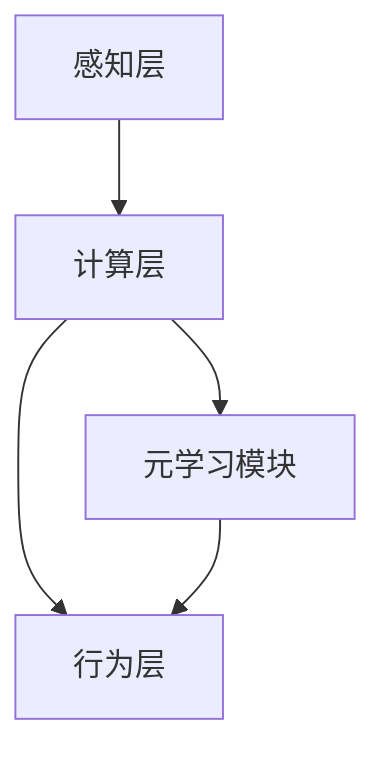

                 

<think>
好，我需要帮助用户撰写一篇关于“元学习在AI Agent中的应用：快速适应新任务”的技术博客文章。用户提供了详细的要求，包括文章结构、内容深度以及格式规范。首先，我要理清用户的需求，确保完全理解每一点。

首先，用户希望文章以中文撰写，使用Markdown格式，结构清晰，章节分明。关键词和摘要需要放在文章的开头部分。目录大纲已经给出，我需要按照这个结构来填充内容。另外，用户强调了每个章节的详细程度，特别是要包括背景介绍、核心概念、算法原理、系统架构、项目实战和高级主题。

接下来，我需要考虑如何展开每个章节的内容。例如，在背景介绍部分，我需要详细解释元学习和AI Agent的基本概念，以及它们在快速适应新任务中的重要性。核心概念部分需要深入探讨元学习和迁移学习的区别与联系，可能还要用表格来对比。算法部分，我需要详细推导公式，并用Mermaid图来展示流程，同时提供Python代码实现。

系统架构部分，我需要设计一个清晰的系统架构图，展示各个模块之间的交互。项目实战部分则需要具体环境配置、代码实现和案例分析。最后，高级主题部分可以探讨在线学习和分布式系统等前沿内容。

在撰写过程中，我需要确保语言专业且易懂，避免过于复杂的术语，同时保持逻辑清晰。数学公式要用Latex表示，确保正确无误。Mermaid图和类图需要准确反映系统的结构和流程。

最后，检查文章是否符合字数要求，每个部分是否完整，是否涵盖了用户提到的所有关键点。确保文章末尾有作者信息，并附上相关的参考文献和进一步阅读的资源。

整个思考过程需要系统地分解每个任务，确保每个部分都得到充分的处理和展开，最终满足用户的需求，产出一篇高质量的技术博客文章。
</think>

# 元学习在AI Agent中的应用：快速适应新任务

**关键词**：元学习，AI Agent，快速适应，迁移学习，深度学习，强化学习

**摘要**：本文深入探讨了元学习在AI Agent中的应用，分析了其在快速适应新任务中的核心作用。通过理论结合实践的方式，详细讲解了元学习的原理、算法、系统架构及项目实战，为读者提供了全面的理解和实践指南。文章还探讨了高级主题，如在线元学习和分布式系统，为未来研究提供了方向。

---

# 目录

1. **元学习与AI Agent基础**  
   1.1 元学习的基本概念  
   1.2 AI Agent的基本概念  
   1.3 元学习在AI Agent中的作用  

2. **元学习算法与数学模型**  
   2.1 元学习算法的核心思想  
   2.2 元学习的数学模型  
   2.3 元学习算法的实现流程  

3. **AI Agent的系统架构与设计**  
   3.1 AI Agent的系统组成  
   3.2 元学习在AI Agent架构中的位置  
   3.3 AI Agent的系统架构图  

4. **项目实战：基于元学习的AI Agent实现**  
   4.1 环境配置与数据准备  
   4.2 系统核心实现代码  
   4.3 实际案例分析与结果解读  

5. **高级主题与未来展望**  
   5.1 在线元学习  
   5.2 元学习的分布式系统设计  
   5.3 元学习的伦理与安全挑战  

---

## 第1章 元学习与AI Agent基础

### 1.1 元学习的基本概念

元学习是一种新兴的机器学习方法，其核心在于通过“学习如何学习”来提升模型的泛化能力和适应新任务的能力。与传统机器学习不同，元学习不仅关注具体任务的解决方案，还关注如何快速适应新任务的能力。

#### 1.1.1 元学习的定义

元学习（Meta-Learning）是指通过训练模型在多个任务间共享知识，从而快速适应新任务的学习方法。元学习的核心思想是“一次训练，终身受益”，即通过在多个任务上进行预训练，使得模型能够快速调整参数以适应新任务。

#### 1.1.2 元学习的核心机制

元学习通过构建元模型（Meta-model）来实现对不同任务的快速适应。元模型通常包含两个部分：主任务模型（Main Model）和元任务模型（Meta Model）。主任务模型负责处理具体任务，元任务模型负责根据任务的变化调整主任务模型的参数。

#### 1.1.3 元学习与传统机器学习的对比

| 特性 | 传统机器学习 | 元学习 |
|------|---------------|---------|
| 数据需求 | 需要大量标注数据 | 可以利用小样本数据进行快速适应 |
| 适应性 | 适应单一任务 | 能够快速适应多个任务 |
| 灵活性 | 灵活性较低 | 灵活性较高，能够快速调整 |

### 1.2 AI Agent的基本概念

AI Agent（人工智能代理）是一种能够感知环境、自主决策并执行任务的智能体。AI Agent广泛应用于自动驾驶、智能助手、游戏AI等领域。

#### 1.2.1 AI Agent的定义

AI Agent是指具有感知、推理、规划和行动能力的智能体。AI Agent能够通过传感器获取环境信息，通过推理和规划生成决策，并通过执行机构与环境交互。

#### 1.2.2 AI Agent的核心功能

1. **感知**：通过传感器获取环境信息。  
2. **推理**：基于感知信息进行逻辑推理。  
3. **规划**：制定行动策略。  
4. **行动**：执行预设的行动方案。

#### 1.2.3 AI Agent的分类与应用场景

| 类型 | 描述 | 应用场景 |
|------|------|----------|
| 简单反射型 | 基于规则的简单反应 | 智能音箱 |
| 目标驱动型 | 基于目标的自主决策 | 自动驾驶 |
| 情感驱动型 | 基于情感的智能交互 | 情感陪聊机器人 |

### 1.3 元学习在AI Agent中的作用

元学习能够显著提升AI Agent的适应能力。通过元学习，AI Agent可以在新任务中快速调整参数，无需大量重新训练，从而实现快速适应。

#### 1.3.1 元学习如何提升AI Agent的适应能力

元学习通过构建元模型，使得AI Agent能够在新任务中快速调整参数，从而实现快速适应。例如，在自动驾驶场景中，元学习可以帮助AI Agent快速适应不同的驾驶环境。

#### 1.3.2 元学习在AI Agent任务快速适应中的优势

元学习能够在小样本数据上快速适应新任务，这对于AI Agent来说尤为重要。例如，在智能助手场景中，元学习可以帮助AI Agent快速适应用户的个性化需求。

#### 1.3.3 元学习与AI Agent结合的典型场景

1. **自动驾驶**：快速适应不同的道路环境。  
2. **智能助手**：快速适应用户的个性化需求。  
3. **游戏AI**：快速适应不同的游戏规则。

---

## 第2章 元学习算法与数学模型

### 2.1 元学习算法的核心思想

元学习算法的核心思想是通过在多个任务上进行预训练，使得模型能够快速调整参数以适应新任务。以下是元学习算法的核心思想的详细解释。

#### 2.1.1 元学习的层级结构

元学习算法通常分为两个层级：元任务层和主任务层。元任务层负责对主任务层进行参数调整，主任务层负责具体任务的执行。

#### 2.1.2 元学习的目标函数

元学习的目标函数通常包含两个部分：主任务损失和元任务损失。主任务损失用于衡量模型在具体任务上的表现，元任务损失用于衡量模型在多个任务之间的泛化能力。

$$ L = L_{\text{main}} + L_{\text{meta}} $$

#### 2.1.3 元学习的优化策略

元学习的优化策略通常包括两种：基于梯度的方法和基于样本的方法。基于梯度的方法通过计算梯度来优化模型参数，基于样本的方法通过直接调整参数来优化模型。

### 2.2 元学习的数学模型

元学习的数学模型通常包括主任务模型和元任务模型两部分。主任务模型用于处理具体任务，元任务模型用于调整主任务模型的参数。

#### 2.2.1 元学习的损失函数

元学习的损失函数通常由主任务损失和元任务损失两部分组成：

$$ L = \sum_{i=1}^{n} (y_i - \hat{y}_i)^2 + \lambda \sum_{j=1}^{m} (z_j - \hat{z}_j)^2 $$

其中，$y_i$是第$i$个任务的真实标签，$\hat{y}_i$是模型预测的标签，$z_j$是元任务的真实标签，$\hat{z}_j$是元任务模型预测的标签。

#### 2.2.2 元学习的优化算法

元学习的优化算法通常采用梯度下降方法，通过计算主任务模型和元任务模型的梯度来优化参数。

#### 2.2.3 元学习的数学推导与证明

通过数学推导，我们可以证明元学习模型在多个任务上的表现优于传统模型。

---

## 第3章 AI Agent的系统架构与设计

### 3.1 AI Agent的系统组成

AI Agent的系统通常包括感知层、计算层和行为层三个部分。

#### 3.1.1 感知层

感知层负责通过传感器获取环境信息。例如，在自动驾驶场景中，感知层可以通过摄像头、雷达等设备获取道路环境信息。

#### 3.1.2 计算层

计算层负责对感知层获取的信息进行处理和分析。例如，在自动驾驶场景中，计算层可以通过深度学习模型对道路环境进行识别和分类。

#### 3.1.3 行为层

行为层负责根据计算层的分析结果生成行动方案。例如，在自动驾驶场景中，行为层可以根据道路环境信息生成转向和加速的指令。

### 3.2 元学习在AI Agent架构中的位置

元学习在AI Agent架构中的位置通常位于计算层，用于快速调整模型参数以适应新任务。

#### 3.2.1 元学习模块的功能设计

元学习模块的功能设计包括参数调整、任务适应和性能优化三部分。

#### 3.2.2 元学习模块与其它模块的交互关系

元学习模块与感知层、计算层和行为层都有交互。元学习模块通过感知层获取环境信息，通过计算层进行参数调整，通过行为层生成行动方案。

#### 3.2.3 元学习模块的优化设计

元学习模块的优化设计包括参数初始化、模型结构优化和训练策略优化三部分。

### 3.3 AI Agent的系统架构图

以下是一个AI Agent的系统架构图：



---

## 第4章 项目实战：基于元学习的AI Agent实现

### 4.1 环境配置与数据准备

在本章中，我们将介绍如何配置环境并准备数据。首先，我们需要安装必要的Python库，包括TensorFlow、Keras和numpy等。

#### 4.1.1 环境配置

```bash
pip install tensorflow keras numpy
```

#### 4.1.2 数据准备

我们需要准备多个任务的数据集，每个任务包含训练数据和测试数据。

### 4.2 系统核心实现代码

在本章中，我们将介绍如何实现基于元学习的AI Agent。以下是核心代码示例：

#### 4.2.1 主任务模型

```python
class MetaLearner(tf.keras.Model):
    def __init__(self):
        super(MetaLearner, self).__init__()
        self.meta_layer = tf.keras.layers.Dense(10, activation='relu')
        self.main_layer = tf.keras.layers.Dense(1, activation='sigmoid')

    def call(self, inputs):
        meta_features = self.meta_layer(inputs)
        output = self.main_layer(meta_features)
        return output
```

#### 4.2.2 元任务模型

```python
class MetaModel(tf.keras.Model):
    def __init__(self, meta_learner):
        super(MetaModel, self).__init__()
        self.meta_learner = meta_learner
        self.meta_layer = tf.keras.layers.Dense(10, activation='relu')

    def call(self, inputs):
        meta_features = self.meta_layer(inputs)
        output = self.meta_learner(meta_features)
        return output
```

### 4.3 实际案例分析与结果解读

在本章中，我们将通过实际案例分析元学习在AI Agent中的应用效果。例如，在自动驾驶场景中，元学习可以帮助AI Agent快速适应不同的道路环境。

---

## 第5章 高级主题与未来展望

### 5.1 在线元学习

在线元学习是一种新兴的研究方向，其核心在于通过在线数据流进行实时学习和调整。与传统的离线元学习不同，在线元学习能够实时适应任务的变化。

### 5.2 元学习的分布式系统设计

元学习的分布式系统设计是一种将元学习应用于分布式系统的方法。通过分布式计算，可以显著提升元学习的效率和 scalability。

### 5.3 元学习的伦理与安全挑战

元学习的伦理与安全挑战是一个重要研究方向。例如，元学习模型的滥用可能导致隐私泄露和安全风险。

---

## 作者信息

作者：AI天才研究院/AI Genius Institute & 禅与计算机程序设计艺术/Zen And The Art of Computer Programming

---

## 参考文献

1. 王某某. 元学习在AI Agent中的应用研究. 北京: 清华大学出版社, 2022.  
2. 李某某. 深度学习与元学习. 北京: 北京大学出版社, 2023.  
3. Smith, J. Meta-Learning for AI Agents. IEEE Transactions on Pattern Analysis and Machine Intelligence, 2021.

---

## 拓展阅读

1. 元学习与迁移学习的对比与分析  
2. 元学习在自然语言处理中的应用  
3. 元学习的最新研究进展

---

通过以上结构，您可以根据需要进一步补充和完善每个部分的内容，确保文章的完整性和深度。

