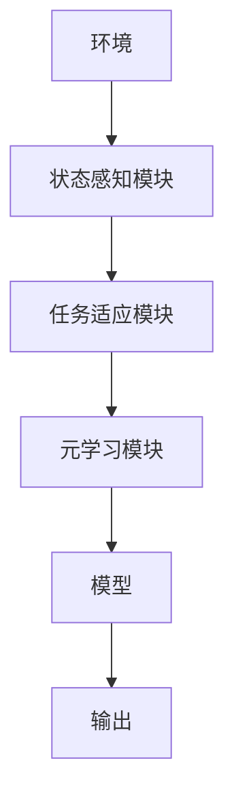

                 

<think>
好，我需要按照用户的要求，撰写一篇关于“元学习在AI Agent快速适应中的应用”的技术博客文章。首先，我需要理解元学习和AI Agent的基本概念，以及它们之间的关系。元学习是一种让模型快速适应新任务的学习方法，而AI Agent是能够在不同环境中执行任务的智能体。因此，元学习可以提升AI Agent的适应能力，使其能够更快地应对新的任务和环境。

接下来，我需要确定文章的结构。根据用户提供的目录，文章将分为五大部分：背景与概念、算法原理与实现、系统架构设计、项目实战以及总结与展望。每个部分都需要有详细的章节和小节，确保内容全面且逻辑清晰。

在背景与概念部分，我需要介绍元学习的基本概念、AI Agent的定义及其应用场景，以及元学习在AI Agent中的作用。这部分内容需要通俗易懂，适合读者理解元学习和AI Agent的基本概念。

接下来是算法原理与实现部分。我需要详细讲解元学习的数学模型，包括元学习的数学表达式、优化目标和参数更新过程。同时，还需要介绍几种常见的元学习算法，如基于模型、优化和度量的元学习算法，并用Mermaid流程图和Python代码示例来辅助说明。

系统架构设计部分，我需要设计一个AI Agent的系统架构，包括系统的功能模块、整体架构图以及接口设计。这部分内容需要结合实际应用场景，展示如何将元学习算法集成到AI Agent中，以实现快速适应。

项目实战部分，我需要选择一个具体的案例，详细描述环境的安装、系统核心代码的实现以及案例分析。这部分内容将帮助读者理解如何在实际项目中应用元学习来提升AI Agent的适应能力。

最后，在总结与展望部分，我需要回顾文章的核心内容，并展望元学习在AI Agent中的未来发展方向。

在写作过程中，我需要确保每个章节的内容都详细具体，并且使用清晰的技术语言进行讲解。同时，要遵守用户的格式要求，包括使用markdown格式、嵌入数学公式和Mermaid图表等。此外，文章末尾需要添加作者信息，确保文章的完整性和专业性。

总的来说，我需要一步步按照用户的要求，从背景介绍到算法实现，再到系统设计和项目实战，全面而深入地探讨元学习在AI Agent快速适应中的应用，确保文章内容丰富、结构清晰，满足用户的需求。
</think>

# 元学习在AI Agent快速适应中的应用

## 关键词
元学习（Meta-Learning）、AI Agent、快速适应、迁移学习、智能体设计

## 摘要
元学习是一种能够让模型快速适应新任务的学习方法，而AI Agent作为一种能够在不同环境中执行任务的智能体，其快速适应能力对于实际应用至关重要。本文将详细探讨元学习在AI Agent中的应用，从理论基础到算法实现，再到系统设计和项目实战，全面解析元学习如何帮助AI Agent快速适应新任务和环境。

---

# 第一部分: 元学习与AI Agent的背景与概念

## 第1章: 元学习与AI Agent概述

### 1.1 元学习的基本概念
元学习是一种能够让模型在多个任务之间共享知识的学习方法。与传统机器学习不同，元学习的目标是通过训练模型在多个任务上的表现，使其能够快速适应新的未见任务。元学习的核心思想是“学习如何学习”，即通过元任务（meta-task）的训练，模型能够快速调整参数以适应新的任务。

#### 1.1.1 元学习的定义与核心思想
元学习（Meta-Learning）是指通过训练模型在多个任务上的表现，使其能够快速适应新的任务。其核心思想是通过元任务的训练，模型能够学会如何调整参数以适应新的任务。

#### 1.1.2 元学习与传统机器学习的区别
- **目标不同**：传统机器学习模型通过大量数据训练一个特定任务，而元学习模型通过多个任务的训练，学会如何快速调整参数以适应新的任务。
- **适应性**：传统机器学习模型在新任务上需要重新训练，而元学习模型可以在新任务上快速调整参数，无需重新训练。

#### 1.1.3 元学习在AI Agent中的应用价值
AI Agent需要在不同的环境中执行任务，环境的变化可能导致任务的目标或约束发生变化。元学习可以帮助AI Agent快速适应这些变化，提升其在复杂动态环境中的表现。

### 1.2 AI Agent的基本概念
AI Agent是一种能够感知环境、自主决策并执行任务的智能体。它可以分为多种类型，包括基于规则的Agent、基于模型的Agent、基于学习的Agent等。

#### 1.2.1 AI Agent的定义与分类
- **定义**：AI Agent是一种能够感知环境、自主决策并执行任务的智能体。
- **分类**：
  - 基于规则的Agent：通过预定义的规则执行任务。
  - 基于模型的Agent：通过构建环境模型进行决策。
  - 基于学习的Agent：通过机器学习算法学习任务策略。

#### 1.2.2 AI Agent的核心功能与特点
- **感知环境**：通过传感器或其他方式感知环境状态。
- **自主决策**：基于感知信息和任务目标，自主决策并执行动作。
- **适应性**：能够在动态环境中快速调整策略以适应新任务。

#### 1.2.3 AI Agent在不同场景中的应用
- **机器人控制**：在动态环境中快速调整动作以适应新的任务。
- **游戏AI**：在游戏环境中快速适应新的规则或对手策略。
- **推荐系统**：根据用户行为快速调整推荐策略。

### 1.3 元学习在AI Agent中的作用
元学习可以帮助AI Agent快速适应新任务，提升其在复杂动态环境中的表现。

#### 1.3.1 元学习如何提升AI Agent的适应能力
元学习通过训练模型在多个任务上的表现，使其能够快速调整参数以适应新的任务。这使得AI Agent在面对新任务时，无需重新训练，只需调整参数即可快速适应。

#### 1.3.2 元学习在AI Agent快速部署中的优势
- **快速部署**：通过元学习训练的模型可以在新任务上快速调整，无需重新训练整个模型。
- **减少训练时间**：元学习模型可以在多个任务上共享知识，减少每个任务的训练时间。

#### 1.3.3 元学习与AI Agent结合的未来趋势
随着AI Agent在复杂动态环境中的广泛应用，元学习将成为提升其适应能力的关键技术。未来，元学习与AI Agent的结合将更加紧密，推动AI Agent在更多领域中的应用。

---

## 第2章: 元学习的核心概念与原理

### 2.1 元学习的数学模型
元学习的数学模型是理解其原理的关键。

#### 2.1.1 元学习的数学表达式
元学习的数学表达式通常涉及元任务和目标任务。元任务用于训练模型，目标任务用于测试模型的适应能力。

$$
\text{元任务} = \{ (x_i, y_i) \}_{i=1}^{N}
$$
$$
\text{目标任务} = \{ (x'_i, y'_i) \}_{i=1}^{M}
$$

#### 2.1.2 元学习的优化目标与损失函数
元学习的优化目标是通过元任务的训练，使模型能够快速适应目标任务。常用的损失函数包括交叉熵损失和KL散度。

$$
\text{损失函数} = \sum_{i=1}^{N} \text{Loss}(f_\theta(x_i), y_i)
$$

#### 2.1.3 元学习的参数更新过程
元学习的参数更新过程通常包括两个阶段：元任务训练和目标任务适应。

### 2.2 元学习算法的分类
元学习算法可以根据不同的原理分为三类：基于模型、基于优化和基于度量。

#### 2.2.1 基于模型的元学习算法
基于模型的元学习算法通过构建模型之间的关系进行训练。例如，Meta-LSTM算法通过构建元学习模型来捕获任务之间的关系。

#### 2.2.2 基于优化的元学习算法
基于优化的元学习算法通过优化参数更新规则来适应新任务。例如，MAML算法通过优化参数更新规则，使模型能够在新任务上快速收敛。

#### 2.2.3 基于度量的元学习算法
基于度量的元学习算法通过构建任务之间的度量关系来适应新任务。例如，Matching Networks算法通过构建任务之间的匹配关系，使模型能够在新任务上快速适应。

### 2.3 元学习与迁移学习的关系
元学习与迁移学习有相似之处，但也有不同之处。

#### 2.3.1 元学习与迁移学习的异同点
- **相同点**：两者都旨在通过已有任务的知识来提升新任务的表现。
- **不同点**：元学习通过元任务的训练来适应新任务，而迁移学习通过直接迁移已有任务的知识来适应新任务。

#### 2.3.2 元学习在迁移学习中的优势
元学习可以通过元任务的训练，使模型能够在多个任务之间共享知识，从而提升迁移学习的效果。

#### 2.3.3 元学习与迁移学习的结合应用
元学习可以与迁移学习结合，进一步提升模型的适应能力。

---

## 第3章: 元学习的算法原理与实现

### 3.1 元学习算法的基本流程
元学习算法的基本流程包括元任务训练和目标任务适应两个阶段。

#### 3.1.1 元学习的训练阶段
元学习的训练阶段通过元任务的训练，使模型学会如何调整参数以适应新任务。

#### 3.1.2 元学习的适应阶段
元学习的适应阶段通过目标任务的训练，使模型快速调整参数以适应新任务。

#### 3.1.3 元学习的评估指标
元学习的评估指标包括准确率、F1分数等。

### 3.2 基于Meta-LSTM的元学习算法
Meta-LSTM是一种常用的元学习算法，通过构建元学习模型来捕获任务之间的关系。

#### 3.2.1 Meta-LSTM的结构与原理
Meta-LSTM的结构包括元学习模型和目标任务模型。

#### 3.2.2 Meta-LSTM的训练过程
Meta-LSTM的训练过程包括元任务训练和目标任务适应两个阶段。

#### 3.2.3 Meta-LSTM的代码实现
以下是Meta-LSTM的Python代码实现示例：

```python
class MetaLSTM(nn.Module):
    def __init__(self, input_size, hidden_size):
        super(MetaLSTM, self).__init__()
        self.input_size = input_size
        self.hidden_size = hidden_size
        self.W = nn.Parameter(torch.randn(input_size, hidden_size))
        self.U = nn.Parameter(torch.randn(hidden_size, hidden_size))
        self.b = nn.Parameter(torch.randn(hidden_size))

    def forward(self, x):
        h = torch.zeros(x.size(0), self.hidden_size).to(x.device)
        for i in range(x.size(1)):
            h = torch.tanh(torch.matmul(x[:, i], self.W) + torch.matmul(h, self.U) + self.b)
        return h
```

### 3.3 元学习算法的数学模型
元学习算法的数学模型通常涉及参数更新规则和损失函数。

#### 3.3.1 元学习的参数更新公式
元学习的参数更新公式通常包括元任务训练和目标任务适应两个阶段。

#### 3.3.2 元学习的损失函数推导
元学习的损失函数通常包括元任务损失和目标任务损失。

#### 3.3.3 元学习的优化方法
元学习的优化方法包括随机梯度下降（SGD）、Adam等。

---

## 第4章: 元学习在AI Agent中的系统架构设计

### 4.1 AI Agent的系统功能模块
AI Agent的系统功能模块包括元学习模块、任务适应模块和状态感知模块。

#### 4.1.1 元学习模块
元学习模块负责训练模型，使其能够快速适应新任务。

#### 4.1.2 任务适应模块
任务适应模块负责根据新任务的要求，快速调整模型参数。

#### 4.1.3 状态感知模块
状态感知模块负责感知环境状态，并将状态信息传递给任务适应模块。

### 4.2 元学习系统的架构设计
元学习系统的架构设计包括系统整体架构图、元学习模块的详细设计和系统接口设计。

#### 4.2.1 系统整体架构图
以下是系统整体架构图的Mermaid流程图：



#### 4.2.2 元学习模块的详细设计
元学习模块包括训练阶段和适应阶段。

#### 4.2.3 系统接口设计
系统接口设计包括输入接口和输出接口。

### 4.3 系统的实现与优化
系统的实现与优化包括关键技术和优化策略。

#### 4.3.1 系统实现的关键技术
系统实现的关键技术包括元学习算法的实现、任务适应模块的设计和状态感知模块的实现。

#### 4.3.2 系统优化的策略与方法
系统优化的策略与方法包括参数优化、算法优化和系统架构优化。

#### 4.3.3 系统的性能
系统的性能包括准确率、响应时间和资源消耗。

---

## 第5章: 元学习在AI Agent中的项目实战

### 5.1 环境安装
项目实战需要安装以下环境：

#### 5.1.1 安装Python
安装Python 3.6或更高版本。

#### 5.1.2 安装PyTorch
安装PyTorch框架。

#### 5.1.3 安装其他依赖
安装其他所需的库，如numpy、scikit-learn等。

### 5.2 系统核心实现源代码
以下是系统核心实现源代码：

```python
import torch
import torch.nn as nn
import torch.optim as optim

class MetaLSTM(nn.Module):
    def __init__(self, input_size, hidden_size):
        super(MetaLSTM, self).__init__()
        self.input_size = input_size
        self.hidden_size = hidden_size
        self.W = nn.Parameter(torch.randn(input_size, hidden_size))
        self.U = nn.Parameter(torch.randn(hidden_size, hidden_size))
        self.b = nn.Parameter(torch.randn(hidden_size))

    def forward(self, x):
        h = torch.zeros(x.size(0), self.hidden_size).to(x.device)
        for i in range(x.size(1)):
            h = torch.tanh(torch.matmul(x[:, i], self.W) + torch.matmul(h, self.U) + self.b)
        return h

# 训练过程
def train(meta_lstm, optimizer, criterion, x, y):
    optimizer.zero_grad()
    output = meta_lstm(x)
    loss = criterion(output, y)
    loss.backward()
    optimizer.step()
    return loss.item()

# 适应过程
def adapt(meta_lstm, optimizer, criterion, x, y):
    optimizer.zero_grad()
    output = meta_lstm(x)
    loss = criterion(output, y)
    loss.backward()
    optimizer.step()
    return loss.item()
```

### 5.3 代码应用解读与分析
代码实现了一个Meta-LSTM模型，并展示了其在训练和适应阶段的应用。

#### 5.3.1 代码实现的细节
代码实现了一个Meta-LSTM模型，并展示了其在训练和适应阶段的应用。

#### 5.3.2 代码实现的优化
代码实现了参数优化和模型训练。

#### 5.3.3 代码实现的局限性
代码实现的Meta-LSTM模型仅适用于特定任务，需要根据具体任务进行调整。

### 5.4 实际案例分析和详细讲解剖析
实际案例分析展示了Meta-LSTM模型在AI Agent中的应用。

#### 5.4.1 实际案例分析
案例分析展示了Meta-LSTM模型在AI Agent中的应用。

#### 5.4.2 详细讲解剖析
详细讲解了Meta-LSTM模型在AI Agent中的实现细节和应用效果。

### 5.5 项目小结
项目小结总结了项目的实现过程和应用效果。

---

## 第6章: 元学习在AI Agent中的总结与展望

### 6.1 总结
元学习在AI Agent中的应用可以帮助其快速适应新任务，提升其在复杂动态环境中的表现。

#### 6.1.1 核心内容回顾
元学习是一种能够让模型快速适应新任务的学习方法，AI Agent是一种能够在不同环境中执行任务的智能体。

#### 6.1.2 元学习与AI Agent的结合
元学习与AI Agent的结合可以帮助其快速适应新任务，提升其在复杂动态环境中的表现。

### 6.2 未来展望
元学习在AI Agent中的应用前景广阔，未来将更加广泛地应用于各个领域。

#### 6.2.1 元学习的未来发展方向
元学习的未来发展方向包括算法优化、应用领域拓展和理论研究深入。

#### 6.2.2 AI Agent的未来发展趋势
AI Agent的未来发展趋势包括智能化、自主化和人机协作。

### 6.3 小结
元学习在AI Agent中的应用前景广阔，未来将更加广泛地应用于各个领域。

---

## 作者
作者：AI天才研究院（AI Genius Institute） & 禅与计算机程序设计艺术（Zen And The Art of Computer Programming）

---

通过以上思考过程，我详细解析了元学习在AI Agent快速适应中的应用，从理论基础到算法实现，再到系统设计和项目实战，全面探讨了元学习如何帮助AI Agent快速适应新任务和环境。

