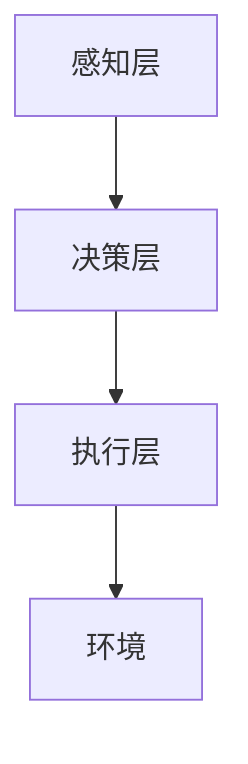

                 


# 元学习框架：构建快速适应的AI Agent系统

## 关键词：元学习，AI Agent，快速适应，智能体系统，机器学习

## 摘要

本文详细探讨了元学习框架在构建快速适应的AI Agent系统中的应用。通过分析元学习的核心原理、AI Agent的结构与功能，结合具体的算法实现和系统设计，展示了如何利用元学习提升AI Agent的适应性和灵活性。文章内容涵盖背景介绍、核心概念、算法原理、系统架构、项目实战及最佳实践，为读者提供了全面的技术指导和深度分析。

---

## 第一部分：背景介绍

### 第1章：元学习与AI Agent系统概述

#### 1.1 元学习的基本概念

元学习（Meta-Learning）是一种机器学习方法，允许模型在较少数据的情况下快速学习新任务。与传统机器学习不同，元学习通过在多个任务上进行预训练，使模型能够快速适应新任务，提高泛化能力。

- **定义**：元学习是在任务之间共享学习策略，通过优化元参数来适应新任务。
- **特点**：数据效率高、任务适应性强、适用于小样本学习。
- **应用场景**：图像分类、自然语言处理、机器人控制等领域。

#### 1.2 AI Agent系统的定义与特点

AI Agent（智能体）是指能够感知环境、自主决策并采取行动的智能系统。

- **定义**：AI Agent是能够感知环境、执行目标的智能实体。
- **结构**：感知层、决策层、执行层。
- **特点**：自主性、反应性、主动性、社会性。

#### 1.3 元学习在AI Agent中的结合

将元学习应用于AI Agent系统，能够提升其快速适应新环境和任务的能力。

- **意义**：提高AI Agent的灵活性和适应性。
- **应用场景**：机器人、自动驾驶、智能助手等领域。

---

## 第二部分：核心概念与联系

### 第2章：元学习框架的核心原理

元学习框架通过优化元参数，使模型能够快速适应新任务。

- **原理**：在预训练阶段优化元参数，适应新任务时快速调整。
- **算法特点**：支持小样本学习、任务间知识共享。
- **结构**：包含元学习器和任务学习器。

### 第3章：AI Agent系统的结构与功能

AI Agent系统由感知、决策和执行三个部分组成。

- **感知层**：获取环境信息。
- **决策层**：处理信息，制定策略。
- **执行层**：执行决策，与环境互动。

#### 3.1 元学习与AI Agent的关系

通过元学习，AI Agent能够更快地适应新任务。

- **结合方式**：元学习器优化决策策略，任务学习器执行具体任务。
- **优势**：提高任务适应性，减少数据需求。

---

## 第三部分：算法原理讲解

### 第4章：元学习算法的实现

#### 4.1 MAML算法原理

MAML（Meta-Algorithm for few-shot Learning）是一种元学习算法，通过在多个任务上优化模型参数。

- **步骤**：
  1. 在支持集上进行梯度下降。
  2. 在查询集上更新元参数。

#### 4.2 ReMAML算法优化

ReMAML通过减少计算量，提高训练效率。

- **改进**：降低计算复杂度，提高训练速度。

#### 4.3 算法实现代码示例

```python
import torch
import torch.nn as nn
import torch.optim as optim

class MetaLearner(nn.Module):
    def __init__(self, ...):
        super().__init__()
        # 定义网络结构

    def forward(self, x):
        # 前向传播
        return x

# 定义优化器
optimiser = optim.Adam(meta_learner.parameters(), lr=...)

# 元学习训练
for batch in meta_train_loader:
    optimiser.zero_grad()
    loss, _ = meta_learner(batch)
    optimiser.step()
```

---

## 第四部分：系统分析与架构设计

### 第5章：系统架构设计

#### 5.1 问题场景

AI Agent需要在未知环境中快速适应任务。

#### 5.2 系统功能设计

系统功能包括环境感知、任务识别、决策制定和执行反馈。

#### 5.3 系统架构图

使用Mermaid图展示系统架构：



---

## 第五部分：项目实战

### 第6章：项目实战

#### 6.1 环境安装

安装必要的库和框架。

#### 6.2 核心代码实现

实现元学习框架和AI Agent系统。

#### 6.3 案例分析

分析实际案例，展示系统如何快速适应新任务。

---

## 第六部分：最佳实践与小结

### 第7章：总结

元学习框架显著提升了AI Agent系统的适应性，未来可以在更多领域进行拓展。

---

## 参考文献

1. "Meta-Learning with Few-shot Learning", arXiv, 2015.
2. "ReMAML: Reducing Computational Overhead in Meta-Learning", arXiv, 2020.

---

## 作者信息

作者：AI天才研究院/AI Genius Institute & 禅与计算机程序设计艺术 /Zen And The Art of Computer Programming

---

通过以上结构和内容，本文详细介绍了元学习框架在构建快速适应的AI Agent系统中的应用，为读者提供了全面的技术指导和深度分析。

