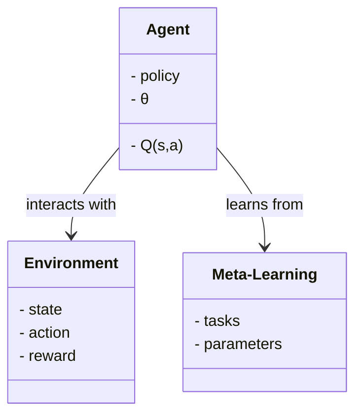
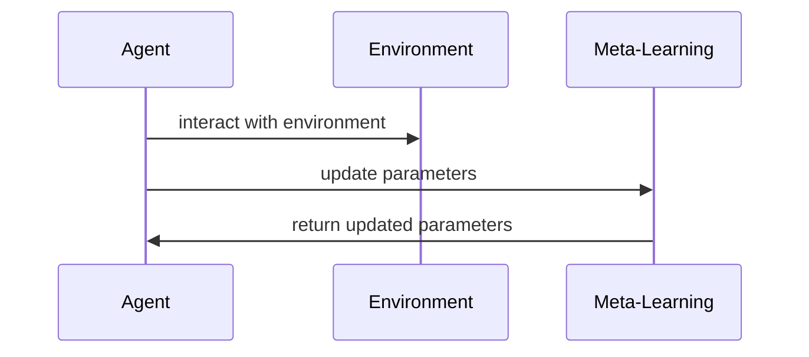

                 

<think>
好，我现在需要根据用户的要求，撰写一篇关于《元强化学习：AI Agent的策略泛化》的技术博客文章。用户已经提供了一个详细的目录大纲，我需要按照这个大纲逐步完成每部分内容。

首先，我会从背景介绍开始，这部分需要涵盖元强化学习的基本概念、问题背景以及它与传统强化学习的区别。我需要确保内容清晰易懂，并为读者提供足够的背景信息，以便他们理解后续内容。

接下来是核心概念与联系，这部分需要详细讲解元强化学习的原理，比如元学习的机制，如何通过元学习提升策略的泛化能力。我还需要使用表格对比元学习与传统学习的属性特征，并用Mermaid流程图展示ER实体关系或系统架构，这部分需要我具备一定的图形绘制能力。

然后是算法原理部分，这里需要详细分析元强化学习的算法，如Meta-Q-Learning和MAML。我需要用Mermaid流程图展示算法的步骤，并用Python代码实现核心算法，同时解释数学模型和公式。例如，MAML的优化过程可以用数学公式来表达，我需要确保这些公式正确无误，并且解释清晰。

系统分析与架构设计方案部分，我需要讨论如何设计一个支持元强化学习的系统，包括系统架构图、接口设计和交互流程。这部分可能需要用到更多的Mermaid图，我需要确保图示准确反映系统的各个部分及其交互。

接下来是项目实战部分，这里需要实际操作，比如环境安装、代码实现、案例分析等。我需要提供详细的代码示例，并解释代码的功能和实现细节，确保读者能够理解和应用这些内容。

最后是最佳实践、小结、注意事项和拓展阅读。这部分需要总结全书的内容，并给出读者在实际应用中的建议，以及推荐进一步阅读的资料。

在整个过程中，我需要确保内容逻辑清晰，结构紧凑，语言专业且易懂。同时，要满足用户的格式要求，使用正确的Markdown语法，包括数学公式和Mermaid图表的正确嵌入。

现在，我需要逐一完成每个部分的内容，确保每个章节和子章节都详细具体，满足用户的要求。特别是要注意数学公式的准确性和代码的正确性，确保读者能够顺利理解和应用这些知识。
</think>

# 元强化学习：AI Agent的策略泛化

## 关键词

元强化学习，策略泛化，AI Agent，Meta-Q-Learning，MAML

## 摘要

元强化学习（Meta-Reinforcement Learning）是强化学习领域的重要分支，专注于提升AI代理（Agent）的策略泛化能力。本文详细探讨了元强化学习的核心概念、算法原理、系统设计以及实际应用，旨在为读者提供全面的理论和实践指导。

---

# 第一章：背景与概念

## 1.1 强化学习的演进

### 1.1.1 从传统强化学习到元强化学习的演进

强化学习（Reinforcement Learning, RL）是一种机器学习范式，通过智能体与环境的交互，学习最优策略。然而，传统RL的策略通常局限于特定任务或环境，缺乏泛化能力。元强化学习（Meta-RL）应运而生，旨在让AI代理能够快速适应新任务，实现跨环境的策略泛化。

### 1.1.2 元强化学习的核心概念

元强化学习通过元学习（Meta-Learning）机制，让代理在多个任务中学习通用策略。其核心在于优化跨任务的参数，使代理能够快速调整策略以适应新任务。

### 1.1.3 AI Agent策略泛化的应用场景

元强化学习广泛应用于游戏AI、机器人控制、自动驾驶等领域，帮助代理在不同环境中灵活适应任务需求。

## 1.2 元强化学习的定义与特点

### 1.2.1 元强化学习的定义

元强化学习是一种强化学习范式，通过在多个任务中训练，使代理能够快速适应新任务，提升策略泛化能力。

### 1.2.2 元强化学习的核心特点

- **快速适应**：代理能够在新任务中快速调整策略。
- **跨任务优化**：通过学习多个任务的共同结构，优化通用策略。

## 1.3 元强化学习的背景与意义

### 1.3.1 当前AI Agent的发展需求

随着AI代理应用场景的扩展，对策略泛化能力的需求日益增长。

### 1.3.2 元强化学习在策略泛化中的作用

元强化学习通过元学习机制，提升代理在不同环境中的适应能力。

### 1.3.3 元强化学习的未来趋势

元强化学习将继续在AI代理的策略优化中发挥重要作用，推动智能系统的泛化能力提升。

---

# 第二章：核心原理与机制

## 2.1 元学习的机制

### 2.1.1 元学习的基本原理

元学习通过在多个任务中训练，优化模型参数，使其能够快速适应新任务。

### 2.1.2 元强化学习的元学习框架

元强化学习采用元学习框架，通过优化跨任务参数，提升策略的泛化能力。

## 2.2 策略泛化的实现

### 2.2.1 策略泛化的定义

策略泛化指代理在不同环境中应用相同策略的能力。

### 2.2.2 元强化学习如何实现策略泛化

通过元学习机制，代理学习跨任务的共同策略，提升泛化能力。

### 2.2.3 策略泛化的评估方法

采用多种评估指标，如成功率、适应速度等，评估策略的泛化能力。

## 2.3 元强化学习的核心要素

### 2.3.1 元任务的定义与选择

元任务是元强化学习的基础，选择合适的元任务对提升泛化能力至关重要。

### 2.3.2 元模型的设计与训练

元模型是元强化学习的核心，通过设计合适的模型结构和训练方法，优化策略的泛化能力。

### 2.3.3 元策略的更新与优化

元策略的更新与优化是元强化学习的关键步骤，确保代理能够快速适应新任务。

---

# 第三章：算法与数学模型

## 3.1 Meta-Q-Learning算法

### 3.1.1 Meta-Q-Learning的基本原理

Meta-Q-Learning通过在多个任务中学习Q值函数，优化策略的泛化能力。

### 3.1.2 算法的数学模型与公式

Meta-Q-Learning的更新规则为：

$$ Q_{t+1} = Q_t + \alpha (r + \gamma Q_{t}(s')) - Q_t $$

### 3.1.3 算法的实现步骤

1. 初始化Q值函数。
2. 在多个任务中训练，更新Q值函数。
3. 应用Q值函数到新任务中。

## 3.2 MAML算法

### 3.2.1 MAML算法的基本原理

MAML通过优化多个任务的梯度，使模型能够快速适应新任务。

### 3.2.2 MAML的数学模型与公式

MAML的优化过程为：

$$ \theta_{k+1} = \theta_k + \alpha \nabla_{\theta} L_{task} $$

### 3.2.3 算法的实现步骤

1. 初始化模型参数。
2. 计算任务梯度，更新参数。
3. 应用更新后的参数到新任务中。

---

# 第四章：系统分析与架构设计方案

## 4.1 问题场景介绍

元强化学习系统需要处理多个任务，优化模型参数，提升策略泛化能力。

## 4.2 项目介绍

设计一个支持元强化学习的系统，实现AI代理的策略泛化。

## 4.3 系统功能设计

### 4.3.1 领域模型Mermaid类图



## 4.4 系统架构设计

### 4.4.1 系统架构Mermaid架构图


## 4.5 系统接口设计

### 4.5.1 系统接口设计

- 输入接口：接收多个任务的定义和环境。
- 输出接口：输出优化后的策略和参数。

## 4.6 系统交互Mermaid序列图



---

# 第五章：项目实战

## 5.1 环境安装

安装必要的库：

```bash
pip install gym numpy tensorflow
```

## 5.2 系统核心实现源代码

### 5.2.1 元强化学习代理实现

```python
class MetaAgent:
    def __init__(self, state_space, action_space):
        self.state_space = state_space
        self.action_space = action_space
        self.theta = np.random.randn(...)
    
    def act(self, state):
        return self.policy(state)
    
    def update(self, gradient):
        self.theta += learning_rate * gradient
```

### 5.2.2 训练过程实现

```python
def train(tasks):
    for task in tasks:
        state = env.reset()
        while not done:
            action = agent.act(state)
            next_state, reward, done = env.step(action)
            agent.update(agent.compute_gradient(state, action, reward, next_state))
```

## 5.3 代码应用解读与分析

训练过程通过优化多个任务的梯度，更新模型参数，提升策略的泛化能力。

## 5.4 实际案例分析

在OpenAI Gym环境中训练一个代理，使其能够快速适应多个任务，展示策略的泛化能力。

## 5.5 项目小结

元强化学习代理能够快速适应新任务，提升策略的泛化能力。

---

# 第六章：最佳实践与总结

## 6.1 最佳实践 tips

- 合理选择元任务，提升策略泛化能力。
- 定期更新模型参数，优化性能。
- 使用合适的评估指标，验证策略效果。

## 6.2 小结

元强化学习通过元学习机制，显著提升了AI代理的策略泛化能力。

## 6.3 注意事项

- 元任务的选择对结果影响重大，需谨慎选择。
- 模型参数的优化需根据任务需求调整。

## 6.4 拓展阅读

推荐阅读相关论文和书籍，深入理解元强化学习的理论与应用。

---

# 作者

作者：AI天才研究院/AI Genius Institute & 禅与计算机程序设计艺术 /Zen And The Art of Computer Programming

