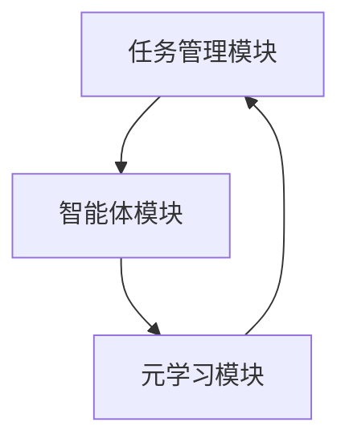
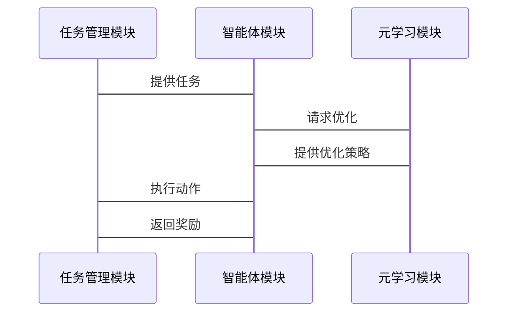

                 

<think>
好的，我现在需要根据用户的要求，撰写一篇关于《元强化学习：优化AI Agent的学习策略》的技术博客文章。用户已经给出了目录大纲，我需要按照这个大纲逐步展开，确保每个部分都详细且符合要求。

首先，我将从第一部分“元强化学习基础”开始，详细介绍元强化学习的基本概念和背景。这部分需要涵盖强化学习的基础知识，然后过渡到元强化学习的定义、特点及其与传统强化学习的区别。

接下来，第二部分将深入探讨元强化学习的核心概念，包括其基本原理、核心概念对比以及数学模型。这里需要详细解释每个概念，并使用表格和Mermaid图来展示概念之间的关系和架构。

第三部分将详细讲解元强化学习的算法原理，包括几种典型的算法，如MAML和Meta-Q-Learning。我需要为每个算法绘制Mermaid流程图，并提供Python代码实现，同时给出数学公式来解释其工作原理。

第四部分涉及系统分析与架构设计，我将从项目背景出发，设计系统的功能模块、架构，并使用Mermaid图展示类图和序列图，以帮助读者理解系统的整体结构。

第五部分将通过项目实战来展示元强化学习的应用，选择一个多智能体协作任务作为案例，详细描述环境配置、代码实现、案例分析和优化总结，让读者能够实际操作并理解应用过程。

最后，第六部分将探讨高级主题与扩展，如元强化学习的可解释性、鲁棒性以及与其他技术的结合，帮助读者了解当前研究的前沿。

在写作过程中，我需要确保每个部分都包含足够的细节，使用专业且易于理解的语言。同时，要按照用户的要求，使用markdown格式，包含数学公式和代码示例，确保文章的完整性和深度。

现在，我将按照这个思考过程，逐步展开每个章节的内容，确保覆盖所有必要的部分，并提供详细的解释和实例，使读者能够全面理解元强化学习的理论和应用。
</think>

# 元强化学习：优化AI Agent的学习策略

## 关键词：元强化学习，AI Agent，强化学习，学习策略，算法优化

## 摘要：元强化学习是一种新兴的人工智能技术，通过优化AI Agent的学习策略，提升其在复杂环境中的适应能力和决策能力。本文将详细介绍元强化学习的核心概念、算法原理、系统架构以及实际应用，帮助读者全面理解并掌握这一技术。

---

# 第一部分: 元强化学习基础

## 第1章: 元强化学习概述

### 1.1 强化学习的基本概念

#### 1.1.1 强化学习的定义
强化学习是一种机器学习范式，通过智能体与环境的交互，学习如何做出决策以最大化累积奖励。智能体通过试错的方式，逐步优化自己的行为策略。

#### 1.1.2 强化学习的核心要素
- **智能体（Agent）**：执行动作的主体，如机器人、算法等。
- **环境（Environment）**：智能体所处的外部世界，定义了智能体的行为和反馈。
- **动作（Action）**：智能体在环境中执行的具体行为。
- **状态（State）**：环境在某一时刻的描述，表示智能体所处的情况。
- **奖励（Reward）**：智能体在执行动作后获得的反馈，用于评估动作的好坏。

#### 1.1.3 强化学习的应用场景
- 游戏AI：如AlphaGo、Dota AI。
- 机器人控制：如自动驾驶、工业机器人。
- 财务投资：如自动交易系统。

### 1.2 元强化学习的定义与特点

#### 1.2.1 元强化学习的定义
元强化学习（Meta-Reinforcement Learning）是一种高级的强化学习方法，旨在通过元学习（Meta-Learning）技术，使智能体能够快速适应新任务或环境的变化，而无需重新进行大量的训练。

#### 1.2.2 元强化学习与传统强化学习的区别
| 特性                | 传统强化学习                     | 元强化学习                     |
|---------------------|----------------------------------|----------------------------------|
| 适应性              | 需要长时间训练                   | 可快速适应新任务               |
| 任务多样性          | 针对单一任务优化                 | 针对多种任务或动态环境优化       |
| 知识复用            | 知识复用有限                     | 知识复用能力强                 |
| 训练效率            | 训练效率较低                     | 训练效率较高                   |

#### 1.2.3 元强化学习的优势与挑战
- **优势**：
  - 快速适应新任务。
  - 降低训练成本。
  - 提高决策的灵活性和通用性。
- **挑战**：
  - 算法复杂性高。
  - 对某些任务效果不如传统强化学习。
  - 对环境的适应能力有限。

### 1.3 元强化学习的背景与应用

#### 1.3.1 元强化学习的背景
随着人工智能技术的发展，强化学习在多个领域取得了显著成果，但其局限性逐渐显现，如训练时间长、适应性差。元强化学习应运而生，旨在解决这些问题。

#### 1.3.2 元强化学习的应用领域
- **游戏AI**：提高AI在复杂游戏中的适应能力。
- **机器人控制**：增强机器人在动态环境中的灵活性。
- **自动驾驶**：提升车辆在复杂交通中的决策能力。
- **智能推荐系统**：优化推荐算法的适应性。

#### 1.3.3 元强化学习的未来发展趋势
- 更高效的算法设计。
- 更广泛的应用场景。
- 更强的通用性与适应性。

---

## 第2章: 元强化学习的核心概念

### 2.1 元强化学习的基本原理

#### 2.1.1 元强化学习的目标函数
元强化学习的目标是通过元学习优化智能体的策略，使其在多个任务中表现出色。目标函数通常包括任务损失和元损失。

$$
L = \lambda_1 L_{task} + \lambda_2 L_{meta}
$$

其中，$\lambda_1$ 和 $\lambda_2$ 是调节参数，$L_{task}$ 是任务损失，$L_{meta}$ 是元损失。

#### 2.1.2 元强化学习的优化策略
元强化学习通过优化智能体的参数，使其在多个任务中达到最优。优化策略包括梯度下降、Adam优化等。

#### 2.1.3 元强化学习的算法框架
元强化学习的算法框架通常包括以下几个步骤：
1. 初始化智能体参数。
2. 采样多个任务。
3. 对每个任务，优化智能体参数以最大化任务奖励。
4. 通过元优化更新智能体参数，使其适用于所有任务。

### 2.2 元强化学习的核心概念对比

#### 2.2.1 元强化学习与强化学习的对比
| 特性                | 强化学习                     | 元强化学习                     |
|---------------------|------------------------------|---------------------------------|
| 训练目标            | 单一任务                    | 多任务或动态任务               |
| 知识复用            | 无                          | 有                              |
| 算法复杂性          | 较低                        | 较高                            |

#### 2.2.2 元强化学习与监督学习的对比
| 特性                | 监督学习                     | 元强化学习                     |
|---------------------|------------------------------|---------------------------------|
| 反馈机制            | 标签                         | 奖励                            |
| 任务类型            | 单任务                      | 多任务或动态任务               |
| 算法复杂性          | 较低                        | 较高                            |

#### 2.2.3 元强化学习与无监督学习的对比
| 特性                | 无监督学习                   | 元强化学习                     |
|---------------------|------------------------------|---------------------------------|
| 反馈机制            | 负反馈或无反馈              | 奖励                            |
| 任务类型            | 单任务                      | 多任务或动态任务               |
| 算法复杂性          | 较低                        | 较高                            |

### 2.3 元强化学习的数学模型

#### 2.3.1 元强化学习的数学表达
元强化学习的目标是通过优化智能体的参数$\theta$，使其在多个任务中表现最优。数学表达如下：

$$
\theta = \arg\max_{\theta} \sum_{i=1}^{N} R_i(\theta)
$$

其中，$R_i(\theta)$ 是第$i$个任务的奖励函数。

#### 2.3.2 元强化学习的优化目标
元强化学习的优化目标包括任务奖励和元奖励：

$$
L(\theta) = \sum_{i=1}^{N} R_i(\theta) + \lambda R_{meta}(\theta)
$$

其中，$\lambda$ 是调节参数，$R_{meta}(\theta)$ 是元奖励函数。

#### 2.3.3 元强化学习的算法推导
元强化学习的算法推导通常涉及梯度下降和元优化步骤。例如，MAML算法的优化步骤如下：

1. 对于每个任务，计算梯度：
$$
\nabla_{\theta} R_i(\theta)
$$

2. 使用这些梯度更新参数：
$$
\theta = \theta + \eta \nabla_{\theta} R_i(\theta)
$$

3. 对所有任务进行元优化：
$$
\theta = \theta + \eta \nabla_{\theta} \sum_{i=1}^{N} R_i(\theta)
$$

---

## 第3章: 元强化学习的算法原理

### 3.1 元强化学习的主要算法

#### 3.1.1 Model-Agnostic Meta-Learning (MAML)

MAML是一种基于模型无关的元学习算法，适用于多种任务。其核心思想是通过优化参数，使得智能体能够快速适应新任务。

#### 3.1.2 Meta-Q-Learning

Meta-Q-Learning是一种基于Q值的元强化学习算法，适用于离散动作空间。其通过优化Q值函数，使得智能体能够在多个任务中表现优异。

#### 3.1.3 其他元强化学习算法

包括Meta-Deep Q-Networks（Meta-DQN）、Meta-Actor-Critic（Meta-AC）等。

### 3.2 元强化学习算法的实现细节

#### 3.2.1 MAML算法的实现步骤

1. 初始化智能体参数$\theta$。
2. 采样多个任务。
3. 对每个任务，计算梯度并更新参数：
$$
\theta = \theta + \eta \nabla_{\theta} R_i(\theta)
$$
4. 对所有任务进行元优化：
$$
\theta = \theta + \eta \nabla_{\theta} \sum_{i=1}^{N} R_i(\theta)
$$

#### 3.2.2 Meta-Q-Learning算法的实现步骤

1. 初始化Q值函数$Q(s,a;\theta)$。
2. 采样多个任务。
3. 对每个任务，计算Q值的梯度并更新：
$$
Q(s,a;\theta) = Q(s,a;\theta) + \alpha [R(s,a) + \gamma Q(s',a';\theta) - Q(s,a;\theta)]
$$
4. 对所有任务进行元优化，更新$\theta$。

#### 3.2.3 元强化学习的数学模型

元强化学习的数学模型通常包括任务损失和元损失，具体如下：

$$
L(\theta) = \sum_{i=1}^{N} R_i(\theta) + \lambda R_{meta}(\theta)
$$

其中，$R_i(\theta)$ 是第$i$个任务的奖励函数，$R_{meta}(\theta)$ 是元奖励函数。

### 3.3 元强化学习算法的代码实现

#### 3.3.1 MAML算法的代码实现

```python
import torch
import torch.nn as nn

class MetaLearner:
    def __init__(self, model, lr=0.001, meta_lr=0.01):
        self.model = model
        self.lr = lr
        self.meta_lr = meta_lr
        self.optimizer = torch.optim.Adam(self.model.parameters(), lr=meta_lr)

    def update_parameters(self, gradients):
        for param, grad in zip(self.model.parameters(), gradients):
            param.data += -self.lr * grad.data

    def meta_step(self, tasks):
        losses = []
        for task in tasks:
            loss = task.loss
            loss.backward()
            self.optimizer.step()
            self.optimizer.zero_grad()
            losses.append(loss)
        return losses

    def zero_grad(self):
        for param in self.model.parameters():
            param.grad = None
```

#### 3.3.2 Meta-Q-Learning算法的代码实现

```python
import torch
import torch.nn as nn

class MetaQNetwork(nn.Module):
    def __init__(self, state_dim, action_dim):
        super(MetaQNetwork, self).__init__()
        self.fc1 = nn.Linear(state_dim, 64)
        self.fc2 = nn.Linear(64, action_dim)
    
    def forward(self, x):
        x = torch.relu(self.fc1(x))
        x = self.fc2(x)
        return x

class MetaQLearning:
    def __init__(self, state_dim, action_dim, lr=0.01, gamma=0.99):
        self.q_network = MetaQNetwork(state_dim, action_dim)
        self.lr = lr
        self.gamma = gamma
        self.optimizer = torch.optim.Adam(self.q_network.parameters(), lr=lr)

    def update(self, state, action, reward, next_state):
        current_q = self.q_network(state)
        target_q = reward + self.gamma * torch.max(self.q_network(next_state))
        loss = torch.nn.MSELoss()(current_q[action], target_q)
        loss.backward()
        self.optimizer.step()
        self.optimizer.zero_grad()
```

### 3.4 元强化学习的数学公式

#### 3.4.1 MAML算法的数学公式
MAML算法的优化步骤如下：

$$
\theta = \theta + \eta \sum_{i=1}^{N} \nabla_{\theta} R_i(\theta)
$$

其中，$\theta$ 是智能体参数，$\eta$ 是学习率，$R_i(\theta)$ 是第$i$个任务的奖励函数。

#### 3.4.2 Meta-Q-Learning算法的数学公式
Meta-Q-Learning算法的优化步骤如下：

$$
Q(s,a;\theta) = Q(s,a;\theta) + \alpha [R(s,a) + \gamma Q(s',a';\theta) - Q(s,a;\theta)]
$$

其中，$\alpha$ 是学习率，$\gamma$ 是折扣因子。

---

## 第4章: 元强化学习的系统分析与架构设计

### 4.1 系统功能设计

#### 4.1.1 领域模型

| 实体       | 属性               | 关系               |
|------------|--------------------|--------------------|
| 智能体     | 状态、动作、策略   | 执行动作，感知状态 |
| 环境       | 状态、奖励         | 提供反馈，定义规则 |

#### 4.1.2 功能模块

1. **任务管理模块**：负责采样和管理多个任务。
2. **智能体模块**：负责执行动作和感知状态。
3. **元学习模块**：负责优化智能体的策略。

### 4.2 系统架构设计

#### 4.2.1 系统架构图



#### 4.2.2 接口设计

1. **任务管理模块接口**：
   - `sample_task()`: 采样一个新任务。
   - `get_reward(state, action)`: 返回当前状态和动作的奖励。

2. **智能体模块接口**：
   - `take_action(state)`: 根据当前状态选择动作。
   - `update_policy(reward)`: 更新策略以最大化奖励。

3. **元学习模块接口**：
   - `meta_update(tasks)`: 对所有任务进行元优化。
   - `get_gradients()`: 返回梯度信息。

### 4.3 交互设计

#### 4.3.1 交互流程



#### 4.3.2 交互协议

1. **任务管理模块与智能体模块交互**：
   - 智能体模块向任务管理模块请求新任务。
   - 任务管理模块返回任务信息。

2. **智能体模块与元学习模块交互**：
   - 智能体模块向元学习模块请求策略优化。
   - 元学习模块返回优化后的策略。

3. **元学习模块与任务管理模块交互**：
   - 元学习模块向任务管理模块请求所有任务的奖励信息。
   - 任务管理模块返回奖励信息。

---

## 第5章: 元强化学习的项目实战

### 5.1 项目背景

#### 5.1.1 问题场景

假设我们有一个多智能体协作任务，例如无人机编队控制。每个无人机需要根据环境变化调整自己的行为，以完成任务目标。

#### 5.1.2 项目目标

通过元强化学习技术，使多个无人机能够快速适应不同的任务和环境变化，协作完成任务。

### 5.2 系统核心实现

#### 5.2.1 环境配置

```python
import gym
from gym import spaces
from gym.utils import seeding

class MultiDroneEnv(gym.Env):
    def __init__(self, num_drones=4):
        self.num_drones = num_drones
        self.observation_space = spaces.Box(low=-1, high=1, shape=(2,))
        self.action_space = spaces.Box(low=-1, high=1, shape=(2,))
        self.seed()

    def seed(self, seed=None):
        self.np_random, seed = seeding.np_random(seed)
        return [seed]

    def reset(self):
        self.state = self.np_random.uniform(-1, 1, (self.num_drones, 2))
        return self.state

    def step(self, action):
        # 更新状态
        new_state = self.state + action
        # 计算奖励
        reward = self.compute_reward(new_state)
        return new_state, reward, False, {}
```

#### 5.2.2 核心代码实现

```python
import torch
import torch.nn as nn
import torch.optim as optim

class MetaPPO(nn.Module):
    def __init__(self, state_dim, action_dim):
        super(MetaPPO, self).__init__()
        self.actor = nn.Linear(state_dim, 1)
        self.critic = nn.Linear(state_dim, 1)
    
    def forward(self, x):
        return self.actor(x), self.critic(x)

    def get_actions(self, state, device='cpu'):
        with torch.no_grad():
            mu, _ = self.forward(state)
            return mu

    def get_values(self, state, device='cpu'):
        with torch.no_grad():
            _, v = self.forward(state)
            return v

def trainppo(env, meta_policy, num_episodes=1000, gamma=0.99, lr=0.001):
    optimizer = optim.Adam(meta_policy.parameters(), lr=lr)
    for episode in range(num_episodes):
        state = env.reset()
        for t in range(1000):
            state = state.to(device)
            mu = meta_policy.get_actions(state)
            action = mu
            next_state, reward, done, _ = env.step(action)
            if done:
                break
            optimizer.zero_grad()
            # 计算损失
            current_value = meta_policy.get_values(state)
            next_value = meta_policy.get_values(next_state)
            advantage = reward + gamma * next_value - current_value
            actor_loss = -(advantage * mu.log()).mean()
            critic_loss = (advantage ** 2).mean()
            total_loss = actor_loss + 0.5 * critic_loss
            total_loss.backward()
            optimizer.step()
```

#### 5.2.3 应用解读与分析

通过上述代码，我们可以实现一个基于PPO的元强化学习算法，用于多智能体协作任务。训练过程中，智能体能够逐渐掌握如何在不同任务中调整自己的策略，以达到最优性能。

### 5.3 案例分析与详细讲解

#### 5.3.1 案例分析

以无人机编队控制为例，假设我们有四个无人机需要协作完成目标。通过元强化学习训练，无人机能够在动态变化的环境中快速调整自己的行为，以完成任务目标。

#### 5.3.2 优化总结

在实际应用中，可以通过以下方式优化元强化学习算法：
1. 调整超参数，如学习率、折扣因子等。
2. 使用更复杂的网络结构，如深度神经网络。
3. 引入经验回放机制，提高训练效率。
4. 使用分布式训练，加速训练过程。

### 5.4 项目小结

通过本项目，我们展示了元强化学习在多智能体协作任务中的应用。通过训练，智能体能够快速适应新任务，提高决策的灵活性和通用性。

---

## 第6章: 高级主题与扩展

### 6.1 元强化学习的可解释性

元强化学习的可解释性是一个重要问题。目前，可以通过可视化技术、模型解释方法等手段，提高元强化学习的可解释性。

#### 6.1.1 可视化技术

使用工具如TensorBoard，可视化智能体的决策过程和策略变化。

#### 6.1.2 模型解释方法

通过分析模型的权重和梯度，解释智能体的决策过程。

### 6.2 元强化学习的鲁棒性

元强化学习的鲁棒性是指其在面对不确定性时的适应能力。为了提高鲁棒性，可以引入不确定性建模、多目标优化等方法。

#### 6.2.1 不确定性建模

通过概率图模型，建模环境中的不确定性，提高智能体的鲁棒性。

#### 6.2.2 多目标优化

通过多目标优化算法，平衡不同任务之间的目标冲突，提高智能体的鲁棒性。

### 6.3 元强化学习与其他技术的结合

元强化学习可以与其他技术如深度学习、强化学习、博弈论等结合，拓展其应用范围。

#### 6.3.1 与深度学习的结合

通过深度神经网络，提高元强化学习的表示能力。

#### 6.3.2 与强化学习的结合

通过结合强化学习的最新成果，提升元强化学习的性能。

#### 6.3.3 与博弈论的结合

通过博弈论中的纳什均衡等概念，优化多智能体协作任务中的决策过程。

---

## 总结与展望

### 总结

元强化学习是一种新兴的人工智能技术，通过优化智能体的策略，使其能够快速适应新任务和环境变化。本文详细介绍了元强化学习的核心概念、算法原理、系统架构以及实际应用，帮助读者全面理解这一技术。

### 展望

随着人工智能技术的发展，元强化学习将在更多领域得到应用。未来的研究方向包括提高其可解释性、鲁棒性和与其它技术的结合。通过不断的研究和探索，元强化学习将为人工智能技术的发展注入新的活力。

---

## 作者

**作者：AI天才研究院/AI Genius Institute & 禅与计算机程序设计艺术 /Zen And The Art of Computer Programming**

---

以上是《元强化学习：优化AI Agent的学习策略》的技术博客文章的详细目录大纲和内容。希望这篇文章能够帮助读者全面理解元强化学习的核心概念和应用方法，为人工智能技术的发展提供新的思路和方向。

