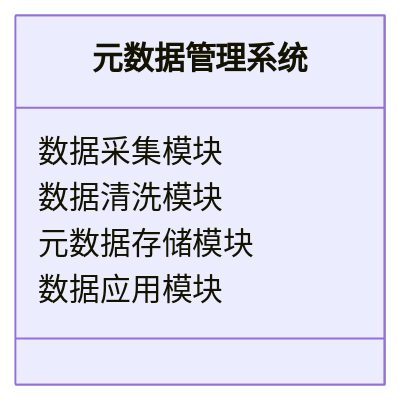
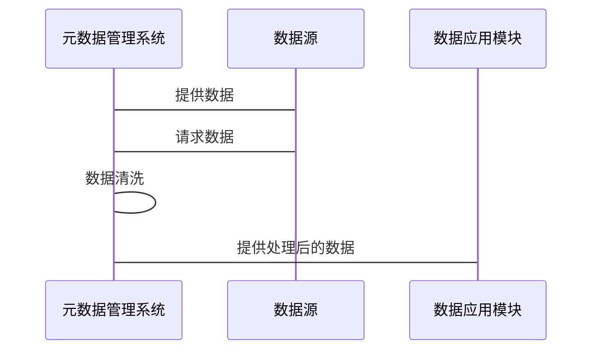

                 


# 元数据管理：组织和利用AI Agent的数据资产

## 关键词：
元数据管理，AI Agent，数据资产，数据清洗，特征提取，分类模型，系统架构

## 摘要：
本文详细探讨了元数据管理在AI Agent中的应用，从背景到核心概念，再到算法原理、系统架构和项目实战，全面分析了如何有效组织和利用数据资产，提升AI Agent的性能和决策能力。

---

# 第1章 元数据管理概述

## 1.1 元数据的基本概念
### 1.1.1 元数据的定义与作用
元数据（Metadata）是描述数据的数据，用于定义数据的属性、结构和上下文。它在数据管理和分析中起着关键作用，帮助我们更好地理解和利用数据。

### 1.1.2 元数据的重要性
元数据的重要性体现在数据的可追溯性、一致性和易用性上。通过元数据，我们可以追踪数据来源，确保数据的准确性和一致性。

### 1.1.3 元数据的分类与特点
元数据可以分为描述性元数据、结构化元数据和管理性元数据。每种类型都有其独特的特点和应用场景。

---

## 1.2 元数据在AI Agent中的作用
### 1.2.1 AI Agent与数据资产的关系
AI Agent需要依赖数据资产进行决策和行动。元数据帮助AI Agent理解数据的含义和结构，从而做出更明智的选择。

### 1.2.2 元数据在数据资产组织中的核心地位
元数据是数据资产组织的基石，通过元数据，我们可以将数据按类别和用途进行有效分类，便于管理和检索。

### 1.2.3 元数据对AI Agent决策的影响
元数据直接影响AI Agent的数据处理和决策能力。通过元数据，AI Agent可以快速获取数据的相关信息，提升处理效率和准确性。

---

## 1.3 元数据管理的目标与挑战
### 1.3.1 元数据管理的目标
元数据管理的目标是确保数据的准确、一致和易于访问，同时提高数据的利用效率。

### 1.3.2 元数据管理的挑战
元数据管理的挑战包括数据的多样性和复杂性、数据安全和隐私问题，以及如何保持数据的一致性和完整性。

### 1.3.3 元数据管理的未来趋势
随着AI技术的不断发展，元数据管理将更加智能化和自动化，元数据将与数据湖、数据仓库等技术深度融合。

---

## 1.4 本章小结
本章介绍了元数据的基本概念、在AI Agent中的作用以及管理的目标与挑战。元数据是数据管理和AI应用中的关键要素，其有效管理对提升数据利用效率和AI Agent的性能至关重要。

---

# 第2章 元数据管理的核心概念与联系

## 2.1 元数据的属性与特征
### 2.1.1 元数据的属性分析
元数据的属性包括数据类型、数据来源、数据格式、数据时间戳等。

### 2.1.2 元数据特征对比表格
以下是元数据特征的对比表格：

| 特征属性 | 描述 |
|----------|------|
| 数据类型 | 数据的格式和类别 |
| 数据来源 | 数据的来源渠道 |
| 数据格式 | 数据的结构和表示方式 |
| 数据时间戳 | 数据的时间记录 |

### 2.1.3 元数据的实体关系图（ER图）
```mermaid
erDiagram
    meta1 {
        title 元数据实体关系图
        entity 元数据 {
            id int
            属性 varchar
            类型 varchar
        }
        entity 数据资产 {
            id int
            名称 varchar
            描述 varchar
        }
    }
    元数据 --> 数据资产 : 描述
```

---

## 2.2 元数据与AI Agent的关系
### 2.2.1 AI Agent的数据需求
AI Agent需要处理大量数据，元数据帮助其快速理解数据的含义和结构。

### 2.2.2 元数据在AI Agent中的应用
元数据在AI Agent中的应用包括数据清洗、特征提取、数据分类等关键步骤。

### 2.2.3 元数据与AI Agent的交互流程
以下是元数据与AI Agent交互的流程图：

```mermaid
flowchart TD
    A[AI Agent] --> B[数据源] : 获取数据
    B --> C[元数据提取] : 提取元数据
    C --> D[数据处理] : 根据元数据进行处理
    D --> A : 提供处理后的数据
```

---

## 2.3 元数据管理的系统架构
### 2.3.1 元数据管理系统的组成
元数据管理系统通常包括数据采集模块、数据清洗模块、元数据存储模块和数据应用模块。

### 2.3.2 元数据管理系统的功能模块
以下是系统功能模块的类图：



### 2.3.3 元数据管理系统的接口设计
以下是系统接口设计的序列图：



---

## 2.4 本章小结
本章深入分析了元数据的属性与特征，探讨了元数据与AI Agent的关系，并设计了元数据管理系统的架构和接口。通过这些分析，我们可以更好地理解元数据在数据管理中的核心地位。

---

# 第3章 元数据管理的算法原理

## 3.1 元数据清洗算法
### 3.1.1 数据清洗的定义
数据清洗是指识别和处理数据中的错误、重复或不一致的部分，以提高数据质量。

### 3.1.2 元数据清洗的步骤
元数据清洗的步骤包括数据收集、数据清洗、数据验证和数据存储。

### 3.1.3 元数据清洗的算法流程图
```mermaid
flowchart TD
    A[数据收集] --> B[数据清洗] : 清洗数据
    B --> C[数据验证] : 验证数据
    C --> D[数据存储] : 存储数据
```

### 3.1.4 元数据清洗的Python代码示例
```python
import pandas as pd

# 读取数据
data = pd.read_csv('data.csv')

# 删除重复数据
data.drop_duplicates(inplace=True)

# 填充缺失值
data.fillna(method='ffill', inplace=True)

# 转换数据类型
data['timestamp'] = pd.to_datetime(data['timestamp'])
```

---

## 3.2 元数据特征提取算法
### 3.2.1 特征提取的定义
特征提取是从数据中提取有用的特征，用于后续的分析和建模。

### 3.2.2 元数据特征提取的方法
元数据特征提取的方法包括基于统计的方法、基于规则的方法和基于机器学习的方法。

### 3.2.3 元数据特征提取的算法流程图
```mermaid
flowchart TD
    A[数据输入] --> B[特征提取] : 提取特征
    B --> C[特征选择] : 选择特征
    C --> D[特征存储] : 存储特征
```

### 3.2.4 元数据特征提取的Python代码示例
```python
from sklearn.feature_selection import SelectKBest

# 特征提取
X = data.drop('target', axis=1)
y = data['target']

# 选择最佳特征
selector = SelectKBest(k=5)
selector.fit(X, y)

# 获取特征权重
feature_scores = pd.DataFrame({'feature': X.columns, 'score': selector.scores_})
```

---

## 3.3 元数据分类算法
### 3.3.1 分类算法的定义
分类算法是一种机器学习算法，用于将数据划分为不同的类别。

### 3.3.2 基于元数据的分类算法
基于元数据的分类算法包括决策树、随机森林和支持向量机（SVM）。

### 3.3.3 分类算法的数学模型
分类算法的数学模型以逻辑回归为例：
$$ P(y=1|x) = \frac{1}{1 + e^{-\beta x}} $$

---

## 3.4 本章小结
本章详细介绍了元数据清洗、特征提取和分类算法的原理和实现方法。通过这些算法，我们可以有效地管理和利用元数据，提升AI Agent的性能。

---

# 第4章 元数据管理的数学模型与公式

## 4.1 元数据相似度计算
### 4.1.1 相似度计算的定义
相似度计算是衡量两个数据或特征之间的相似程度。

### 4.1.2 基于元数据的相似度计算公式
余弦相似度公式为：
$$ \text{余弦相似度} = \frac{\sum_{i=1}^{n} x_i y_i}{\sqrt{\sum_{i=1}^{n} x_i^2} \sqrt{\sum_{i=1}^{n} y_i^2}} $$

---

## 4.2 元数据分类模型
### 4.2.1 分类模型的定义
分类模型是一种监督学习算法，用于将数据划分为不同的类别。

### 4.2.2 基于元数据的分类模型公式
逻辑回归的损失函数为：
$$ \text{损失函数} = -\sum_{i=1}^{n} [y_i \ln p_i + (1 - y_i) \ln (1 - p_i)] $$

---

## 4.3 元数据聚类分析
### 4.3.1 聚类分析的定义
聚类分析是一种无监督学习算法，用于将数据划分为不同的簇。

### 4.3.2 基于元数据的聚类分析公式
K-means算法的目标函数为：
$$ \text{目标函数} = \sum_{i=1}^{k} \sum_{j=1}^{n_i} (x_{ij} - \mu_i)^2 $$

---

## 4.4 本章小结
本章通过数学模型和公式，详细分析了元数据相似度计算、分类模型和聚类分析的原理。这些模型为元数据管理提供了理论基础。

---

# 第5章 元数据管理的系统分析与架构设计

## 5.1 系统功能设计
### 5.1.1 系统功能模块划分
元数据管理系统的主要功能模块包括数据采集、数据清洗、元数据存储和数据应用。

### 5.1.2 系统功能模块的mermaid类图


---

## 5.2 系统架构设计
### 5.2.1 系统架构图
元数据管理系统的架构图如下：
```mermaid
flowchart TD
    A[数据采集模块] --> B[数据清洗模块] : 数据清洗
    B --> C[元数据存储模块] : 存储元数据
    C --> D[数据应用模块] : 提供数据应用
```

---

## 5.3 系统接口设计
### 5.3.1 系统接口设计
元数据管理系统的接口设计包括数据采集接口、数据清洗接口和数据应用接口。

### 5.3.2 系统接口的mermaid序列图


---

## 5.4 本章小结
本章通过系统功能设计、架构设计和接口设计，详细分析了元数据管理系统的实现方案。这些设计为元数据管理提供了技术基础。

---

# 第6章 元数据管理的项目实战

## 6.1 环境安装
### 6.1.1 Python环境的安装与配置
安装Python和相关库：
```bash
pip install pandas numpy scikit-learn
```

---

## 6.2 核心实现
### 6.2.1 数据清洗实现
```python
import pandas as pd

# 读取数据
data = pd.read_csv('data.csv')

# 删除重复数据
data.drop_duplicates(inplace=True)

# 填充缺失值
data.fillna(method='ffill', inplace=True)

# 转换数据类型
data['timestamp'] = pd.to_datetime(data['timestamp'])
```

### 6.2.2 特征提取实现
```python
from sklearn.feature_selection import SelectKBest

# 特征提取
X = data.drop('target', axis=1)
y = data['target']

# 选择最佳特征
selector = SelectKBest(k=5)
selector.fit(X, y)

# 获取特征权重
feature_scores = pd.DataFrame({'feature': X.columns, 'score': selector.scores_})
```

### 6.2.3 分类模型实现
```python
from sklearn.linear_model import LogisticRegression

# 数据准备
X_train = selector.transform(X)
y_train = y

# 训练模型
model = LogisticRegression()
model.fit(X_train, y_train)
```

---

## 6.3 实际案例分析
### 6.3.1 案例背景与数据准备
假设我们有一个电商数据集，包含用户行为数据。

### 6.3.2 数据清洗与特征提取
根据上述代码进行数据清洗和特征提取。

### 6.3.3 模型训练与结果分析
训练逻辑回归模型，并分析模型的准确率和召回率。

---

## 6.4 本章小结
本章通过项目实战，详细展示了元数据管理的环境配置、数据清洗、特征提取和分类模型实现过程。通过实际案例分析，验证了元数据管理的有效性。

---

# 第7章 元数据管理的总结与最佳实践

## 7.1 总结
元数据管理是数据管理和AI应用中的关键环节。通过有效的元数据管理，可以提升数据的利用效率和AI Agent的决策能力。

## 7.2 最佳实践
### 7.2.1 数据清洗的技巧
- 使用合适的方法处理缺失值和重复数据。
- 确保数据类型和格式的一致性。

### 7.2.2 特征提取的注意事项
- 根据业务需求选择合适的特征提取方法。
- 避免过拟合和欠拟合。

### 7.2.3 模型选择的建议
- 根据数据规模和复杂度选择合适的模型。
- 进行交叉验证和调参优化。

## 7.3 小结与注意事项
- 元数据管理是一个持续的过程，需要不断优化和改进。
- 在实际应用中，注意数据安全和隐私保护。

## 7.4 拓展阅读
- 《数据挖掘导论》
- 《机器学习实战》
- 《元数据管理与应用》

---

# 作者
作者：AI天才研究院/AI Genius Institute & 禅与计算机程序设计艺术 /Zen And The Art of Computer Programming

---

通过以上章节的详细分析，我们可以全面了解元数据管理在AI Agent中的应用。从理论到实践，从算法到系统设计，本文为读者提供了丰富的知识和实用的指导，帮助他们在实际项目中更好地管理和利用数据资产。

