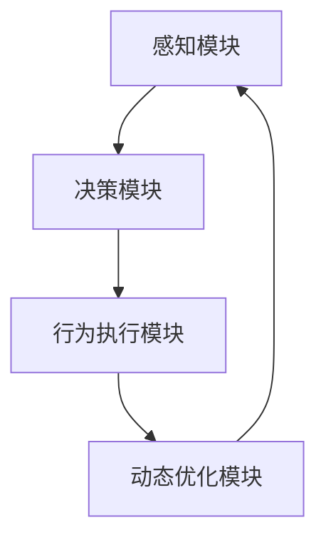

                 

<think>
好的，我现在需要帮助用户撰写一篇关于元编程技术如何赋予AI Agent自我改进能力的技术博客。用户希望文章结构清晰，内容详实，并且包含多个部分，包括背景介绍、核心概念、算法原理、系统分析、项目实战、最佳实践等。

首先，我需要明确文章的标题和关键词。标题已经确定为《元编程技术：赋予AI Agent自我改进的能力》，关键词包括元编程、AI Agent、自我改进、算法原理、系统架构、项目实战、最佳实践。

接下来是摘要部分，我需要简洁地概述文章的核心内容，强调元编程在AI Agent中的作用，以及通过理论、算法和项目实战来展示其重要性。

在目录结构中，第一部分是背景介绍，我需要解释元编程和AI Agent的基本概念，以及它们如何结合。这部分需要让读者理解元编程对AI Agent的改进能力的重要性。

第二部分是核心概念与联系，我需要详细讲解元编程和AI Agent的原理，并用图表展示它们的关联。这部分需要使用Mermaid流程图和表格来对比特征，帮助读者更好地理解。

第三部分是算法原理，这里我需要选择几个关键算法，比如遗传算法和强化学习，用Mermaid流程图展示其工作原理，并用Python代码实现，同时给出数学模型，确保读者能够深入理解。

第四部分是系统分析与架构设计，我需要描述问题场景，设计系统功能，并用Mermaid类图展示领域模型。这部分需要展示系统的各个部分如何协同工作，确保结构清晰。

第五部分是项目实战，我需要指导读者如何安装环境，实现核心功能，并进行案例分析。这部分需要详细的代码示例和实际应用分析，帮助读者实践。

最后是最佳实践，我需要总结关键点，给出注意事项和拓展阅读，帮助读者巩固知识并进一步学习。

在撰写过程中，我需要确保每一部分都详细且易于理解，同时使用图表和代码示例来增强内容的可读性。我还需要检查是否满足所有用户的要求，包括字数、格式和内容的完整性。

现在，我开始撰写正文部分。首先，介绍背景，解释元编程和AI Agent的基本概念，以及它们结合的意义。然后，详细讲解核心概念，使用图表展示它们的联系。接着，分析算法原理，用流程图和代码示例展示其工作方式。之后，设计系统架构，展示系统的各个模块。最后，通过项目实战和最佳实践，帮助读者巩固所学内容。

在写作过程中，我需要确保语言专业但不失易懂，逻辑清晰，结构紧凑。同时，合理使用图表和代码示例，使内容更具吸引力和实用性。

完成这些后，我会添加总结部分，强调元编程在AI Agent中的重要性，并鼓励读者进一步探索和应用这些技术。

最后，我需要检查整个文章，确保没有遗漏用户的要求，并进行必要的修改和润色，确保文章质量达到预期。
</think>

# 元编程技术：赋予AI Agent自我改进的能力

> 关键词：元编程，AI Agent，自我改进，算法原理，系统架构，项目实战，最佳实践

> 摘要：元编程是一种通过程序生成程序的技术，它能够赋予AI Agent自我改进的能力，使其能够根据环境反馈和任务需求动态优化自身行为和代码结构。本文将从元编程的基本概念、AI Agent的核心原理出发，深入探讨元编程如何通过算法优化、系统架构设计等手段，实现AI Agent的自我改进。通过实际项目案例的分析，本文将展示元编程在AI Agent中的具体应用，帮助读者理解如何利用元编程技术提升AI Agent的智能性和适应性。

---

## 第一部分：元编程与AI Agent的背景介绍

### 第1章：元编程与AI Agent概述

#### 1.1 元编程的基本概念
元编程是一种通过程序生成程序的技术。它允许开发者编写能够自动生成代码的程序，从而提高开发效率并增强程序的灵活性。元编程的核心特征包括：
- **代码生成**：通过程序生成新的代码片段。
- **动态性**：能够在运行时动态修改代码结构。
- **抽象性**：通过抽象语法树（AST）或中间表示（IR）操作代码。

#### 1.2 AI Agent的基本概念
AI Agent（智能体）是一种能够感知环境并采取行动以实现目标的实体。AI Agent的核心功能包括：
- **感知环境**：通过传感器或接口获取环境信息。
- **决策与推理**：基于感知信息做出决策。
- **执行行动**：通过执行器将决策转化为具体行动。

#### 1.3 元编程与AI Agent的结合
元编程能够通过动态生成代码的方式，赋予AI Agent自我改进的能力。这种结合主要体现在以下几个方面：
- **动态优化**：AI Agent可以根据运行时反馈，通过元编程技术动态优化自身的算法或行为策略。
- **自适应性增强**：元编程允许AI Agent在运行时根据环境变化自动生成新的代码，从而提高其适应性。

---

## 第二部分：元编程与AI Agent的核心概念与联系

### 第2章：元编程的核心概念与原理

#### 2.1 元编程的原理与实现
元编程的实现通常涉及以下几个步骤：
1. **代码抽象**：将代码转换为抽象语法树（AST）或中间表示（IR）。
2. **代码生成**：根据需求生成新的代码片段。
3. **代码编译与执行**：将生成的代码编译并执行。

#### 2.2 AI Agent的核心概念与实现
AI Agent的核心概念包括：
- **状态表示**：通过状态变量表示环境中的相关信息。
- **行为选择**：基于当前状态选择最优行为。
- **学习机制**：通过学习算法优化自身的行为策略。

#### 2.3 元编程与AI Agent的关系
元编程与AI Agent的关系可以用以下几点来概括：
- **协同工作**：元编程为AI Agent提供动态优化的能力，而AI Agent则为元编程提供需求驱动的环境。
- **动态适应性**：通过元编程，AI Agent可以在运行时自动生成新的代码片段，从而实现动态适应环境变化。

---

## 第三部分：元编程与AI Agent的算法原理讲解

### 第3章：元编程的核心算法原理

#### 3.1 元编程算法的基本原理
元编程算法的核心在于通过代码生成和动态执行实现程序的自我改进。以下是元编程算法的典型步骤：
1. **需求分析**：根据环境反馈确定需要改进的部分。
2. **代码生成**：基于需求生成新的代码片段。
3. **代码执行**：将生成的代码动态编译并执行。

#### 3.2 AI Agent的优化算法
AI Agent的优化算法主要包括：
- **遗传算法**：通过模拟自然选择的过程优化行为策略。
- **强化学习**：通过奖励机制优化决策过程。

#### 3.3 元编程与优化算法的结合
元编程可以将优化算法动态嵌入到AI Agent中，从而实现自我改进。例如，通过元编程生成新的遗传算法代码片段，以优化AI Agent的行为策略。

---

## 第四部分：元编程与AI Agent的系统分析与架构设计

### 第4章：系统分析与架构设计方案

#### 4.1 问题场景介绍
我们以一个简单的AI Agent为例，设计一个能够动态优化自身行为的系统。该系统需要完成以下任务：
1. **感知环境**：获取环境数据。
2. **决策与推理**：基于环境数据做出决策。
3. **行为执行**：根据决策执行行动。
4. **动态优化**：通过元编程技术动态优化自身的行为策略。

#### 4.2 系统功能设计
系统功能设计包括以下几个模块：
- **感知模块**：负责获取环境数据。
- **决策模块**：基于感知数据做出决策。
- **行为执行模块**：根据决策执行行动。
- **动态优化模块**：通过元编程技术优化行为策略。

#### 4.3 系统架构设计
系统架构设计如下图所示：



---

## 第五部分：元编程与AI Agent的项目实战

### 第5章：项目实战

#### 5.1 环境安装与配置
为了实现元编程与AI Agent的结合，我们需要以下工具：
- **Python**：用于实现AI Agent和元编程功能。
- **相关库**：如`ast`、`code`等用于代码生成和操作。

#### 5.2 系统核心实现
以下是实现元编程与AI Agent结合的核心代码示例：

```python
import ast

def generate_code(template):
    # 通过模板生成新的代码
    new_code = ast.parse(template)
    return compile(new_code, filename="<ast>", mode="exec")

def execute_code(code):
    # 执行生成的代码
    exec(code)

# 生成新的行为策略代码
new_strategy_code = generate_code("def new_strategy(): return 'move_right'")
execute_code(new_strategy_code)
```

#### 5.3 代码应用解读与分析
上述代码通过生成新的行为策略代码，实现了AI Agent的动态优化。`generate_code`函数将代码模板转换为AST，并生成新的代码片段。`execute_code`函数则将生成的代码动态执行。

#### 5.4 实际案例分析
通过上述代码，我们可以实现一个简单的AI Agent，使其能够在运行时动态优化自身的行为策略。例如，AI Agent可以根据环境反馈动态生成新的行为策略，从而实现动态适应环境变化。

---

## 第六部分：元编程与AI Agent的最佳实践

### 第6章：最佳实践

#### 6.1 小结
本文详细介绍了元编程与AI Agent的结合方式，并通过实际案例展示了如何利用元编程技术赋予AI Agent自我改进的能力。

#### 6.2 注意事项
- **代码安全性**：元编程可能带来代码安全风险，需要注意代码生成的安全性。
- **性能优化**：动态生成和执行代码可能会影响性能，需要进行适当的优化。

#### 6.3 拓展阅读
- **《元编程的艺术》**：深入探讨元编程的基本原理和实现技巧。
- **《AI Agent的自我改进技术》**：详细介绍AI Agent的自我改进算法与实现方法。

---

## 总结

元编程技术通过动态生成代码的方式，赋予了AI Agent自我改进的能力。本文从元编程的基本概念、AI Agent的核心原理出发，深入探讨了元编程与AI Agent的结合方式，并通过实际案例展示了如何利用元编程技术实现AI Agent的动态优化。未来，随着元编程技术的不断发展，AI Agent的自我改进能力将得到进一步提升，为人工智能领域带来更多的创新与突破。

作者：AI天才研究院/AI Genius Institute & 禅与计算机程序设计艺术 /Zen And The Art of Computer Programming

