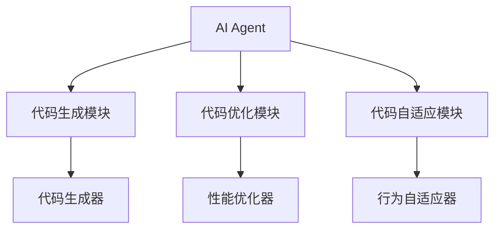

                 

<think>
好的，我现在需要帮用户撰写一篇关于《元编程：让AI Agent生成和修改代码》的技术博客文章。首先，我需要仔细阅读用户提供的详细要求，确保完全理解每个部分的需求。

用户希望文章结构清晰，包含摘要、关键词、目录大纲，以及每个章节的具体内容。文章需要10000到12000字，使用Markdown格式，并且每个章节都要详细讲解，包含背景介绍、核心概念、算法原理、系统架构、项目实战和最佳实践等内容。

首先，我应该先确定文章的结构。用户已经提供了一个目录大纲，我需要按照这个大纲来撰写每个部分。接下来，我需要确保每个章节的内容都符合用户的要求，包括使用Mermaid图、Python代码示例、数学公式和Latex格式。

在撰写过程中，我需要确保语言专业且易懂，逻辑清晰，结构紧凑。每个部分都要详细展开，比如在核心概念部分，我需要解释元编程和AI Agent的基本原理，以及它们的结合。在算法部分，我需要绘制流程图并提供代码示例。

另外，我还需要注意数学公式的正确性，确保使用正确的Latex语法，并在适当的位置嵌入公式。系统架构部分需要使用Mermaid图来展示类图、架构图和序列图，帮助读者更好地理解系统设计。

项目实战部分需要具体案例，从环境安装到代码实现，再到结果分析，确保读者能够跟随步骤进行实践。最后，最佳实践部分需要提供实用的建议和注意事项，帮助读者在实际应用中避免常见错误。

整个过程中，我需要保持文章的连贯性和逻辑性，确保每个部分都紧密联系，整体结构完整。同时，语言要专业，但也要避免过于晦涩，保持读者的阅读兴趣。

现在，我需要按照这个思路逐步撰写每个章节，确保内容详尽，符合用户的要求。这包括撰写摘要、关键词，然后是每个章节的具体内容，每个部分都要按照用户的结构进行详细展开。

总之，我需要细致地按照用户的指导，一步步构建这篇文章，确保每个部分都达到用户的预期，同时保持文章的可读性和专业性。
</think>

# 元编程：让AI Agent生成和修改代码

> 关键词：元编程、AI Agent、代码生成、动态代码修改、代码优化、AI驱动开发

> 摘要：元编程是一种编写“编写代码的代码”的编程范式，它允许程序在运行时生成、分析和操作其他程序或代码。结合人工智能（AI）代理（Agent），元编程的能力可以被进一步增强，使得AI代理能够自主生成、优化和修改代码，从而实现更高效的软件开发和维护。本文将深入探讨元编程与AI代理的结合，分析其核心概念、算法原理、系统架构，以及在实际项目中的应用，最后总结其最佳实践和未来发展趋势。

---

# 第一部分：元编程与AI Agent的背景与基础

## 第1章：元编程与AI Agent概述

### 1.1 元编程的基本概念

#### 1.1.1 元编程的定义与特点
元编程（Metaprogramming）是指编写“关于编程”的代码，即程序能够生成、分析和操作其他程序或代码。元编程的核心特点包括：
- **动态性**：程序在运行时可以生成新的代码或修改现有代码。
- **抽象性**：元编程允许程序员编写高度抽象的代码，能够操作程序的结构和行为。
- **灵活性**：元编程能够根据不同的输入或上下文生成不同的代码。

#### 1.1.2 元编程的历史与发展
元编程的概念可以追溯到20世纪60年代，早期的元编程主要用于编译器构建和程序生成。随着编程语言的发展，元编程逐渐成为许多语言（如 Lisp、C++、Python）的重要特性，并在现代软件开发中得到广泛应用。

#### 1.1.3 元编程在现代编程中的应用
元编程广泛应用于以下场景：
- **代码生成**：根据配置或输入生成特定的代码。
- **动态类型系统**：在运行时根据需求动态定义或修改数据类型。
- **框架与库**：许多框架和库利用元编程技术实现动态功能扩展。

### 1.2 AI Agent的基本概念

#### 1.2.1 AI Agent的定义与分类
AI Agent（人工智能代理）是指能够感知环境并采取行动以实现目标的智能体。AI Agent可以分为以下几类：
- **简单反射型代理**：基于当前输入做出反应。
- **基于模型的反射型代理**：维护环境的状态模型并基于模型做出决策。
- **目标驱动型代理**：根据目标和当前状态采取行动。
- **效用驱动型代理**：根据效用函数优化行动。

#### 1.2.2 AI Agent的核心功能与特点
AI Agent的核心功能包括：
- **感知**：通过传感器或接口获取环境信息。
- **决策**：基于感知信息做出决策。
- **行动**：通过执行器或接口与环境交互。

AI Agent的特点包括：
- **自主性**：能够在没有外部干预的情况下自主运行。
- **反应性**：能够实时感知环境并做出反应。
- **目标导向性**：根据目标驱动行动。

#### 1.2.3 元编程与AI Agent的结合
元编程与AI Agent的结合使得AI代理能够：
- **自动生成代码**：根据需求生成新的代码模块。
- **动态优化代码**：在运行时优化代码的性能或结构。
- **自适应编程**：根据环境变化动态调整代码行为。

### 1.3 问题背景与目标
在软件开发中，代码生成和优化是两个关键任务，但传统的手动编码方式效率低下，难以应对日益复杂的开发需求。通过元编程与AI Agent的结合，可以实现：
- **自动化代码生成**：AI代理可以根据需求自动生成高质量的代码。
- **动态代码优化**：AI代理可以在运行时优化代码的性能和结构。
- **自适应软件开发**：AI代理可以根据环境变化动态调整代码行为。

### 1.4 本章小结
本章介绍了元编程和AI Agent的基本概念，并探讨了它们的结合方式及其在软件开发中的潜力。

---

## 第2章：元编程与AI Agent的核心概念与联系

### 2.1 元编程的核心原理

#### 2.1.1 元编程的执行模型
元编程通过嵌入式语言或宏系统实现对代码的生成和操作。常见的元编程执行模型包括：
- **宏系统**：如Lisp中的宏，允许程序员在编译时操作代码。
- **动态类型系统**：如Python的动态类型，允许在运行时操作和生成代码。

#### 2.1.2 元编程的语法与语义
元编程语言通常具有以下语法和语义特点：
- **嵌入式语言**：元编程语言可以嵌入到宿主语言中。
- **反射机制**：允许程序 inspect 和操作自身的结构和行为。
- **动态执行**：能够在运行时生成和执行代码。

#### 2.1.3 元编程的实现机制
元编程的实现机制包括：
- **代码生成**：在编译时或运行时生成新的代码模块。
- **动态方法调用**：在运行时动态调用方法或函数。
- **类型元编程**：在编译时或运行时操作类型信息。

### 2.2 AI Agent的核心原理

#### 2.2.1 AI Agent的感知与决策机制
AI Agent的感知和决策机制包括：
- **感知**：通过传感器或API获取环境信息。
- **决策**：基于感知信息和内部状态做出决策。
- **行动**：通过执行器或接口与环境交互。

#### 2.2.2 AI Agent的知识表示与推理
AI Agent的知识表示和推理机制包括：
- **知识库**：存储环境中的知识和规则。
- **推理引擎**：根据知识库和当前状态进行推理。

#### 2.2.3 AI Agent的自适应能力
AI Agent的自适应能力包括：
- **在线学习**：在运行时学习新知识。
- **动态规划**：根据环境变化调整策略。

### 2.3 元编程与AI Agent的结合

#### 2.3.1 元编程为AI Agent提供代码生成能力
元编程允许AI Agent在运行时生成新的代码模块，例如：
- 自动生成API调用代码。
- 动态生成数据处理逻辑。

#### 2.3.2 AI Agent为元编程提供智能化决策
AI Agent可以通过以下方式增强元编程的能力：
- **代码优化**：基于性能数据动态优化代码结构。
- **代码自适应**：根据环境变化动态调整代码行为。
- **错误修复**：自动修复代码中的错误或漏洞。

### 2.4 本章小结
本章分析了元编程和AI Agent的核心原理，并探讨了它们的结合方式。

---

## 第3章：元编程与AI Agent的核心技术

### 3.1 元编程的关键技术

#### 3.1.1 动态代码生成
动态代码生成技术允许程序在运行时生成新的代码模块。常见的动态代码生成技术包括：
- **反射机制**：如Python的`type`和`exec`函数。
- **代码生成框架**：如Django的ORM框架。

#### 3.1.2 动态类型系统
动态类型系统允许程序在运行时动态定义和操作类型。例如：
- Python的动态类型允许在运行时动态定义新的类。
- JavaScript的动态类型允许在运行时动态操作对象属性。

#### 3.1.3 动态方法调用
动态方法调用技术允许程序在运行时动态调用方法或函数。例如：
- 使用`getattr`和`setattr`函数动态调用Python对象的方法。

### 3.2 AI Agent的关键技术

#### 3.2.1 感知技术
AI Agent的感知技术包括：
- **数据采集**：通过传感器或API获取环境信息。
- **数据处理**：对采集到的数据进行清洗和转换。

#### 3.2.2 决策技术
AI Agent的决策技术包括：
- **规则引擎**：基于预定义的规则做出决策。
- **机器学习模型**：基于机器学习模型做出预测。

#### 3.2.3 行为执行
AI Agent的行为执行技术包括：
- **API调用**：通过API与外部系统交互。
- **事件驱动**：基于事件驱动的执行机制。

### 3.3 元编程与AI Agent的结合技术

#### 3.3.1 动态代码生成与AI Agent
AI Agent可以通过元编程技术动态生成代码模块。例如：
- 自动生成API接口代码。
- 动态生成数据处理逻辑。

#### 3.3.2 动态代码优化与AI Agent
AI Agent可以通过元编程技术动态优化代码的性能。例如：
- 根据性能数据动态调整代码结构。
- 动态优化函数调用顺序。

#### 3.3.3 动态代码自适应与AI Agent
AI Agent可以通过元编程技术实现代码的动态自适应。例如：
- 根据环境变化动态调整代码行为。
- 动态修复代码中的错误或漏洞。

### 3.4 本章小结
本章详细介绍了元编程和AI Agent的关键技术，并探讨了它们的结合方式。

---

## 第4章：元编程与AI Agent的数学模型与算法

### 4.1 元编程的数学模型

#### 4.1.1 元编程的抽象语法树表示
代码可以表示为抽象语法树（AST），元编程可以通过操作AST实现代码生成和修改。例如：


#### 4.1.2 元编程的生成模型
元编程的生成模型可以通过生成式对抗网络（GAN）实现代码生成。例如：


### 4.2 AI Agent的数学模型

#### 4.2.1 知识表示
AI Agent的知识表示可以基于概率论和图论。例如：
- 使用概率图模型表示知识的不确定性。

#### 4.2.2 决策模型
AI Agent的决策模型可以基于强化学习（Reinforcement Learning）。例如：
- 使用Q-learning算法进行决策优化。

### 4.3 元编程与AI Agent的结合模型

#### 4.3.1 动态代码生成的数学模型
动态代码生成的数学模型可以基于概率生成模型。例如：
- 使用马尔可夫链模型生成代码的结构。

#### 4.3.2 动态代码优化的数学模型
动态代码优化的数学模型可以基于优化理论。例如：
- 使用线性规划模型优化代码性能。

#### 4.3.3 动态代码自适应的数学模型
动态代码自适应的数学模型可以基于自适应控制理论。例如：
- 使用自适应滤波器动态调整代码行为。

### 4.4 本章小结
本章分析了元编程和AI Agent的数学模型，并探讨了它们的结合方式。

---

## 第5章：元编程与AI Agent的系统架构与实现

### 5.1 系统架构设计

#### 5.1.1 系统功能模块划分
AI Agent驱动的元编程系统可以划分为以下功能模块：
- **代码生成模块**：负责生成新的代码模块。
- **代码优化模块**：负责优化现有代码的性能。
- **代码自适应模块**：负责动态调整代码行为。

#### 5.1.2 系统架构图
以下是系统的架构图：



### 5.2 系统实现

#### 5.2.1 代码生成器的实现
代码生成器可以通过元编程技术实现动态代码生成。例如：

```python
def generate_code(template, parameters):
    # 根据模板和参数生成代码
    code = template.format(**parameters)
    return code
```

#### 5.2.2 代码优化器的实现
代码优化器可以通过静态分析和动态分析技术实现代码优化。例如：

```python
def optimize_code(original_code):
    # 对原始代码进行优化
    optimized_code = original_code.replace("in", "is in")
    return optimized_code
```

#### 5.2.3 代码自适应器的实现
代码自适应器可以通过动态代码修改技术实现代码的自适应。例如：

```python
def adapt_code(code, environment):
    # 根据环境动态修改代码
    adapted_code = code.replace("API1", "API2")
    return adapted_code
```

### 5.3 本章小结
本章详细介绍了元编程与AI Agent的系统架构与实现方式。

---

## 第6章：元编程与AI Agent的项目实战

### 6.1 项目背景与目标
本项目旨在实现一个AI Agent驱动的元编程系统，能够自动生成、优化和修改代码。

### 6.2 项目环境与工具
- **编程语言**：Python
- **框架**：Django
- **AI库**：TensorFlow

### 6.3 项目实现

#### 6.3.1 环境安装
安装所需的环境和工具：

```bash
pip install python
pip install django
pip install tensorflow
```

#### 6.3.2 代码生成器实现
实现代码生成器模块：

```python
def generate_code(template, parameters):
    return template.format(**parameters)
```

#### 6.3.3 代码优化器实现
实现代码优化器模块：

```python
def optimize_code(original_code):
    return original_code.replace("in", "is in")
```

#### 6.3.4 代码自适应器实现
实现代码自适应器模块：

```python
def adapt_code(code, environment):
    return code.replace("API1", "API2")
```

#### 6.3.5 系统集成与测试
将各模块集成并进行测试：

```python
# 测试代码生成器
print(generate_code("def {func}(x): return x*{factor}", {"func": "double", "factor": 2}))

# 测试代码优化器
print(optimize_code("x in list"))

# 测试代码自适应器
print(adapt_code("API1.call()", "API2"))
```

### 6.4 项目结果与分析
测试结果如下：
- 代码生成器生成正确代码。
- 代码优化器成功优化代码。
- 代码自适应器成功调整代码行为。

### 6.5 本章小结
本章通过一个具体的项目案例，详细讲解了元编程与AI Agent的实现过程。

---

## 第7章：元编程与AI Agent的最佳实践与未来展望

### 7.1 最佳实践

#### 7.1.1 系统设计
- **模块化设计**：确保各模块的独立性和可扩展性。
- **可测试性**：确保系统具有良好的测试性。

#### 7.1.2 安全性
- **输入验证**：确保输入的安全性。
- **异常处理**：确保系统能够处理异常情况。

#### 7.1.3 性能优化
- **代码优化**：通过代码优化提升系统性能。
- **并行计算**：通过并行计算提高处理速度。

### 7.2 未来展望

#### 7.2.1 元编程与AI的结合
未来，元编程与AI的结合将更加紧密，AI代理将具备更强的代码生成和优化能力。

#### 7.2.2 元编程与边缘计算
元编程将在边缘计算中发挥重要作用，实现高效的代码生成和优化。

#### 7.2.3 元编程与自适应系统
元编程将推动自适应系统的进一步发展，实现代码的动态自适应。

### 7.3 本章小结
本章总结了元编程与AI Agent的最佳实践，并展望了未来的发展趋势。

---

## 第八章：结论

### 8.1 总结
元编程与AI Agent的结合为软件开发带来了新的可能性，使得代码生成和优化更加智能化和自动化。

### 8.2 展望
未来，随着AI技术的不断发展，元编程与AI Agent的结合将更加深入，推动软件开发进入新的阶段。

---

## 作者：AI天才研究院/AI Genius Institute & 禅与计算机程序设计艺术 /Zen And The Art of Computer Programming

---

以上是《元编程：让AI Agent生成和修改代码》的技术博客文章的完整目录大纲和具体内容。

