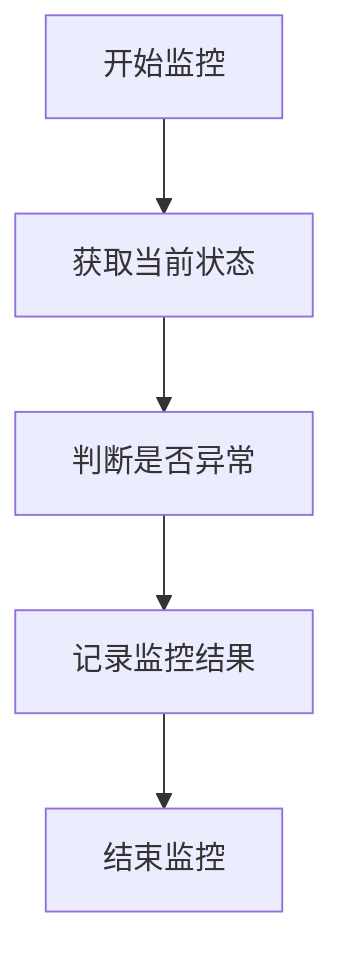
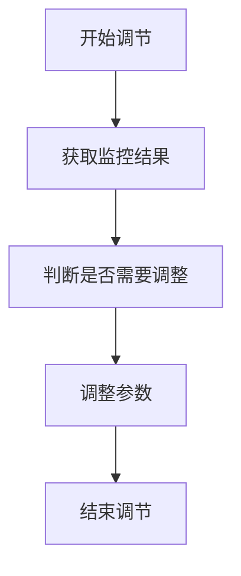
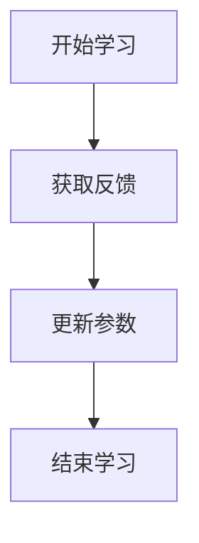
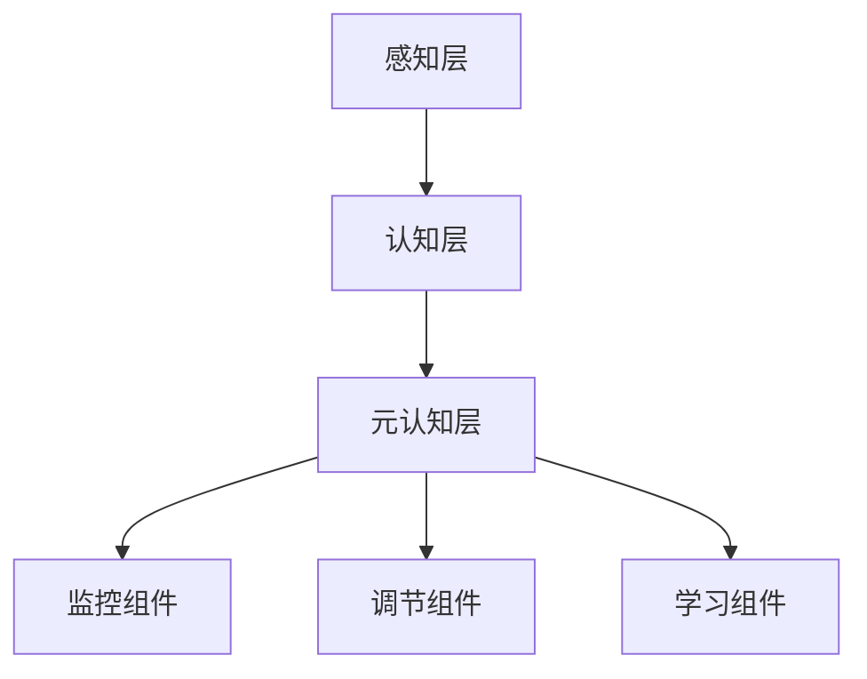

                 

<think>
好的，我需要撰写一篇关于“元认知AI Agent：自我监控与调节”的技术博客文章。首先，我需要明确什么是元认知AI Agent，它与其他AI Agent有什么不同，以及它在实际应用中的价值。

让我先理解元认知的基本概念。元认知是指“关于认知的认知”，即个体对自己认知过程的认知和调控能力。元认知能力包括对自身认知过程的监控、评估和调节。将这一概念应用到AI Agent中，元认知AI Agent就是具备自我监控和调节能力的智能体，能够在运行过程中反思自己的行为，识别问题，并主动调整策略以优化表现。

接下来，我需要分析当前AI Agent的局限性。传统AI Agent通常依赖于预定义的规则和训练数据，缺乏对自身行为的反思和调整能力。在复杂多变的环境中，当遇到未见过的情况或出现错误时，传统AI Agent可能无法有效应对，需要依赖外部干预或重新训练。而元认知AI Agent通过具备自我监控和调节能力，可以在运行时动态调整策略，提高适应性和 robustness。

然后，我需要探讨元认知AI Agent的核心组成部分。首先，元认知监控模块负责实时监控AI Agent的内部状态和外部环境，识别潜在的问题或改进机会。其次，元认知调节模块根据监控结果，调整AI Agent的行为策略、参数或模型，以优化表现。最后，元认知学习模块通过经验积累和反馈机制，不断优化监控和调节机制，提升整体智能性。

接下来，我需要详细解释元认知AI Agent的算法原理。首先是元认知监控机制，它可能基于某种注意力机制或状态评估算法，实时跟踪AI Agent的认知过程和结果。然后是元认知调节机制，它可能采用强化学习或其他优化算法，根据监控结果调整行为策略。最后是元认知学习机制，它可能利用元学习方法，如元学习网络（Meta-Learning Networks），来优化监控和调节模块的性能。

在系统架构方面，元认知AI Agent需要一个高效的架构设计，以支持实时监控、动态调节和持续学习。可能采用分层架构，将监控、调节和学习模块分别部署在不同的层次，确保各模块之间的高效协作。同时，系统架构需要具备可扩展性，以应对不同规模和复杂度的应用场景。

为了验证元认知AI Agent的可行性，我需要设计一些实际应用场景，并进行项目实战。例如，在自然语言处理任务中，元认知AI Agent可以监控模型的预测结果，识别潜在的错误，并主动调整参数以提高准确率。在推荐系统中，元认知AI Agent可以监控用户反馈，动态调节推荐策略，提供更个性化的推荐结果。

最后，我需要总结元认知AI Agent的优势和挑战。虽然它具备强大的自我监控和调节能力，但在实际应用中可能面临计算资源消耗大、算法复杂度高、监控机制的准确性等问题。因此，未来的研究方向可能包括优化算法效率、提高监控机制的准确性，以及探索更有效的学习策略。

总之，元认知AI Agent通过自我监控与调节，能够显著提升AI系统的智能性和适应性，为解决复杂问题提供了新的可能性。
</think>

# 元认知AI Agent：自我监控与调节

> 关键词：元认知AI Agent, 自我监控, 自我调节, AI系统优化, 智能体设计

> 摘要：本文探讨了元认知AI Agent的核心概念、算法原理、系统架构以及实际应用。通过详细分析元认知AI Agent的自我监控与调节机制，结合具体应用场景，展示了其在提升AI系统性能和适应性方面的潜力。

---

# 第一部分：元认知AI Agent的背景与概念

## 第1章：元认知AI Agent的定义与背景

### 1.1 元认知AI Agent的定义

#### 1.1.1 元认知的定义与特征
元认知（Metacognition）是指个体对自身认知过程的认知和调控能力。它包括对思维过程的监控、评估和调整。元认知的核心特征包括：
- **自我监控**：对自身认知过程的实时跟踪。
- **自我调节**：根据监控结果调整认知策略。
- **自我评估**：对认知结果的评价和反馈。

#### 1.1.2 元认知AI Agent的核心概念
元认知AI Agent是一种具备自我监控和调节能力的智能体。它不仅能够执行任务，还能反思自己的行为，识别问题，并主动调整策略以优化表现。

#### 1.1.3 元认知AI Agent的应用场景
元认知AI Agent适用于需要动态适应和优化的复杂场景，如自动驾驶、智能推荐系统、自然语言处理等。在这些场景中，元认知能力能够帮助AI Agent更高效地应对不确定性。

### 1.2 元认知AI Agent的问题背景

#### 1.2.1 当前AI Agent的局限性
传统AI Agent通常依赖预定义规则和静态模型，在面对未见情况时缺乏灵活性。例如，在自然语言处理任务中，模型可能在特定数据集上表现优异，但在实际应用中遇到新的数据时，性能下降明显。

#### 1.2.2 元认知能力在AI Agent中的必要性
元认知能力使AI Agent能够主动监控和调整自身行为，适应动态变化的环境。这种能力在处理复杂任务时尤为重要，例如在自动驾驶中，AI Agent需要实时监控自身决策过程，并根据路况调整驾驶策略。

#### 1.2.3 元认知AI Agent的研究现状
目前，学术界和工业界对元认知AI Agent的研究主要集中在以下方面：
- 元认知监控机制的设计与优化。
- 元认知调节算法的开发与应用。
- 元认知学习方法的研究与实践。

### 1.3 元认知AI Agent与传统AI Agent的对比

#### 1.3.1 传统AI Agent的功能特点
传统AI Agent通常基于预定义的规则和模型，缺乏自我监控和调节能力。它们在处理特定任务时表现出色，但在复杂或动态环境中容易出现性能下降。

#### 1.3.2 元认知AI Agent的独特优势
元认知AI Agent的核心优势在于其自我监控和调节能力。这种能力使其能够：
- 动态调整策略，适应变化的环境。
- 主动识别问题，优化性能。
- 持续学习，提升智能性。

#### 1.3.3 元认知AI Agent的边界与外延
元认知AI Agent的边界在于其监控和调节能力的范围。它既不等同于完全自主的AI系统，也不同于传统AI Agent。其外延涉及多个领域，包括认知科学、人工智能、机器学习等。

---

## 第2章：元认知AI Agent的核心概念与联系

### 2.1 元认知的结构与功能

#### 2.1.1 元认知的层次结构
元认知的层次结构包括：
- **元认知知识**：关于认知过程的知识，如任务目标、策略选择。
- **元认知技能**：执行监控和调节的认知技能。
- **元认知信念**：个体对自身认知能力的信念和态度。

#### 2.1.2 元认知的机制与功能
元认知的机制包括：
- **监控**：实时跟踪认知过程。
- **评估**：对认知结果进行评价。
- **调节**：根据监控和评估结果调整认知策略。

### 2.2 元认知AI Agent的核心要素

#### 2.2.1 元认知监控模块
元认知监控模块负责实时跟踪AI Agent的认知过程，识别潜在问题。

#### 2.2.2 元认知调节模块
元认知调节模块根据监控结果，调整AI Agent的行为策略和参数。

#### 2.2.3 元认知学习模块
元认知学习模块通过经验积累和反馈，优化监控和调节机制。

### 2.3 元认知AI Agent的核心概念联系

| 核心概念 | 描述 | 关联性 |
|----------|------|--------|
| 元认知监控 | 监控认知过程 | 与调节模块密切相关 |
| 元认知调节 | 调整行为策略 | 基于监控结果 |
| 元认知学习 | 优化监控与调节 | 提高整体智能性 |

---

## 第3章：元认知AI Agent的算法原理

### 3.1 元认知监控机制的算法实现

#### 3.1.1 元认知监控的数学模型
元认知监控可以通过以下数学模型实现：
$$
f_{\text{monitor}}(x) = \begin{cases}
\text{正常} & \text{if } x \text{在预定义范围内} \\
\text{异常} & \text{otherwise}
\end{cases}
$$

#### 3.1.2 监控算法的流程图


#### 3.1.3 监控算法的代码实现
```python
def monitor(current_state):
    if current_state in predefined_range:
        return "正常"
    else:
        return "异常"
```

### 3.2 元认知调节机制的算法实现

#### 3.2.1 调节策略的数学模型
元认知调节可以通过以下公式实现：
$$
f_{\text{adjust}}(y) = \begin{cases}
\text{调整参数} & \text{if } y \text{异常} \\
\text{保持原状} & \text{otherwise}
\end{cases}
$$

#### 3.2.2 调节算法的流程图


#### 3.2.3 调节算法的代码实现
```python
def adjust_parameters(current_state):
    if current_state == "异常":
        # 调整参数
        return new_parameters
    else:
        return current_parameters
```

### 3.3 元认知学习机制的算法实现

#### 3.3.1 学习模型的数学公式
元认知学习可以通过以下公式表示：
$$
f_{\text{learn}}(z) = \theta_{\text{new}} = \theta_{\text{old}} + \alpha \cdot \nabla L(z)
$$

其中，$\theta_{\text{new}}$ 是新参数，$\theta_{\text{old}}$ 是旧参数，$\alpha$ 是学习率，$L(z)$ 是损失函数。

#### 3.3.2 学习算法的流程图


#### 3.3.3 学习算法的代码实现
```python
def update_parameters(feedback):
    loss = calculate_loss(feedback)
    gradients = compute_gradients(loss)
    new_theta = theta + learning_rate * gradients
    return new_theta
```

---

## 第4章：元认知AI Agent的系统架构与设计

### 4.1 系统架构概述

#### 4.1.1 分层架构设计
元认知AI Agent的分层架构包括：
- **感知层**：负责数据采集和初步处理。
- **认知层**：执行任务并产生输出。
- **元认知层**：监控和调节认知过程。

#### 4.1.2 组件化设计
元认知AI Agent的组件化设计包括：
- **监控组件**：实时跟踪认知过程。
- **调节组件**：根据监控结果调整策略。
- **学习组件**：优化监控和调节机制。

### 4.2 系统架构图


---

## 第5章：元认知AI Agent的实际应用与挑战

### 5.1 实际应用场景

#### 5.1.1 自然语言处理
在自然语言处理任务中，元认知AI Agent可以监控模型的预测结果，识别潜在错误，并主动调整参数以提高准确率。

#### 5.1.2 智能推荐系统
在智能推荐系统中，元认知AI Agent可以监控用户反馈，动态调节推荐策略，提供更个性化的推荐结果。

### 5.2 挑战与解决方案

#### 5.2.1 计算资源消耗
元认知AI Agent的实时监控和调节机制可能增加计算资源消耗。解决方案包括优化算法效率和引入边缘计算技术。

#### 5.2.2 监控机制的准确性
监控机制的准确性直接影响调节效果。解决方案包括引入更先进的监控算法和增强学习机制。

---

## 第6章：元认知AI Agent的未来发展方向

### 6.1 研究方向

#### 6.1.1 元学习算法的优化
进一步优化元学习算法，提高元认知AI Agent的自适应能力。

#### 6.1.2 多模态数据的融合
研究如何将多模态数据融入元认知AI Agent，提升其感知和决策能力。

### 6.2 技术趋势

#### 6.2.1 边缘计算与分布式架构
未来，元认知AI Agent可能更多地采用边缘计算和分布式架构，以降低计算资源消耗。

#### 6.2.2 跨领域应用的拓展
元认知AI Agent的应用将从单一领域扩展到多领域，提升其通用性和适应性。

---

## 第7章：总结与展望

### 7.1 总结

元认知AI Agent通过自我监控与调节，显著提升了AI系统的智能性和适应性。其核心在于元认知能力的实现，包括监控、调节和学习三个主要部分。通过合理的系统架构设计和算法优化，元认知AI Agent在实际应用中表现出强大的潜力。

### 7.2 展望

未来，元认知AI Agent的研究将朝着算法优化、架构创新和多领域应用的方向发展。随着技术的进步，元认知AI Agent将更加智能化和自主化，为解决复杂问题提供新的可能性。

---

# 附录：参考文献

（此处可以列出相关的学术论文、技术报告和其他参考资料）

---

# 作者

作者：AI天才研究院/AI Genius Institute & 禅与计算机程序设计艺术 /Zen And The Art of Computer Programming

---

这篇文章通过详细阐述元认知AI Agent的核心概念、算法原理和系统架构，结合实际应用场景，展示了其在提升AI系统性能和适应性方面的潜力。希望对您理解元认知AI Agent有所帮助！

