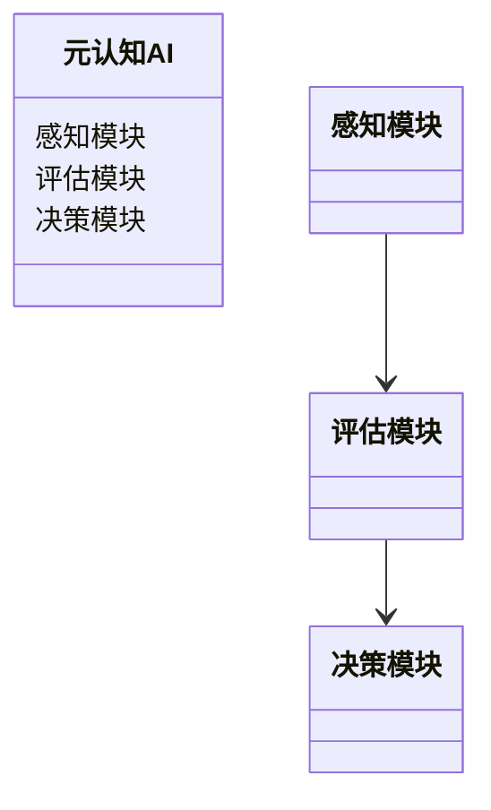
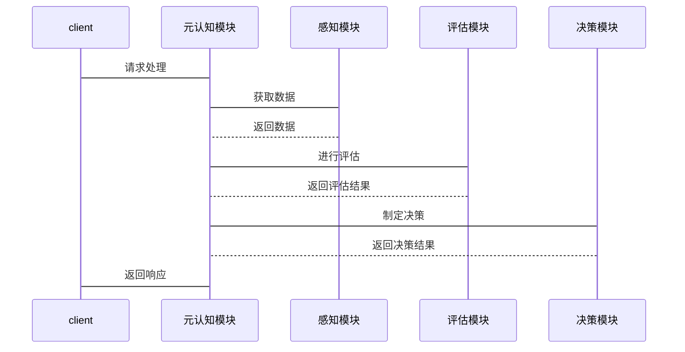
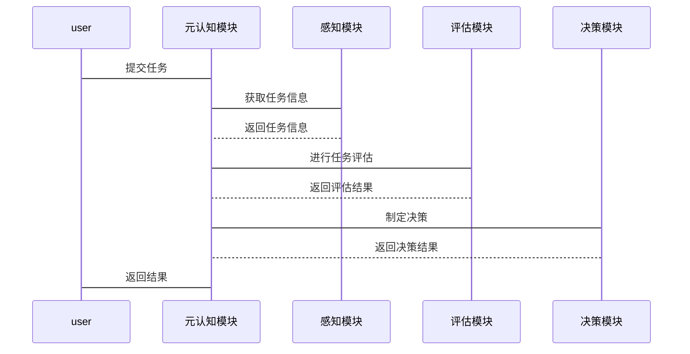

                 


# 元认知AI：具有自我评估能力的AI Agent

## 关键词
- 元认知AI
- 自我评估
- AI代理
- 强化学习
- 自适应系统

## 摘要
元认知AI是一种具有自我评估能力的AI代理，能够通过元认知模型进行自我监控、反馈和优化。本文详细探讨了元认知AI的核心概念、算法原理、系统架构及其在实际应用中的案例，旨在帮助读者理解如何构建和优化具备自适应能力的AI系统。

---

# 第1章: 元认知AI的基本概念

## 1.1 元认知的基本定义
### 1.1.1 元认知的定义与特点
元认知是指个体对自身认知过程的认知和调控能力。在AI领域，元认知AI能够对自身的决策、行为和结果进行反思和评估，从而优化后续的操作。

### 1.1.2 元认知在AI中的应用
元认知AI能够应用于智能决策支持、自动化系统优化和人机协作等领域，通过自我评估提升系统的整体性能。

### 1.1.3 元认知AI的核心目标
元认知AI的核心目标是通过自我监控和反馈机制，实现系统的自适应优化和智能增强。

---

## 1.2 元认知AI的背景与现状
### 1.2.1 AI发展的历史与现状
人工智能技术经历了从专家系统到深度学习的演变，当前正在向更加智能化和自适应化的方向发展。

### 1.2.2 元认知AI的提出背景
随着AI系统的复杂化，传统AI在动态环境中的适应能力不足，元认知AI应运而生，旨在解决这一问题。

### 1.2.3 元认知AI的研究进展
目前，元认知AI的研究主要集中在元学习、自适应算法和智能优化等领域，取得了一系列重要成果。

---

## 1.3 元认知AI的核心概念
### 1.3.1 元认知模型的构成
元认知模型包括感知模块、评估模块和决策模块，能够对系统的输入、输出和行为进行监控和评估。

### 1.3.2 元认知AI的系统架构
元认知AI的系统架构通常采用分层设计，包括感知层、评估层和决策层，各层之间通过反馈机制进行交互。

### 1.3.3 元认知AI的功能模块
元认知AI的功能模块包括自我监控、反馈收集、评估分析和自适应优化等，能够实现系统的动态调整和优化。

---

## 1.4 元认知AI的应用场景
### 1.4.1 智能决策支持
元认知AI能够通过自我评估提供更精准的决策支持，帮助用户做出最优选择。

### 1.4.2 自动化系统优化
元认知AI能够对自动化系统进行实时监控和优化，提升系统的运行效率和稳定性。

### 1.4.3 人机协作与增强
元认知AI通过自我评估和反馈机制，能够更好地与人类协同工作，提升人机协作的效率和效果。

---

## 1.5 本章小结
本章主要介绍了元认知AI的基本概念、背景与现状、核心概念及其应用场景。通过这些内容，读者可以初步理解元认知AI的定义、目标和实现方式。

---

# 第2章: 元认知AI的核心原理

## 2.1 元认知模型的原理
### 2.1.1 元认知模型的输入与输出
元认知模型的输入包括系统的运行状态和环境反馈，输出是对系统的评估结果和优化建议。

### 2.1.2 元认知模型的内部机制
元认知模型通过自我监控和反馈机制，对系统的运行状态进行实时评估，并根据评估结果调整系统的行为。

### 2.1.3 元认知模型的训练与优化
元认知模型需要通过大量的数据训练，不断优化自身的评估能力和决策能力。

---

## 2.2 元认知AI的反馈机制
### 2.2.1 反馈的定义与作用
反馈是指系统在运行过程中接收到的外部评价或结果，用于指导系统的优化和调整。

### 2.2.2 反馈的分类与实现
反馈可以分为正向反馈和负向反馈，通过不同的反馈类型，元认知AI能够实现系统的自适应优化。

### 2.2.3 反馈在元认知AI中的应用
元认知AI通过反馈机制不断调整自身的评估策略，提升系统的整体性能。

---

## 2.3 元认知AI的自适应学习
### 2.3.1 自适应学习的定义
自适应学习是指系统能够根据反馈信息，动态调整自身的学习策略和参数。

### 2.3.2 自适应学习的实现方法
自适应学习可以通过强化学习、元学习等算法实现，系统能够根据反馈不断优化自身的学习过程。

### 2.3.3 自适应学习的效果评估
通过效果评估，元认知AI能够验证自适应学习的成效，并进一步优化学习策略。

---

## 2.4 元认知AI与传统AI的对比
### 2.4.1 传统AI的局限性
传统AI缺乏自我评估能力，难以在动态环境中做出适应性调整。

### 2.4.2 元认知AI的优势
元认知AI通过自我评估和反馈机制，能够实现系统的动态优化和自适应增强。

### 2.4.3 元认知AI的未来发展
元认知AI将朝着更加智能化和自适应化的方向发展，广泛应用于各个领域。

---

## 2.5 本章小结
本章详细讲解了元认知AI的核心原理，包括元认知模型的内部机制、反馈机制和自适应学习。通过这些内容，读者可以更好地理解元认知AI的实现方式及其优势。

---

# 第3章: 元认知AI的算法原理

## 3.1 元认知模型的算法概述
### 3.1.1 元认知模型的基本算法
元认知模型通常采用强化学习和元学习算法，能够通过反馈信息不断优化自身的评估和决策能力。

### 3.1.2 强化学习在元认知AI中的应用
强化学习通过奖励机制，帮助元认知AI学习最优的决策策略。

### 3.1.3 元学习在元认知AI中的应用
元学习通过在不同任务之间的迁移学习，提升元认知AI的适应能力。

---

## 3.2 元认知AI的反馈机制算法
### 3.2.1 反馈机制的实现算法
元认知AI的反馈机制通常采用监督学习算法，通过标签信息调整系统的评估策略。

### 3.2.2 反馈机制的优化算法
通过优化算法，元认知AI能够更高效地利用反馈信息，提升系统的整体性能。

### 3.2.3 反馈机制的数学模型
反馈机制的数学模型通常采用损失函数和优化器的形式，通过最小化损失函数实现模型优化。

---

## 3.3 元认知AI的自适应学习算法
### 3.3.1 自适应学习的实现算法
自适应学习通常采用在线学习算法，能够根据实时反馈动态调整学习策略。

### 3.3.2 自适应学习的优化算法
通过优化算法，元认知AI能够更高效地利用反馈信息，提升学习效果。

### 3.3.3 自适应学习的数学模型
自适应学习的数学模型通常采用神经网络和优化器的形式，通过训练数据不断优化模型参数。

---

## 3.4 本章小结
本章详细讲解了元认知AI的算法原理，包括强化学习、元学习和自适应学习等算法的应用。通过这些内容，读者可以更好地理解元认知AI的技术实现。

---

# 第4章: 元认知AI的系统架构设计

## 4.1 问题场景介绍
### 4.1.1 问题背景
在动态环境中，传统的AI系统缺乏自我评估能力，难以应对复杂的变化。

### 4.1.2 问题描述
元认知AI需要具备自我评估能力，能够根据反馈信息动态调整系统的运行策略。

### 4.1.3 问题解决
通过元认知模型和反馈机制，元认知AI能够实现系统的自适应优化。

---

## 4.2 系统功能设计
### 4.2.1 领域模型设计
元认知AI的领域模型包括感知模块、评估模块和决策模块，能够对系统的运行状态进行实时监控和评估。

### 4.2.2 领域模型的Mermaid类图


### 4.2.3 领域模型的实现
元认知AI的系统功能设计需要结合具体的应用场景，通过模块化设计实现各功能模块的协同工作。

---

## 4.3 系统架构设计
### 4.3.1 系统架构概述
元认知AI的系统架构通常采用微服务架构，各功能模块通过API进行交互。

### 4.3.2 系统架构的Mermaid架构图
```mermaid
dockerfile
client --> API Gateway
API Gateway --> 元认知模块
元认知模块 --> 数据库
```

### 4.3.3 系统架构的实现
通过微服务架构设计，元认知AI能够实现各功能模块的独立开发和部署，提升系统的扩展性和维护性。

---

## 4.4 系统接口设计
### 4.4.1 系统接口概述
元认知AI的系统接口包括感知接口、评估接口和决策接口，能够实现各模块之间的数据交互。

### 4.4.2 系统接口的Mermaid序列图


### 4.4.3 系统接口的实现
通过标准化接口设计，元认知AI能够实现各模块之间的高效交互，提升系统的整体性能。

---

## 4.5 系统交互设计
### 4.5.1 系统交互概述
元认知AI的系统交互包括用户与系统之间的交互，以及系统各模块之间的交互。

### 4.5.2 系统交互的Mermaid序列图


### 4.5.3 系统交互的实现
通过高效的系统交互设计，元认知AI能够实现用户需求的快速响应和系统的动态优化。

---

## 4.6 本章小结
本章详细讲解了元认知AI的系统架构设计，包括功能模块、系统架构、接口设计和系统交互等方面的内容。通过这些内容，读者可以更好地理解元认知AI的技术实现。

---

# 第5章: 元认知AI的项目实战

## 5.1 环境搭建
### 5.1.1 开发环境选择
建议选择Python和相关深度学习框架（如TensorFlow或PyTorch）进行开发。

### 5.1.2 依赖安装
安装必要的库和工具，如numpy、pandas、scikit-learn等。

### 5.1.3 环境配置
配置开发环境，确保各库和工具版本兼容。

---

## 5.2 系统核心实现
### 5.2.1 元认知模型的实现
编写元认知模型的代码，实现感知、评估和决策模块的功能。

```python
class 元认知模型:
    def __init__(self):
        self.感知模块 = 感知模块()
        self.评估模块 = 评估模块()
        self.决策模块 = 决策模块()

    def 运行(self):
        while True:
            数据 = self.感知模块.获取数据()
            评估结果 = self.评估模块.评估(数据)
            决策结果 = self.决策模块.决策(评估结果)
            self.反馈(决策结果)
```

### 5.2.2 反馈机制的实现
编写反馈机制的代码，实现对系统的实时监控和优化。

```python
class 反馈机制:
    def __init__(self):
        self.反馈数据 = []

    def 收集反馈(self, 数据):
        self.反馈数据.append(数据)

    def 调整模型(self):
        pass
```

### 5.2.3 自适应学习的实现
编写自适应学习算法的代码，实现对系统的动态优化。

```python
class 自适应学习:
    def __init__(self):
        self.学习率 = 0.1

    def 调整参数(self, 梯度):
        pass
```

---

## 5.3 代码应用解读与分析
### 5.3.1 代码的功能解读
元认知模型的代码实现了感知、评估和决策模块的功能，能够对系统的运行状态进行实时监控和评估。

### 5.3.2 代码的优化建议
通过优化代码结构和算法，可以进一步提升元认知AI的性能和效率。

### 5.3.3 代码的拓展方向
未来可以在代码中增加更多的功能模块，如自我修复和自我进化能力。

---

## 5.4 实际案例分析
### 5.4.1 案例背景
以智能客服系统为例，介绍元认知AI在实际应用中的具体场景。

### 5.4.2 案例分析
通过案例分析，展示元认知AI在智能客服系统中的应用效果和优化成果。

### 5.4.3 案例总结
总结案例分析的结果，提出改进建议和未来发展方向。

---

## 5.5 本章小结
本章通过项目实战的方式，详细讲解了元认知AI的环境搭建、系统实现、代码应用和案例分析等内容。通过这些内容，读者可以更好地理解元认知AI的实现过程和实际应用。

---

# 第6章: 元认知AI的最佳实践

## 6.1 实践总结
### 6.1.1 实践经验总结
总结在元认知AI开发过程中的经验和教训，提出改进建议。

### 6.1.2 实践中的注意事项
在开发元认知AI时，需要注意系统的实时性和反馈机制的有效性。

### 6.1.3 实践中的常见问题
列举开发过程中常见的问题，并提出解决方案。

---

## 6.2 未来展望
### 6.2.1 元认知AI的未来发展方向
元认知AI将朝着更加智能化和自适应化的方向发展，应用领域将更加广泛。

### 6.2.2 元认知AI的技术趋势
随着技术的进步，元认知AI将更加注重多模态学习和人机协作能力。

### 6.2.3 元认知AI的潜在挑战
元认知AI的发展仍然面临诸多挑战，如数据隐私、算法复杂性和计算资源需求等。

---

## 6.3 本章小结
本章通过总结实践经验、展望未来发展方向和分析潜在挑战，为读者提供了元认知AI开发的宝贵经验和未来研究方向。

---

# 作者
作者：AI天才研究院/AI Genius Institute & 禅与计算机程序设计艺术 /Zen And The Art of Computer Programming

