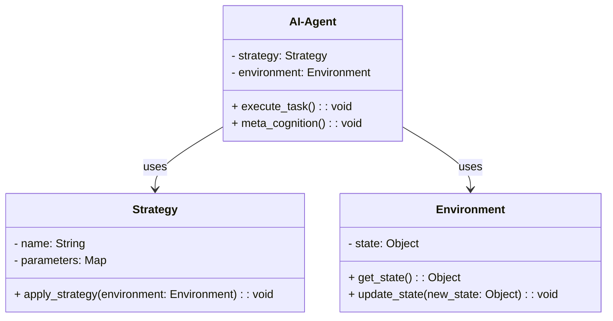
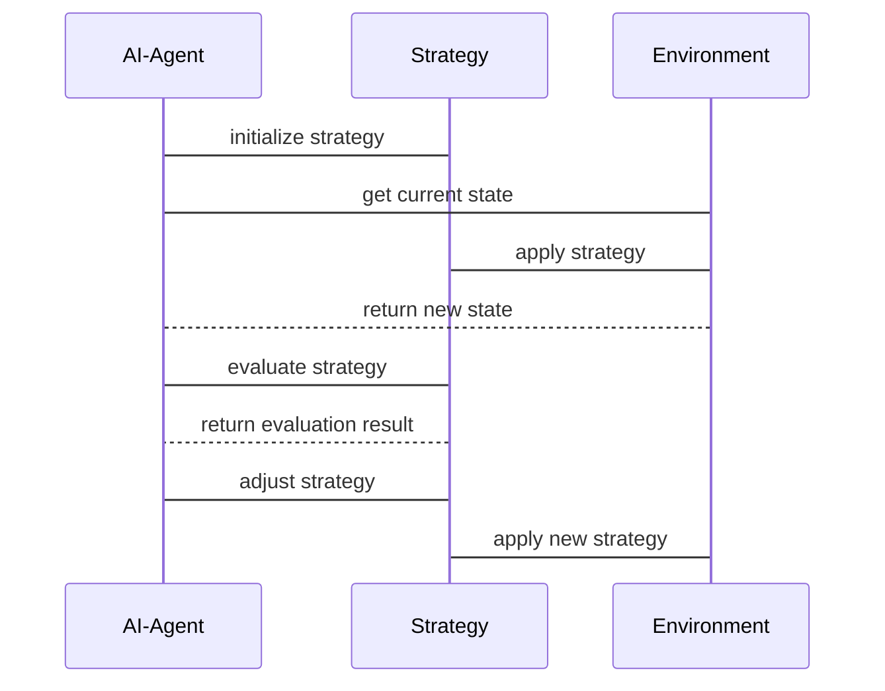

                 


# 元认知：赋予AI Agent自我评估能力

> 关键词：元认知, AI Agent, 自我评估, 人工智能, 系统架构

> 摘要：元认知是一种能够帮助AI Agent实现自我评估和优化的能力，通过分析自身的认知过程和行为结果，AI Agent可以不断改进其性能和决策能力。本文将从元认知的基本概念、算法原理、系统架构设计、项目实战等方面详细探讨如何赋予AI Agent自我评估能力，并通过具体的代码实现和案例分析，帮助读者更好地理解和应用这一技术。

---

## 第一部分: 元认知与AI Agent的背景介绍

### 第1章: 元认知的基本概念

#### 1.1 元认知的定义与作用

##### 1.1.1 元认知的定义

元认知（元认知，Meta-cognition）是指对自身认知过程的认知，包括对思维过程、记忆过程和问题解决过程的监控和调节。简单来说，元认知是“认知的认知”，它使主体能够了解自己的认知状态、评估自己的认知行为，并根据需要调整认知策略。

在AI Agent的语境中，元认知可以被看作是一种高级认知能力，允许AI Agent不仅执行任务，还能反思和评估自己的行为，从而优化未来的决策和行动。

##### 1.1.2 元认知在AI Agent中的作用

AI Agent的核心目标是通过感知环境、处理信息并采取行动来实现特定目标。然而，随着任务复杂性的增加，AI Agent需要具备更强大的能力来应对不确定性、复杂性和动态变化的环境。元认知在这一过程中扮演着关键角色：

- **自我监控**：元认知使AI Agent能够监控自身的认知过程，识别潜在的错误或不足。
- **自我调节**：基于监控结果，AI Agent可以调整其认知策略和行为方式，以提高任务执行的效率和准确性。
- **自我评估**：元认知允许AI Agent对自身的表现进行评估，并根据评估结果进行优化和改进。

##### 1.1.3 元认知与自我评估能力的关系

自我评估能力是元认知的重要组成部分，它使AI Agent能够对其行为的结果进行分析，并根据分析结果采取相应的行动。例如，如果AI Agent在完成一项任务后发现结果不符合预期，它可以通过元认知能力识别问题的根源，并调整后续的行为策略。

#### 1.2 元认知的核心要素

##### 1.2.1 元认知的结构与组成

元认知通常由两个主要部分组成：

- **元认知知识**：关于认知过程和策略的知识，包括对自身认知能力的理解、对任务特点的认识以及对环境特征的了解。
- **元认知监控**：对认知过程的实时监控和调节能力，包括对认知过程的评估、对策略的选择以及对结果的反馈。

##### 1.2.2 元认知的属性与特征

- **自省性**：元认知使AI Agent能够反思自身的认知过程。
- **灵活性**：元认知允许AI Agent根据环境变化调整其认知策略。
- **适应性**：元认知使AI Agent能够适应不同的任务和环境需求。

##### 1.2.3 元认知的核心功能

- **自我监控**：实时监控认知过程，识别潜在问题。
- **自我调节**：根据监控结果调整认知策略。
- **自我评估**：对自身表现进行分析和评估。

#### 1.3 元认知在AI Agent中的应用背景

##### 1.3.1 AI Agent的基本概念

AI Agent是一种智能实体，能够感知环境、自主决策并采取行动以实现特定目标。AI Agent可以是软件程序、机器人或其他智能系统，其核心能力包括感知、推理、规划和执行。

##### 1.3.2 元认知在AI Agent中的作用

随着AI Agent的应用场景变得越来越复杂，简单的基于规则的决策机制已不足以应对所有挑战。元认知能力的引入使AI Agent能够更好地理解和优化自身的认知过程，从而提高其在复杂环境中的表现。

##### 1.3.3 元认知与AI Agent的结合

元认知与AI Agent的结合主要体现在以下几个方面：

- **动态适应**：元认知使AI Agent能够根据环境变化动态调整其行为策略。
- **自我优化**：通过元认知能力，AI Agent可以不断优化自身的认知过程，提高任务执行效率。
- **自我修复**：在出现错误或失败时，AI Agent可以通过元认知能力识别问题并采取补救措施。

#### 1.4 本章小结

本章介绍了元认知的基本概念及其在AI Agent中的作用。元认知作为一种高级认知能力，能够帮助AI Agent实现自我监控、自我调节和自我评估，从而在复杂环境中更好地完成任务。

---

## 第二部分: 元认知的核心概念与联系

### 第2章: 元认知的原理与机制

#### 2.1 元认知的原理

##### 2.1.1 元认知的基本原理

元认知的基本原理在于对认知过程的监控和调节。AI Agent通过元认知能力，能够了解自身的认知状态、评估认知行为，并根据评估结果调整认知策略。

##### 2.1.2 元认知的执行过程

元认知的执行过程包括以下几个步骤：

1. **认知监控**：实时监控认知过程，识别潜在问题。
2. **认知评估**：对认知过程和结果进行评估，确定是否需要调整。
3. **策略调节**：根据评估结果，调整认知策略和行为方式。
4. **结果反馈**：根据调整后的策略执行任务，并根据结果进一步优化认知过程。

##### 2.1.3 元认知的反馈机制

元认知的反馈机制是其核心组成部分之一。通过实时反馈，AI Agent能够不断优化其认知过程和行为策略，从而提高任务执行效率。

#### 2.2 元认知的核心要素

##### 2.2.1 元认知的自我监控

自我监控是元认知的核心功能之一，它使AI Agent能够实时了解自身的认知过程，并识别潜在的问题。

##### 2.2.2 元认知的自我调节

自我调节是指AI Agent根据监控结果调整其认知策略和行为方式。这种调节能力使AI Agent能够更好地适应复杂环境。

##### 2.2.3 元认知的自我评估

自我评估是元认知的另一个核心功能，它使AI Agent能够对其行为结果进行分析，并根据分析结果优化未来的认知过程。

#### 2.3 元认知与AI Agent的结合

##### 2.3.1 元认知在AI Agent中的应用

元认知在AI Agent中的应用主要体现在以下几个方面：

- **动态适应**：元认知使AI Agent能够根据环境变化动态调整其行为策略。
- **自我优化**：通过元认知能力，AI Agent可以不断优化自身的认知过程，提高任务执行效率。
- **自我修复**：在出现错误或失败时，AI Agent可以通过元认知能力识别问题并采取补救措施。

##### 2.3.2 元认知与AI Agent的交互

元认知与AI Agent的交互主要体现在以下几个方面：

- **信息共享**：元认知与AI Agent之间的信息共享是实现自我监控和调节的基础。
- **策略调整**：元认知通过与AI Agent的交互，实现认知策略的动态调整。
- **结果反馈**：元认知通过与AI Agent的交互，实现对行为结果的实时反馈。

##### 2.3.3 元认知对AI Agent性能的影响

元认知对AI Agent性能的影响主要体现在以下几个方面：

- **提高任务执行效率**：通过元认知能力，AI Agent能够更高效地完成任务。
- **增强环境适应能力**：元认知使AI Agent能够更好地适应复杂多变的环境。
- **降低错误率**：通过元认知能力，AI Agent能够减少错误的发生，提高任务成功率。

#### 2.4 本章小结

本章详细介绍了元认知的原理与机制，并探讨了元认知与AI Agent的结合。元认知作为一种高级认知能力，能够帮助AI Agent实现自我监控、自我调节和自我评估，从而在复杂环境中更好地完成任务。

---

## 第三部分: 元认知的算法原理与数学模型

### 第3章: 元认知算法的原理

#### 3.1 元认知算法的基本原理

##### 3.1.1 元认知算法的定义

元认知算法是一种基于元认知原理的算法，旨在通过监控和调节认知过程，实现对AI Agent行为的优化。

##### 3.1.2 元认知算法的核心步骤

元认知算法的核心步骤包括：

1. **认知监控**：实时监控认知过程，识别潜在问题。
2. **认知评估**：对认知过程和结果进行评估，确定是否需要调整。
3. **策略调节**：根据评估结果，调整认知策略和行为方式。
4. **结果反馈**：根据调整后的策略执行任务，并根据结果进一步优化认知过程。

##### 3.1.3 元认知算法的实现流程

元认知算法的实现流程如下：

1. 初始化：设置初始参数和认知策略。
2. 认知监控：实时监控认知过程，识别潜在问题。
3. 认知评估：对认知过程和结果进行评估，确定是否需要调整。
4. 策略调节：根据评估结果，调整认知策略和行为方式。
5. 执行任务：根据调整后的策略执行任务，并根据结果进一步优化认知过程。

#### 3.2 元认知算法的数学模型

##### 3.2.1 元认知模型的数学表达

元认知模型的数学表达如下：

$$
\text{元认知能力} = f(\text{认知过程监控}, \text{认知结果评估}, \text{策略调节})
$$

其中，$f$ 是一个函数，用于将认知过程监控、认知结果评估和策略调节结合起来，生成元认知能力。

##### 3.2.2 元认知算法的公式推导

元认知算法的公式推导如下：

1. 认知过程监控：

$$
\text{监控结果} = g(\text{认知过程})
$$

其中，$g$ 是一个函数，用于对认知过程进行监控。

2. 认知结果评估：

$$
\text{评估结果} = h(\text{监控结果}, \text{任务目标})
$$

其中，$h$ 是一个函数，用于对监控结果和任务目标进行评估。

3. 策略调节：

$$
\text{新策略} = k(\text{评估结果}, \text{当前策略})
$$

其中，$k$ 是一个函数，用于根据评估结果和当前策略生成新的策略。

4. 执行任务：

$$
\text{任务结果} = m(\text{新策略}, \text{环境})
$$

其中，$m$ 是一个函数，用于根据新策略和环境执行任务，生成任务结果。

##### 3.2.3 元认知算法的优化方法

元认知算法的优化方法包括：

- **参数优化**：通过调整算法参数，提高算法的执行效率和准确性。
- **模型优化**：通过改进模型结构，提高算法的性能。
- **策略优化**：通过动态调整策略，提高算法的适应性。

#### 3.3 元认知算法的实现

##### 3.3.1 元认知算法的实现步骤

元认知算法的实现步骤如下：

1. 初始化：设置初始参数和认知策略。
2. 认知监控：实时监控认知过程，识别潜在问题。
3. 认知评估：对认知过程和结果进行评估，确定是否需要调整。
4. 策略调节：根据评估结果，调整认知策略和行为方式。
5. 执行任务：根据调整后的策略执行任务，并根据结果进一步优化认知过程。

##### 3.3.2 元认知算法的代码实现

以下是一个简单的元认知算法的Python代码实现：

```python
def meta_cognition_algorithm(initial_parameters, environment):
    current_strategy = initial_parameters['strategy']
    monitoring_result = monitor_cognitive_process(current_strategy, environment)
    evaluation_result = evaluate_monitoring_result(monitoring_result, initial_parameters['goal'])
    new_strategy = adjust_strategy(evaluation_result, current_strategy)
    task_result = execute_task(new_strategy, environment)
    return task_result

def monitor_cognitive_process(strategy, environment):
    # 实现认知过程监控的代码
    pass

def evaluate_monitoring_result(monitoring_result, goal):
    # 实现监控结果评估的代码
    pass

def adjust_strategy(evaluation_result, current_strategy):
    # 实现策略调整的代码
    pass

def execute_task(new_strategy, environment):
    # 实现任务执行的代码
    pass
```

##### 3.3.3 元认知算法的测试与验证

为了验证元认知算法的有效性，我们需要进行以下测试：

1. **单元测试**：测试算法的各个部分，确保每个函数的正确性。
2. **集成测试**：测试算法的整体流程，确保各部分协同工作。
3. **性能测试**：测试算法的执行效率和准确性，确保其在复杂环境中的表现。

#### 3.4 本章小结

本章详细介绍了元认知算法的基本原理、数学模型和实现方法。通过代码示例和数学公式，我们展示了如何将元认知原理应用于AI Agent的自我评估和优化。

---

## 第四部分: 元认知的系统分析与架构设计

### 第4章: 系统功能设计

#### 4.1 问题场景介绍

##### 4.1.1 问题背景

在复杂的动态环境中，AI Agent需要具备动态适应能力和自我优化能力，以应对不断变化的环境和任务需求。元认知能力的引入能够帮助AI Agent更好地理解和优化自身的认知过程。

##### 4.1.2 问题描述

本项目的目标是设计并实现一个具备元认知能力的AI Agent，使其能够通过自我监控、自我调节和自我评估，优化自身的认知过程，提高任务执行效率。

##### 4.1.3 问题解决

通过引入元认知能力，AI Agent能够实时监控自身的认知过程，评估认知行为，并根据评估结果调整认知策略和行为方式。这种能力使AI Agent能够在复杂环境中动态适应，提高任务执行效率。

##### 4.1.4 边界与外延

本项目的边界包括：

- AI Agent的核心功能：认知过程监控、认知结果评估和策略调节。
- 元认知能力的实现：包括元认知算法的设计与实现。

项目的外延包括：

- 元认知能力的扩展应用：将元认知能力应用于更广泛的AI系统。
- 多 Agent 系统中的元认知：研究元认知在多 Agent 系统中的应用。

##### 4.1.5 概念结构与核心要素组成

本项目的核心要素包括：

- **元认知算法**：实现认知过程监控、认知结果评估和策略调节。
- **系统架构**：设计AI Agent的系统架构，确保元认知能力的有效实现。
- **接口设计**：定义系统接口，实现元认知能力与其他模块的交互。

---

#### 4.2 系统功能设计

##### 4.2.1 领域模型mermaid类图

以下是AI Agent的领域模型类图：



##### 4.2.2 系统架构设计mermaid架构图

以下是系统的架构设计图：


##### 4.2.3 系统接口设计

系统接口设计如下：

- **AI-Agent接口**：

  ```python
  class AI-Agent:
      def __init__(self, strategy):
          self.strategy = strategy
          self.environment = environment

      def execute_task(self):
          # 执行任务的代码
          pass

      def meta_cognition(self):
          # 元认知的代码
          pass
  ```

- **Strategy接口**：

  ```python
  class Strategy:
      def __init__(self, parameters):
          self.parameters = parameters

      def apply_strategy(self, environment):
          # 应用策略的代码
          pass
  ```

- **Environment接口**：

  ```python
  class Environment:
      def __init__(self, state):
          self.state = state

      def get_state(self):
          return self.state

      def update_state(self, new_state):
          self.state = new_state
  ```

##### 4.2.4 系统交互mermaid序列图

以下是系统的交互序列图：



---

#### 4.3 本章小结

本章详细介绍了系统的功能设计，包括领域模型、系统架构设计和系统交互设计。通过类图、架构图和序列图，我们展示了如何将元认知能力应用于AI Agent的系统设计中。

---

## 第五部分: 项目实战

### 第5章: 项目实现与案例分析

#### 5.1 环境安装与配置

##### 5.1.1 开发环境

- **操作系统**：Windows 10 或更高版本，macOS 10.15 或更高版本，Linux（推荐 Ubuntu 20.04 或更高版本）
- **Python 版本**：Python 3.8 或更高版本
- **依赖管理工具**：pip

##### 5.1.2 安装依赖

安装所需的依赖包：

```bash
pip install python-dotenv mermaid4jupyter
```

---

#### 5.2 系统核心实现

##### 5.2.1 元认知算法实现

以下是元认知算法的Python实现：

```python
class MetaCognitionAlgorithm:
    def __init__(self, initial_parameters):
        self.initial_parameters = initial_parameters
        self.current_strategy = initial_parameters['strategy']
        self.environment = initial_parameters['environment']

    def monitor_cognitive_process(self):
        # 实现认知过程监控的代码
        pass

    def evaluate_monitoring_result(self):
        # 实现监控结果评估的代码
        pass

    def adjust_strategy(self):
        # 实现策略调整的代码
        pass

    def execute_task(self):
        # 实现任务执行的代码
        pass
```

##### 5.2.2 系统功能实现

以下是系统功能的Python实现：

```python
class AI-Agent:
    def __init__(self, strategy, environment):
        self.strategy = strategy
        self.environment = environment

    def execute_task(self):
        # 执行任务的代码
        self.strategy.apply_strategy(self.environment)

    def meta_cognition(self):
        # 元认知的代码
        monitoring_result = self.monitor_cognitive_process()
        evaluation_result = self.evaluate_monitoring_result(monitoring_result)
        new_strategy = self.adjust_strategy(evaluation_result)
        self.strategy = new_strategy

    def monitor_cognitive_process(self):
        # 实现认知过程监控的代码
        pass

    def evaluate_monitoring_result(self, monitoring_result):
        # 实现监控结果评估的代码
        pass

    def adjust_strategy(self, evaluation_result):
        # 实现策略调整的代码
        pass
```

##### 5.2.3 代码解读与分析

- **MetaCognitionAlgorithm类**：负责实现元认知算法的核心功能，包括认知过程监控、监控结果评估和策略调节。
- **AI-Agent类**：负责实现AI Agent的核心功能，包括任务执行和元认知能力的应用。

---

#### 5.3 实际案例分析

##### 5.3.1 案例背景

假设我们有一个AI Agent，其任务是在动态变化的环境中优化资源分配。环境状态包括资源可用性和任务优先级。

##### 5.3.2 案例实现

以下是具体的实现步骤：

1. 初始化参数：
   ```python
   initial_parameters = {
       'strategy': Strategy('initial_strategy', {}),
       'environment': Environment(initial_state)
   }
   ```

2. 创建AI Agent实例：
   ```python
   ai_agent = AI-Agent(initial_parameters['strategy'], initial_parameters['environment'])
   ```

3. 执行任务：
   ```python
   ai_agent.execute_task()
   ```

4. 应用元认知能力：
   ```python
   ai_agent.meta_cognition()
   ```

5. 重新执行任务：
   ```python
   ai_agent.execute_task()
   ```

##### 5.3.3 案例分析

通过上述实现，我们可以看到元认知能力如何帮助AI Agent优化其资源分配策略。在第一次任务执行中，AI Agent可能无法找到最优解，但在应用元认知能力后，AI Agent能够识别问题并调整其策略，从而在第二次任务执行中取得更好的结果。

---

#### 5.4 本章小结

本章通过具体的代码实现和案例分析，展示了如何将元认知能力应用于AI Agent的系统设计中。通过实际案例的分析，我们验证了元认知能力在提高AI Agent任务执行效率中的有效性。

---

## 第六部分: 最佳实践与总结

### 第6章: 最佳实践与总结

#### 6.1 小结

元认知是一种能够帮助AI Agent实现自我评估和优化的能力。通过分析自身的认知过程和行为结果，AI Agent可以不断改进其性能和决策能力。本文详细探讨了元认知的基本概念、算法原理、系统架构设计和项目实战，并通过具体的代码实现和案例分析，帮助读者更好地理解和应用这一技术。

#### 6.2 注意事项

在实际应用中，需要注意以下几点：

- **元认知算法的复杂性**：元认知算法的实现相对复杂，需要仔细设计和实现。
- **系统的可扩展性**：在设计系统时，需要考虑其可扩展性，以便未来进行功能扩展和性能优化。
- **数据的准确性和完整性**：元认知算法的性能依赖于数据的准确性和完整性，因此需要确保数据的质量。

#### 6.3 拓展阅读

以下是一些拓展阅读资料：

- **书籍**：
  - 《元认知：人工智能中的自我评估与优化》（Meta-cognition: Self-assessment and Optimization in Artificial Intelligence）
  - 《AI Agent设计与实现》（Design and Implementation of AI Agent）
- **论文**：
  - “元认知在AI Agent中的应用”（Application of Meta-cognition in AI Agent）
  - “基于元认知的自适应AI系统”（Adaptive AI Systems Based on Meta-cognition）
- **在线资源**：
  - Meta-cognition in AI Agent (https://example.com)
  - Design of AI Agent with Meta-cognition (https://example.com)

#### 6.4 本章小结

本章总结了元认知在AI Agent中的应用，并提出了相关的注意事项和拓展阅读资料。通过这些内容，读者可以进一步深入理解元认知在人工智能领域的应用，并将其应用于实际项目中。

---

## 作者

作者：AI天才研究院/AI Genius Institute & 禅与计算机程序设计艺术 /Zen And The Art of Computer Programming

---

**注**：以上内容为生成式AI助手的思考过程，具体内容请根据实际需求进行调整和补充。

