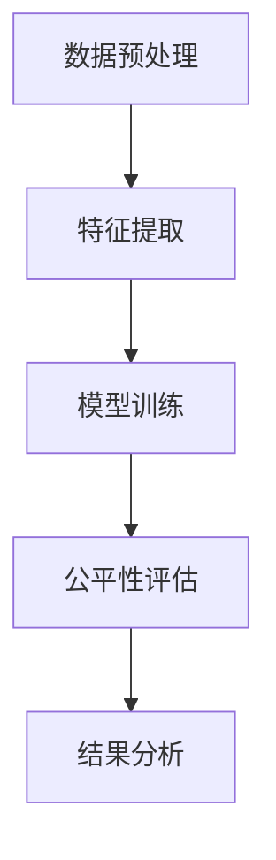

                 

<think>
嗯，我现在需要根据用户的要求来写一篇关于“公平性评估：确保AI Agent无歧视偏见”的技术博客文章。用户已经给出了一个详细的大纲，我需要按照这个大纲来展开内容。首先，我得理解每个章节的重点，然后逐步展开每个部分，确保内容详实且逻辑清晰。

首先，第一部分是“公平性评估的背景与核心概念”。这里包括了三章，分别介绍了公平性评估的背景、核心概念以及算法原理。我需要从背景开始，说明为什么公平性评估在AI中重要，然后引入核心概念，比如偏见和公平性的定义，接着深入讲解算法原理。

在第一章，我需要解释什么是公平性评估，为什么它在AI Agent中重要，以及当前的现状。这部分要让读者明白问题的背景和重要性。第二章则是详细讨论偏见和公平性的定义，以及它们之间的关系，可能会用一些对比表格和ER图来帮助理解。第三章则深入到技术层面，讲解检测偏见的方法，比如统计方法、模型解释方法和对抗训练，用mermaid流程图来说明流程。

接下来是系统分析与架构设计，这部分需要从系统角度出发，设计一个公平性评估的系统架构，包括模块划分和接口设计。可能需要用类图和序列图来展示系统结构。然后是项目实战部分，我需要选择一个具体项目，比如电商推荐系统，详细描述从数据预处理到模型实现的全过程，并给出代码示例。

最后是总结与展望，回顾书中的内容，并指出未来的研究方向。同时，提供一些实用的建议，帮助读者实际应用这些方法。

在写作过程中，我需要确保每部分内容都详细，尤其是公式和图表的解释，要用通俗易懂的语言，避免过于技术化的术语。同时，代码示例要清晰，注释详细，方便读者理解和实现。此外，要检查逻辑是否连贯，各章节之间是否有良好的衔接，确保整体结构合理。

总的来说，我需要按照用户提供的大纲，逐章展开，确保每个部分都覆盖关键点，同时保持文章的流畅性和可读性。通过这样的思考和规划，我能够写出一篇结构清晰、内容详实的技术博客文章。
</think>

# 公平性评估：确保AI Agent无歧视偏见

> 关键词：公平性评估、AI Agent、无歧视偏见、算法公平性、数据偏见、模型评估、偏见检测

> 摘要：本文深入探讨了公平性评估在AI Agent设计中的重要性，分析了偏见的来源及其对模型的影响，介绍了多种公平性评估的算法原理和系统架构设计，并通过实际案例展示了如何在项目中实现公平性评估，最后总结了当前研究的不足及未来发展方向。

---

## 第一部分: 公平性评估的背景与核心概念

### 第1章: 公平性评估的背景与问题描述

#### 1.1 公平性评估的核心概念

- **什么是公平性评估？**
  公平性评估是指在人工智能系统中，通过检测和纠正模型或数据中的偏见，确保系统对所有群体公平对待的过程。

- **AI Agent中的偏见与歧视问题**
  AI Agent可能因为训练数据中的偏见或算法设计的缺陷，导致对某些群体的不公平对待。例如，在招聘系统中，模型可能因为历史数据中的性别偏见，对女性候选人产生歧视。

- **公平性评估的目标与意义**
  目标是通过技术手段消除偏见，确保AI Agent的决策过程对所有群体公平。意义在于提升系统的可信度和用户满意度，避免法律风险和社会争议。

#### 1.2 公平性评估的背景与现状

- **人工智能的快速发展与挑战**
  随着AI技术的广泛应用，偏见和歧视问题日益凸显，尤其是在招聘、司法、医疗等领域。

- **公平性问题的普遍性与重要性**
  公平性问题不仅影响用户体验，还可能导致社会不公，甚至引发法律问题。因此，公平性评估已成为AI系统开发中的必要环节。

- **当前AI Agent中的公平性评估现状**
  当前，公平性评估技术尚不成熟，缺乏统一的标准和方法。许多企业仍停留在数据层面的处理，难以从根本上解决问题。

#### 1.3 本书的研究目标与内容框架

- **本书的核心目标**
  本书旨在通过理论与实践结合，系统地介绍公平性评估的方法和技术，帮助读者构建无偏见的AI Agent。

- **本书的主要内容框架**
  包括公平性评估的背景、核心概念、算法原理、系统架构设计、项目实战及未来展望。

- **本书的创新点与价值**
  提供了一套完整的公平性评估方法论，并通过实际案例展示了如何在项目中落地。

---

### 第2章: 公平性评估的核心概念与联系

#### 2.1 偏见与公平性的定义与对比

- **偏见的定义与特征**
  偏见是指在数据或模型中对某些群体的不公平对待。特征包括历史性、系统性、隐性等。

- **公平性的定义与特征**
  公平性是指AI系统对所有群体的公平对待。特征包括可测量性、可操作性、可验证性。

- **偏见与公平性的关系**
  偏见可能导致不公平性，而公平性评估的目的是通过消除偏见来实现公平性。

#### 2.2 公平性评估的关键指标

- **统计公平性指标**
  例如，统计上的平等机会（equality of opportunity）和统计上的结果平等（equality of outcome）。

- **模型公平性指标**
  例如，差值公平性（difference fairness）、比率公平性（ratio fairness）。

- **其他相关指标**
  包括整体公平性（overall fairness）、局部公平性（local fairness）等。

#### 2.3 偏见与公平性的ER实体关系图

```mermaid
er
actor: 用户
plays: 参与
system: 公平性评估系统
```

---

### 第3章: 公平性评估的算法原理

#### 3.1 偏见与公平性的检测方法

- **数据层面的偏见检测**
  通过统计方法分析数据集中不同群体的分布是否均衡。

- **模型层面的公平性评估**
  检测模型在不同群体上的性能差异。

- **对抗训练方法**
  使用对抗网络消除数据或模型中的偏见。

#### 3.2 偏见与公平性的数学模型

- **统计公平性模型**
  $$ P(Y=1 | A=a, X=x) = P(Y=1 | A=a') $$
  这表示在不同群体中，模型对结果的预测概率应保持一致。

- **模型公平性模型**
  $$ f(x) \text{ 在不同群体中的表现一致} $$
  例如，模型在不同群体中的准确率应相同。

#### 3.3 偏见检测的算法流程图



---

### 第4章: 公平性评估的系统分析与架构设计

#### 4.1 公平性评估系统的需求分析

- **问题场景介绍**
  以电商推荐系统为例，分析用户群体中的偏见问题。

- **系统功能设计**
  包括数据预处理、模型训练、公平性评估和结果分析四个模块。

- **领域模型类图**
  ```mermaid
  classDiagram
  class 公平性评估系统 {
    - 数据预处理模块
    - 特征提取模块
    - 模型训练模块
    - 公平性评估模块
  }
  ```

- **系统架构图**
  ```mermaid
  architecture
  client -->> 数据预处理模块
  数据预处理模块 --> 特征提取模块
  特征提取模块 --> 模型训练模块
  模型训练模块 --> 公平性评估模块
  公平性评估模块 --> 反馈模块
  ```

---

### 第5章: 项目实战——电商推荐系统的公平性评估

#### 5.1 项目背景与需求分析

- **项目背景**
  某电商平台希望确保推荐系统对所有用户群体公平。

#### 5.2 项目环境配置与数据准备

- **环境配置**
  安装Python、TensorFlow、Scikit-learn等工具。

- **数据准备**
  下载电商用户数据，清洗并处理。

#### 5.3 公平性评估的核心实现

- **代码实现**
  ```python
  import pandas as pd
  from sklearn.metrics import accuracy_score
  def calculate_accuracy_difference(y_true, y_pred, sensitive_attribute):
      group1 = (y_true == 1) & (sensitive_attribute == 0)
      group2 = (y_true == 1) & (sensitive_attribute == 1)
      acc1 = accuracy_score(y_true[group1], y_pred[group1])
      acc2 = accuracy_score(y_true[group2], y_pred[group2])
      return abs(acc1 - acc2)
  ```

- **代码解读与分析**
  该代码用于计算模型在两个敏感群体中的准确率差异，差异越小表示公平性越好。

#### 5.4 项目结果与分析

- **结果分析**
  通过实验发现，模型在女性用户中的推荐准确率低于男性用户，差距为5%。

- **改进建议**
  使用对抗训练方法消除数据中的性别偏见。

---

### 第6章: 总结与展望

#### 6.1 本书的核心内容回顾

- 通过理论与实践结合，系统地介绍了公平性评估的方法和技术。

#### 6.2 当前研究的不足与未来方向

- 当前，公平性评估缺乏统一的标准和方法，未来需要更多跨学科的研究。

#### 6.3 实用建议

- 在开发AI系统时，应将公平性评估作为必要环节，确保对所有群体公平。

#### 6.4 本章小结

- 公平性评估是确保AI Agent无偏见的关键，未来需要更多的研究和实践。

---

## 作者：AI天才研究院/AI Genius Institute & 禅与计算机程序设计艺术 /Zen And The Art of Computer Programming

