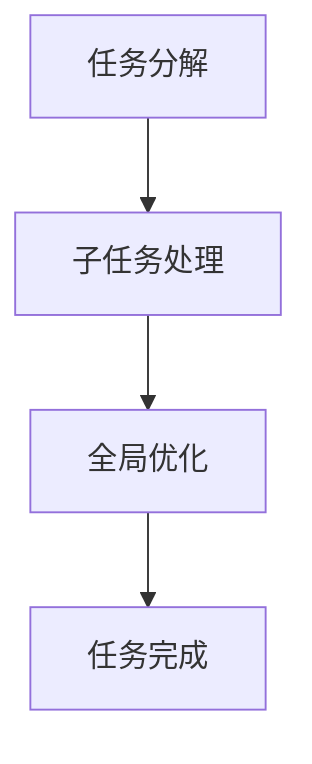
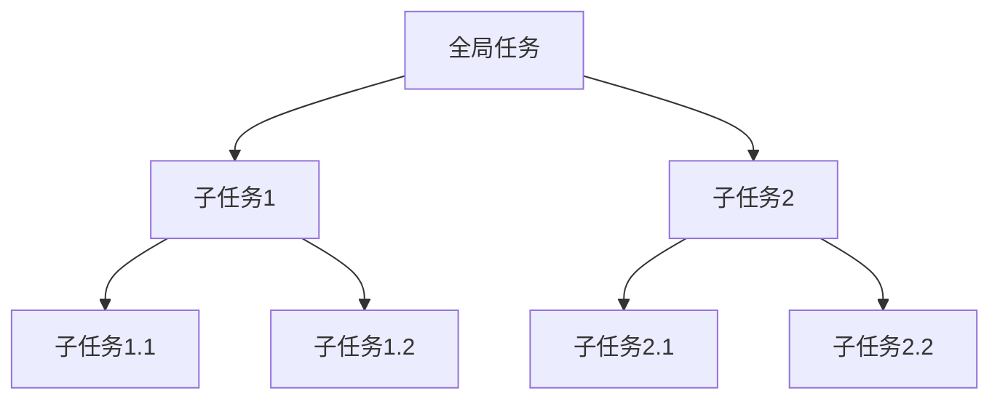
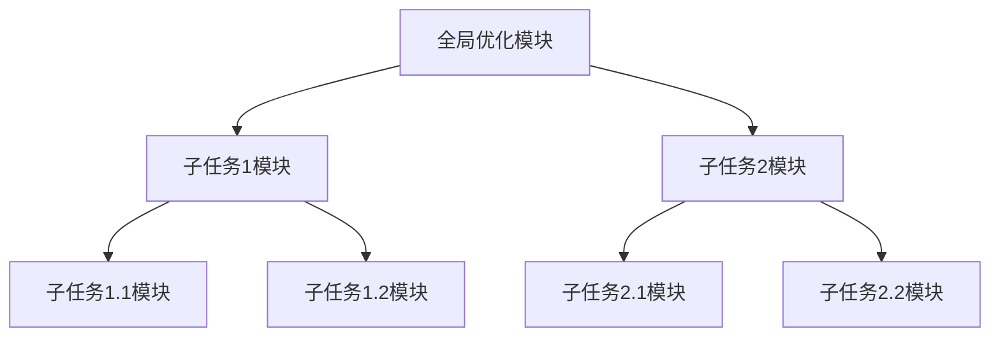

                 

<think>
好的，我现在需要帮助用户撰写一篇关于分层强化学习的长篇技术博客。用户提供了详细的结构大纲和内容要求，我需要确保每个部分都详细展开，并满足所有指定的格式和内容要求。

首先，我需要理解分层强化学习的基本概念和应用场景。分层强化学习是一种通过层次化结构来分解复杂任务的强化学习方法，能够提高AI Agent的效率和性能。接下来，我需要在摘要部分概述文章的核心内容，强调分层强化学习的优势和应用场景。

在第一章，背景与概述部分，我需要详细解释分层强化学习的起源、基本概念及其与传统强化学习的区别。这部分需要确保读者能够理解分层强化学习的重要性及其在AI Agent中的作用。

第二章的核心概念与原理部分，我需要详细讲解分层强化学习的分解方法、层次结构、节点类型、学习机制和优化方法。这部分需要使用表格和图表来对比不同分解方法的优缺点，并通过mermaid流程图展示层次结构。

算法原理部分，我需要选择几种典型的分层强化学习算法，如HRL、DQN-H和MA-HRL，详细解释它们的工作原理，并用mermaid流程图展示算法流程。同时，提供Python代码示例，帮助读者理解实现细节。

系统分析与架构设计部分，我需要从项目介绍、系统功能设计、架构设计、接口设计和交互设计几个方面入手。使用mermaid类图、架构图和序列图来展示系统的结构和交互流程。

项目实战部分，我需要选择一个具体的案例，如智能仓储管理，展示如何应用分层强化学习解决实际问题。从环境安装、代码实现到案例分析，一步步引导读者完成项目。

最后，最佳实践部分需要总结分层强化学习的应用经验和注意事项，小结部分回顾全文，注意事项提醒读者在实际应用中需要注意的问题，拓展阅读则提供进一步学习的资源。

在撰写过程中，我需要确保每个部分都详细展开，使用逻辑清晰、结构紧凑的语言，同时满足格式要求，如数学公式使用latex，图表使用mermaid，代码使用Python。确保整篇文章内容丰富、详细，符合用户的深度需求。

现在，我可以开始撰写每个章节的具体内容，确保每个部分都符合用户的结构和内容要求，同时保持语言的专业性和可读性。
</think>

# 分层强化学习：处理复杂任务的AI Agent策略

> **关键词**：分层强化学习，AI Agent，复杂任务，层次化策略，强化学习算法

> **摘要**：  
> 分层强化学习是一种通过层次化结构分解复杂任务的强化学习方法，能够显著提升AI Agent的效率和性能。本文从分层强化学习的基本概念、算法原理、系统架构到实际应用，全面阐述了其在处理复杂任务中的策略。通过详细分析分层强化学习的核心概念、典型算法及其在系统设计中的应用，本文为读者提供了一套从理论到实践的完整指南。

---

## 第一部分：分层强化学习基础

### 第1章：分层强化学习的背景与概述

#### 1.1 分层强化学习的起源与发展

分层强化学习（Hierarchical Reinforcement Learning, HRL）起源于20世纪90年代，随着强化学习（Reinforcement Learning, RL）的快速发展而逐渐受到关注。HRL的核心思想是通过将复杂任务分解为多个子任务，构建层次化的决策结构，从而提高学习效率和任务处理能力。近年来，随着AI Agent在机器人、自动驾驶、游戏AI等领域的广泛应用，HRL在处理复杂任务中的优势日益凸显。

**关键概念**：  
- **强化学习（Reinforcement Learning, RL）**：通过智能体与环境交互，学习最优策略以最大化累积奖励。  
- **分层强化学习（HRL）**：通过层次化分解，将复杂任务拆解为多个子任务，每个子任务由不同的强化学习模块处理。

**问题背景**：  
传统强化学习在处理复杂任务时面临以下挑战：  
1. **状态空间和动作空间过大**：复杂任务的状态和动作数量呈指数级增长，导致学习效率低下。  
2. **目标分解困难**：复杂任务难以直接分解为简单的子任务，影响学习效果。  
3. **策略优化复杂**：全局优化需要考虑所有可能的状态和动作组合，计算开销巨大。  

**HRL的优势**：  
通过层次化分解，HRL能够将复杂任务分解为多个子任务，每个子任务由不同的强化学习模块处理，从而降低复杂度，提高学习效率和任务处理能力。

---

#### 1.2 分层强化学习的基本概念

**1.2.1 分层强化学习的定义**  
分层强化学习是一种通过构建层次化结构，将复杂任务分解为多个子任务的强化学习方法。每个子任务由不同的强化学习模块处理，模块之间通过层次化的交互完成任务。

**1.2.2 分层强化学习的特点**  
1. **层次化分解**：任务被分解为多个子任务，每个子任务由不同的模块处理。  
2. **模块化设计**：每个子任务对应一个强化学习模块，模块之间通过接口交互。  
3. **灵活性与可扩展性**：层次化结构使得系统具有良好的灵活性和可扩展性。  

**1.2.3 分层强化学习的组成部分**  
1. **层次结构**：任务被分解为多个层次，每个层次对应不同的子任务。  
2. **强化学习模块**：每个子任务由一个强化学习模块处理，模块之间通过接口交互。  
3. **全局目标**：整个系统的目标由多个子任务的目标共同优化。  

---

#### 1.3 分层强化学习在AI Agent中的作用

**1.3.1 AI Agent的基本概念**  
AI Agent是一种能够感知环境、做出决策并执行动作的智能体。AI Agent的核心目标是通过与环境交互，实现预定任务。

**1.3.2 分层强化学习对AI Agent的提升**  
通过层次化分解，分层强化学习能够将复杂任务分解为多个子任务，每个子任务由不同的强化学习模块处理，从而提高AI Agent的效率和性能。

**1.3.3 分层强化学习的应用场景**  
1. **机器人控制**：复杂动作的分解与优化。  
2. **自动驾驶**：路径规划、障碍规避等任务的分解。  
3. **游戏AI**：策略分解与优化。  

---

## 第二部分：分层强化学习的核心概念与原理

### 第2章：分层强化学习的核心概念与原理

#### 2.1 分层强化学习的分解方法

**2.1.1 目标分解法**  
目标分解法将复杂任务分解为多个子目标，每个子目标对应一个强化学习模块。例如，在自动驾驶中，路径规划和障碍规避可以作为两个子目标。

**2.1.2 动作分解法**  
动作分解法将复杂动作分解为多个简单动作，每个动作由不同的强化学习模块处理。例如，在机器人控制中，抓取和放置可以作为两个子动作。

**2.1.3 状态分解法**  
状态分解法将复杂状态分解为多个简单状态，每个状态由不同的强化学习模块处理。例如，在游戏中，敌人和队友的状态可以分别处理。

**对比分析**：  
下表对比了目标分解法、动作分解法和状态分解法的特点：

| **分解方法** | **目标** | **动作** | **状态** |
|--------------|----------|----------|----------|
| 目标分解法    | 分解为子目标 | -        | -        |
| 动作分解法    | -        | 分解为子动作 | -        |
| 状态分解法    | -        | -        | 分解为子状态 |

---

#### 2.2 分层强化学习的层次结构

**2.2.1 层次结构的定义**  
层次结构是分层强化学习的核心，任务被分解为多个层次，每个层次对应不同的子任务。

**2.2.2 层次结构的类型**  
1. **树状结构**：任务分解为多个子任务，每个子任务进一步分解为更小的任务。  
2. **网状结构**：任务分解为多个子任务，子任务之间可能存在交叉或重叠。  

**2.2.3 层次结构的设计原则**  
1. **目标明确**：每个层次的目标清晰，避免任务混淆。  
2. **模块化设计**：每个层次对应一个模块，模块之间通过接口交互。  

---

#### 2.3 分层强化学习的节点类型

**2.3.1 目标节点**  
目标节点表示任务的目标，例如在自动驾驶中，目标节点可以是“到达目的地”。  

**2.3.2 行动节点**  
行动节点表示具体动作，例如“左转”、“右转”等。  

**2.3.3 状态节点**  
状态节点表示当前状态，例如“前方有障碍物”。  

---

#### 2.4 分层强化学习的学习机制

**2.4.1 层次化策略学习**  
层次化策略学习通过在不同层次上学习策略，优化整体任务的执行效果。  

**2.4.2 分层Q-learning**  
分层Q-learning将任务分解为多个子任务，每个子任务学习一个Q值函数。  

**2.4.3 分层Actor-Critic方法**  
分层Actor-Critic方法通过在不同层次上学习策略和价值函数，优化整体任务的执行效果。  

---

## 第三部分：分层强化学习的算法原理

### 第3章：分层强化学习的典型算法

#### 3.1 HRL（Hierarchical Reinforcement Learning）

**3.1.1 HRL的基本原理**  
HRL通过构建层次化结构，将复杂任务分解为多个子任务，每个子任务由不同的强化学习模块处理。

**3.1.2 HRL的实现流程**  
1. **任务分解**：将复杂任务分解为多个子任务。  
2. **子任务处理**：每个子任务由不同的强化学习模块处理。  
3. **全局优化**：通过协调不同模块的策略，优化整体任务的执行效果。  

**3.1.3 HRL的数学模型**  
HRL的数学模型可以通过以下公式表示：

$$ V(s) = \max_{a} Q(s, a) $$

其中，$s$是当前状态，$a$是动作。

---

#### 3.2 DQN-H（Deep Q-Network with Hierarchical Structure）

**3.2.1 DQN-H的基本原理**  
DQN-H是一种基于深度强化学习的分层强化学习算法，通过构建层次化结构，将复杂任务分解为多个子任务。

**3.2.2 DQN-H的实现流程**  
1. **任务分解**：将复杂任务分解为多个子任务。  
2. **子任务处理**：每个子任务由一个深度Q网络处理。  
3. **全局优化**：通过协调不同深度Q网络的策略，优化整体任务的执行效果。  

**3.2.3 DQN-H的数学模型**  
DQN-H的数学模型可以通过以下公式表示：

$$ Q(s, a) = \max_{a'} Q(s', a') $$

其中，$s$是当前状态，$a$是动作，$s'$是下一个状态，$a'$是下一个动作。

---

#### 3.3 MA-HRL（Multi-Agent Hierarchical Reinforcement Learning）

**3.3.1 MA-HRL的基本原理**  
MA-HRL是一种基于多智能体的分层强化学习算法，通过构建层次化结构，将复杂任务分解为多个子任务，每个子任务由不同的智能体处理。

**3.3.2 MA-HRL的实现流程**  
1. **任务分解**：将复杂任务分解为多个子任务。  
2. **子任务处理**：每个子任务由一个智能体处理。  
3. **全局优化**：通过协调不同智能体的策略，优化整体任务的执行效果。  

**3.3.3 MA-HRL的数学模型**  
MA-HRL的数学模型可以通过以下公式表示：

$$ V(s) = \max_{i} V_i(s_i) $$

其中，$s$是当前状态，$s_i$是子任务的状态。

---

## 第四部分：分层强化学习的系统架构

### 第4章：分层强化学习的系统架构设计

#### 4.1 系统功能设计

**4.1.1 系统功能模块**  
1. **任务分解模块**：将复杂任务分解为多个子任务。  
2. **子任务处理模块**：每个子任务由不同的强化学习模块处理。  
3. **全局优化模块**：通过协调不同模块的策略，优化整体任务的执行效果。  

**4.1.2 功能流程图**  
下图展示了分层强化学习系统的功能流程：



---

#### 4.2 系统架构设计

**4.2.1 架构类型**  
1. **树状架构**：任务分解为多个子任务，每个子任务进一步分解为更小的任务。  
2. **网状架构**：任务分解为多个子任务，子任务之间可能存在交叉或重叠。  

**4.2.2 架构设计原则**  
1. **模块化设计**：每个子任务对应一个模块，模块之间通过接口交互。  
2. **层次化结构**：任务被分解为多个层次，每个层次对应不同的子任务。  

**4.2.3 架构示意图**  
下图展示了分层强化学习系统的架构设计：



---

#### 4.3 接口设计

**4.3.1 接口定义**  
1. **子任务接口**：定义子任务之间的接口，例如动作、状态等。  
2. **全局优化接口**：定义全局优化模块与子任务模块之间的接口。  

**4.3.2 接口交互流程**  
下图展示了分层强化学习系统的接口交互流程：



---

## 第五部分：分层强化学习的项目实战

### 第5章：分层强化学习的项目实战

#### 5.1 项目介绍

**5.1.1 项目背景**  
本项目旨在通过分层强化学习算法，解决复杂任务中的决策问题，例如自动驾驶中的路径规划和障碍规避。

**5.1.2 项目目标**  
通过分层强化学习算法，实现复杂任务的分解与优化，提高任务处理效率和性能。

---

#### 5.2 系统核心实现

**5.2.1 环境安装**  
1. 安装Python环境。  
2. 安装必要的库，例如TensorFlow、Keras等。  

**5.2.2 核心代码实现**  
以下是分层强化学习算法的核心代码实现：

```python
class HRLAgent:
    def __init__(self, state_space, action_space):
        self.state_space = state_space
        self.action_space = action_space
        self.sub_tasks = self.decompose_task()  # 分解任务
        self.sub_agents = [self.create_sub_agent(task) for task in self.sub_tasks]  # 创建子任务代理

    def decompose_task(self):
        # 分解任务为多个子任务
        pass

    def create_sub_agent(self, task):
        # 创建子任务代理
        pass

    def act(self, state):
        # 根据当前状态选择动作
        pass
```

**5.2.3 代码解读与分析**  
1. `HRLAgent`类是分层强化学习算法的核心类，包含任务分解和子任务代理创建方法。  
2. `decompose_task`方法将复杂任务分解为多个子任务。  
3. `create_sub_agent`方法创建子任务代理。  

---

#### 5.3 项目实战案例

**5.3.1 案例背景**  
在自动驾驶中，路径规划和障碍规避是两个重要的任务，可以通过分层强化学习算法实现。

**5.3.2 案例实现**  
以下是分层强化学习算法在自动驾驶中的实现：

```python
class AutonomousVehicle:
    def __init__(self, state_space, action_space):
        self.state_space = state_space
        self.action_space = action_space
        self.planner = HRLAgent(state_space, action_space)  # 初始化分层强化学习代理

    def drive(self):
        while True:
            state = self.get_state()  # 获取当前状态
            action = self.planner.act(state)  # 选择动作
            self.execute_action(action)  # 执行动作
```

---

## 第六部分：总结与展望

### 第6章：总结与展望

#### 6.1 总结

分层强化学习是一种通过层次化结构分解复杂任务的强化学习方法，能够显著提高AI Agent的效率和性能。通过层次化分解，分层强化学习能够将复杂任务分解为多个子任务，每个子任务由不同的强化学习模块处理，从而降低复杂度，提高学习效率和任务处理能力。

---

#### 6.2 展望

随着AI技术的不断发展，分层强化学习在处理复杂任务中的应用前景广阔。未来，可以通过以下方向进一步研究和优化：  
1. **多智能体协作**：研究分层强化学习在多智能体协作中的应用。  
2. **动态任务分解**：研究分层强化学习在动态任务分解中的应用。  
3. **强化学习与深度学习的结合**：研究分层强化学习与深度学习的结合，进一步提高任务处理能力。  

---

## 作者

**作者**：AI天才研究院/AI Genius Institute & 禅与计算机程序设计艺术 /Zen And The Art of Computer Programming  

---

**注**：以上内容为示例性的分层强化学习技术博客文章，实际撰写时需要根据具体需求进一步扩展和优化。

