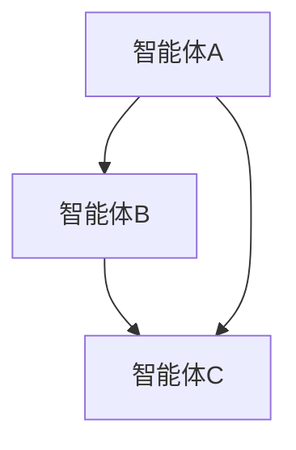
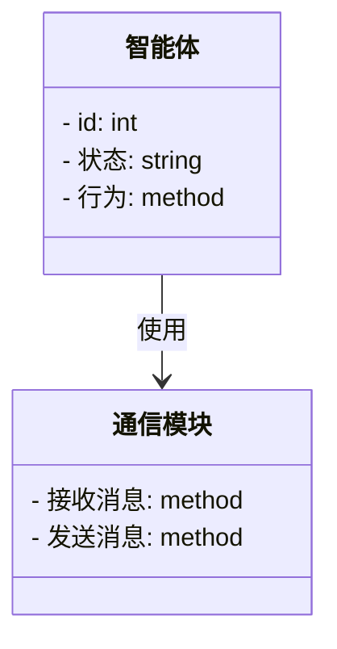
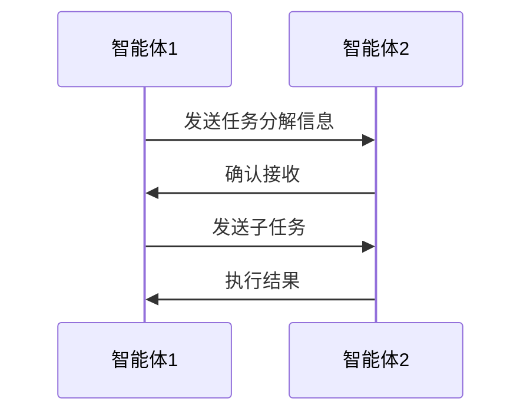

                 

<think>
好的，我需要完成一个《分布式AI Agent系统：设计与实现》的博客文章，按照用户的要求，文章需要包含标题、关键词、摘要，以及详细的目录结构。根据用户提供的示例，我应该先明确文章的结构和内容，然后逐步填充每一部分内容。

首先，我需要确定文章的标题和关键词。标题已经给出是《分布式AI Agent系统：设计与实现》，关键词应该与主题相关，比如分布式系统、AI Agent、多智能体系统、系统架构等，大概5-7个。

接下来是摘要部分，需要简明扼要地概括文章的核心内容和主题思想。摘要应该包含主要的研究内容、方法和结论。

然后是目录结构。根据用户的示例，文章分为多个章节，每个章节下有不同的小节。我需要确保每个章节都涵盖必要的内容，包括背景、核心概念、算法原理、系统架构、项目实战、总结等。

在填充内容时，我需要确保每一部分都详细且有深度。例如，在背景部分，我需要介绍分布式AI Agent的基本概念、问题背景和应用领域；在核心概念部分，要定义分布式AI Agent，讨论其特点和与其他技术的对比；在算法部分，需要详细讲解相关的算法及其实现；在系统架构部分，需要用图表展示系统设计；在项目实战部分，提供实际案例和代码实现。

此外，用户强调了格式要求，包括使用markdown格式，数学公式使用latex，图表使用mermaid等。我需要确保这些格式在实际写作中得到正确应用。

最后，我需要总结文章的主要内容，并给出一些注意事项和未来的研究方向，以帮助读者更好地理解和应用所学知识。

总之，我需要按照用户的要求，逐步完成每个部分的内容，确保逻辑清晰、结构紧凑，同时语言专业且易于理解。在写作过程中，要时刻回顾用户的需求，确保每个部分都符合他们的期望。
</think>

# 分布式AI Agent系统：设计与实现

> 关键词：分布式系统、AI Agent、多智能体系统、系统架构、算法原理

> 摘要：本文系统地探讨了分布式AI Agent系统的设计与实现，从基本概念到算法原理，再到实际应用，全面解析了分布式AI Agent的核心思想和技术实现。文章结合理论与实践，通过详细的数学模型和系统架构图，深入分析了分布式AI Agent的设计原则、算法实现和系统架构，为读者提供了一个全面的理解框架。

---

## 第一章: 分布式AI Agent系统概述

### 1.1 分布式AI Agent的基本概念

#### 1.1.1 分布式AI Agent的定义
分布式AI Agent（Distributed AI Agent，简称DAIA）是指在分布式系统中，由多个智能体协作完成特定任务的系统。这些智能体能够自主决策、相互协作，并在分布式环境中实现目标。

#### 1.1.2 分布式AI Agent的核心特点
- **分布式性**：智能体分布在不同的节点上，通过通信和协作完成任务。
- **自主性**：每个智能体具有自主决策能力。
- **协作性**：智能体之间需要通过通信和协商实现协作。
- **动态性**：系统环境和任务需求可能动态变化。

#### 1.1.3 分布式AI Agent与传统AI的区别
- **传统AI**：集中式计算，单个智能体完成任务。
- **分布式AI Agent**：多个智能体协作，任务分解为子任务，分布式执行。

### 1.2 分布式AI Agent的背景与问题背景

#### 1.2.1 分布式系统的发展历程
- 分布式系统从早期的简单网络到现代的复杂系统，经历了多个发展阶段。
- 随着AI技术的发展，分布式AI Agent逐渐成为研究热点。

#### 1.2.2 分布式AI Agent的提出背景
- 传统AI在复杂环境下的局限性。
- 分布式系统的需求推动了AI Agent的分布式化。

#### 1.2.3 分布式AI Agent的应用场景与问题描述
- **应用场景**：多智能体协作、分布式计算、分布式任务调度等。
- **问题描述**：通信延迟、任务分配不均、协作效率低下等。

### 1.3 分布式AI Agent的外延与边界

#### 1.3.1 分布式AI Agent的外延
- 包括多智能体系统、分布式计算、AI协作等多个方面。

#### 1.3.2 分布式AI Agent的边界
- 系统的边界定义为智能体之间的通信和协作范围。

#### 1.3.3 分布式AI Agent与相关概念的对比
- **多智能体系统（MAS）**：强调多个智能体的协作。
- **分布式系统**：强调资源的分布和协作。
- **AI Agent**：强调智能体的自主性。

### 1.4 本章小结
本章介绍了分布式AI Agent的基本概念、核心特点以及与传统AI的区别，探讨了其发展背景和应用场景，并通过对比分析明确了其外延与边界。

---

## 第二章: 分布式AI Agent的核心概念与联系

### 2.1 分布式AI Agent的核心原理

#### 2.1.1 分布式AI Agent的原理概述
- 智能体通过通信和协作实现任务目标。
- 分布式系统中的智能体需要具备自主性和协作性。

#### 2.1.2 分布式AI Agent的核心要素
- **智能体**：具备感知和决策能力的实体。
- **通信机制**：智能体之间交换信息的通道。
- **协作协议**：智能体之间协作的规则和流程。

#### 2.1.3 分布式AI Agent的数学模型
分布式AI Agent的数学模型可以用图论表示，节点表示智能体，边表示通信关系。

$$ G = (V, E) $$
其中，$ V $ 表示智能体集合，$ E $ 表示智能体之间的通信关系。

### 2.2 分布式AI Agent的概念属性特征对比

#### 2.2.1 分布式AI Agent的属性特征
- **自主性**：智能体能够自主决策。
- **协作性**：智能体之间能够协作完成任务。
- **分布性**：智能体分布在不同的节点上。

#### 2.2.2 与传统AI Agent的对比分析
| 特性 | 分布式AI Agent | 传统AI Agent |
|------|----------------|---------------|
| 自主性 | 高             | 中             |
| 分布性 | 分布式         | 集中式         |
| 协作性 | 高             | 低             |

#### 2.2.3 分布式AI Agent的ER实体关系图
```mermaid
er
actor: 用户
agent: AI Agent
system: 分布式系统
interaction: 交互
```

### 2.3 本章小结
本章详细阐述了分布式AI Agent的核心原理，对比分析了其属性特征，并通过ER实体关系图展示了其概念结构。

---

## 第三章: 分布式AI Agent系统的设计原则与挑战

### 3.1 分布式AI Agent的设计原则

#### 3.1.1 分布式系统的设计原则
- **模块化设计**：将系统划分为多个模块，便于维护和扩展。
- **通信效率**：优化智能体之间的通信机制，减少延迟。

#### 3.1.2 AI Agent的设计原则
- **自主性**：确保智能体具备自主决策能力。
- **协作性**：设计高效的协作协议。

#### 3.1.3 分布式AI Agent的独特设计原则
- **任务分解**：将全局任务分解为子任务，分配给不同的智能体。
- **动态调整**：根据环境变化动态调整任务分配。

### 3.2 分布式AI Agent的主要挑战

#### 3.2.1 分布式环境下的通信与协调问题
- 智能体之间的通信延迟可能影响协作效率。

#### 3.2.2 分布式系统中的同步与一致性问题
- 多个智能体协作时，如何保证系统的一致性。

#### 3.2.3 分布式AI Agent的计算资源分配问题
- 如何高效分配计算资源，避免资源浪费。

### 3.3 本章小结
本章探讨了分布式AI Agent的设计原则，并分析了其面临的主要挑战，包括通信效率、系统一致性以及资源分配等问题。

---

## 第四章: 分布式AI Agent的算法原理

### 4.1 分布式AI Agent的算法概述

#### 4.1.1 多智能体协作算法
- **一致性算法**：如Byzantine Fault Tolerant（BFT）算法。
- **分布式共识算法**：如分布式一致性算法。

#### 4.1.2 分布式AI Agent的数学模型
- 使用图论和概率论模型描述智能体的协作过程。

### 4.2 多智能体协作算法实现

#### 4.2.1 分布式一致性算法

- 智能体之间通过消息传递实现一致性。

#### 4.2.2 分布式共识算法
- BFT算法的伪代码实现：
```python
def bft_consensus(n, f):
    # n: 总节点数
    # f: 故障节点数
    pass
```

### 4.3 本章小结
本章详细讲解了分布式AI Agent的算法原理，包括一致性算法和共识算法，并通过图示和伪代码展示了其实现过程。

---

## 第五章: 分布式AI Agent系统的架构设计

### 5.1 系统架构概述

#### 5.1.1 系统功能设计
- **任务分配**：将全局任务分解为子任务。
- **智能体协作**：实现智能体之间的协作。
- **结果汇总**：汇总各智能体的执行结果。

#### 5.1.2 系统架构设计


### 5.2 系统接口设计

#### 5.2.1 智能体接口
- `void sendMessage(Message msg)`：发送消息。
- `void receiveMessage(Message msg)`：接收消息。

#### 5.2.2 通信模块接口
- `void sendTo(int id, Message msg)`：向指定智能体发送消息。
- `Message receiveFrom(int id)`：从指定智能体接收消息。

### 5.3 系统交互设计


### 5.4 本章小结
本章详细设计了分布式AI Agent系统的架构，包括功能设计、类结构和交互流程，并通过图表展示了系统的整体架构。

---

## 第六章: 分布式AI Agent项目实战

### 6.1 项目介绍与环境安装

#### 6.1.1 项目介绍
- **项目名称**：分布式AI Agent协作系统。
- **项目目标**：实现多智能体协作完成任务。

#### 6.1.2 环境安装
- **编程语言**：Python 3.8+
- **依赖库**：`asyncio`, `numpy`, `networkx`

### 6.2 系统核心实现

#### 6.2.1 智能体类实现
```python
class Agent:
    def __init__(self, id):
        self.id = id
        self.status = "idle"
    
    def send_message(self, message, recipient):
        # 实现消息发送逻辑
        pass
    
    def receive_message(self, message):
        # 实现消息接收逻辑
        pass
```

#### 6.2.2 通信模块实现
```python
class Communication:
    def __init__(self):
        self.agents = {}
    
    def send(self, sender, recipient, message):
        self.agents[recipient].receive_message(message)
    
    def receive(self, agent, message):
        pass
```

### 6.3 代码应用解读与分析

#### 6.3.1 任务分解逻辑
```python
def decompose_task(global_task):
    sub_tasks = []
    # 分解逻辑
    return sub_tasks
```

#### 6.3.2 协作逻辑
```python
def collaborate(agents, task):
    for agent in agents:
        agent.send_message(task, agent.id)
    # 等待所有agent完成任务
    return results
```

### 6.4 实际案例分析
- **案例分析**：多个智能体协作完成图像识别任务。
- **结果展示**：各智能体的执行结果汇总。

### 6.5 项目小结
本章通过实际项目展示了分布式AI Agent系统的实现过程，包括环境安装、代码实现和案例分析。

---

## 第七章: 总结与展望

### 7.1 分布式AI Agent系统的总结

#### 7.1.1 核心内容回顾
- 分布式AI Agent的基本概念。
- 系统设计原则与算法实现。

#### 7.1.2 实践中的注意事项
- 通信延迟对协作效率的影响。
- 系统一致性问题的处理。

### 7.2 未来研究方向

#### 7.2.1 算法优化
- 更高效的分布式一致性算法。
- 更智能的任务分配策略。

#### 7.2.2 系统扩展性
- 支持更大规模的分布式系统。
- 支持更多类型的AI Agent。

### 7.3 最佳实践 Tips
- 在分布式系统中，通信效率至关重要。
- 任务分解应尽量均衡。

### 7.4 本章小结
本章总结了分布式AI Agent系统的实现过程，并展望了未来的研究方向，同时给出了实践中的注意事项和最佳实践建议。

---

## 作者：AI天才研究院 & 禅与计算机程序设计艺术

---

以上是《分布式AI Agent系统：设计与实现》的完整目录和内容框架，按照用户的要求，涵盖了从基础概念到算法实现再到项目实战的全过程。每一章节都详细展开了核心内容，并通过图表和代码示例进行了直观的展示。希望这篇文章能够为读者提供清晰的思路和实践指导。

