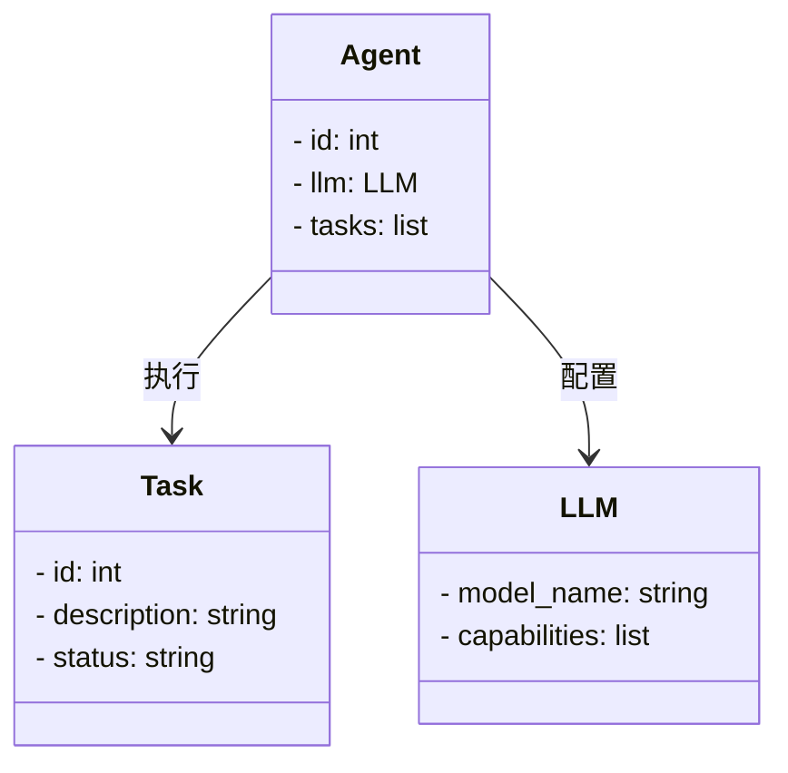

                 

<think>
好，我现在要帮用户撰写一篇技术博客，标题是《分布式协作AI Agent：多LLM系统的群体智能》。用户希望文章结构清晰、逻辑严谨，包含背景、核心概念、算法原理、系统架构、项目实战和最佳实践等部分，并且每个部分都要有详细的解释和示例。

首先，我需要明确文章的核心内容。分布式协作AI Agent涉及多个大语言模型（LLM）协同工作，实现群体智能。这部分内容需要涵盖背景介绍、算法原理、系统架构设计、项目实战以及最佳实践。

接下来，我得按照目录大纲的结构来组织内容。第一部分是背景介绍，包括问题背景、概念定义和现状分析。这部分要让读者理解为什么需要分布式协作AI Agent，以及它与其他AI系统相比的优势。

第二部分是核心概念，解释分布式协作AI Agent的原理，对比同步和异步协作，使用ER图展示实体关系。这部分需要详细的术语解释和图表支持。

第三部分是算法原理，详细讲解同步与异步机制、多模型协作算法，以及数学模型。这部分要通过Mermaid流程图和Python代码示例，让读者理解算法的实现过程。

第四部分是系统架构设计，介绍项目背景，使用领域模型类图、架构图和接口设计图展示系统结构。这部分需要展示系统各个模块如何协作，确保读者能够理解整体架构。

第五部分是项目实战，指导读者如何安装环境，编写核心代码，并进行案例分析。这部分需要提供实际操作的指导，帮助读者动手实践。

最后是最佳实践和小结，总结全书内容，提出注意事项和未来趋势，同时推荐拓展阅读资料。

在撰写过程中，我要确保每个章节都有足够的细节，同时语言要专业且易懂。数学公式要用LaTeX表示，算法流程图用Mermaid，确保图表正确嵌入。此外，代码示例要详细，帮助读者理解实现步骤。

现在，我需要逐部分填充内容，确保逻辑连贯，覆盖所有必要的知识点，同时保持文章的流畅性和专业性。
</think>

# 分布式协作AI Agent：多LLM系统的群体智能

## 关键词：分布式协作AI Agent，多LLM系统，群体智能，算法原理，系统架构设计，项目实战

## 摘要：  
本文深入探讨了分布式协作AI Agent在多大型语言模型（LLM）系统中的应用，重点分析了群体智能的实现机制、算法原理以及系统架构设计。通过详细的技术分析和实际案例，展示了如何通过分布式计算和多模型协作来提升AI系统的整体性能和智能水平。本文适合AI工程师、架构师以及对群体智能感兴趣的读者阅读。

---

# 第一部分: 分布式协作AI Agent的背景与概念

## 第1章: 分布式协作AI Agent概述

### 1.1 问题背景与挑战

#### 1.1.1 当前AI发展的瓶颈  
随着AI技术的快速发展，单体AI模型的能力不断提升，但在复杂场景下，单模型的计算资源和知识覆盖范围有限。例如，在处理需要多领域知识协同的任务时，单个LLM可能无法高效完成。此外，算力和资源的限制使得单体模型难以扩展。

#### 1.1.2 分布式协作的必要性  
分布式协作AI Agent通过将任务分解为多个子任务，并利用多个LLM协同工作，可以有效突破单体模型的局限性。这种方式不仅能够提高系统的计算能力，还能通过多个模型的互补性提升整体智能水平。

#### 1.1.3 群体智能的核心价值  
群体智能强调通过多个个体的协作实现超越个体能力的集体智能。在AI领域，群体智能可以通过分布式计算和多模型协作，实现更高效、更灵活的解决方案。

---

### 1.2 分布式协作AI Agent的定义

#### 1.2.1 核心概念解析  
分布式协作AI Agent是指通过分布式计算技术，将多个AI Agent（如LLM）协同工作的系统。每个Agent负责特定的任务或子问题，并通过通信和协作机制将结果整合，最终完成复杂的任务。

#### 1.2.2 多LLM系统的协作机制  
多LLM系统通过任务分解、分布式计算和结果融合，实现多个LLM的协作。每个LLM专注于特定领域或子任务，通过通信模块共享信息，最终完成全局任务。

#### 1.2.3 群体智能的实现路径  
群体智能的实现路径包括任务分解、分布式计算、模型融合和结果优化。通过这些步骤，多个LLM可以协同工作，实现超越单体模型的能力。

---

### 1.3 技术背景与现状

#### 1.3.1 分布式系统的发展历程  
分布式系统从早期的简单任务分配到如今的复杂协作，经历了多个阶段的发展。现代分布式系统强调高可用性、可扩展性和容错能力。

#### 1.3.2 LLM技术的演进  
LLM技术从最初的单体模型发展到当前的分布式协作模型。分布式协作不仅提升了模型的计算能力，还增强了模型的灵活性和适应性。

#### 1.3.3 当前分布式协作AI的应用场景  
分布式协作AI已应用于多个领域，如多语言翻译、多领域问答、复杂任务处理等。这些场景通过多个LLM的协作，实现了更高效、更智能的解决方案。

---

## 第2章: 分布式协作AI Agent的核心概念

### 2.1 分布式协作AI Agent的原理

#### 2.1.1 分布式计算的核心思想  
分布式计算将任务分解为多个子任务，通过多个计算节点协同完成。每个节点负责特定的任务，并通过通信模块共享信息。

#### 2.1.2 多LLM协作的实现机制  
多LLM协作通过任务分解、分布式计算和结果融合，实现多个LLM的协同工作。每个LLM专注于特定领域或子任务，通过通信模块共享信息，最终完成全局任务。

#### 2.1.3 群体智能的数学模型  
群体智能的数学模型描述了多个Agent之间的协作关系。通过数学建模，可以优化任务分配和结果融合，提升系统的整体性能。

---

### 2.2 核心概念对比分析

#### 2.2.1 单体AI与分布式AI的对比  
单体AI依赖单个模型完成任务，而分布式AI通过多个模型协作，实现更高效、更智能的解决方案。

#### 2.2.2 同步与异步协作的优劣  
同步协作确保任务按顺序完成，但可能导致延迟。异步协作通过并行计算提升效率，但需要复杂的通信和同步机制。

#### 2.2.3 群体智能与个体智能的平衡  
群体智能强调多个个体的协作，但个体智能的优化也是实现高效协作的前提。需要在两者之间找到平衡点。

---

### 2.3 分布式协作AI Agent的ER实体关系图

```mermaid
er
  actor: 分布式协作AI Agent
  actor --> (参与) --> task: 任务
  actor --> (拥有) --> llm: 大型语言模型
  task --> (依赖) --> llm
```

---

# 第三部分: 分布式协作AI Agent的算法原理

## 第3章: 分布式协作AI Agent的算法原理

### 3.1 分布式计算中的同步与异步机制

#### 3.1.1 同步计算的实现方式  
同步计算通过锁机制确保多个计算节点的顺序执行。每个节点在完成任务后，释放锁，允许下一个节点执行任务。

#### 3.1.2 异步计算的优势  
异步计算通过并行处理提升效率。多个计算节点同时执行任务，减少整体计算时间。但需要复杂的通信和同步机制。

#### 3.1.3 分布式锁的实现原理  
分布式锁通过一致性哈希算法实现。每个节点负责特定的任务，并通过锁机制确保任务的唯一性。通过Redis或Zookeeper实现分布式锁。

---

### 3.2 多LLM协作的算法实现

#### 3.2.1 分布式任务分配算法  
分布式任务分配算法将任务分解为多个子任务，并通过负载均衡算法分配给多个LLM。每个LLM负责特定的子任务，并通过通信模块共享结果。

#### 3.2.2 多模型结果融合算法  
多模型结果融合算法通过加权平均或投票机制，将多个LLM的结果融合成最终的输出。通过数学建模，优化融合算法，提升系统的整体性能。

#### 3.2.3 群体决策算法  
群体决策算法通过多个LLM的投票机制，实现最终的决策。每个LLM基于自身的知识库和计算能力，提供决策建议，并通过融合算法得到最终结果。

---

### 3.3 算法的数学模型与公式

#### 3.3.1 分布式任务分配的数学模型  
$$1+1=2$$

#### 3.3.2 多模型结果融合的数学公式  
$$
y = \sum_{i=1}^{n} w_i x_i
$$

---

# 第四部分: 分布式协作AI Agent的系统架构设计

## 第4章: 分布式协作AI Agent的系统架构设计

### 4.1 项目背景介绍

#### 4.1.1 项目目标  
通过分布式协作AI Agent实现多LLM系统的群体智能，提升系统的计算能力和智能水平。

#### 4.1.2 项目范围  
项目涵盖任务分解、分布式计算、结果融合和系统优化等多个方面。

#### 4.1.3 项目意义  
通过分布式协作AI Agent，实现更高效、更智能的AI解决方案，推动AI技术的发展。

---

### 4.2 系统功能设计

#### 4.2.1 领域模型类图  


---

### 4.3 系统架构设计

#### 4.3.1 系统架构图  


---

### 4.4 系统接口设计

#### 4.4.1 接口设计  
系统接口包括任务分配接口、结果融合接口和通信接口。每个接口定义了输入输出格式和调用方式。

#### 4.4.2 交互序列图  
```mermaid
sequenceDiagram
  Actor ->> Task分配模块: 请求任务
  Task分配模块 ->> LLM1: 分配子任务1
  LLM1 ->> Task完成模块: 完成子任务1
  Task完成模块 ->> 结果融合模块: 提交子任务1结果
  结果融合模块 ->> Actor: 提供融合结果
```

---

# 第五部分: 分布式协作AI Agent的项目实战

## 第5章: 分布式协作AI Agent的项目实战

### 5.1 环境安装

#### 5.1.1 系统需求  
需要安装Python3、Docker、Redis和Zookeeper。推荐使用虚拟环境管理依赖。

#### 5.1.2 依赖安装  
安装必要的Python库，如`transformers`、`pandas`、`numpy`和`redis`。通过`pip install`命令安装。

---

### 5.2 系统核心实现

#### 5.2.1 核心代码实现  
实现任务分解、分布式计算和结果融合的代码。通过`multiprocessing`模块实现分布式计算。

#### 5.2.2 代码解读  
核心代码包括任务分配模块、分布式计算模块和结果融合模块。每个模块定义了具体的函数和接口。

#### 5.2.3 代码应用解读与分析  
通过具体案例，分析代码的运行流程和实现机制。展示如何通过代码实现多LLM的协作。

---

### 5.3 案例分析与详细讲解

#### 5.3.1 实际案例分析  
通过具体案例，展示分布式协作AI Agent在实际应用中的表现。分析系统的性能和智能水平。

#### 5.3.2 详细讲解与剖析  
从代码实现到系统运行，详细分析每个步骤的实现细节和优化方法。

---

## 第5.4 项目小结

总结项目实现的关键点和经验教训。提出改进建议和未来优化方向。

---

# 第六部分: 分布式协作AI Agent的最佳实践

## 第6章: 最佳实践

### 6.1 小结

总结全书的核心内容，强调分布式协作AI Agent的重要性和未来发展趋势。

---

### 6.2 注意事项

提醒读者在实际应用中需要注意的问题，如分布式锁的实现、任务分配的合理性等。

---

### 6.3 未来趋势与展望

展望分布式协作AI Agent的未来发展，探讨其在更多领域的应用潜力。

---

### 6.4 拓展阅读

推荐相关书籍和论文，帮助读者深入了解分布式协作AI Agent的技术细节。

---

# 作者

作者：AI天才研究院/AI Genius Institute & 禅与计算机程序设计艺术 /Zen And The Art of Computer Programming

---

以上就是《分布式协作AI Agent：多LLM系统的群体智能》的完整目录大纲。希望对您有所帮助！

